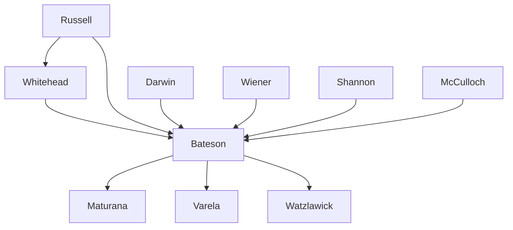

---

cssclasses:
  - Philosophy
  - Computer-Science
subclasses:
  - Epistemology
  - Philosophy-of-Mind
  - Cognitive-Science
related:
  - "[[Cybernetics]]"
  - "[[Information Theory]]"
  - "[[Systems Theory]]"
  - "[[Feedback]]"
  - "[[Redundancy]]"
  - "[[Ecology of Mind]]"
aliases:
  - cybernetic explanation
  - negative explanation
  - restraint causation
  - information theory
  - feedback loops
  - causal circuits
  - redundancy pattern
  - mapping transformation
  - context hierarchy
  - form pattern
reference:
  - Bateson, G. (2000). Steps to an ecology of mind. University of Chicago Press. (pp. 399-410)
tags:
  - Podcast
---

#### Podcast

<iframe allow="autoplay *; encrypted-media *; fullscreen *; clipboard-write" frameborder="0" height="150" style="width:100%;overflow:hidden;border-radius:10px;background:transparent;" sandbox="allow-forms allow-popups allow-same-origin allow-scripts allow-storage-access-by-user-activation allow-top-navigation-by-user-activation" src="https://embed.podcasts.apple.com/us/podcast/epistemology-and-ecology/id1786764068?i=1000682844031&uo=4&l=en-GB&theme=auto"></iframe>

---

#### Central Problem

[[Bateson]] addresses the fundamental question of how cybernetic and informational explanations differ from classical causal explanations in the physical sciences. The text grapples with the epistemological challenge: how can we explain phenomena in terms of information, pattern, and constraint rather than in terms of energy transfer and positive causation?

The central tension lies in the nature of cybernetic subject matter itself. Unlike physics, which deals with events and objects directly, cybernetics deals with the "information carried by events and objects"—treating phenomena as proposing "facts, messages, percepts, and the like." This shift requires fundamentally different explanatory strategies and raises profound questions about the location of meaning, the nature of pattern, and the relationship between map and territory.

The problem extends to understanding how systems—organisms, computers, societies—can exhibit purposive behavior, maintain stability, and generate non-random responses to random events through circuits of restraint rather than chains of positive causation.

#### Main Thesis

[[Bateson]] argues that cybernetic explanation is fundamentally negative in character, operating through restraint rather than cause. While causal explanation is positive ("ball B moved because ball A hit it"), cybernetic explanation asks why many possible events did not occur, explaining that the actual event was "one of those few which could, in fact, occur."

**The Paradigm of Natural Selection:** The theory of evolution under natural selection exemplifies this negative logic. Organisms that were not viable could not survive to reproduce; evolution follows "pathways of viability" by eliminating alternatives. This parallels the logical proof by *reductio ad absurdum*—establishing what must be true by demonstrating what cannot be.

**Information as Constraint:** The quantity of information is defined negatively, expressed as the logarithm of the improbability of the actual event. A Chinese ideograph carries more information than an English letter because it excludes several thousand alternatives rather than merely twenty-five. Crucially, information has "zero dimension"—no mass, length, or time—and thus real dimensions have no place in cybernetics.

**Stimulus-Response vs. Cause-Effect:** In cybernetic systems, the energy of response is provided by the respondent, not the stimulus. When one kicks a dog, the dog's behavior is energized by its own metabolism, not the kick. This distinguishes informational sequences from energy transfer.

**Redundancy and Pattern:** Redundancy—the predictability of events within larger aggregates—is "the very essence and raison d'être of communication." Pattern is defined as an aggregate permitting guessing "when the entire aggregate is not available for inspection." Meaning emerges as redundancy introduced into a universe of message-plus-referent.

**The Non-Localizability of Form:** Information, pattern, form, and contrast cannot be located anywhere. They have zero dimension and thus resist localization. The contrast between white paper and black coffee is "not somewhere between the paper and the coffee."

#### Historical Context

This text appears in *Steps to an Ecology of Mind* (1972), a collection of [[Bateson]]'s essays spanning decades. The specific piece dates from 1967, published in *American Scientist*, positioning it within the mature phase of cybernetics and systems theory.

The intellectual context includes the post-war development of cybernetics through the Macy Conferences (1946-1953), where [[Bateson]] was a key participant alongside [[Wiener]], [[McCulloch]], [[Mead]], and others. By 1967, cybernetics had differentiated from its wartime origins in control systems engineering to encompass broader questions of mind, communication, and social systems.

The text engages with [[Shannon]]'s information theory while critiquing its limitations for understanding meaning and pattern. It also responds to the dominant behaviorist and positivist frameworks in psychology and biology, proposing an alternative epistemology grounded in pattern, relationship, and logical type.

[[Bateson]]'s work on schizophrenia, learning, and communication had led him to emphasize the importance of context, levels of abstraction, and the dangers of confusing logical types—themes central to this text.

#### Philosophical Lineage

#### Key Thinkers

| Thinker | Dates | Movement | Main Work | Core Concept |
|---------|-------|----------|-----------|--------------|
| [[Bateson]] | 1904-1980 | [[Cybernetics]] | *Steps to an Ecology of Mind* | Ecology of mind, double bind |
| [[Wiener]] | 1894-1964 | [[Cybernetics]] | *Cybernetics* | Feedback, control systems |
| [[Shannon]] | 1916-2001 | [[Information Theory]] | *Mathematical Theory of Communication* | Information entropy |
| [[Darwin]] | 1809-1882 | [[Evolutionary Biology]] | *Origin of Species* | Natural selection |
| [[Russell]] | 1872-1970 | [[Analytic Philosophy]] | *Principia Mathematica* | Theory of logical types |
| [[McCulloch]] | 1898-1969 | [[Cybernetics]] | *Embodiments of Mind* | Neural networks, heterarchy |

#### Key Concepts

| Concept | Definition | Related to |
|---------|------------|------------|
| Negative explanation | Explanation that identifies what could not occur, constraining events to those that could actually happen | [[Bateson]], [[Cybernetics]] |
| Restraint | Factors determining inequality of probability; constraints that shape which events occur | [[Bateson]], [[Information Theory]] |
| Redundancy | Predictability of events within a larger aggregate; pattern that permits guessing across incomplete information | [[Shannon]], [[Bateson]] |
| Feedback circuit | Closed causal chain where events at any position affect all positions at later times | [[Wiener]], [[Cybernetics]] |
| Zero dimensionality | Property of information: having no mass, length, or time; not locatable in space | [[Bateson]], [[Information Theory]] |
| Mapping/Transform | Formal process imputed to every step in a cybernetic sequence; rigorous metaphor between systems | [[Bateson]], [[Cybernetics]] |
| Context hierarchy | Universal structure where meaning emerges only through larger contexts containing smaller ones | [[Bateson]], [[Semiotics]] |
| Reductio ad absurdum | Logical proof by demonstrating that all alternatives except one are untenable | [[Russell]], [[Logic]] |

#### Authors Comparison

| Theme | [[Bateson]] | [[Shannon]] | [[Wiener]] |
|-------|-------------|-------------|------------|
| Central question | How does mind relate to nature? | How to measure information? | How do systems self-regulate? |
| Definition of information | Difference that makes a difference | Reduction of uncertainty | Message controlling action |
| Role of meaning | Central: meaning is redundancy | Excluded from technical theory | Implied in purpose |
| Subject matter | Pattern, form, relationship | Signal transmission | Control and communication |
| Epistemological stance | Ecological, holistic | Mathematical, formal | Engineering, practical |

#### Influences & Connections

- **Predecessors:** [[Bateson]] ← influenced by ← [[Russell]] (logical types), [[Whitehead]] (process philosophy), [[Darwin]] (natural selection)
- **Contemporaries:** [[Bateson]] ↔ dialogue with ↔ [[Wiener]], [[McCulloch]], [[Mead]], [[von Neumann]]
- **Followers:** [[Bateson]] → influenced → [[Maturana]], [[Varela]], [[Watzlawick]], [[Morin]]
- **Opposing views:** [[Bateson]] ← critiqued ← behaviorism, reductionist biology, naive realism

#### Summary Formulas

- **[[Bateson]]:** Cybernetic explanation is always negative—it explains by identifying what could not happen, constraining the universe of possibilities to the actual event through restraint rather than positive causation.
- **On information:** The subject matter of cybernetics is not events and objects but the information carried by them; information is of zero dimension and cannot be located.
- **On redundancy:** Redundancy or pattern is the essence of communication; meaning is redundancy introduced into the universe of message-plus-referent.
- **On form:** Form, pattern, contrast, and information are not items that can be localized; they exist as relationships between elements, not in the elements themselves.

#### Timeline

| Year | Event |
|------|-------|
| 1948 | [[Shannon]] publishes *A Mathematical Theory of Communication* |
| 1948 | [[Wiener]] publishes *Cybernetics* |
| 1946-1953 | Macy Conferences on cybernetics; [[Bateson]] participates |
| 1956 | [[Bateson]] et al. publish "Toward a Theory of Schizophrenia" (double bind) |
| 1967 | [[Bateson]] publishes "Cybernetic Explanation" in *American Scientist* |
| 1972 | [[Bateson]] publishes *Steps to an Ecology of Mind* |
| 1979 | [[Bateson]] publishes *Mind and Nature: A Necessary Unity* |

#### Notable Quotes

> "The subject matter of cybernetics is not events and objects but the information carried by events and objects. We consider the objects or events only as proposing facts, messages, percepts, and the like." — [[Bateson]]

> "Information and form are not items which can be localized. The contrast between this white paper and that black coffee is not somewhere between the paper and the coffee." — [[Bateson]]

---
> [!warning]-
> This annotation was normalised using a large language model and may contain inaccuracies. These texts serve as preliminary study resources rather than exhaustive references.
