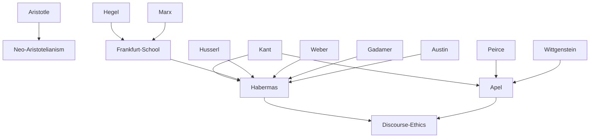

---
cssclasses:
  - Philosophy
  - Political-Science
subclasses:
  - Ethics
  - Social-and-Political-Philosophy
  - 20th-Century-Philosophy
related:
  - "[[Critical Theory]]"
  - "[[Frankfurt School]]"
  - "[[Communicative Rationality]]"
  - "[[Deliberative Democracy]]"
  - "[[Neo-Aristotelianism]]"
  - "[[Hermeneutics]]"
  - "[[Postmodernism]]"
  - "[[Kantian Ethics]]"
  - "[[Public Sphere]]"
  - "[[Post-Secular Society]]"
aliases:
  - discourse ethics
  - communicative action
  - practical philosophy
  - system lifeworld
  - universal pragmatics
  - post metaphysics
  - public sphere
  - ideal speech
  - critical theory
reference:
  - "[Abbagnano, N., & Fornero, G. (2012). La ricerca del pensiero. Vol. 3C. Dalla crisi della modernità agli sviluppi più recenti. Paravia.](https://archive.org/download/ssp-s07-e04/The%20search%20for%20thought%20-%20Unit%2016%20Chapter%201.pdf)"
tags:
  - Podcast
---

#### Podcast

<iframe src="https://archive.org/embed/ssp-s07-e04" width="100%" height="30" frameborder="0" webkitallowfullscreen="true" mozallowfullscreen="true" allowfullscreen></iframe>

---

#### Central Problem

How can we establish a rational, universally valid foundation for ethics in a post-metaphysical age marked by the collapse of religious and metaphysical worldviews, cultural pluralism, and moral relativism? The modern conception of knowledge reduces reason to scientific reason, treats values as extra-rational preferences, limits philosophy to descriptive analysis of ethical language, and separates ethics from politics. Against this backdrop, both [[Habermas]] and [[Apel]] seek to rehabilitate practical philosophy—the domain of morality, law, and politics that belonged to Aristotelian *philosophia practica*—while avoiding both the relativism of contextual ethics and the abstraction of traditional deontological approaches.

The central tension lies between "contextualists" (neo-Aristotelians like [[Gadamer]] and [[Ritter]]) who ground ethics in the concrete *ethos* of particular communities, and "universalists" (post-Kantians like Habermas and Apel) who insist on principles valid for all rational beings across cultures. The question becomes: Can we derive universally binding moral norms from the very structure of human communication itself?

#### Main Thesis

[[Habermas]] and [[Apel]] develop an "ethics of discourse" (*Diskursethik*) that grounds morality in the universal presuppositions of rational argumentation. Their thesis holds that anyone who engages in sincere argumentation implicitly accepts certain "validity claims": correctness (following argumentative norms), truth (making true statements), and sincerity (expressing genuine beliefs). These presuppositions entail an "ideal speech situation"—a counterfactual model of communication among free and equal participants where only the "force of the better argument" prevails.

The ethics of discourse is: (a) **cognitivist**—moral judgments have rational foundations, not merely emotional ones; (b) **deontological**—focused on right action and binding principles; (c) **formal**—specifying procedures rather than content; (d) **universalist**—valid for all rational beings; (e) **post-Kantian**—transforming [[Kant]]'s monological categorical imperative into a dialogical principle requiring collective verification.

[[Habermas]] distinguishes "system" (governed by money and power, instrumental rationality) from "lifeworld" (governed by communicative rationality, shared traditions, cultural reproduction). Modernity's pathology lies in the system's "colonization" of the lifeworld. Against postmodernist critics who declare modernity exhausted, Habermas argues it is merely "incomplete"—the Enlightenment project of emancipation remains valid and must be realized.

[[Apel]] provides a stronger "transcendental-pragmatic" foundation, arguing that the presuppositions of argumentation are not mere hypotheses but necessary conditions that cannot be denied without performative self-contradiction. Anyone who argues against the rules of argumentation must use those very rules, thereby confirming them.

#### Historical Context

The "rehabilitation of practical philosophy" began in 1960s Germany, led by [[Karl-Heinz Ilting]] and [[Riedel]], as a reaction against positivism, scientism, and the separation of facts from values characteristic of modern thought. This movement sought to recover the Aristotelian tradition of *phronesis* (practical wisdom) that [[Kant]] had displaced with autonomous disciplines (moral science, economics, political science, jurisprudence).

[[Habermas]] emerged from the Frankfurt School, initially sharing [[Adorno]]'s critique of the "administered society" and instrumental reason. However, he progressively distanced himself from Frankfurt School pessimism, developing a communicative conception of reason that preserves critical-emancipatory potential. His "linguistic turn" in the 1970s, influenced by Austin, [[Searle]], Chomsky, and [[Mead]], led to the mature theory of communicative action (1981).

The debate with [[Gadamer]] (hermeneutics), the confrontation with [[Weber]]'s theory of rationalization, and opposition to [[Lyotard]] and postmodern thought shaped Habermas's defense of modernity. His later work addresses the challenges of multiculturalism, globalization, and religion in "post-secular" societies.

[[Apel]] developed independently, transforming Kantian transcendental philosophy through semiotics (theory of signs) and Peirce's pragmatism, arriving at a "transformation of philosophy" that grounds rationality in the intersubjective community of language users rather than the solitary thinking subject.

#### Philosophical Lineage

#### Key Thinkers

| Thinker | Dates | Movement | Main Work | Core Concept |
|---------|-------|----------|-----------|--------------|
| [[Habermas]] | 1929- | [[Critical Theory]] | *Theory of Communicative Action* | Communicative rationality, discourse ethics |
| [[Apel]] | 1922-2017 | [[Transcendental Pragmatics]] | *Transformation of Philosophy* | Ultimate foundation, transcendental-pragmatic |
| [[Gadamer]] | 1900-2002 | [[Hermeneutics]] | *Truth and Method* | Practical wisdom (*phronesis*) |
| [[Ritter]] | 1903-1974 | [[Neo-Aristotelianism]] | *Metaphysics and Politics* | *Ethos* and institutions |
| [[Peirce]] | 1839-1914 | [[Pragmatism]] | *Collected Papers* | Community of inquiry, fallibilism |

#### Key Concepts

| Concept | Definition | Related to |
|---------|------------|------------|
| Discourse Ethics (*Diskursethik*) | Moral theory grounding norms in the universal presuppositions of argumentation; norms are valid if accepted by all affected in ideal discourse | [[Habermas]], [[Apel]] |
| Communicative Action | Action oriented toward mutual understanding through language, as opposed to strategic action oriented toward success | [[Habermas]], [[Critical Theory]] |
| Ideal Speech Situation | Counterfactual model of communication where participants are free, equal, and constrained only by the force of the better argument | [[Habermas]], [[Discourse Ethics]] |
| System / Lifeworld | Two levels of society: system (money, power, instrumental rationality) vs. lifeworld (communicative rationality, tradition, values) | [[Habermas]], [[Weber]] |
| Validity Claims | Presuppositions of argumentation: correctness, truth, sincerity, and comprehensibility | [[Habermas]], [[Apel]] |
| Transcendental Pragmatics | Apel's project of grounding philosophy on necessary conditions of argumentation that cannot be denied without self-contradiction | [[Apel]], [[Kant]] |
| Performative Contradiction | Self-refuting assertion where the content contradicts the act of asserting (e.g., "I assert that I don't exist") | [[Apel]], [[Argumentation Theory]] |
| Post-Secular Society | Society where religious and secular worldviews coexist in mutual learning, neither privileged nor excluded from public discourse | [[Habermas]], [[Political Philosophy]] |
| Colonization of Lifeworld | Pathological intrusion of system mechanisms (money, bureaucracy) into domains properly governed by communicative reason | [[Habermas]], [[Critical Theory]] |

#### Authors Comparison

| Theme | [[Habermas]] | [[Apel]] |
|-------|--------------|----------|
| Foundation of ethics | Universal pragmatics (hypothetical-scientific) | Transcendental pragmatics (a priori, ultimate) |
| Status of presuppositions | High-level empirical generalizations | Necessary, undeniable conditions |
| Relation to [[Kant]] | Post-Kantian transformation | Semiotic transformation of transcendentalism |
| Against relativism | Dialogical rationality | Performative self-contradiction argument |
| Key concept | Communicative rationality | Unlimited communication community |
| Political application | Deliberative democracy, constitutional state | Planetary ethics, global public sphere |

#### Influences & Connections

- **Predecessors:** [[Habermas]] ← influenced by ← [[Adorno]], [[Horkheimer]], [[Kant]], [[Hegel]], [[Marx]], [[Weber]], [[Husserl]], [[Gadamer]], [[Austin]], [[Chomsky]]; [[Apel]] ← influenced by ← [[Kant]], [[Peirce]], [[Wittgenstein]], [[Heidegger]]
- **Contemporaries:** [[Habermas]] ↔ dialogue with ↔ [[Gadamer]], [[Luhmann]], [[Rawls]], [[Ratzinger]]; [[Apel]] ↔ dialogue with ↔ [[Habermas]]
- **Followers:** [[Habermas]] → influenced → deliberative democracy theory, [[Benhabib]], [[Honneth]]; [[Apel]] → influenced → transcendental argumentation theory
- **Opposing views:** [[Habermas]] ← criticized by ← [[Lyotard]], postmodernists, communitarians; [[Apel]] ← criticized by ← fallibilists, pragmatists

#### Summary Formulas

- **[[Habermas]]:** Communicative reason, embedded in the universal presuppositions of language, can ground moral norms valid for all rational beings and defend modernity's unfinished emancipatory project.
- **[[Apel]]:** The conditions of rational argumentation—membership in real and ideal communication communities—constitute an ultimate, transcendental foundation for universal ethics immune to relativism.
- **Discourse Ethics:** Moral norms are valid when they could be accepted by all affected parties in an ideal discourse where only the force of the better argument prevails.
- **System vs. Lifeworld:** Modernity's pathology lies in the colonization of the lifeworld (governed by communicative reason) by system imperatives (money, power), not in reason itself.

#### Timeline

| Year | Event |
|------|-------|
| 1962 | [[Habermas]] publishes *Structural Transformation of the Public Sphere* |
| 1968 | [[Habermas]] publishes *Knowledge and Human Interests* |
| 1972-74 | [[Riedel]] publishes *Rehabilitation of Practical Philosophy* anthology |
| 1973 | [[Apel]] publishes *Transformation of Philosophy* |
| 1981 | [[Habermas]] publishes *Theory of Communicative Action* |
| 1983 | [[Habermas]] publishes *Moral Consciousness and Communicative Action* |
| 1985 | [[Habermas]] publishes *The Philosophical Discourse of Modernity* |
| 1988 | [[Habermas]] publishes *Postmetaphysical Thinking* |
| 1992 | [[Habermas]] publishes *Between Facts and Norms* |
| 1996 | [[Habermas]] publishes *The Inclusion of the Other* |
| 2004 | [[Habermas]]-[[Ratzinger]] debate on pre-political foundations of liberal state |

#### Notable Quotes

> "The only coercion that should be admitted is the coercion of the better argument." — [[Habermas]]

> "Modernity is not concluded but incomplete." — [[Habermas]]

> "Anyone who argues already presupposes the validity of logical rules and the norms of a communication community—these cannot be denied without performative self-contradiction." — [[Apel]]

---
> [!warning]-
> This annotation was normalised using a large language model and may contain inaccuracies. These texts serve as preliminary study resources rather than exhaustive references.
