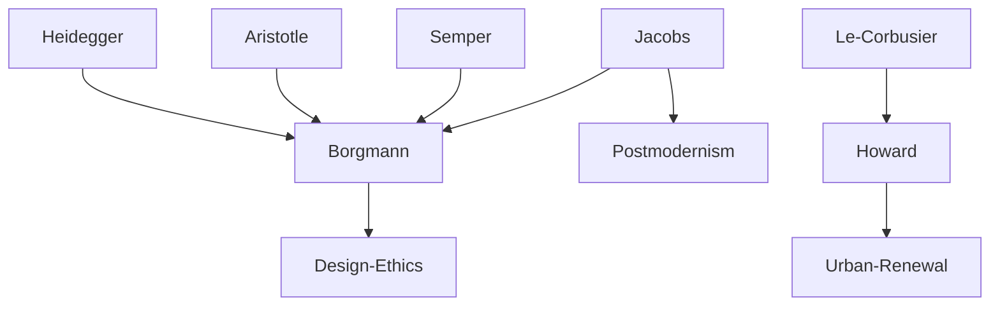

---

cssclasses:
  - Philosophy
  - Arts
subclasses:
  - Design-Theory
  - Ethics
related:
  - "[[Material Culture]]"
  - "[[Technology]]"
  - "[[Engagement]]"
  - "[[Design Ethics]]"
  - "[[Urban Design]]"
  - "[[Heidegger]]"
aliases:
  - depth design
  - material culture
  - design engagement
  - user disburdenment
  - aesthetic design
  - engineering design
  - focal things
  - design trusteeship
  - festive engagement
  - daily engagement
reference:
  - "Buchanan, R., & Margolin, V. (Eds.). (2007). Discovering design: explorations in design studies (7. Aufl). University of Chicago Press. (pp.13-22)"
tags:
  - Podcast
---

#### Podcast

<iframe allow="autoplay *; encrypted-media *; fullscreen *; clipboard-write" frameborder="0" height="150" style="width:100%;overflow:hidden;border-radius:10px;background:transparent;" sandbox="allow-forms allow-popups allow-same-origin allow-scripts allow-storage-access-by-user-activation allow-top-navigation-by-user-activation" src="https://embed.podcasts.apple.com/us/podcast/the-depth-of-design/id1786764068?i=1000684552247&uo=4&l=en-GB&theme=auto"></iframe>

---

#### Central Problem

[[Borgmann]] addresses a fundamental crisis in design: the tendency of material culture toward "attenuation, superficiality, and even disappearance." As technology advances, design risks becoming shallow—reduced to surface aesthetics while engineering takes over the substantive shaping of our environment.

The core tension lies between two trajectories: on one hand, technological development drives toward user "disburdenment"—eliminating the need for engagement, skill, and attention. Sound systems shrink to opaque handheld devices; gas stations ideally become invisible automatic mechanisms. On the other hand, this trajectory severs design from meaningful human engagement with the material world.

The problem is compounded by a split within design practice itself. Design has divided into an engineering branch (devising underlying structures that disburden users) and an aesthetic branch (confined to "smoothing interfaces and stylizing surfaces"). Neither branch alone addresses what [[Borgmann]] sees as design's proper concern: the moral and cultural excellence of our material surroundings.

The question becomes: How can design recover depth—fusing engineering and aesthetics to create material settings that "provoke and reward engagement" rather than merely disburdening users from meaningful interaction with reality?

#### Main Thesis

[[Borgmann]] argues that design should be understood as "the excellence of material objects" and that designers, as professionals entrusted with this precious social good, must recover the "depth of design"—a practice that fuses engineering and aesthetics to foster human engagement rather than mere consumption.

**Design as Professional Trusteeship:** Like doctors with health and lawyers with justice, designers are entrusted with a valued social good: the moral and cultural excellence of the material environment. They must be accountable not only to immediate client desires but to the well-being of this good itself.

**Engagement as the Criterion:** "Engagement" designates the symmetry linking humanity and reality—the profound realization of the commensuration between human capacities and worldly things. A musical instrument engages deeply; a television program typically does not. Design should make material culture "conducive to engagement."

**The Decline of Engagement:** Technology tends toward "disburdenment"—eliminating exertion, skill, and attention. This leaves us with "opaque and glamorous commodities" enjoyed in passive consumption. As engagement declines, aesthetic design becomes superficial, divorced from the powerful shaping of material culture.

**Selective and Focal Practice:** Since full domestic engagement is neither possible nor desirable today, designers must help people engage "selectively and focally"—choosing which practices merit deep engagement (cooking, for instance) while using technology to disburden less meaningful activities.

**Two Settings, Two Modes:** Engagement has two principal settings (city and home) and two modes (daily and festive). Daily engagement includes housework and urban errands; festive engagement includes the culture of the table, communal celebrations, concerts, and games. Design must serve both.

**Depth Through Disclosure:** Things with depth have "wealth of experiential properties" and "disclosing power." A cooking pot discloses the texture, color, and taste of food through its handling. Technological devices, by contrast, tend to insulate users from the world, representing it rather than allowing it to be present.

#### Historical Context

The text emerges from the 1991 "Discovering Design" conference at the University of Illinois at Chicago, a gathering that brought together philosophers, designers, and theorists to examine design's foundations.

[[Borgmann]] writes against the backdrop of late twentieth-century technological society and its material abundance. The postwar period had seen unprecedented expansion of consumer goods and technological devices, accompanied by growing concerns about alienation, consumerism, and the loss of authentic human experience.

The text engages with postmodernism in architecture—the movement that arose in the late 1960s to preserve historic urban areas and revive classical and vernacular vocabularies. [[Borgmann]] critiques postmodernism's limitations: while preservation projects like Faneuil Hall and Pike Place drew people back to inner cities, the activity remained essentially consumption—"the background is history, but the foreground is late twentieth-century retailing."

[[Borgmann]]'s thinking draws on his earlier work on the "device paradigm" (developed in *Technology and the Character of Contemporary Life*, 1984), which distinguished between "things" that engage us bodily and socially, and "devices" that deliver commodities while concealing their machinery.

The reference to [[Jane Jacobs]]'s critique of urban renewal (*The Death and Life of Great American Cities*, 1961) situates the text within ongoing debates about modernist planning and its failures.

#### Philosophical Lineage

#### Key Thinkers

| Thinker | Dates | Movement | Main Work | Core Concept |
|---------|-------|----------|-----------|--------------|
| [[Borgmann]] | 1937- | [[Philosophy of Technology]] | *Technology and the Character of Contemporary Life* | Device paradigm, focal things |
| [[Jacobs]] | 1916-2006 | [[Urban Theory]] | *The Death and Life of Great American Cities* | Critique of urban renewal |
| [[Le Corbusier]] | 1887-1965 | [[Modernism]] | *Vers une architecture* | La ville radieuse |
| [[Howard]] | 1850-1928 | [[Urban Planning]] | *Garden Cities of To-morrow* | Garden City movement |
| [[Semper]] | 1803-1879 | [[Architectural Theory]] | *Style in the Technical and Tectonic Arts* | Material and technique |

#### Key Concepts

| Concept | Definition | Related to |
|---------|------------|------------|
| Depth of design | Design that fuses engineering and aesthetics to provide material settings provoking and rewarding engagement | [[Borgmann]], [[Design Theory]] |
| Engagement | The symmetry linking humanity and reality; profound realization of commensuration between human capacities and worldly things | [[Borgmann]], [[Heidegger]] |
| Disburdenment | Technology's tendency to eliminate exertion, skill, and attention, leaving users with opaque commodities | [[Borgmann]], [[Philosophy of Technology]] |
| Focal things | Things that gather practices of engagement around them; things with depth and disclosing power | [[Borgmann]], [[Heidegger]] |
| Trusteeship | Designer's professional responsibility to guard and advocate for the moral and cultural excellence of material culture | [[Borgmann]], [[Design Ethics]] |
| Disclosing power | The capacity of things to reveal the wealth of the world through their handling and use | [[Borgmann]], [[Phenomenology]] |

#### Authors Comparison

| Theme | [[Borgmann]] | [[Jacobs]] | [[Le Corbusier]] |
|-------|--------------|------------|------------------|
| Central question | How can design foster engagement? | What makes cities vital? | How can cities be rational? |
| View of modernism | Critique: destroys historical depth | Critique: destroys urban vitality | Advocacy: hygienic rationalism |
| Design's role | Moral trusteeship for material culture | Emergent from use patterns | Technical problem-solving |
| Technology | Ambivalent: enables disburdenment | Neutral: depends on scale | Enabling: serves efficiency |
| Human flourishing | Through focal engagement | Through diverse street life | Through rational organization |

#### Influences & Connections

- **Predecessors:** [[Borgmann]] ← influenced by ← [[Heidegger]] (thing vs. object), [[Aristotle]] (practical wisdom)
- **Contemporaries:** [[Borgmann]] ↔ dialogue with ↔ [[Jacobs]], [[Buchanan]], design theorists
- **Followers:** [[Borgmann]] → influenced → design ethics, philosophy of technology, sustainable design
- **Opposing views:** [[Borgmann]] ← critiques ← modernist urbanism, technological optimism, consumerism

#### Summary Formulas

- **[[Borgmann]]:** Design should be understood as the excellence of material objects; designers are trustees charged with fostering engagement rather than mere disburdenment.
- **On engagement:** Engagement is the profound realization of the symmetry between human capacities and worldly things; it is what gives life depth rather than mere comfort.
- **On technology:** Technology tends toward disburdenment, producing opaque and glamorous commodities that sever users from meaningful engagement with reality.
- **On depth:** Design has depth when it creates things with wealth of experiential properties and disclosing power—things that allow the world to be present in its own right.

#### Timeline

| Year | Event |
|------|-------|
| 1961 | [[Jacobs]] publishes *The Death and Life of Great American Cities* |
| 1984 | [[Borgmann]] publishes *Technology and the Character of Contemporary Life* |
| 1991 | "Discovering Design" conference at University of Illinois at Chicago |
| 1992 | Camden Yards Ballpark opens in Baltimore |
| 1995 | [[Buchanan]] and [[Margolin]] publish *Discovering Design* anthology |

#### Notable Quotes

> "Design in this objective sense is everyone's concern. So are health, justice, and education. And yet society especially entrusts the latter three concerns to particularly qualified people, to doctors, lawyers, and teachers. Similarly design can be thought of as a professional practice, and designers as professionals." — [[Borgmann]]

> "Engagement is to designate the profound realization of the humanity-reality commensuration. A musical instrument normally engages a person deeply; a television program typically fails to do so." — [[Borgmann]]

> "Aesthetic design becomes shallow, not because it is aesthetic, but because it has become superficial. It has been divorced from the powerful shaping of the material culture." — [[Borgmann]]

---
> [!warning]-
> This annotation was normalised using a large language model and may contain inaccuracies. These texts serve as preliminary study resources rather than exhaustive references.
