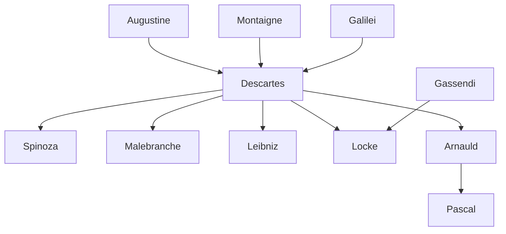

---
cssclasses:
  - Philosophy
subclasses:
  - Epistemology
  - 17th-18th-Century-Philosophy
  - Metaphysics
related:
  - "[[Rationalism]]"
  - "[[Scientific Revolution]]"
  - "[[Methodical Doubt]]"
  - "[[Mind-Body Problem]]"
  - "[[Cartesian Dualism]]"
  - "[[Epistemology]]"
  - "[[Innate Ideas]]"
  - "[[Mechanicism]]"
  - "[[Discourse on Method]]"
  - "[[Meditations on First Philosophy]]"
aliases:
  - cartesian method
  - methodical doubt
  - thinking substance
  - extended substance
  - innate ideas
  - analytic geometry
  - cartesian dualism
  - clear distinct
  - hyperbolic doubt
  - evil genius
  - pineal gland
  - universal science
reference:
  - "Abbagnano, N., & Fornero, G. (2012). La ricerca del pensiero. Vol. 2A. Dall'Umanesimo all'empirismo. Paravia."
---

#### Central Problem

How can human beings establish a secure foundation for knowledge that withstands radical skepticism and provides a universal method applicable to all fields of inquiry? [[Descartes]] confronts the crisis of knowledge inherited from Renaissance skepticism, particularly the Pyrrhonist revival by thinkers like [[Montaigne]], which questioned whether any certain knowledge is attainable.

The problem emerged from [[Descartes]]' own educational experience at the Jesuit college of La Flèche, where despite successfully assimilating the learned traditions of his time, he found himself without any reliable criterion for distinguishing truth from falsehood. The inherited scholastic philosophy appeared incapable of grounding the new sciences, while the new sciences themselves lacked philosophical justification.

[[Descartes]] seeks a method that is simultaneously theoretical and practical: it must enable the distinction between true and false knowledge while also providing practical benefits for human life, making humanity "master and possessor of nature." The fundamental tension lies between the need for absolute certainty as the foundation of knowledge and the apparent impossibility of escaping doubt about any particular belief.

#### Main Thesis

Descartes' central thesis is that certain knowledge must be grounded in the self-evident existence of the thinking subject (*cogito ergo sum*), from which all other knowledge can be systematically derived through the application of a universal method modeled on mathematical reasoning.

**The Method:** [[Descartes]] formulates four rules: (1) **Evidence** — accept only what presents itself clearly and distinctly to the mind; (2) **Analysis** — divide complex problems into simpler elements; (3) **Synthesis** — proceed from simple to complex knowledge in orderly fashion; (4) **Enumeration and Review** — ensure completeness through thorough checking.

**The Cogito:** Through methodical doubt extended to its hyperbolic extreme (the "evil genius" hypothesis), [[Descartes]] discovers that the one thing immune to doubt is the existence of the doubting subject itself. Even if deceived about everything else, the act of doubting proves existence: "I think, therefore I am."

**The Nature of the Self:** The thinking subject exists as *res cogitans* — an immaterial, conscious, free substance whose essence is thought. This is distinguished absolutely from *res extensa* — material, spatial, unconscious, mechanically determined substance.

**God as Guarantor:** The idea of an infinite, perfect being cannot originate from a finite mind; therefore God must exist as its cause. Divine perfection excludes deception, thus guaranteeing that clear and distinct ideas correspond to reality.

**Cartesian Dualism:** Reality divides into two heterogeneous substances: thinking substance (mind) and extended substance (matter). The physical world operates mechanically according to mathematical laws, while the mind possesses freedom and consciousness.

#### Historical Context

[[Descartes]] (1596-1650) developed his philosophy during a period of profound intellectual and political upheaval. The Scientific Revolution had challenged the Aristotelian-Ptolemaic worldview, with [[Galilei]]'s condemnation in 1633 demonstrating the continuing conflict between new science and traditional authority. [[Descartes]] himself suppressed his *Treatise on Light* (which supported Copernicanism) following Galilei's trial.

The Thirty Years' War (1618-1648) devastated Europe, creating an atmosphere of instability. Religious conflicts between Catholics and Protestants had undermined confidence in traditional authorities. [[Descartes]] lived primarily in the Netherlands (1629-1649), seeking the intellectual freedom unavailable in Catholic France.

The recovery of ancient skepticism, particularly through [[Montaigne]]'s *Essays*, had created an intellectual crisis regarding the possibility of certain knowledge. The new mathematical physics of [[Galilei]] and [[Kepler]] demanded philosophical justification that scholastic Aristotelianism could not provide.

[[Descartes]] was educated in the Jesuit tradition, which combined scholastic philosophy with humanistic learning and some openness to new science. His *Discourse on Method* (1637) was deliberately written in French rather than Latin to reach a broader audience, signaling a break with academic tradition. His major works — *Meditations on First Philosophy* (1641), *Principles of Philosophy* (1644), and *Passions of the Soul* (1649) — established the agenda for seventeenth-century philosophy.

#### Philosophical Lineage

#### Key Thinkers

| Thinker | Dates | Movement | Main Work | Core Concept |
|---------|-------|----------|-----------|--------------|
| [[Descartes]] | 1596-1650 | [[Rationalism]] | *Meditations on First Philosophy* | Cogito ergo sum, methodical doubt |
| [[Montaigne]] | 1533-1592 | [[Renaissance Skepticism]] | *Essays* | Pyrrhonist doubt, "Que sais-je?" |
| [[Galilei]] | 1564-1642 | [[Scientific Revolution]] | *Dialogue on the Two World Systems* | Mathematical physics, primary/secondary qualities |
| [[Gassendi]] | 1592-1655 | [[Atomism]] | *Fifth Objections* | Critique of innate ideas, empiricism |
| [[Arnauld]] | 1612-1694 | [[Jansenism]] | *Fourth Objections* | Cartesian circle objection |
| [[Hobbes]] | 1588-1679 | [[Materialism]] | *Third Objections* | Matter as thinking substance |

#### Key Concepts

| Concept | Definition | Related to |
|---------|------------|------------|
| Cogito ergo sum | The indubitable truth that the thinking subject exists, discovered through methodical doubt | [[Descartes]], [[Rationalism]] |
| Methodical doubt | Systematic suspension of belief in anything that can possibly be doubted | [[Descartes]], [[Epistemology]] |
| Hyperbolic doubt | Radical doubt extended to all beliefs through the "evil genius" hypothesis | [[Descartes]], [[Skepticism]] |
| Res cogitans | Thinking substance — immaterial, conscious, free mind | [[Descartes]], [[Dualism]] |
| Res extensa | Extended substance — material, spatial, mechanically determined matter | [[Descartes]], [[Mechanicism]] |
| Clear and distinct ideas | The criterion of evidence: truth is what presents itself with clarity and distinctness | [[Descartes]], [[Epistemology]] |
| Innate ideas | Ideas present in the mind from birth, not derived from experience | [[Descartes]], [[Rationalism]] |
| Adventitious ideas | Ideas that appear to come from external experience | [[Descartes]], [[Epistemology]] |
| Factitious ideas | Ideas formed or invented by the mind itself | [[Descartes]], [[Epistemology]] |
| Cartesian dualism | The division of reality into two heterogeneous substances: mind and matter | [[Descartes]], [[Metaphysics]] |

#### Authors Comparison

| Theme | [[Descartes]] | [[Galilei]] | [[Gassendi]] |
|-------|---------------|-------------|--------------|
| Foundation of knowledge | Cogito, innate ideas | Sensate experiences + demonstrations | Experience, atomism |
| Method | Deductive, mathematical | Mathematical-experimental | Empirical induction |
| Role of God | Guarantor of evidence | Creator of mathematical nature | Atomist creator |
| Nature of mind | Immaterial substance | Not systematically addressed | Material (brain) |
| Primary qualities | Extension, figure, motion | Extension, figure, motion, number | Extension, shape, size |
| Physics | Mechanistic vortex theory | Mathematical experimental physics | Atomistic mechanism |

#### Influences & Connections

- **Predecessors:** [[Descartes]] ← influenced by ← [[Augustine]] (cogito anticipation), [[Montaigne]] (skeptical method), [[Galilei]] (mathematical physics)
- **Contemporaries:** [[Descartes]] ↔ debate with ↔ [[Gassendi]], [[Hobbes]], [[Arnauld]] (Objections and Replies)
- **Followers:** [[Descartes]] → influenced → [[Spinoza]] (geometric method), [[Malebranche]] (occasionalism), [[Leibniz]] (rationalism)
- **Opposing views:** [[Descartes]] ← criticized by ← [[Gassendi]] (empiricist critique), [[Hobbes]] (materialist critique), [[Pascal]] (limits of reason)

#### Summary Formulas

- **[[Descartes]]:** Certain knowledge requires a secure foundation in the self-evident existence of the thinking subject, from which all other truths can be derived through clear and distinct ideas guaranteed by a non-deceiving God.

- **[[Gassendi]]:** The cogito is a disguised syllogism, and the idea of infinity derives from negating finitude through experience, not from innate ideas implanted by God.

- **[[Hobbes]]:** Thinking proves existence, but not the existence of an immaterial substance; the thinking thing could be material (body or brain).

#### Timeline

| Year | Event |
|------|-------|
| 1596 | [[Descartes]] born at La Haye, Touraine |
| 1605 | [[Descartes]] enters the Jesuit college of La Flèche |
| 1618 | [[Descartes]] volunteers in a French regiment in Holland; Thirty Years' War begins |
| 1619 | [[Descartes]] has his famous dreams, conceives the project of a universal science |
| 1627 | [[Descartes]] composes *Rules for the Direction of the Mind* |
| 1629 | [[Descartes]] settles permanently in the Netherlands |
| 1633 | [[Galilei]] condemned; [[Descartes]] suppresses *Treatise on Light* |
| 1637 | [[Descartes]] publishes *Discourse on Method* with three Essays |
| 1641 | [[Descartes]] publishes *Meditations on First Philosophy* with Objections and Replies |
| 1644 | [[Descartes]] publishes *Principles of Philosophy* |
| 1649 | [[Descartes]] publishes *Passions of the Soul*; moves to Stockholm at Queen Christina's invitation |
| 1650 | [[Descartes]] dies of pneumonia in Stockholm |

#### Notable Quotes

> "I think, therefore I am" (*Cogito ergo sum*) — [[Descartes]]

> "It is not enough, before beginning to rebuild the house where one lives, to demolish it... but one must also have provided oneself with another house, where one can lodge comfortably during the time of the works." — [[Descartes]]

> "Archimedes, to move the terrestrial globe from its place and transport it elsewhere, asked only for one fixed and immobile point. Similarly, I shall have the right to conceive great hopes, if I am fortunate enough to find only one thing that is certain and indubitable." — [[Descartes]]

---
> [!NOTE]
> *This summary has been created to present the key points from the source text, which was automatically extracted using LLM. Please note that the summary may contain errors. It serves as an essential starting point for study and reference purposes.*
