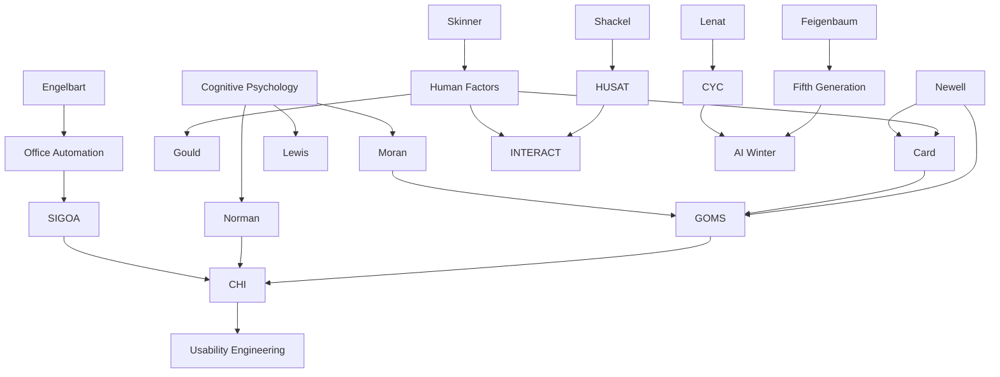

---

cssclasses:
  - Computer-Science
  - Psychology
  - History
subclasses:
  - Human-Computer-Interaction
  - Cognitive-Science
  - Design-History
related:
  - "[[Managing Vacuum Tubes & Transistors, New Vistas (1945–1965) (1 of 7)]]"
  - "[[HCI Prior to Personal Computing (1965–1980) (2 of 7)]]"
  - "[[Discretionary Use Comes into Focus (1980–1985) (3 of 7)]]"
  - "[[Graphical User Interfaces Succeed (1985–1995) (4 of 7)]]"
  - "[[Internet Era Arrives and Survives a Bubble (1995–2005) (5 of 7)]]"
  - "[[Scaling (2005-2015) (6 of 7)]]"
  - "[[Cultures and Bridges & A New Era (7 of 7)]]"
aliases:
  - discretionary use
  - mandatory use
  - sigchi formation
  - cognitive psychology
  - human factors
  - office automation
  - personal computers
  - minicomputer era
  - usability engineering
  - keystroke model
  - ai winter
  - fifth generation
reference:
  - "Grudin, J. (2017). From tool to partner: the evolution of human-computer interaction. Morgan & Claypool Publishers. (pp. 41-53)"
tags:
  - Podcast
---

#### Podcast

<iframe allow="autoplay *; encrypted-media *; fullscreen *; clipboard-write" frameborder="0" height="150" style="width:100%;overflow:hidden;border-radius:10px;background:transparent;" sandbox="allow-forms allow-popups allow-same-origin allow-scripts allow-storage-access-by-user-activation allow-top-navigation-by-user-activation" src="https://embed.podcasts.apple.com/us/podcast/from-tool-to-partner-the-evolution-of-human/id1786764068?i=1000683538203&uo=4&l=en-GB&theme=auto"></iframe>

---

#### Central Problem

This section of Grudin's historical account addresses a pivotal transformation in human-computer interaction: the shift from mandatory to discretionary computer use during 1980–1985. The central problem concerns how this transition fundamentally altered the priorities, methods, and disciplinary orientations of HCI research and practice.

When computer time was expensive and hardware dominated costs, human factors engineering optimized efficiency for workers mandated to use systems (data entry clerks, operators, reservation agents). The psychological profile of such users—trained, repetitive, captive—differed radically from discretionary users who could choose whether to adopt technology. The emergence of affordable microcomputers, personal computers, and office minicomputers created markets of technically unsophisticated users who received minimal training and would simply abandon tools that frustrated them.

The problem extends beyond mere interface design: it encompasses the formation of new professional communities (ACM SIGCHI), the tension between cognitive science and behavioral human factors, and the recurring cycles of AI hype and disappointment. How should research priorities shift when users have choice? What methods suit discretionary contexts where first impressions and learnability matter more than expert efficiency? Why did European and American HCI develop different emphases? These questions animate the period's defining debates.

#### Main Thesis

Grudin argues that the 1980–1985 period represents a watershed when discretionary use emerged as the dominant paradigm for personal computing research, catalyzing the formation of CHI as a distinct field that diverged from traditional human factors engineering while inheriting—often unknowingly—the visions of earlier pioneers.

The thesis unfolds across several dimensions:

**Technological enablement:** The convergence of affordable displays, quality printers (HP inkjet 1984, laser printers 1984–1985), the IBM PC (1981), and the Hayes Smartmodem (1981) created conditions for mass discretionary use. Community bulletin boards proliferated, reaching 60,000 systems serving 17 million users by the mid-1990s.

**Institutional crystallization:** SIGCHI emerged from SIGSOC in 1982–1983, dominated by cognitive psychologists from seven key organizations: IBM, Xerox PARC, CMU, MRC APU, Bell Labs, Digital, and UCSD. Half of the 58 papers at CHI'83 came from these institutions. The field appropriated the legacy of Bush, Sutherland, and Nelson—pioneers most early CHI researchers had not read—to gain legitimacy.

**Disciplinary divergence:** CHI and human factors, despite the conference subtitle "Human Factors in Computing Systems," moved apart after 1985. Card explicitly reduced cognitive science emphasis in CHI'86 to prevent it from "becoming human factors again." The GOMS model, paradoxically, addressed expert repetitive use characteristic of human factors rather than the discretionary novice focus CHI championed.

**AI cyclicality:** The Fifth Generation panic (1981–1983) triggered massive investments—ESPRIT, Alvey, DARPA's Strategic Computing Initiative ($400M by 1988), MCC consortium—yet produced another AI winter. Ovum's 1985 prediction of 1,000% revenue growth proved wildly optimistic; actual growth was under 20%.

#### Historical Context

The early 1980s witnessed the AT&T divestiture (1984), ending a monopoly where neither customers nor employees had technological choice. AT&T's 1985 Unix PC failed precisely because the company lacked experience designing for discretionary use. This regulatory transformation symbolized broader shifts toward consumer choice.

Office automation emerged as a distinct research field with the 1980 Stanford International Symposium (featuring two Engelbart papers), ACM SIGOA formation, AFIPS conferences, and journals like *Office: Technology and People* (1982) and *ACM Transactions on Office Information Systems* (1983). Minicomputers from Digital, Data General, and Wang brought computing to workgroup budgets—Wang's founder became the fourth wealthiest American through word processing systems.

The cognitive revolution in psychology provided theoretical foundations. Behaviorists like Skinner focused on measurable outputs; cognitive psychologists insisted internal memory and processes mattered—computers proved such structures existed. This "heated war" through the 1960s–1980s shaped HCI's methodological battles. Human factors leaders dismissed cognitive theorizing as "unobservable will o' the wisps"; cognitive scientists accused behaviorists of ignoring memory and problem-solving.

European HCI developed differently: few mass-market software companies meant focus on in-house development. *Behaviour and Information Technology* (1982) and HUSAT at Loughborough emphasized job design, labor division, and ergonomics rather than first-time user experience.

#### Philosophical Lineage

#### Key Thinkers

| Thinker | Dates | Movement | Main Work | Core Concept |
|---------|-------|----------|-----------|--------------|
| [[Card]] | 1945– | [[Cognitive Science]] | *The Psychology of Human–Computer Interaction* (1983) | GOMS, keystroke-level model |
| [[Newell]] | 1927–1992 | [[Cognitive Science]] | *Human Problem Solving* | Production systems, cognitive architecture |
| [[Norman]] | 1935– | [[Cognitive Engineering]] | "Design Principles for Human–Computer Interfaces" (1983) | User satisfaction functions, cognitive engineering |
| [[Gould]] | – | [[Human Factors]] | CHI'83 iterative design paper | User-centered iterative design |
| [[Shneiderman]] | 1947– | [[Human-Computer Interaction]] | HCIL founding (1983) | Direct manipulation, interface guidelines |
| [[Shackel]] | 1927–2007 | [[Human Factors]] | INTERACT'84 chair | Usability, European HCI |
| [[Feigenbaum]] | 1936– | [[Artificial Intelligence]] | Fifth Generation warnings (1983) | Expert systems, singularity |
| [[Lenat]] | 1950– | [[Artificial Intelligence]] | CYC project (1984) | Common-sense knowledge base |

#### Key Concepts

| Concept | Definition | Related to |
|---------|------------|------------|
| Discretionary use | Computer use where the user chooses whether to engage, contrasted with mandated operational tasks | [[Human-Computer Interaction]], [[Usability]] |
| Mandatory use | Required computer use by operators, clerks, and workers with no choice about tool adoption | [[Human Factors]], [[Efficiency]] |
| GOMS | Goals, Operators, Methods, Selection rules—cognitive model for expert user performance | [[Card]], [[Newell]], [[Moran]] |
| Keystroke-level model | Predicting expert task time based on keystroke sequences | [[Card]], [[Human Factors]] |
| Office automation | Minicomputer-based productivity tools for workgroups: word processing, email, file sharing | [[Engelbart]], [[SIGOA]] |
| Cognitive engineering | Application of cognitive science to interface design, distinguishing CHI from behavioral human factors | [[Norman]], [[CHI]] |
| Fifth Generation | Japanese government AI initiative (1982–1992) triggering Western competitive panic | [[ICOT]], [[AI Winter]] |
| AI winter | Period of reduced funding and interest following unfulfilled AI promises | [[Minsky]], [[DARPA]] |
| Usability engineering | Systematic approach to designing usable systems through iterative testing | [[Gould]], [[Lewis]] |
| Bundling | Practice of including software free with hardware purchases, ended by IBM antitrust action (1969) | [[Software Industry]], [[IBM]] |

#### Authors Comparison

| Theme | [[Grudin]] | [[Card]]/[[Newell]] |
|-------|-----------|---------------------|
| Primary concern | Historical sociology of HCI fields | Cognitive modeling of performance |
| View of human factors | Valuable for mandatory use contexts | "Classical human factors has second-class status" |
| Methodological preference | Archival, interview-based history | Experimental, model-building |
| Discretionary use | Central organizing concept | Not primary focus (GOMS models expert repetitive use) |
| Disciplinary politics | Documents CHI-HF divergence neutrally | Actively shaped CHI to prevent "becoming human factors" |
| AI assessment | Cyclical hype/winter pattern | Neural networks, production systems as cognitive models |

#### Influences & Connections

- **Predecessors:** [[Card]] ← influenced by ← [[Newell]], [[Simon]]; [[Norman]] ← influenced by ← [[Cognitive Psychology]]
- **Contemporaries:** [[Card]] ↔ collaborated with ↔ [[Moran]], [[Newell]]; [[Gould]] ↔ collaborated with ↔ [[Lewis]]
- **Institutional formations:** [[CHI]] ← emerged from ← [[SIGSOC]]; [[SIGOA]] → absorbed into → [[CHI]], [[CSCW]]
- **Opposing views:** [[Card]] ← methodological tension with ← [[Human Factors]]; [[Bannon]] ← criticized ← [[CHI]] novice emphasis
- **Technology transfers:** [[Xerox PARC]] → GUI concepts → [[Apple Lisa]], [[Apple Macintosh]]

#### Summary Formulas

- **[[Grudin]]:** The 1980–1985 period crystallized discretionary use as the organizing paradigm for CHI, differentiating it from human factors through cognitive psychology methods and first-time user priorities, while AI investments yielded another cycle of inflated expectations and disappointment.

- **[[Card]]/[[Newell]]:** Transform HCI into "hard science" through cognitive modeling (GOMS, keystroke-level) that predicts expert performance, avoiding the "second-class status" of classical human factors.

- **[[Bannon]]:** The shift "from human factors to human actors" has broader implications than CHI's narrow focus on novice first-time use acknowledges; European perspectives emphasize ongoing skilled work.

#### Timeline

| Year | Event |
|------|-------|
| 1979 | VisiCalc spreadsheet for Apple II demonstrates business potential |
| 1980 | Stanford International Symposium on Office Automation; SIGOA formed |
| 1981 | IBM PC released; Hayes Smartmodem enables BBS proliferation; Xerox Star, Symbolics/LMI Lisp machines |
| 1982 | Japanese Fifth Generation project announced; SIGOA initiates COIS; *Behaviour and Information Technology* launched |
| 1983 | First CHI conference (1,000+ attendees); Card/Moran/Newell *Psychology of Human–Computer Interaction*; HCIL founded at Maryland; MCC consortium formed |
| 1984 | Apple Macintosh; INTERACT'84 London; AT&T divestiture; HP inkjet printers; MCC purchases Lisp machines; Loughborough HCI program |
| 1985 | *Human–Computer Interaction* journal founded; AT&T Unix PC fails; HP/Apple laser printers; Ovum predicts 1,000% AI revenue growth |

#### Notable Quotes

> "Hard science, in the form of engineering, drives out soft science, in the form of human factors." — [[Newell]] and [[Card]]

> "It's not enough just to establish what computer systems can and cannot do; we need to spend just as much effort establishing what people can and want to do." — [[Smith]] and [[Green]]

> "Text editors are the white rats of HCI." — [[Green]]

---
> [!warning]-
> This annotation was normalised using a large language model and may contain inaccuracies. These texts serve as preliminary study resources rather than exhaustive references.
