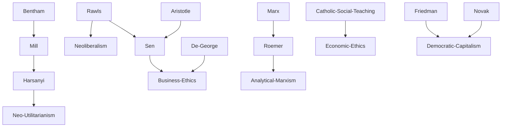

---
cssclasses:
  - Philosophy
  - Economics
subclasses:
  - Applied-Ethics
  - Social-and-Political-Philosophy
  - 20th-Century-Philosophy
aliases:
  - business ethics
  - economic ethics
  - ethical finance
  - fair trade
  - ethical investment
  - corporate responsibility
  - welfare economics
  - social utility
  - ethical screening
  - market ethics
contributions:
  - Conceptual
  - Constructive
authors:
  - "[[Sen]]"
  - "[[Harsanyi]]"
  - "[[Rawls]]"
  - "[[George]]"
  - "[[Roemer]]"
  - "[[Friedman]]"
  - "[[Novak]]"
reference: "Abbagnano, N., & Fornero, G. (2012). La ricerca del pensiero. Vol. 3C. Dalla crisi della modernità agli sviluppi più recenti. Paravia."
related:
  - "[[Utilitarianism]]"
  - "[[Neoliberalism]]"
  - "[[Business Ethics]]"
  - "[[Welfare Economics]]"
  - "[[Sen]]"
  - "[[Rawls]]"
  - "[[Applied Ethics]]"
  - "[[Corporate Social Responsibility]]"
  - "[[Fair Trade]]"
  - "[[Analytical Marxism]]"
---

#### Central Problem

The chapter addresses the fundamental tension between economic rationality and ethical responsibility in contemporary society. The central question is whether economics should pursue only utility (l'utile) or whether it must also orient itself toward justice (il giusto). This dilemma emerges from the recognition that economic activities produce far-reaching consequences beyond mere profit—affecting underdevelopment, inequality between rich and poor, environmental protection, wealth management, and non-economic consequences of economic actions.

Contemporary economics can no longer avoid confronting urgent planetary problems. Economists have moved beyond purely technical analyses and methodological discussions to engage with real solutions for real problems, where economics intersects with politics and ethics. Civil society has gradually become aware of the massive effects of economic behavior and the necessity of questioning whether the market should only produce wealth or also promote ethical values. This has generated a vast debate where contributions from economists intersect with those of philosophers and politicians, creating transversal tendencies that unite followers of various religious faiths, environmentalists, and politicians of different orientations.

#### Main Thesis

The chapter argues that economic activity, being a human activity, can and should be evaluated from a moral standpoint. The thesis, articulated forcefully by Richard De George, challenges the "myth of amoral business"—the widespread conviction that "business is business" and that morality and business represent separate fields. Against this dogma, proponents of business ethics maintain that since business is a human activity, like any other human activity, it can and must be evaluated ethically.

The text presents multiple approaches to integrating ethics with economics:

**Utilitarianism vs. Neoliberalism:** Utilitarianism identifies utility as the criterion for collective action and foundation of individual happiness, aiming to maximize social welfare understood as the sum of individual utilities. Neo-utilitarianism, as formulated by Harsanyi, views political, economic, and legal decisions as expressions of human rationality calculated to produce the greatest happiness for the greatest number. Neoliberalism (exemplified by Rawls) counters that society cannot rely solely on utility calculation but must ask whether choices are also just, presupposing a strong connection between freedom of initiative and responsibility.

**Sen's Ethical Paradigm:** Sen argues that welfare economics can be substantially enriched by greater attention to ethics. The value of wealth must be conjoined not only with happiness (a relative and unquantifiable element) but with a concept of "well-being" that differs from simple "utility." Well-being does not consist only in having higher income but translates into better quality of life—a variable that must be considered in economic calculations.

**Business Ethics as Normative Ethics:** Business ethics qualifies as an ethics of consequences, not intentions. It does not merely describe but prescribes behavioral models, representing one of the most significant manifestations of the late-twentieth-century rebirth of normative ethics.

#### Historical Context

Business ethics emerged in America in the 1970s, with its conventional birth date set at November 1974, coinciding with the first business ethics conference at the University of Kansas, organized by philosopher Richard De George and Joseph A. Pichler. Initially, the field faced resistance: philosophers considered the business world uninteresting (many had an "anti-business" mentality), while business professors thought philosophical reflection had little relevance for business affairs.

The development of ethical finance and investment gained momentum between the late 1960s and 1990s in Europe and the Third World (notably Bangladesh). The ethical screening criterion originated around 1920 in the United States when the Methodist Church allowed its faithful to invest in the stock market, provided speculation did not involve the alcohol industry or gambling.

In Italy, ethical investments took root in the late 1970s with the establishment of MAGs (Mutue di AutoGestione—Mutual Self-Management organizations). The Banca Etica was founded in 1998 to promote ethically sustainable investments. The fair trade movement was formalized in Italy through the 1999 "Carta italiana dei criteri del commercio equo e solidale" by AGICES.

The Catholic Church's post-conciliar engagement with social questions is reflected in papal encyclicals: Paul VI's *Populorum progressio* (1967) and *Octogesima adveniens* (1971), and John Paul II's *Sollicitudo rei socialis* (1987), calling for renewed synergy between ethical and economic rationality oriented toward human dignity.

#### Philosophical Lineage

#### Key Thinkers

| Thinker | Dates | Movement | Main Work | Core Concept |
|---------|-------|----------|-----------|--------------|
| [[Harsanyi]] | 1920-2000 | [[Neo-Utilitarianism]] | *Rational Behavior and Bargaining Equilibrium* | Social utility as average of individual utilities |
| [[Sen]] | 1933- | [[Welfare Economics]] | *Ethics and Economics* | Well-being beyond utility; capabilities approach |
| [[De George]] | 1933- | [[Business Ethics]] | *Business Ethics* | Business as ethically evaluable human activity |
| [[Rawls]] | 1921-2002 | [[Neoliberalism]] | *A Theory of Justice* | Justice over mere utility calculation |
| [[Roemer]] | 1945- | [[Analytical Marxism]] | *A General Theory of Exploitation and Class* | Exploitation as ethical-existential issue |
| [[Friedman]] | 1912-2006 | [[Neoliberalism]] | *Capitalism and Freedom* | Market efficiency with legality |
| [[Novak]] | 1933-2017 | [[Democratic Capitalism]] | *The Spirit of Democratic Capitalism* | Capitalism compatible with Christian ethics |

#### Key Concepts

| Concept | Definition | Related to |
|---------|------------|------------|
| Business Ethics | Discipline evaluating economic activities from moral standpoint; rejects "amoral business" dogma | [[De George]], [[Applied Ethics]] |
| Ethical Finance | Organization of financial services respecting moral values and pursuing ethically binding objectives | [[Sen]], [[Welfare Economics]] |
| Ethical Screening | Selection of investments based on moral convictions and ideological criteria | [[Business Ethics]], ethical funds |
| Fair Trade | Import from developing countries with guarantees for producers (dignified pay, prefinancing, long-term contracts) | [[Social Justice]], development |
| Utilitarianism | Theory identifying utility as criterion for action; maximizing sum of individual utilities | [[Bentham]], [[Mill]], [[Harsanyi]] |
| Neoliberalism | View that society must evaluate not only utility but justice of economic choices | [[Rawls]], freedom-responsibility link |
| Macro-ethics of Business | Moral evaluation of basic economic institutions (market, planned economy, welfare state) | [[Business Ethics]], institutions |
| Meso-ethics of Business | Moral evaluation of intermediate organizations (banks, corporations) | [[Business Ethics]], organizations |
| Micro-ethics of Business | Moral evaluation of individual economic choices and professional roles | [[Business Ethics]], stakeholders |
| Social Utility | Average of individual utilities calculated by "sympathetic but impartial observer" | [[Harsanyi]], [[Rawls]] |

#### Authors Comparison

| Theme | [[Harsanyi]] | [[Sen]] | [[De George]] | [[Roemer]] |
|-------|--------------|---------|---------------|------------|
| Economic goal | Maximum average utility | Well-being as quality of life | Ethical business conduct | Equal access to means |
| Method | Rational calculation | Capabilities approach | Normative prescription | Analytical Marxism |
| Utility concept | Quantifiable average | Insufficient criterion | Secondary to ethics | Masks exploitation |
| Justice | Implicit in utility | Central variable | Guides business | Requires redistribution |
| Role of ethics | Instrumental | Fundamental | Prescriptive | Existential-ethical |

#### Influences & Connections

- **Predecessors:** [[Harsanyi]] ← influenced by ← [[Bentham]], [[Mill]] (classical utilitarianism)
- **Predecessors:** [[Sen]] ← influenced by ← [[Aristotle]], [[Rawls]]
- **Contemporaries:** [[Rawls]] ↔ dialogue with ↔ [[Harsanyi]] (veil of ignorance concept)
- **Contemporaries:** [[Sen]] ↔ debate with ↔ [[Rawls]], [[Nozick]], [[Habermas]]
- **Followers:** [[De George]] → influenced → business ethics discipline, corporate ethics programs
- **Opposing views:** [[Roemer]] ← criticized by ← traditional economists; [[Friedman]] ← criticized by ← Marxists

#### Summary Formulas

- **[[Harsanyi]]:** Political-economic decisions should maximize social utility, understood as the average of individual utilities, calculated by a sympathetic but impartial observer.

- **[[Sen]]:** Welfare economics must integrate ethics; well-being is not mere utility or income but quality of life that markets should promote alongside wealth.

- **[[De George]]:** Business is a human activity that can and must be morally evaluated; the myth of "amoral business" must be overcome.

- **[[Roemer]]:** Capitalist exploitation limits workers' capacities to be and do; ethical criticism requires making means of production accessible to all.

- **[[Rawls]]:** Society cannot rely solely on utility calculation but must ask whether choices are just, linking freedom of initiative to responsibility.

#### Timeline

| Year | Event |
|------|-------|
| 1920 | Methodist Church establishes first ethical screening criteria for investment |
| 1967 | Paul VI publishes *Populorum progressio* on social development |
| 1971 | Paul VI publishes *Octogesima adveniens* on social questions |
| 1974 | First Business Ethics conference at University of Kansas ([[De George]], Pichler) |
| 1982 | [[De George]] publishes *Business Ethics*; [[Novak]] publishes *The Spirit of Democratic Capitalism* |
| 1987 | John Paul II publishes *Sollicitudo rei socialis* |
| 1988 | [[Sen]] publishes *Ethics and Economics* |
| 1998 | Banca Etica founded in Italy |
| 1999 | AGICES publishes Italian Charter for Fair Trade criteria |

#### Notable Quotes

> "Welfare economics can be substantially enriched by paying greater attention to ethics, and the study of ethics can also benefit from closer contact with economics." — [[Sen]]

> "Being business a human activity, like any other of our activities, it can—and in some respects must—be evaluated also from an ethical standpoint." — [[De George]]

> "Morality is not a detached sector of life, but the lubricant and glue of the entire society." — [[De George]]

---
> [!NOTE]
> *This summary has been created to present the key points from the source text, which was automatically extracted using LLM. Please note that the summary may contain errors. It serves as an essential starting point for study and reference purposes.*
