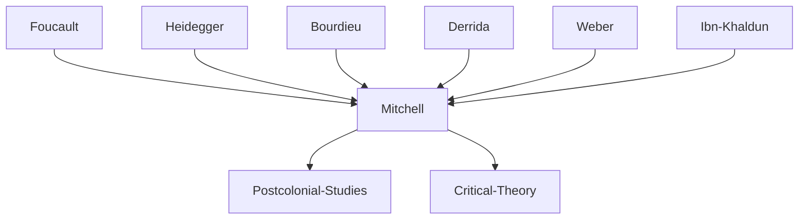

---

cssclasses:
  - Philosophy
  - Political-Science
  - History
subclasses:
  - Continental-Philosophy
  - Social-and-Political-Philosophy
  - Critical-Theory
related:
  - "[[Foucault]]"
  - "[[Disciplinary Power]]"
  - "[[Colonialism]]"
  - "[[Modernity]]"
  - "[[Panopticism]]"
  - "[[Bourdieu]]"
aliases:
  - enframing colonialism
  - disciplinary power
  - colonial egypt
  - model village
  - nizam jadid
  - world exhibition
  - spatial order
  - representation politics
  - colonial modernity
  - kabyle house
reference:
  - Mitchell, T. (2003). Colonising Egypt (Repr). Univ. of California Press. (pp.34-62)
tags:
  - Podcast
---

#### Podcast

<iframe allow="autoplay *; encrypted-media *; fullscreen *; clipboard-write" frameborder="0" height="150" style="width:100%;overflow:hidden;border-radius:10px;background:transparent;" sandbox="allow-forms allow-popups allow-same-origin allow-scripts allow-storage-access-by-user-activation allow-top-navigation-by-user-activation" src="https://embed.podcasts.apple.com/us/podcast/enframing-egypt-disciplinary-power-and-colonial-control/id1786764068?i=1000686582522&uo=4&l=en-GB&theme=auto"></iframe>

---

#### Central Problem

How did modern disciplinary power transform Egypt in the nineteenth century, and what is the relationship between colonial ordering practices and the emergence of a distinctively modern mode of representation? Mitchell addresses the fundamental question of what distinguishes modern forms of political power from earlier modes of domination, examining how the introduction of barracks, schools, and model villages in Egypt created not merely new institutions but an entirely new ontology of order.

The central tension lies between two radically different conceptions of order: the pre-modern understanding based on cycles of fullness and emptiness, growth and decay (captured in the Arabic term *'umran*), and the modern understanding based on enframing—the division of the world into neutral frameworks and their contents, representations and what they represent. Mitchell's problem is not simply historical but epistemological: how do the techniques of modern power produce the very categories through which we understand reality, including the distinction between "real" and "representation" that structures modern thought?

This investigation challenges both traditional colonial historiography and conventional Foucauldian analysis by demonstrating that disciplinary power was not merely exported from Europe to the colonies but was in fact developed on the colonial frontier—the panopticon was a colonial invention, and the model village perfected in Egypt and Algeria.

#### Main Thesis

Mitchell argues that modern disciplinary power operates through a distinctive technique he calls "enframing" (*Einrahmung*), which produces the effect of a neutral spatial framework within which objects, persons, and activities can be positioned, monitored, and controlled. This enframing is not merely a technique of administration but constitutes the very ontology of modernity—the belief that the world divides into material reality and its representations, into things and their meanings.

The thesis unfolds through several interconnected claims:

**The Nizam Jadid (New Order):** Beginning in 1822, the Egyptian peasantry was for the first time conscripted into a modern army organized according to Prussian-French military techniques. This "new order" was characterized by precise timing, coordinated movements, uniform dress, and continuous surveillance—transforming masses of individuals into what military theorists called a "military machine" that could be "turned with the precision of a watch."

**Enframing as Spatial Practice:** The techniques of the barracks extended to the village through the Programme of 1829 and the construction of "model villages" by French engineers. These villages replaced organic settlements with geometrically ordered spaces where every family received rooms according to rank, every activity had its designated location, and every person could be located, counted, and monitored. Order was achieved by effecting "an inert structure that contains and orders a contents."

**The Production of Representation:** Enframing creates the peculiar modern effect of a world divided between things and their meanings, between reality and its representation. In the world-as-exhibition, everything appears as a picture of something else, requiring an external observer to decode its meaning. This contrasts sharply with pre-modern orders (exemplified by the Kabyle house) where relations of resemblance and difference do not produce a hierarchy of original and copy.

**Colonialism and Modernity:** Mitchell demonstrates that disciplinary power was not simply applied to the colonies from a European center but was developed through colonial encounters. The panopticon was devised on Europe's colonial frontier with the Ottoman Empire; model schooling developed as a method for "civilizing" colonized populations.

#### Historical Context

The text examines Egypt during the crucial period of Muhammad Ali's rule (1805-1848) and its aftermath, when Egypt experienced unprecedented transformations under pressure from European powers. The defeat of Napoleon's invasion (1798-1801) had paradoxically opened Egypt to intensive European influence, as Muhammad Ali sought to modernize the country to resist further European encroachment.

The 1830s-1840s saw the systematic reorganization of Egyptian society according to European administrative models. The Ordinance of January 1830 confined peasants to their native districts, requiring permits for travel. The Programme of 1829 specified in detail how peasants were to work, what crops to cultivate, and the punishments for failure—extending the disciplinary logic of the barracks to the entire rural population.

This period coincided with the expansion of European colonialism across North Africa. France invaded Algeria in 1830, and similar "model village" projects were implemented there with even more explicit military purposes—relocating populations to areas easier to control. Alexis de Tocqueville visited Algeria in 1841 as an expert advocate for continued colonial conquest.

The broader context includes the emergence of world exhibitions in European capitals, which Mitchell analyzes in his first chapter as paradigmatic of the modern world-as-exhibition: spaces designed to produce the effect of reality as something to be observed, decoded, and represented.

#### Philosophical Lineage

#### Key Thinkers

| Thinker | Dates | Movement | Main Work | Core Concept |
|---------|-------|----------|-----------|--------------|
| [[Foucault]] | 1926-1984 | [[Post-Structuralism]] | *Discipline and Punish* | Disciplinary power, panopticism |
| [[Bourdieu]] | 1930-2002 | [[Critical Sociology]] | *Outline of a Theory of Practice* | Kabyle house, habitus |
| [[Heidegger]] | 1889-1976 | [[Phenomenology]] | *The Question Concerning Technology* | Enframing (Gestell) |
| [[Ibn Khaldun]] | 1332-1406 | [[Islamic Philosophy]] | *Muqaddimah* | 'Umran, cycles of civilization |
| [[Derrida]] | 1930-2004 | [[Deconstruction]] | *Of Grammatology* | Différance, trace |
| [[Weber]] | 1864-1920 | [[Sociology]] | *Science as a Vocation* | Disenchantment, rationalization |

#### Key Concepts

| Concept | Definition | Related to |
|---------|------------|------------|
| Enframing | The modern technique of dividing and organizing space by conjuring up a neutral surface called "space" within which contents can be positioned and controlled | [[Heidegger]], [[Foucault]], [[Colonialism]] |
| Nizam jadid | "New Order"—the Ottoman and Egyptian adoption of Prussian-French military discipline, drill, and organization | [[Disciplinary Power]], [[Modernity]] |
| World-as-exhibition | The modern ontological effect whereby reality appears as a representation or picture of something else, requiring external observation | [[Representation]], [[Colonial Gaze]] |
| 'Umran | Arabic term for civilization/culture as a process of building, fullness, and flourishing—not a static framework | [[Ibn Khaldun]], [[Pre-modern Order]] |
| Model village | Colonial administrative technique of rebuilding settlements according to geometric plans, making populations legible and controllable | [[Spatial Order]], [[Colonial Administration]] |
| Military machine | The conception of an army as a mechanism of precise, coordinated movements that can be expanded, contracted, and directed on command | [[Disciplinary Power]], [[Prussian Military]] |
| Hierarchies of truth | The modern ordering of reality into representations and originals, copies and referents, with the "real" as the absent signified | [[Representation]], [[Epistemology]] |
| The filling of the house | Kabyle practice of tending to the world's fertility and potential fullness, without division into framework and content | [[Bourdieu]], [[Pre-modern Order]] |
| Colonial frontier | The site where disciplinary techniques were developed before being applied in European metropoles | [[Colonialism]], [[Modernity]] |
| Différance | Derrida's term for the unstable play of differing/deferring that produces meaning without fixed origins | [[Derrida]], [[Post-Structuralism]] |

#### Authors Comparison

| Theme | [[Mitchell]] | [[Foucault]] |
|-------|--------------|--------------|
| Site of analysis | Colonial Egypt and Algeria | France and Northern Europe |
| Origin of disciplinary power | Colonial frontier | European institutions |
| Panopticism | Colonial invention exported to Europe | Bentham's utilitarian design |
| Spatial order | Enframing as representation | Surveillance and normalization |
| Pre-modern contrast | Kabyle house, Islamic city | Classical episteme |
| Critique of modernity | World-as-exhibition, colonial gaze | Biopolitics, governmentality |
| Key metaphor | Exhibition, picture, frame | Prison, examination, gaze |

#### Influences & Connections

- **Predecessors:** [[Mitchell]] ← influenced by ← [[Foucault]], [[Heidegger]], [[Derrida]], [[Bourdieu]]
- **Primary Sources:** [[Mitchell]] ← draws on ← [[Ibn Khaldun]], [[al-Jabarti]], [[Tocqueville]]
- **Contemporaries:** [[Mitchell]] ↔ dialogue with ↔ [[Said]], [[Chakrabarty]], [[Spivak]]
- **Followers:** [[Mitchell]] → influenced → [[Postcolonial Studies]], [[Critical Theory]], [[Science Studies]]
- **Opposing views:** [[Mitchell]] ← critiques ← [[Orientalism]], [[Modernization Theory]], [[Weber]]

#### Summary Formulas

- **[[Mitchell]]:** Modern disciplinary power operates through enframing—the production of neutral spatial frameworks that divide reality into representations and what they represent, creating the world-as-exhibition.
- **[[Foucault]] (as read by Mitchell):** Disciplinary power works not by taking what is produced but by entering into the process of production itself, seeking to penetrate, reorder, and colonize.
- **[[Bourdieu]] (as read by Mitchell):** The Kabyle house exemplifies a pre-modern order based on the tending of polar forces (male/female, light/dark, dry/wet) rather than the separation of framework and content.
- **[[Ibn Khaldun]] (as read by Mitchell):** 'Umran names a cycle of building, fullness, and decay that never resolves into the modern distinction between material city and ideal plan.

#### Timeline

| Year | Event |
|------|-------|
| 1798-1801 | French occupation of Egypt under [[Napoleon]] |
| 1805 | [[Muhammad Ali]] becomes ruler of Egypt |
| 1822 | Mass conscription of Egyptian peasants into modern army begins |
| 1829 | Programme for Agriculture issued, extending discipline to villages |
| 1830 | Ordinance confining peasants to native districts; France invades Algeria |
| 1835-1836 | Reorganization of Egyptian military training schools |
| 1840s | Construction of "model villages" on private estates |
| 1841 | [[Tocqueville]] visits Algeria to inspect colonial conquest |
| 1846 | Kafr al-Zayat rebuilt as model village under French engineers |
| 1882 | British occupation of Egypt |

#### Notable Quotes

> "The panoptic principle was devised on Europe's colonial frontier with the Ottoman Empire, and examples of the panopticon were built for the most part not in northern Europe, but in places like colonial India." — [[Mitchell]]

> "Enframing is a method of dividing up and containing, as in the construction of barracks or the rebuilding of villages, which operates by conjuring up a neutral surface or volume called 'space'." — [[Mitchell]]

> "There is nothing symbolic in this world. Gall is not associated with wormwood because it represents bitterness. It occurs itself as the trace of bitterness." — [[Mitchell]]

---
> [!warning]-
> This annotation was normalised using a large language model and may contain inaccuracies. These texts serve as preliminary study resources rather than exhaustive references.
