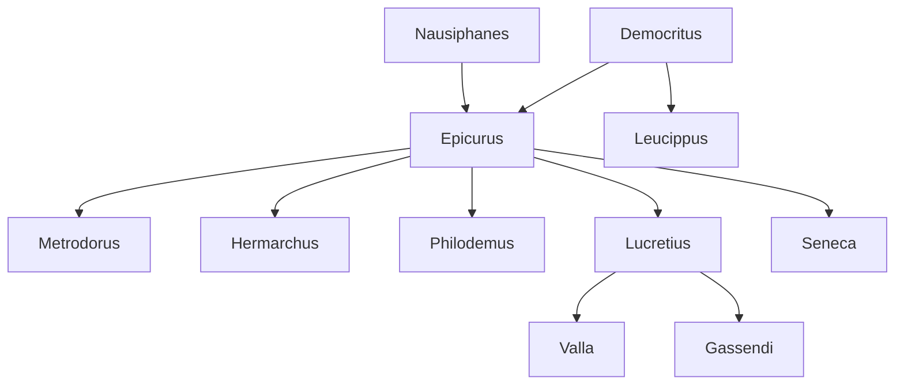

---
cssclasses:
  - Philosophy
  - Psychology
subclasses:
  - Ancient-Greek-and-Roman-Philosophy
  - Ethics
  - Epistemology
related:
  - "[[Atomism]]"
  - "[[Hellenistic Philosophy]]"
  - "[[Stoicism]]"
  - "[[Skepticism]]"
  - "[[Hedonism]]"
  - "[[Materialism]]"
  - "[[Free Will]]"
  - "[[Philosophy of Death]]"
  - "[[Democritus]]"
  - "[[Lucretius]]"
aliases:
  - pleasure ethics
  - garden philosophy
reference:
  - "Abbagnano, N., & Fornero, G. (2012). La ricerca del pensiero. Vol. 1B. Dall'ellenismo alla scolastica. Paravia."
---

#### Central Problem

Epicureanism addresses the fundamental question of how human beings can achieve genuine happiness and tranquility in a world filled with fears, anxieties, and unfulfilled desires. The central problem is threefold: How can we liberate ourselves from the paralyzing fears of the gods, death, and the afterlife? How can we understand the nature of pleasure and pain so as to live well? And how can we navigate our desires to achieve lasting contentment rather than perpetual agitation?

[[Epicurus]] recognized that most human suffering derives not from actual physical pain but from mental disturbances—anxieties about divine punishment, terror of death, endless pursuit of unnecessary pleasures, and fear of uncontrollable pain. These psychological afflictions prevent people from achieving the serene life that should be philosophy's ultimate goal. The challenge was to develop a comprehensive philosophical system—encompassing epistemology, physics, and ethics—that could serve as a "quadruple medicine" (quadrifarmaco) capable of curing these spiritual maladies.

Unlike the Stoics who sought harmony with cosmic reason, Epicurus sought liberation from cosmic fears altogether, teaching that neither gods nor death nor the pursuit of excessive pleasure should disturb the wise person's tranquility.

#### Main Thesis

[[Epicurus]] maintains that philosophy's sole purpose is instrumental: to provide the means for achieving happiness, understood as liberation from mental disturbance (ataraxia) and bodily pain (aponia). This therapeutic conception of philosophy yields the famous "quadrifarmaco" or fourfold remedy:

**First Medicine:** The gods exist but do not concern themselves with human affairs. Living in perfect bliss between worlds, they neither reward nor punish mortals. Therefore, fear of divine intervention is groundless.

**Second Medicine:** Death is nothing to us. Since death is merely the dissolution of atoms and the cessation of sensation, "when we exist, death is not present; when death is present, we no longer exist." Fear of death is therefore irrational.

**Third Medicine:** Pleasure, properly understood, is easily attainable. True happiness requires only the satisfaction of natural and necessary desires, which are modest and readily fulfilled.

**Fourth Medicine:** Pain, when severe, is brief (leading either to death or recovery); when chronic, it is bearable. Therefore, fear of unbearable suffering is unfounded.

The physical foundation for this ethics is a modified atomism derived from [[Democritus]]. All reality consists of atoms moving through infinite void. However, [[Epicurus]] crucially introduces the concept of *clinamen* (atomic swerve)—a spontaneous, uncaused deviation in atomic trajectories that breaks deterministic necessity and makes human freedom possible.

The ethical goal is negative pleasure—not the pursuit of intense sensations but the absence of pain and disturbance. The wise person achieves self-sufficiency through rational calculation of pleasures, limiting desires to what is natural and necessary, and cultivating friendship as the supreme social good while avoiding political entanglements.

#### Historical Context

[[Epicurus]] (341-271 BCE) lived during the turbulent transition from the Classical to the Hellenistic period. Born on Samos to Athenian colonists, he witnessed the aftermath of [[Alexander]]'s conquests and the fragmentation of his empire among warring generals. The old certainties of the Greek polis had collapsed; citizens of small city-states now found themselves subjects of vast monarchies over which they had no control.

In this context of political powerlessness and social upheaval, Epicureanism offered a philosophy of strategic withdrawal. Around 307-306 BCE, [[Epicurus]] established his school in Athens in a garden (hence "philosophers of the Garden"), creating an alternative community based on friendship and philosophical practice rather than civic engagement.

The school was remarkably inclusive for its time: women and slaves could participate as equals, united by bonds of philosophical friendship. The community venerated [[Epicurus]] almost as a divine figure, following his precept: "Act always as if Epicurus were watching." This reverence ensured doctrinal stability—unlike other Hellenistic schools, Epicureanism remained remarkably faithful to its founder's teachings for over five centuries.

The Roman poet [[Lucretius]] (96-55 BCE) transmitted Epicurean physics and ethics in his masterpiece *De rerum natura*, presenting [[Epicurus]] as humanity's liberator from superstition and the fear of death. The poem became the primary source for Epicurean thought in the Latin West.

#### Philosophical Lineage

#### Key Thinkers

| Thinker | Dates | Movement | Main Work | Core Concept |
|---------|-------|----------|-----------|--------------|
| [[Epicurus]] | 341-271 BCE | [[Epicureanism]] | *Letter to Menoeceus* | Quadrifarmaco, ataraxia |
| [[Metrodorus]] | 331-278 BCE | [[Epicureanism]] | Polemical writings | Orthodox Epicureanism |
| [[Philodemus]] | 110-35 BCE | [[Epicureanism]] | Herculaneum papyri | Late Epicurean debates |
| [[Lucretius]] | 96-55 BCE | [[Epicureanism]] | *De rerum natura* | Poetic atomism |
| [[Democritus]] | 460-370 BCE | [[Atomism]] | Lost works | Original atomic theory |

#### Key Concepts

| Concept | Definition | Related to |
|---------|------------|------------|
| Quadrifarmaco | The fourfold remedy: philosophy as medicine against fear of gods, death, inability to attain pleasure, and fear of pain | [[Epicurus]], [[Epicureanism]] |
| Ataraxia | Absence of mental disturbance; tranquility of soul achieved through philosophical understanding | [[Epicurus]], [[Hellenistic Philosophy]] |
| Aponia | Absence of bodily pain; physical component of Epicurean happiness | [[Epicurus]], [[Epicureanism]] |
| Clinamen | Spontaneous atomic swerve that breaks determinism and enables free will | [[Epicurus]], [[Lucretius]] |
| Canonica | Epicurean theory of knowledge based on sensations, anticipations, and emotions as criteria of truth | [[Epicurus]], [[Epistemology]] |
| Anticipation (prolepsis) | General concepts formed from repeated sensations that anticipate future experience | [[Epicurus]], [[Epicureanism]] |
| Natural and necessary desires | Basic needs (food, drink, shelter) whose satisfaction is essential and easily achieved | [[Epicurus]], [[Ethics]] |
| Catastematic pleasure | Stable pleasure consisting in the absence of pain, contrasted with kinetic (active) pleasure | [[Epicurus]], [[Epicureanism]] |
| Negative hedonism | Conception of pleasure as absence of pain rather than positive sensation | [[Epicurus]], [[Ethics]] |
| "Live hidden" | Epicurean maxim advising withdrawal from political life to preserve tranquility | [[Epicurus]], [[Epicureanism]] |

#### Authors Comparison

| Theme | [[Epicurus]] | [[Stoics]] | [[Democritus]] |
|-------|--------------|------------|----------------|
| Ultimate reality | Atoms and void | Logos-permeated matter | Atoms and void |
| Cosmology | Infinite worlds, no providence | Single cosmos, providential | Infinite worlds, necessity |
| Source of motion | Weight and clinamen | Cosmic logos | Inherent property |
| Criterion of truth | Sensation, anticipation, emotion | Cataleptic representation | Sensation |
| Ethics foundation | Pleasure (absence of pain) | Virtue (life according to nature) | Cheerfulness |
| Providence | Denied | Affirmed | Denied |
| Free will | Guaranteed by clinamen | Compatible with fate | Determinism |
| Political engagement | Rejected ("live hidden") | Accepted (cosmopolitanism) | Unclear |
| The gods | Exist but indifferent | Identified with cosmic reason | Atomic images |

#### Influences & Connections

- **Predecessors:** [[Epicurus]] ← influenced by ← [[Democritus]], [[Nausiphanes]], [[Pamphilus]]
- **Contemporaries:** [[Epicurus]] ↔ polemics with ↔ [[Stoics]], [[Academics]], [[Peripatetics]]
- **Followers:** [[Epicurus]] → influenced → [[Lucretius]], [[Philodemus]], [[Diogenes of Oenoanda]]
- **Later reception:** [[Epicurus]] → influenced → [[Valla]], [[Gassendi]], [[Jefferson]]
- **Opposing views:** [[Epicurus]] ← criticized by ← [[Cicero]], [[Plutarch]], [[Church Fathers]]

#### Summary Formulas

- **[[Epicurus]]:** Philosophy is a fourfold medicine that liberates us from fear of gods and death, demonstrates that pleasure is easily attained and pain easily endured, enabling the wise person to achieve tranquil self-sufficiency.
- **[[Lucretius]]:** Epicurus is humanity's liberator who, through understanding atomic nature, freed mortals from the crushing weight of superstition and the terror of death.
- **[[Democritus]]:** Reality consists of atoms and void, with all phenomena explicable through atomic motion and combination—though without the element of spontaneous swerve.

#### Timeline

| Year | Event |
|------|-------|
| 341 BCE | [[Epicurus]] born on Samos |
| 327 BCE | [[Epicurus]] begins studying philosophy under Pamphilus and Nausiphanes |
| 323 BCE | [[Epicurus]] goes to Athens, possibly attends Academy |
| 311 BCE | [[Epicurus]] teaches at Mytilene on Lesbos |
| 309 BCE | [[Epicurus]] moves to Lampsacus, forms first group of disciples |
| 307-306 BCE | [[Epicurus]] establishes the Garden school in Athens |
| 278 BCE | Death of [[Metrodorus]] of Lampsacus |
| 271 BCE | Death of [[Epicurus]]; Hermarchus succeeds as head of Garden |
| 96 BCE | Birth of [[Lucretius]] |
| 55 BCE | Death of [[Lucretius]]; *De rerum natura* published by Cicero |

#### Notable Quotes

> "When we exist, death is not present; when death is present, we no longer exist." — [[Epicurus]]

> "If we were not troubled by thoughts about celestial phenomena and death, and by not knowing the limits of pains and desires, we would have no need of natural science." — [[Epicurus]]

> "Of all the things that wisdom provides for the happiness of the whole life, by far the greatest is the acquisition of friendship." — [[Epicurus]]

---
> [!warning]-
> This annotation was normalised using a large language model and may contain inaccuracies. These texts serve as preliminary study resources rather than exhaustive references.
