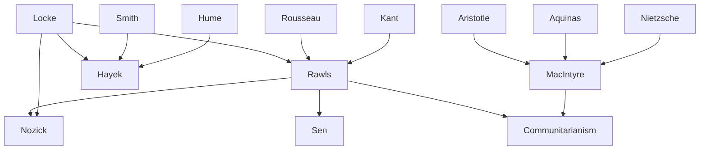

---
cssclasses:
  - Philosophy
  - Political-Science
subclasses:
  - Social-and-Political-Philosophy
  - Ethics
  - 20th-Century-Philosophy
related:
  - "[[Social Contract Theory]]"
  - "[[Distributive Justice]]"
  - "[[Libertarianism]]"
  - "[[Welfare State]]"
  - "[[Utilitarianism]]"
  - "[[Virtue Ethics]]"
  - "[[Political Liberalism]]"
  - "[[Kantian Ethics]]"
  - "[[Classical Liberalism]]"
  - "[[Neoliberalism]]"
aliases:
  - justice theory
  - political philosophy
  - rawls justice
  - social contract
  - distributive justice
  - original position
  - veil ignorance
  - state minimal
  - individual rights
  - virtue ethics
reference:
  - "[Abbagnano, N., & Fornero, G. (2012). La ricerca del pensiero. Vol. 3C. Dalla crisi della modernità agli sviluppi più recenti. Paravia.](https://archive.org/download/ssp-s07-e07/The%20search%20for%20thought%20-%20Unit%2017%20Chapter%202.pdf)"
tags:
  - Podcast
---

#### Podcast

<iframe src="https://archive.org/embed/ssp-s07-e07" width="100%" height="30" frameborder="0" webkitallowfullscreen="true" mozallowfullscreen="true" allowfullscreen></iframe>

---

#### Central Problem

Beginning in the 1970s, political philosophy witnessed a revival of ethical-political themes concerning justice and freedom, topics previously constrained by Marxist-Leninist doctrine in continental Europe. The central problem addresses how to live justly in modern democratic societies, how to reconcile the natural differences among human beings with the demands of equity implicit in justice, and how to balance individual liberty with fair distribution of goods.

The fundamental tension lies between the liberal tradition's emphasis on freedom and the socialist-communist tradition's emphasis on justice. These two concepts appeared perpetually in conflict throughout nineteenth and twentieth-century political doctrines. The challenge of democratic citizenship in an era of economic globalization, diminishing natural resources, and growing awareness of both justice and injustice demanded new philosophical approaches that transcended old dogmatic schematisms.

As economist and philosopher [[Sen]] emphasized, the preliminary question "equality of what?" reveals the complexity of the problem. Human beings differ profoundly in their characteristics (age, sex, abilities, talents, predisposition to illness) and external circumstances (property, social background, environmental conditions). Demanding equality in one dimension inevitably conflicts with equality in another. A pregnant woman, for example, may face greater difficulties than a man of equal age and financial conditions. This "pervasive human diversity" requires flexible instruments for arguing in favor of justice, of which freedom itself is a fundamental component.

#### Main Thesis

[[Rawls]] proposed a model of "justice as fairness" capable of harmonizing individual liberty with social (distributive) justice. His theory establishes that justice is "the first requisite of social institutions," just as truth is for systems of thought. Laws and institutions must be abolished or reformed if unjust, even if they provide some degree of welfare to society as a whole.

Rawls's position is explicitly anti-utilitarian: a just society cannot define itself as such by compensating sacrifices imposed on a few with greater advantages enjoyed by many. "Each person possesses an inviolability founded on justice that even the welfare of society as a whole cannot override." Equal liberty of citizenship must be taken for granted.

The theory rests on two principles of justice chosen from an "original position" behind a "veil of ignorance":
1. **First Principle (Liberty):** Each person has an equal right to the most extensive system of fundamental liberties compatible with a similar system for all others.
2. **Second Principle (Difference):** Social and economic inequalities are just only if they produce compensating benefits for everyone, particularly the least advantaged members of society, and are attached to positions open to all.

[[Nozick]] counters with radical individualism: there are only individuals with their personal lives and rights. The state must be "minimal," interfering as little as possible in individual life, limited to protection against force, theft, fraud, and contract enforcement. Any more extensive state "violates the rights of persons."

[[Friedrich von Hayek]] defends negative liberty (freedom from coercion) and argues that "social justice" is a quasi-religious superstition threatening free civilization. The state should guarantee only a minimum subsistence level through assistance, not through market intervention.

[[MacIntyre]] rejects both positions, arguing that morality cannot be severed from community. The Enlightenment project of founding morality on individual reason has failed. We need to return to the classical Aristotelian tradition where virtues are types of action rooted in shared community values.

#### Historical Context

The debate emerged from the crisis of certainties that marked the twentieth century. The devastation of two World Wars, the rise and fall of totalitarian regimes, and the Cold War division between liberal capitalism and communist socialism created an urgent need to rethink the foundations of political legitimacy. The Marxist-Leninist framework that had dominated continental European political thought was increasingly questioned.

[[Rawls]]'s *A Theory of Justice* (1971) fundamentally altered Anglo-American political philosophy, providing an alternative to the utilitarian moral tradition that had dominated for over a century. His work democratized debate about justice, allowing rational arguments to address the challenges of democratic citizenship in an era of globalization.

The welfare state expansion of the postwar period faced challenges from the economic crises of the 1970s. Neo-liberal thinkers like [[Hayek]] and [[Nozick]] provided intellectual ammunition for critiques of state intervention, influencing the conservative turns in Britain (Thatcher) and America (Reagan). Meanwhile, the communitarian critique emerged as a response to what [[MacIntyre]] diagnosed as the moral catastrophe of modernity—the reduction of ethics to arbitrary individual preference.

The collapse of Soviet communism in 1989 further intensified these debates, as the apparent triumph of liberal democracy raised questions about whether history had reached its end or whether new challenges—multiculturalism, globalization, environmental crisis—demanded new theoretical frameworks.

#### Philosophical Lineage

#### Key Thinkers

| Thinker | Dates | Movement | Main Work | Core Concept |
|---------|-------|----------|-----------|--------------|
| [[Rawls]] | 1921-2002 | [[Neo-contractualism]] | *A Theory of Justice* | Justice as fairness |
| [[Nozick]] | 1938-2002 | [[Libertarianism]] | *Anarchy, State, and Utopia* | Minimal state |
| [[Hayek]] | 1899-1992 | [[Neoliberalism]] | *Law, Legislation and Liberty* | Negative liberty |
| [[MacIntyre]] | 1929- | [[Communitarianism]] | *After Virtue* | Virtue ethics revival |
| [[Sen]] | 1933- | [[Capability Approach]] | *Inequality Reexamined* | Equality of what? |
| [[Locke]] | 1632-1704 | [[Classical Liberalism]] | *Two Treatises of Government* | Natural rights |

#### Key Concepts

| Concept | Definition | Related to |
|---------|------------|------------|
| Original Position | Hypothetical situation where individuals choose principles of justice in conditions of absolute equality, ignorant of their future social position | [[Rawls]], [[Neo-contractualism]] |
| Veil of Ignorance | Epistemic condition excluding knowledge of contingent factors that would put people in conflict, enabling impartial choice | [[Rawls]], [[Social Contract]] |
| Difference Principle | Inequalities are permitted only when they maximize or improve the expectations of the least advantaged group | [[Rawls]], [[Distributive Justice]] |
| Maximin Rule | Decision procedure selecting the option that maximizes the minimum outcome | [[Rawls]], [[Decision Theory]] |
| Minimal State | State limited to protection against force, theft, fraud, and contract enforcement; anything more extensive is unjustified | [[Nozick]], [[Libertarianism]] |
| Negative Liberty | Freedom understood as absence of external coercion or interference | [[Hayek]], [[Berlin]] |
| Demarchy | Hayek's proposed replacement for democracy, emphasizing rule-governed government over majority power | [[Hayek]], [[Constitutional Theory]] |
| Overlapping Consensus | Agreement on political principles from different comprehensive doctrines | [[Rawls]], [[Political Liberalism]] |
| Emotivism | Meta-ethical view that moral judgments express subjective attitudes, not objective truths | [[MacIntyre]], [[Metaethics]] |
| Virtue | Types of action rooted in values transmitted and recognized within a community of belonging | [[MacIntyre]], [[Aristotle]] |

#### Authors Comparison

| Theme | [[Rawls]] | [[Nozick]] | [[Hayek]] | [[MacIntyre]] |
|-------|-----------|------------|-----------|---------------|
| Primary value | Justice as fairness | Individual rights | Negative liberty | Community virtue |
| View of state | Regulatory, redistributive | Minimal, protective | Limited, non-interventionist | Embedded in community |
| On equality | Fair equality of opportunity | Procedural only | Against "social justice" | Defined by social roles |
| Philosophical ancestry | [[Kant]], Social Contract | [[Locke]], Classical Liberalism | [[Hume]], Scottish Enlightenment | [[Aristotle]], [[Aquinas]] |
| View of market | Needs regulation | Self-regulating | Spontaneous order | Subordinate to community |
| Individualism | Moderate | Radical | Strong | Rejected |
| Utilitarianism | Rejected | Rejected | Partially accepted | Rejected |

#### Influences & Connections

- **Predecessors:** [[Rawls]] ← influenced by ← [[Kant]], [[Locke]], [[Rousseau]]
- **Predecessors:** [[Hayek]] ← influenced by ← [[Hume]], [[Smith]], [[Popper]]
- **Predecessors:** [[MacIntyre]] ← influenced by ← [[Aristotle]], [[Aquinas]], [[Nietzsche]]
- **Contemporaries:** [[Rawls]] ↔ debate with ↔ [[Nozick]], [[Hayek]], [[Communitarians]]
- **Contemporaries:** [[Hayek]] ↔ dialogue with ↔ [[Popper]], opposed [[Keynes]]
- **Followers:** [[Rawls]] → influenced → [[Sen]], [[Dworkin]], [[Scanlon]]
- **Opposing views:** [[Rawls]] ← criticized by ← [[Nozick]] (too redistributive), [[MacIntyre]] (too abstract)
- **Opposing views:** [[Hayek]] ← criticized by ← [[Keynesians]], [[Social Democrats]]

#### Summary Formulas

- **[[Rawls]]:** Justice requires that principles be chosen from an original position of equality behind a veil of ignorance, yielding equal liberty for all and inequalities only when they benefit the least advantaged.
- **[[Nozick]]:** Individual rights are inviolable; only a minimal state limited to protection against force and fraud is justified; any redistribution violates the rights of persons as ends in themselves.
- **[[Hayek]]:** Liberty is absence of coercion; the free market spontaneously coordinates human activity better than any central planning; "social justice" is a dangerous superstition threatening civilization.
- **[[MacIntyre]]:** The Enlightenment project of founding morality on individual reason has catastrophically failed; we must return to Aristotelian virtue ethics embedded in community traditions.

#### Timeline

| Year | Event |
|------|-------|
| 1944 | [[Hayek]] publishes *The Road to Serfdom* |
| 1960 | [[Hayek]] publishes *The Constitution of Liberty* |
| 1971 | [[Rawls]] publishes *A Theory of Justice* |
| 1974 | [[Nozick]] publishes *Anarchy, State, and Utopia* |
| 1974 | [[Hayek]] receives Nobel Prize in Economics |
| 1973-1979 | [[Hayek]] publishes *Law, Legislation and Liberty* (3 volumes) |
| 1981 | [[MacIntyre]] publishes *After Virtue* |
| 1993 | [[Rawls]] publishes *Political Liberalism* |

#### Notable Quotes

> "Each person possesses an inviolability founded on justice that even the welfare of society as a whole cannot override." — [[Rawls]]

> "Only a minimal state, limited to the narrow functions of protection against force, theft, fraud, enforcement of contracts, and so on, is justified." — [[Nozick]]

> "The widespread belief in 'social justice' is probably today the gravest threat to most other values of a free civilization." — [[Hayek]]

---
> [!warning]-
> This annotation was normalised using a large language model and may contain inaccuracies. These texts serve as preliminary study resources rather than exhaustive references.
