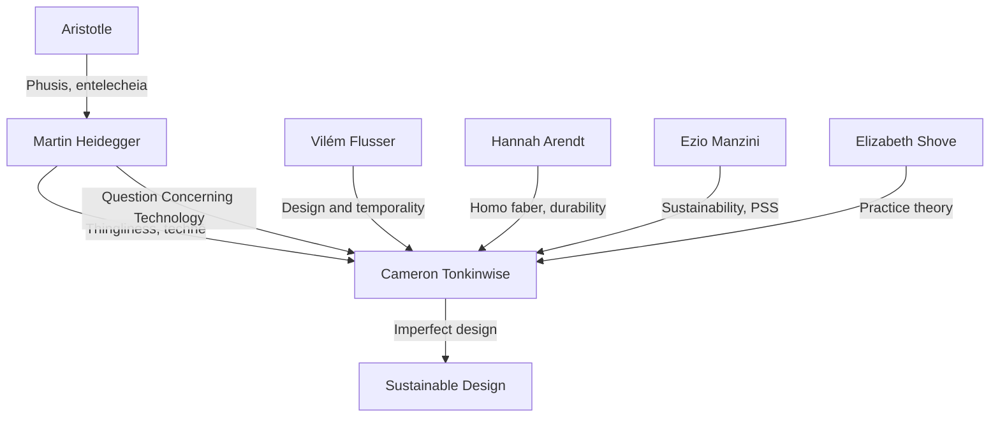

---
cssclasses:
  - Philosophy
subclasses:
  - Phenomenology
  - Aesthetics
  - Philosophy-of-Science
related:
  - "[[Martin Heidegger]]"
  - "[[Design Philosophy]]"
  - "[[Sustainability]]"
  - "[[Product Service Systems]]"
  - "[[Phusis]]"
  - "[[Techne]]"
aliases:
  - tonkinwise 2004
  - is design
  - dematerialisation design
  - heidegger on
  - thingliness design
  - mathematics of
  - entelecheia design
  - phusis vs
  - disposable durables
  - product life
reference:
  - Tonkinwise, C. (2004). Ethics by Design, or the Ethos of Things. Design Philosophy Papers, 2(2), 129–144. https://doi.org/10.2752/144871304X13966215067994
---

#### Is Design Finished? Dematerialisation and Changing Things

#### Central Problem

Why do things accumulate unsustainably in our households, and why do sophisticated technical products end up as junk so quickly? Tonkinwise argues that neither consumerism nor instrumentalism adequately explains the paradox of "disposable durables"—products made of long-lasting materials yet designed for short use-lives. Drawing on Heidegger's analysis of *thingliness* (mathēmata), *phusis* vs *technē*, and *entelecheia*, Tonkinwise shows that the problem lies in the *mathematics of things*: modern making produces "finished" objects that deny their temporality, their being-in-time. The result is things that accumulate and flow without anyone caring for them. The question then becomes: can design produce *unfinished* things—things that remain in motion, capable of repair and alteration?

#### Main Thesis

The unsustainability of our material culture stems from the *ontology of making* itself. Modern *technē* produces things as **finished ends**—complete, static, out-of-time objects. This "finishedness" paradoxically leads to disposability: because products are cast as unchanging, they become mere "stuff" alienated from their production, unable to be sustained or cared for. By contrast, Ancient Greek *phusis* understood things as always in motion, never complete yet always complete-as-what-they-are (*entelecheia*: "holding itself in its end"). Tonkinwise proposes that sustainable design must shift from producing finished objects to designing **things-in-motion**: products that can change over time through repair, maintenance, and alteration. This is not quality design (timeless perfection) but *imperfect design*—"product-plus-process" that takes responsibility for sustaining things through time.

#### Historical Context and Intellectual Background

Tonkinwise writes amid two converging discourses:

1. **Sustainability research**: Product-service systems (PSS) were emerging as strategies for dematerialization—delivering functional results with fewer material inputs. Researchers like Ezio Manzini and Walter Stahel promoted "use-oriented" and "result-oriented" services.

2. **Consumption sociology**: Moving beyond crude "consumerism" stereotypes, scholars like Elizabeth Shove were analyzing everyday practices (cleaning, cooking, commuting) that structure our relations with things, drawing on actor-network theory and phenomenology.

Tonkinwise argues both approaches remain incomplete without engaging Heidegger's deeper analysis of *thingliness*. Previous calls for product-life extension (Werkbund, Vance Packard, EternallyYours) still aimed at *perfect* things. The Heideggerian brief is different: design imperfect things that must be continuously improved.

Key intellectual sources:
- **Heidegger's 1935-6 lectures** (*The Question Concerning the Thing*): The shift from Greek qualitative *mathēmata* to modern quantitative mathematics
- **Heidegger's 1939 essay on Aristotle's *Physics* B1**: *Phusis* as movedness, *entelecheia* as "holding itself in its end"
- **Vilém Flusser**: Objects as obstacles; design and temporality
- **Hannah Arendt**: Durability and the human artifice

#### Philosophical Lineage

#### Key Thinkers

| Thinker | Dates | Movement | Main Work | Core Concept |
|---------|-------|----------|-----------|--------------|
| [[Martin Heidegger]] | 1889-1976 | [[Phenomenology]] | *The Question Concerning the Thing* | Mathēmata, phusis vs technē, entelecheia |
| [[Hannah Arendt]] | 1906-1975 | [[Political Philosophy]] | *The Human Condition* | Homo faber, durability, work vs labor |
| [[Vilém Flusser]] | 1920-1991 | [[Media Philosophy]] | *The Shape of Things* | Design as obstacle, temporality |
| [[Ezio Manzini]] | 1945- | [[Design for Sustainability]] | *Prometheus of the Everyday* | Dematerialization paradox, PSS |
| [[Abraham Moles]] | 1920-1992 | [[Information Theory]] | *The Comprehensive Guarantee* | Maintenance mentality |

#### Key Concepts

| Concept | Definition | Related to |
|---------|------------|------------|
| Mathēmata | "Things insofar as we learn them"—the fore-understanding by which things come to be the things we experience | [[Heidegger]], [[Phenomenology]] |
| Phusis | Greek "nature" as movedness: things always in motion, never finished yet always what they aim to be | [[Aristotle]], [[Heidegger]] |
| Technē | Making that produces finished, static products alienated from time | [[Heidegger]], [[Poiesis]] |
| Entelecheia | "Holding itself in its end"—being at every moment what one aims to be, without being complete | [[Aristotle]], [[Heidegger]] |
| Disposable durable | Paradoxical modern product: made of lasting materials, designed for short use-life | [[Tonkinwise]], [[Sustainability]] |
| Product-plus | Product plus a process that sustains it through time; design that takes responsibility for temporality | [[Tonkinwise]], [[PSS]] |
| Finishedness | The quality of made things as complete, static, out-of-time—leading to neglect and disposal | [[Tonkinwise]], [[Technē]] |

#### Authors Comparison

| Theme | Tonkinwise | Heidegger | Manzini |
|-------|------------|-----------|---------|
| Problem diagnosis | Ontology of making produces finished things | Technology enframes beings as standing-reserve | Lack of design culture leads to worthless products |
| Key concept | Disposable durables, finishedness | Gestell, present-at-hand | Material intensity, dematerialization |
| Solution | Design things-in-motion, product-plus | Gelassenheit, letting-be | Product-service systems |
| Temporality | Things must be actively sustained through time | Being is always temporal, in-time | Shift from production to reproduction culture |
| Role of design | Must change fundamentally or "finish" | Technē as mode of revealing | Extend designer competence to services |

#### Influences & Connections

#### Predecessors
- **[[Aristotle]]**: Phusis as movedness, entelecheia, distinction from technē
- **[[Martin Heidegger]]**: Thingliness, mathematics of things, critique of technology
- **[[Hannah Arendt]]**: Homo faber, work vs labor, durability of human artifice

#### Contemporaries
- **[[Ezio Manzini]]**: Sustainability, dematerialization paradox
- **[[Elizabeth Shove]]**: Practice theory, comfort/cleanliness/convenience
- **[[Walter Stahel]]**: Product-life extension, utilization-focused service economy

#### Successors
- **[[Sustainable Design]]**: Product-service systems, circular economy
- **[[Repair Studies]]**: Right to repair, maintenance as practice
- **[[Design Philosophy]]**: Ontological design, thing theory

#### Summary Formulas

1. **The Paradox of Disposable Durables**: Products made of durable materials + designed as finished = things treated as disposable → accumulation and throughput.

2. **Phusis vs Technē**: Phusis = things always in motion, never finished; Technē = making that produces finished, static products denying their temporality.

3. **Entelecheia**: A tree is at every moment complete-as-tree even while never completed; a table is not-a-table until finished, then merely present.

4. **The Mathematics of Finishedness**: Production erases itself in its outcome → finished products lose their having-been-produced-ness → reified as sheer stuff → neglected, disposed, accumulated.

5. **The Heideggerian Brief**: Design imperfect products that must be continuously improved—things in motion, capable of repair and alteration. Not quality design (timeless perfection) but product-plus-process.

#### Timeline

| Year | Event |
|------|-------|
| 1927 | [[Heidegger]] publishes *Being and Time* (ready-to-hand/present-at-hand) |
| 1935-6 | Heidegger delivers lectures on *The Question Concerning the Thing* |
| 1939 | Heidegger's essay on Aristotle's *Physics* B1 (phusis, entelecheia) |
| 1954 | Heidegger publishes "The Question Concerning Technology" |
| 1958 | [[Hannah Arendt]] publishes *The Human Condition* |
| 1961 | [[Vance Packard]] publishes *The Waste Makers* (planned obsolescence) |
| 1985 | [[Abraham Moles]] proposes "The Comprehensive Guarantee" |
| 1995 | [[Ezio Manzini]] publishes "Prometheus of the Everyday" |
| 1999 | [[Vilém Flusser]]'s *The Shape of Things* published in English |
| 2003 | [[Elizabeth Shove]] publishes *Comfort, Cleanliness and Convenience* |
| 2004 | [[Cameron Tonkinwise]] publishes "Is Design Finished?" |

#### Notable Quotes

> "Consumerism emerges as a fundamental inability to sustain things. It is a refusal to acknowledge that artificial things remain natural to the extent that they are within time, aging." — [[Cameron Tonkinwise]]

> "Design timely things, things that can last longer by being able to change over time. Design things that are not finished, things that can keep on by keeping on being repaired and altered, things in motion." — [[Cameron Tonkinwise]]

> "The more involved we are with the immaterial, the more material things accumulate as junk about us." — [[Ezio Manzini]], paraphrased by Tonkinwise
