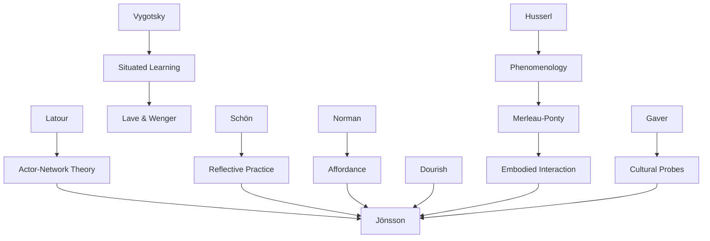

---
cssclasses:
  - Philosophy
  - Arts
  - Sociology
subclasses:
  - Applied-Ethics
  - Design-Theory
  - Participatory-Design
related:
  - "[[Design Ethics]]"
  - "[[Situated Ethics]]"
  - "[[Universal Design]]"
  - "[[Participatory Design]]"
  - "[[Phenomenology]]"
aliases:
  - situated ethics
  - design ethics
  - rehabilitation engineering
  - cultural probes
  - universal design
  - user involvement
  - disability design
  - lifeworld design
  - affordance design
  - action research
reference:
  - Jönsson, B., Anderberg, P., Flodin, E., Malmborg, L., Nordgren, C., & Svensk, A. (2005). Ethics in the Making. Design Philosophy Papers, 3(4), 213–226. https://doi.org/10.2752/144871305X13966254124914
---

#### Central Problem

[[Jönsson]] and colleagues confront a significant gap in design research: while medical research has long-established ethical codes and guidelines (Nuremberg Code, Helsinki Declaration, European Convention), the design disciplines lack equivalent frameworks for ethically grounded practice. The existing ethical principles, however "universal" they appear, originate from medicine and are not formulated based on experiences from designing civil products for everyday life.

The problem is compounded by the fact that mere involvement of human subjects and application of safety provisions in design research do not guarantee ethical considerations will be met. The complex interaction with users presents both opportunities and risks across multiple dimensions: preparation worth the research person's time; respect for users' contributions; dignified treatment; feedback in iterative processes with mutual information and inspiration; and products genuinely influenced by users.

This challenge is particularly acute in rehabilitation engineering and design for people with disabilities and elderly persons. The dominant approaches—such as the "wheelchair-for-all" attitude—often fail to question underlying assumptions about what people with mobility impairments actually need or desire. Design ethics must address not only how products function but how they reshape existence and existential terms for users.

#### Main Thesis

[[Jönsson]] argues for a **situated ethics** in design that operates dually: situationally grounded in specific contexts while continuously examined against the spirit of international ethical codes, charters, and declarations. Rather than mechanistically applying general principles, situated design ethics reveals the most important ethical aspects in a given situation, elaborates them, documents outcomes, and makes them openly available as exemplars for ongoing discussion.

**From Particular to General:** Proceeding from specific needs rather than general ones (which require abstract specifications for multitudes) results not only in ethical benefits but also in increased innovation and effectiveness. Involving persons with disabilities in product development helps ensure innovative and "useworthy" products.

**Two-Way Information and Inspiration:** Designers may be informed and inspired by users while users are simultaneously informed and inspired by designers. Utilizing this bidirectional flow has profound ethical implications while making the design process more efficient and situated. This echoes the framework by [[Kensing]] and [[Munk-Madsen]].

**Desiderata vs. Description:** Design focuses on "that-which-ought-to-be" (desiderata) rather than "that-which-is" (description). Desiderata encompasses aesthetics, ethics, and reason—it is about what we intend the world to be, which is the voice of design.

**Artefacts as Actants:** Following [[Latour]], artefacts are "society and culture made sustainable." Products and built environments are themselves "actants" entering the ethical domain not merely as neutral means but as ethos-generating forces. The "missing masses" names an ethical force hidden beyond what we call "the social"—the force is in the things themselves.

**The FACE Model:** [[Anderberg]] proposes a model where Function is analyzed through Attitude, Control, and Enabling—a framework that necessitates consideration of ethical aspects, bridging the gap between medical and social models of disability.

#### Historical Context

This article emerges from the early 2000s intersection of design research, disability studies, and applied ethics. The period saw considerable increase in ethical expectations placed on businesses and professions, with organizations developing codes of conduct and professional guidelines. The drafting of ethics codes was seen as indication of professionalism in emerging disciplines.

The design community was grappling with its relationship to established ethical frameworks. The Nuremberg Code (1949), Helsinki Declaration (1964), and European Convention had established precedents for human subjects research, but these emerged from medical contexts. Design needed frameworks addressing civil products, everyday environments, and the particular challenges of participatory methods involving vulnerable populations.

The disability rights movement had shifted discourse from individual/medical models toward social models emphasizing environmental barriers. However, [[Jönsson]] notes that neither model satisfies design needs—the medical model oversimplifies disability as individual characteristic, while the social model directs awareness toward ideological analysis rather than practical everyday solutions.

The Principles of Universal Design (1997) from NC State University had established that environments, services, and products should be designed for use by as many people as possible regardless of situation or ability. This connected design ethics to broader human rights frameworks including the Charter of Fundamental Rights of the EU and Convention on the Rights of the Child.

#### Philosophical Lineage

#### Key Thinkers

| Thinker | Dates | Movement | Main Work | Core Concept |
|---------|-------|----------|-----------|--------------|
| [[Husserl]] | 1859-1938 | [[Phenomenology]] | *Logical Investigations* | Back to the things themselves |
| [[Merleau-Ponty]] | 1908-1961 | [[Phenomenology]] | *Phenomenology of Perception* | The lived body |
| [[Latour]] | 1947-2022 | [[Actor-Network Theory]] | *Technology is Society Made Durable* | Missing masses, actants |
| [[Schön]] | 1930-1997 | [[Reflective Practice]] | *The Reflective Practitioner* | Reflection-in-action |
| [[Norman]] | 1935- | [[Cognitive Science]] | *Psychology of Everyday Things* | Affordance |
| [[Dourish]] | 1965- | [[Embodied Interaction]] | *Where the Action Is* | Embodied interaction |
| [[Gaver]] | 1960- | [[Interaction Design]] | *Design: Cultural Probes* | Cultural probes |
| [[Vygotsky]] | 1896-1934 | [[Developmental Psychology]] | *Mind in Society* | Showing through action |

#### Key Concepts

| Concept | Definition | Related to |
|---------|------------|------------|
| Situated ethics | Ethics revealing important aspects in given situations, documented as exemplars, continuously questioned against international codes | [[Jönsson]], [[Applied Ethics]] |
| Cultural probes | Self-reporting methods by participants on everyday life details, inspiring or informing design; valuable for users with language limitations | [[Gaver]], [[Participatory Design]] |
| Desiderata | The inclusive whole of aesthetics, ethics, and reason; what we intend the world to be—the voice of design | [[Design Theory]] |
| Actants | Artefacts as society made sustainable; things as ethos-generating forces entering the ethical domain | [[Latour]], [[Actor-Network Theory]] |
| Missing masses | Hidden ethical force in designed things, beyond what we call "the social" | [[Latour]], [[Design Ethics]] |
| Lifeworld | The lived world we already find ourselves in, pre-reflexive and pre-scientific; the point of departure for phenomenology | [[Husserl]], [[Phenomenology]] |
| Affordance | How objects offer opportunities for possible interactions to an observer; what we first perceive in phenomena | [[Norman]], [[Gibson]] |
| FACE model | Function analyzed through Attitude, Control, and Enabling; necessitates ethical consideration | [[Anderberg]], [[Disability Studies]] |
| Useworthy | Products that are not just usable but worthy of use; emerges from involving diverse users in development | [[Eftring]], [[Universal Design]] |
| Reflective practitioner | Researcher who leans forward, is a practitioner, but reflects on action | [[Schön]], [[Action Research]] |

#### Authors Comparison

| Theme | [[Jönsson]] | [[Latour]] |
|-------|-------------|------------|
| Central concern | Ethical design with/for disabled persons | Sociology of technology |
| View of artefacts | Reshape existence and existential terms | Society made durable; actants |
| Ethics | Situated, dual (local + universal codes) | Distributed in "missing masses" |
| Method | Cultural probes, case studies, action research | Actor-network tracing |
| The social | Includes human sector logic | Includes non-human actants |
| Design role | Voice of desiderata; what ought to be | Reveals hidden ethical forces |

#### Influences & Connections

- **Predecessors:** [[Jönsson]] ← influenced by ← [[Husserl]], [[Merleau-Ponty]], [[Vygotsky]], [[Latour]], [[Schön]]
- **Contemporaries:** [[Jönsson]] ↔ dialogue with ↔ [[Gaver]], [[Dourish]], [[Norman]], [[Kensing]]
- **Followers:** [[Jönsson]] → influenced → [[Participatory Design]], [[Design for Disability]], [[Critical Design]]
- **Opposing views:** [[Jönsson]] ← contrasts with ← Medical Model (individual deficit), Social Model (political analysis without practical solutions)

#### Summary Formulas

- **[[Husserl]]:** We want to go back to the things themselves—the phenomenon as it appears to someone in their lifeworld.
- **[[Merleau-Ponty]]:** The body is the vehicle of being in the world; the general medium for having a world—the integrated "lived body."
- **[[Latour]]:** Artefacts are society and culture made sustainable; the "missing masses" names an ethical force hidden in things themselves.
- **[[Jönsson]]:** Situated design ethics operates dually—locally grounded while examined against international codes, proceeding from particular to general, with two-way information and inspiration between designers and users.

#### Timeline

| Year | Event |
|------|-------|
| 1901 | [[Husserl]] publishes *Logical Investigations* |
| 1930 | [[Vygotsky]] publishes *Mind in Society* |
| 1962 | [[Merleau-Ponty]]'s *Phenomenology of Perception* in English |
| 1964 | Helsinki Declaration on medical research ethics |
| 1983 | [[Schön]] publishes *The Reflective Practitioner* |
| 1988 | [[Norman]] publishes *Psychology of Everyday Things* |
| 1991 | [[Latour]] publishes "Technology is Society Made Durable" |
| 1997 | Principles of Universal Design published |
| 1999 | [[Gaver]] introduces Cultural Probes |
| 2001 | [[Dourish]] publishes *Where the Action Is* |
| 2005 | [[Jönsson]] et al. publish "Ethics in the Making" |

#### Notable Quotes

> "Technology is society made durable... The 'missing masses' names an ethical force hidden beyond what we now call 'the social', and the force is in the things per se." — [[Latour]]

> "We want to go back to the things themselves." — [[Husserl]]

> "The body is the vehicle of being in the world... the general medium for having a world." — [[Merleau-Ponty]]

---
> [!warning]-
> This annotation was normalised using a large language model and may contain inaccuracies. These texts serve as preliminary study resources rather than exhaustive references.
