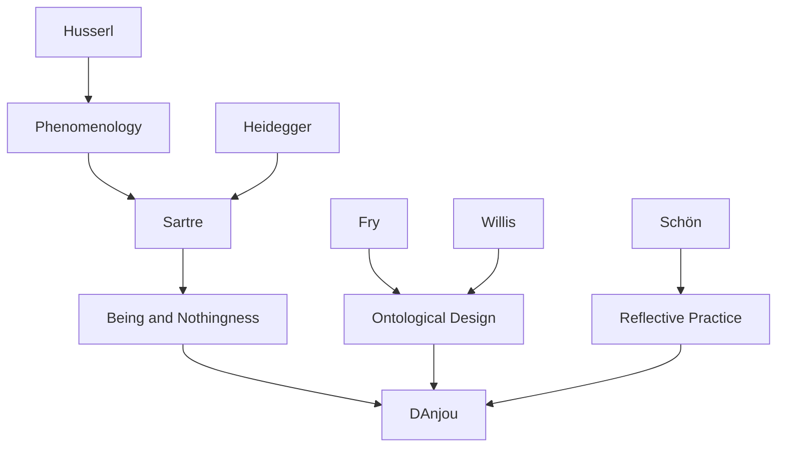

---
cssclasses:
  - Philosophy
  - Arts
  - Education
subclasses:
  - Existentialism
  - Design-Education
  - Design-Ethics
related:
  - "[[Sartre]]"
  - "[[Existentialism]]"
  - "[[Sustainability]]"
  - "[[Design Education]]"
  - "[[Ontological Design]]"
aliases:
  - existential self
  - sartre design
  - sustainability design
  - design education
  - fundamental project
  - being other
  - radical conversion
  - design studio
  - existential project
  - design ethics
reference:
  - D’Anjou, P. (2007). The Existential Self as Locus of Sustainability in Design. Design Philosophy Papers, 5(3), 119–128. https://doi.org/10.2752/144871307X13966292017559
---

#### Central Problem

The paper confronts how sustainability can become genuinely integrated into design education rather than remaining a superficial add-on or technical consideration. D'Anjou argues that sustainability cannot be effectively taught as a "utensil" to be applied to design projects; instead, it must be understood as a fundamental orientation of the designer's self. The central question becomes: how can design education transform students' fundamental projects so that sustainability becomes an authentic, freely chosen mode of being-in-the-world through design?

#### Main Thesis

The existential self, understood through [[Sartre]]'s ontology, is the proper locus of sustainability in design. Drawing on Sartre's concepts of being-for-itself (human consciousness), being-in-itself (the world without consciousness), and the fundamental project (one's chosen way of being-in-the-world), d'Anjou argues that sustainability requires a "radical conversion" of the student-designer's fundamental project.

The thesis reverses conventional approaches: instead of sustainability serving design (as a tool or constraint), design must serve sustainability. This reversal positions the designer not as a problem-solver producing artifacts but as a conscious self defining itself and its being-in-the-world through design choices and actions. The design project becomes an existential project where the student creates their identity through freely chosen commitments.

The studio setting provides the crucial pedagogical site where this transformation can occur, as the dialectical relationship between instructor and student creates space for reflective engagement with one's fundamental project.

#### Historical Context

The paper emerges from growing concerns about environmental sustainability and design's complicity in ecological destruction. The early 2000s saw increasing urgency around climate change and resource depletion, prompting design disciplines to incorporate sustainability into curricula—often superficially as technical knowledge or green criteria to be checked.

[[Sartre]]'s existentialism, developed primarily in the 1940s-1950s, provides the philosophical framework. His concepts of radical freedom, absolute responsibility, and the fundamental project offer resources for understanding how individuals can transform their fundamental orientations toward the world.

The work of [[Fry]] and [[Willis]] on "ontological designing" provides important context, arguing that design shapes not just artifacts but the being of designers and users. D'Anjou extends this through explicit engagement with Sartrean ontology, proposing that design education must address the ontological level of the student's existence.

#### Philosophical Lineage

#### Key Thinkers

| Thinker | Dates | Movement | Main Work | Core Concept |
|---------|-------|----------|-----------|--------------|
| [[Sartre]] | 1905-1980 | [[Existentialism]] | *Being and Nothingness* | Existence precedes essence, radical freedom |
| [[Fry]] | - | [[Design Theory]] | *A New Design Philosophy* | Defuturing, sustainment |
| [[Willis]] | - | [[Design Theory]] | "Ontological Designing" | Ontological design |
| [[Schön]] | 1930-1997 | [[Education Theory]] | *The Reflective Practitioner* | Reflection in action |
| [[Heidegger]] | 1889-1976 | [[Phenomenology]] | *Being and Time* | Being-in-the-world |

#### Key Concepts

| Concept | Definition | Related to |
|---------|------------|------------|
| Being-for-itself | Human consciousness; that which is aware of itself and can negate, question, and project | [[Sartre]], [[Existentialism]] |
| Being-in-itself | The world without consciousness; undifferentiated, self-identical being | [[Sartre]], [[Ontology]] |
| Fundamental project | The basic orientation one has chosen toward existence; structures all subsidiary projects | [[Sartre]], [[Existentialism]] |
| Radical conversion | Transformation of one's fundamental project; shift from pre-reflective to reflective mode | [[Sartre]], [[Ethics]] |
| Existential project | Any project through which individuals define themselves through choices and actions | [[Sartre]], [[Agency]] |
| Sustainment | Environments designed with the ability to sustain that which needs to be sustained | [[Fry]], [[Sustainability]] |

#### Authors Comparison

| Theme | [[Sartre]] | [[Fry]] | [[D'Anjou]] |
|-------|-----------|--------------|-------------|
| Central concern | Human freedom and responsibility | Design and defuturing | Existential foundation of sustainability |
| Approach | Phenomenological ontology | Critical design theory | Applied existentialism |
| Agency | Individual consciousness | Design practice | Student-designer self |
| Transformation | Radical conversion | Redirective practice | Pedagogical intervention |

#### Influences & Connections

- **Predecessors:** [[D'Anjou]] ← influenced by ← [[Sartre]], [[Fry]], [[Willis]], [[Schön]]
- **Contemporaries:** [[D'Anjou]] ↔ dialogue with ↔ design education theorists, sustainability researchers
- **Related movements:** [[Ontological Design]] ↔ resonates with ↔ existentialist design theory
- **Pedagogical context:** Design studio → site of → existential transformation

#### Summary Formulas

- **Existential inversion:** Instead of sustainability serving design (as tool), design must serve sustainability (as existential commitment).
- **Sartrean foundation:** Human consciousness (being-for-itself) organizes the world through projects; sustainability must become part of the designer's fundamental project.
- **Radical conversion:** Transforming students' fundamental projects requires moving from pre-reflective to reflective mode, making visible the underlying orientations that structure design choices.
- **Pedagogical role:** The design instructor's task is to bring sustainability into the dialectic between existential and design projects, enabling students to freely choose sustainability as authentic self-definition.

#### Timeline

| Year | Event |
|------|-------|
| 1943 | [[Sartre]] publishes *Being and Nothingness* |
| 1946 | [[Sartre]] delivers "Existentialism is a Humanism" |
| 1983 | [[Schön]] publishes *The Reflective Practitioner* |
| 1999 | [[Fry]] publishes *A New Design Philosophy* |
| 2006 | [[Willis]] publishes "Ontological Designing" |
| 2007 | [[D'Anjou]] publishes "The Existential Self as Locus of Sustainability in Design" |

#### Notable Quotes

> "The question of sustainability becomes not what sustainability can do for design but rather what design can do for sustainability."

> "The designer is to be considered as a conscious self that defines the self and his/her being-in-the-world through the design project and the act of design, and not as a problem-solving agent aiming only at the making of artefacts."

> "It is thus in the dialectical situation that takes place between the project of defining the self (the existential project) and the design project, that sustainability in these terms might be approached."

---
> [!warning]-
> This annotation was normalised using a large language model and may contain inaccuracies. These texts serve as preliminary study resources rather than exhaustive references.
