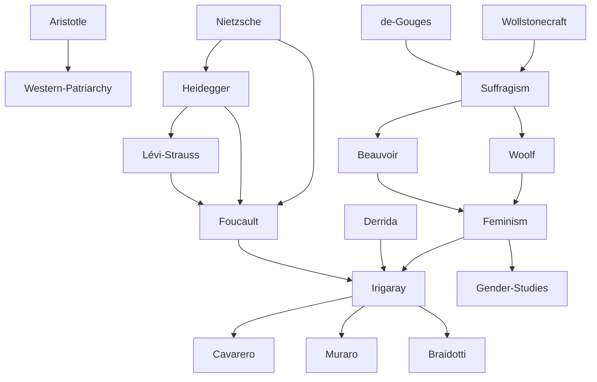

---
cssclasses:
  - Philosophy
  - Sociology
subclasses:
  - Social-and-Political-Philosophy
  - 20th-Century-Philosophy
  - Continental-Philosophy
related:
  - "[[Existentialism]]"
  - "[[Structuralism]]"
  - "[[Post-structuralism]]"
  - "[[The Second Sex]]"
  - "[[Gender Studies]]"
  - "[[French Revolution]]"
  - "[[Deconstruction]]"
  - "[[Psychoanalysis]]"
  - "[[Crisis of the Subject]]"
  - "[[Nomadic Theory]]"
aliases:
  - feminist philosophy
  - gender studies
  - sexual difference
  - womens movement
  - subject crisis
  - equality difference
  - nomadic subject
reference:
  - "Abbagnano, N., & Fornero, G. (2012). La ricerca del pensiero. Vol. 3C. Dalla crisi della modernità agli sviluppi più recenti. Paravia."
---

#### Central Problem

This chapter addresses two interconnected problems in contemporary philosophy. The first concerns the historical exclusion of women from philosophical discourse and their systematic subordination within Western thought, from [[Aristotle]]'s characterization of women as naturally inferior (lacking full deliberative capacity) to modern struggles for equality and recognition of sexual difference. The second problem concerns the crisis of the modern subject: the dissolution of the Cartesian conception of the self as sovereign, rational, conscious foundation of reality. Both problems converge on a fundamental question: What remains of "the human" after the critique of traditional humanism?

The philosophical tradition, built on the principle of identity ("either A or not-A"), classified differences as deviations from a masculine norm rather than understanding them in their irreducible specificity. Women were defined as "the other" relative to the male subject, while the subject itself—supposedly the foundation of all knowledge—was revealed by [[Nietzsche]], Heidegger, and the structuralists to be an accidental product of deeper forces: linguistic, social, biological, and economic structures that precede and condition consciousness.

#### Main Thesis

The chapter develops two interrelated theses. First, feminist thought progresses from demanding equality with men to affirming sexual difference as ontologically significant. Early feminists like [[Wollstonecraft]] and [[de Gouges]] claimed equal rights; [[Beauvoir]] argued that "one is not born, but rather becomes, a woman"; contemporary thinkers like [[Irigaray]], [[Cavarero]], [[Muraro]], and [[Braidotti]] articulate a "thought of sexual difference" that refuses both assimilation to masculine models and essentialist definitions of womanhood, proposing instead "nomadic" subjectivities constituted through multiple intersecting differences.

Second, the "death of man" announced by structuralism and post-structuralism dissolves the Cartesian-Kantian subject. [[Nietzsche]] revealed consciousness as an accidental evolutionary product serving the "herd"; [[Heidegger]] reconceived human existence as "thrown project" within historical horizons of meaning not of our making; [[Lévi-Strauss]] uncovered unconscious structures constraining human thought and action; [[Foucault]] declared "man" a recent invention—"a simple fold in our knowledge"—destined to disappear. The human sciences, by making man an object of knowledge, paradoxically annihilate him as sovereign subject.

#### Historical Context

The women's movement emerged from the French Revolution (1789), which proclaimed universal rights while excluding women from citizenship. [[Olympe de Gouges]]'s *Declaration of the Rights of Woman* (1791) and [[Wollstonecraft]]'s *Vindication of the Rights of Woman* (1792) initiated feminist discourse. The [[Seneca]] Falls Convention (1848) in the United States marked a milestone for suffragism. The 19th-century movement focused on education, property rights, and voting.

The 20th century brought new developments: [[Woolf]]'s *A Room of One's Own* (1929) and *Three Guineas* (1938) articulated women's economic oppression and their estrangement from patriarchal war-culture; [[Beauvoir]]'s *The Second Sex* (1949) became foundational for feminist philosophy. The 1960s-70s witnessed the emergence of feminism proper, with [[Friedan]]'s *The Feminine Mystique* (1963), consciousness-raising groups, and the slogan "the personal is political." The 1970s saw the birth of "gender studies" and "the thought of sexual difference."

Parallel to this, the crisis of the subject unfolded through [[Nietzsche]]'s genealogical critique, [[Heidegger]]'s overcoming of metaphysics, and the structuralist "death of man" proclaimed by [[Lévi-Strauss]] and [[Foucault]].

#### Philosophical Lineage

#### Key Thinkers

| Thinker | Dates | Movement | Main Work | Core Concept |
|---------|-------|----------|-----------|--------------|
| [[Wollstonecraft]] | 1759-1797 | [[Enlightenment Feminism]] | *Vindication of the Rights of Woman* | Women's education and equality |
| [[de Gouges]] | 1748-1793 | [[Revolutionary Feminism]] | *Declaration of the Rights of Woman* | Women's citizenship rights |
| [[Woolf]] | 1882-1941 | [[Modernist Feminism]] | *A Room of One's Own* | Economic independence, "Society of Outsiders" |
| [[Beauvoir]] | 1908-1986 | [[Existentialist Feminism]] | *The Second Sex* | "One is not born, but becomes, a woman" |
| [[Friedan]] | 1921-2006 | [[Liberal Feminism]] | *The Feminine Mystique* | Demystification of housewife ideal |
| [[Irigaray]] | 1930- | [[French Feminism]] | *Speculum of the Other Woman* | Deconstruction of phallocentrism |
| [[Cavarero]] | 1947- | [[Italian Feminism]] | *In Spite of [[Plato]]* | Female language and subjectivity |
| [[Muraro]] | 1940- | [[Italian Feminism]] | *The Symbolic Order of the Mother* | Mother-daughter relationship, maternal genealogy |
| [[Braidotti]] | 1954- | [[Nomadic Feminism]] | *Nomadic Subjects* | Nomadic subjectivity, becoming |

#### Key Concepts

| Concept | Definition | Related to |
|---------|------------|------------|
| Sexual Difference | Ontological difference between masculine and feminine, not reducible to biological sex, marking thought and action non-hierarchically | [[Irigaray]], [[Feminism]] |
| Gender | Social, cultural, and psychological construction of masculinity and femininity; focus of "gender studies" | [[Feminism]], [[Sociology]] |
| Patriarchy | System of male dominance institutionalized through family, law, economy, and culture | [[Beauvoir]], [[Feminism]] |
| Second Sex | Woman as "other" defined only in relation to man as primary subject | [[Beauvoir]], [[Existentialism]] |
| Symbolic Order of the Mother | Recognition of mother-daughter relationship as primary mediation, source of language and meaning | [[Muraro]], [[Irigaray]] |
| Nomadic Subject | Identity constituted through multiple intersecting differences (sex, race, class, age); fluid, not fixed | [[Braidotti]], [[Post-structuralism]] |
| Death of Man | Structuralist thesis that "man" is a recent invention destined to disappear when knowledge finds new form | [[Foucault]], [[Structuralism]] |
| Episteme | Unconscious horizon of categories underlying knowledge and values of a historical epoch | [[Foucault]], [[Structuralism]] |
| Universal Substratum | Unconscious categorical apparatus inhabiting the depths of human psyche, universal in time and space | [[Lévi-Strauss]], [[Structuralism]] |

#### Authors Comparison

| Theme | [[Beauvoir]] | [[Irigaray]] | [[Braidotti]] |
|-------|--------------|--------------|---------------|
| Central question | How to liberate women? | How to think female specificity? | How to think difference plurally? |
| Woman's condition | Historically constructed, not natural | Defined as "lack" by phallocentric culture | Multiple, intersecting differences |
| Relation to men | Reciprocal recognition of alterity | Deconstruct masculine symbolic order | Beyond binary opposition |
| Strategy | Collective liberation, equality | Deconstruction, maternal genealogy | Nomadism, becoming |
| Subject conception | Existentialist project | Critique of subject as masculine | Post-subject, fluid identity |

#### Influences & Connections

- **Predecessors:** [[Beauvoir]] ← influenced by ← [[Sartre]], [[Hegel]]; [[Irigaray]] ← influenced by ← [[Freud]], [[Lacan]], [[Derrida]]
- **Contemporaries:** [[Irigaray]] ↔ dialogue with ↔ [[Cixous]], [[Kristeva]]; [[Cavarero]] ↔ dialogue with ↔ [[Muraro]]
- **Followers:** [[Beauvoir]] → influenced → [[Friedan]], [[Irigaray]], contemporary feminism; [[Irigaray]] → influenced → Italian feminism
- **Opposing views:** [[Beauvoir]] ← criticized by ← difference feminists (for assimilation to masculine model); [[Structuralism]] ← criticized by ← [[Sartre]] (for eliminating human freedom)

#### Summary Formulas

- **[[Wollstonecraft]]:** Women's apparent inferiority results from educational deprivation, not nature; equal education will reveal equal capacity.
- **[[Beauvoir]]:** "One is not born, but rather becomes, a woman"—femininity is constructed, not given, and women must reclaim their freedom as subjects.
- **[[Woolf]]:** Women need economic independence and separation from patriarchal values to develop authentic culture; "as a woman, I have no country."
- **[[Irigaray]]:** Western philosophy and psychoanalysis define woman as "lack"; recovering maternal genealogy can restore female symbolic order.
- **[[Braidotti]]:** Identity is nomadic—constituted through multiple, intersecting differences; the point is not who we are but what we want to become.
- **[[Foucault]]:** "Man" is a recent invention, a fold in our knowledge; thinking in the void of the disappeared subject opens new possibilities for thought.

#### Timeline

| Year | Event |
|------|-------|
| 1791 | [[de Gouges]] publishes *Declaration of the Rights of Woman and Citizen* |
| 1792 | [[Wollstonecraft]] publishes *Vindication of the Rights of Woman* |
| 1793 | [[de Gouges]] executed; women's political associations abolished in France |
| 1848 | [[Seneca]] Falls Convention issues *Declaration of Sentiments* |
| 1929 | [[Woolf]] publishes *A Room of One's Own* |
| 1938 | [[Woolf]] publishes *Three Guineas* |
| 1949 | [[Beauvoir]] publishes *The Second Sex* |
| 1963 | [[Friedan]] publishes *The Feminine Mystique* |
| 1966 | [[Foucault]] publishes *The Order of Things* (announces "death of man") |
| 1974 | [[Irigaray]] publishes *Speculum of the Other Woman* |
| 1987 | Diotima community publishes *The Thought of Sexual Difference* |
| 1991 | [[Muraro]] publishes *The Symbolic Order of the Mother* |
| 1994 | [[Braidotti]] publishes *Nomadic Subjects* |

#### Notable Quotes

> "One is not born, but rather becomes, a woman. No biological, psychological, or economic destiny defines the figure that the human female takes on in society." — [[Beauvoir]]

> "As a woman I have no country. As a woman my country is the whole world." — [[Woolf]]

> "Man is only a recent invention, a figure not yet two centuries old, a simple fold in our knowledge, and he will disappear as soon as that knowledge has found a new form." — [[Foucault]]

---
> [!warning]-
> This annotation was normalised using a large language model and may contain inaccuracies. These texts serve as preliminary study resources rather than exhaustive references.
