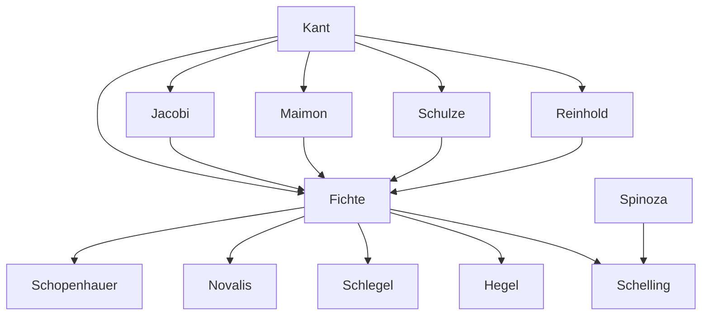

---
cssclasses:
  - Philosophy
subclasses:
  - 19th-Century-Philosophy
  - Metaphysics
  - Epistemology
related:
  - "[[German Idealism]]"
  - "[[Critical Philosophy]]"
  - "[[Thing-in-itself]]"
  - "[[Dialectic]]"
  - "[[Transcendental Philosophy]]"
  - "[[Romanticism]]"
  - "[[Science of Knowledge]]"
  - "[[Streben]]"
  - "[[Intellectual Intuition]]"
  - "[[Absolute]]"
aliases:
  - german idealism
  - doctrine science
  - absolute ego
  - thing itself
  - intellectual intuition
  - infinite ego
  - dialectical structure
  - dogmatism idealism
reference:
  - Abbagnano, N., & Fornero, G. (2012). La ricerca del pensiero. Vol. 2B. Dall'Illuminismo a Hegel. Paravia.
tags:
  - Podcast
---

#### Podcast

<iframe src="https://archive.org/embed/ssp-s04-e13" width="100%" height="30" frameborder="0" webkitallowfullscreen="true" mozallowfullscreen="true" allowfullscreen></iframe>

---

#### Central Problem

The chapter addresses the philosophical transition from Kantian critical philosophy to Fichtean idealism, centering on the fundamental problem of the "thing-in-itself" (Ding an sich). [[Kant]]'s critical philosophy had left unresolved dualisms—most notably between phenomenon and noumenon—that his immediate followers found philosophically untenable. The central question becomes: if consciousness is the condition of all knowledge, how can we admit the existence of a thing-in-itself, that is, a reality neither thought nor thinkable, neither represented nor representable?

The immediate critics of [[Kant]] ([[Reinhold]], [[Schulze]], [[Maimon]], [[Jacobi]], [[Beck]]) focused their critiques on the alleged contradiction in [[Kant]]'s system: declaring the thing-in-itself both existent and unknowable. [[Jacobi]] had already insinuated that the noumenon concept is a "realistic" presupposition that, while necessary to enter the realm of criticism, does not allow one to remain there. If criticism is true, the thing-in-itself must be abolished to reduce everything to the subject (idealism); if criticism is false, one must admit the thing-in-itself and return to realism.

This critique prepares the ground for [[Fichte]]'s decisive move: shifting from the gnoseological plane (doctrine of knowing) to the metaphysical plane (doctrine of being), abolishing the "specter" of the thing-in-itself and thereby transforming the finite Kantian Ego into an infinite creative activity that is the source of all that exists.

#### Main Thesis

[[Fichte]] inaugurates German Idealism by radically transforming the Kantian "I think" from a finite ordering principle into an infinite creative activity that constitutes the foundation of all reality. The core thesis is that "everything is Spirit"—where Spirit (Geist), synonymous with Ego (Ich), Absolute, and Infinite, ultimately refers to human reality considered as cognitive and practical activity and creative freedom.

**The Three Principles of the Doctrine of Science:**

1. **"The Ego posits itself"** (thesis): The Ego is self-creating activity (Tathandlung), both the agent (Tat) and the product of action (Handlung). Unlike things whose nature is fixed, the Ego is what it makes itself. This self-positing constitutes the absolute and unconditioned first principle of all knowledge.

2. **"The Ego posits the non-Ego"** (antithesis): The Ego, to be an Ego, must oppose something to itself. A subject without object, an activity without obstacle, would be empty abstractions. The non-Ego (nature, world) is posited by the Ego within the Ego as the necessary dialectical pole of its being.

3. **"The Ego opposes in the Ego to the divisible Ego a divisible non-Ego"** (synthesis): Through mutual limitation, we arrive at the concrete situation: multiple finite egos confronting multiple finite objects. The terms "divisible" indicate the multiple and finite.

**The Dialectical Structure:** The Ego exhibits a triadic dialectical structure of thesis-antitesis-synthesis, anticipating [[Hegel]]'s dialectic. Spirit lives through opposition and struggle; its affirmations must be victories. Each synthesis is a pause preceding new struggles, expressing the infinite restlessness of spiritual activity.

**Freedom as Ultimate Goal:** The Ego's essence is Streben (striving)—infinite effort toward freedom. Morality requires obstacles; if the Ego overcame all limits, it would cease to exist. Perfection lies not in a static state but in perpetual self-improvement: "To be free is nothing; to become free is heavenly."

#### Historical Context

Gottlieb [[Fichte]] (1762-1814) was born in Rammenau, Saxony, to an impoverished family. He studied theology at Jena and Leipzig while struggling with poverty, working as a private tutor. In 1790, his encounter with [[Kant]]'s writings proved decisive for his philosophical formation. His first work, *Essay on a Critique of All Revelation* (1792), was published anonymously and initially attributed to [[Kant]] himself, who then revealed the true author.

[[Fichte]] became professor at Jena in 1794, where he produced his foundational works: the *Foundations of the Entire Science of Knowledge* (1794), *Foundations of Natural Right* (1796), and *System of Moral Doctrine* (1798). In 1799, the "atheism controversy" erupted when [[Fichte]] identified God with the moral order of the world in an article. Accused of atheism, he was forced to resign from Jena, despite student petitions in his favor.

Moving to [[Berlin]], [[Fichte]] associated with the Romantics (Schlegel, [[Schleiermacher]], [[Tieck]]). During the Napoleonic occupation, he delivered the famous *Addresses to the German Nation* (1807-1808), calling for national education as the means for German liberation. He became professor and rector at the University of [[Berlin]], dying in 1814 from an infectious fever contracted from his wife while she nursed wounded soldiers.

The immediate critics of [[Kant]]—Reinhold, [[Schulze]], [[Maimon]], [[Jacobi]], [[Beck]]—prepared [[Fichte]]'s breakthrough by demonstrating the philosophical impossibility of maintaining the thing-in-itself while remaining within the critical framework. [[Fichte]]'s transformation of Kantian philosophy into absolute idealism inaugurated the great current of German Idealism that would culminate in [[Schelling]] and Hegel.

#### Philosophical Lineage

#### Key Thinkers

| Thinker | Dates | Movement | Main Work | Core Concept |
|---------|-------|----------|-----------|--------------|
| [[Fichte]] | 1762-1814 | [[German Idealism]] | *Science of Knowledge* | Infinite Ego, Tathandlung |
| [[Kant]] | 1724-1804 | [[Critical Philosophy]] | *Critique of Pure Reason* | Thing-in-itself, finite I think |
| [[Reinhold]] | 1758-1823 | [[Post-Kantianism]] | *Elementary Philosophy* | Principle of consciousness |
| [[Schulze]] | 1761-1833 | [[Skepticism]] | *Aenesidemus* | Critique of thing-in-itself |
| [[Maimon]] | 1754-1800 | [[Post-Kantianism]] | *Essay on Transcendental Philosophy* | Thing-in-itself as √-a |
| [[Jacobi]] | 1743-1819 | [[Philosophy of Faith]] | *On Transcendental Idealism* | Contradiction in noumenon |
| [[Schelling]] | 1775-1854 | [[German Idealism]] | *System of Transcendental Idealism* | Absolute as identity |
| [[Hegel]] | 1770-1831 | [[German Idealism]] | *Phenomenology of Spirit* | Dialectical reason |

#### Key Concepts

| Concept | Definition | Related to |
|---------|------------|------------|
| Tathandlung | "Fact-act": the Ego is simultaneously the agent (Tat) and the product (Handlung) of its own activity | [[Fichte]], [[German Idealism]] |
| Intellectual Intuition | Self-awareness in which knowing and producing are identical; the Ego's immediate grasp of itself | [[Fichte]], [[Schelling]] |
| Streben | Infinite striving; the Ego's essential character as perpetual effort toward freedom and self-overcoming | [[Fichte]], [[Romanticism]] |
| Thing-in-itself | [[Kant]]'s noumenon; rejected by [[Fichte]] as a "chimera" and "non-thought" contradicting critical philosophy | [[Kant]], [[Critical Philosophy]] |
| Absolute Ego | The infinite, unconditioned, creative activity that is the source of all reality | [[Fichte]], [[German Idealism]] |
| Non-Ego | The object, nature, world—posited by the Ego as its necessary dialectical opposite | [[Fichte]], [[German Idealism]] |
| Dogmatism | Philosophy starting from the thing-in-itself; leads to fatalism and materialism | [[Fichte]], [[Spinoza]] |
| Idealism | Philosophy starting from the Ego; doctrine of freedom and creative activity | [[Fichte]], [[German Idealism]] |
| Divisible Ego | Finite ego; the empirical human subject limited by objects | [[Fichte]], [[German Idealism]] |
| Spiritual Pantheism | God is Spirit operating in the world, i.e., humanity itself | [[Fichte]], [[German Idealism]] |

#### Authors Comparison

| Theme | [[Kant]] | [[Fichte]] | [[Hegel]] |
|-------|----------|------------|-----------|
| The Ego | Finite, ordering principle | Infinite, creative activity | Spirit realizing itself in history |
| Thing-in-itself | Exists but unknowable | Abolished as contradiction | Sublated in Absolute Knowledge |
| Nature | Independent of consciousness | Posited by Ego as dialectical moment | Moment of Spirit's self-externalization |
| Freedom | Postulate of practical reason | Essence and mission of Ego | Realized through rational institutions |
| Method | Transcendental deduction | Absolute deduction | Dialectical development |
| Intuition | Only sensible intuition | Intellectual intuition restored | Overcome in conceptual thought |
| God | Postulate of moral faith | Moral order of world (early); Absolute (later) | Absolute Spirit |

#### Influences & Connections

- **Predecessors:** [[Fichte]] ← influenced by ← [[Kant]], [[Reinhold]], [[Schulze]], [[Maimon]], [[Jacobi]]
- **Contemporaries:** [[Fichte]] ↔ dialogue with ↔ [[Schelling]], [[Schlegel]], [[Schleiermacher]]
- **Contemporaries:** [[Fichte]] ↔ criticized by ↔ [[Hegel]] (subjectivity)
- **Followers:** [[Fichte]] → influenced → [[Schelling]], [[Hegel]], [[Novalis]], [[Schlegel]]
- **Followers:** [[Fichte]] → influenced → [[Schopenhauer]] (will concept)
- **Opposing views:** [[Fichte]] ← criticized by ← [[Jacobi]] (atheism controversy)
- **Opposing views:** [[Fichte]] ← opposed ← [[Dogmatism]], [[Materialism]]

#### Summary Formulas

- **[[Kant]]:** The I think is the supreme principle of knowledge, but finite, limited by the thing-in-itself that provides the matter of sensation.
- **[[Fichte]]:** The Ego is infinite creative activity (Tathandlung) that posits itself, opposes the non-Ego, and exists as perpetual striving (Streben) toward freedom—humanity's ultimate mission.
- **[[Reinhold]]:** Sought a single principle (consciousness) to ground Kantian philosophy, preparing the way for [[Fichte]]'s more radical solution.
- **[[Jacobi]]:** Exposed the contradiction in [[Kant]]'s noumenon: criticism requires abolishing the thing-in-itself (idealism) or affirming it (realism), but cannot have both.
- **[[Schelling]]:** Extended Fichtean idealism to nature, seeing Absolute as identity of subject and object, Spirit and Nature.
- **[[Hegel]]:** Criticized [[Fichte]]'s Ego as still subjective, developing a dialectical idealism where Spirit realizes itself through history and institutions.

#### Timeline

| Year | Event |
|------|-------|
| 1762 | [[Fichte]] born in Rammenau, Saxony |
| 1781 | [[Kant]] publishes *Critique of Pure Reason* |
| 1787 | [[Jacobi]] publishes *On Transcendental Idealism*, criticizing [[Kant]] |
| 1790 | [[Fichte]] encounters [[Kant]]'s philosophy in Leipzig |
| 1791 | [[Fichte]] visits [[Kant]] in Königsberg |
| 1792 | [[Fichte]] publishes *Essay on a Critique of All Revelation* (attributed to [[Kant]]) |
| 1794 | [[Fichte]] becomes professor at Jena; publishes *Foundations of the Entire Science of Knowledge* |
| 1796 | [[Fichte]] publishes *Foundations of Natural Right* |
| 1798 | [[Fichte]] publishes *System of Moral Doctrine*; atheism controversy begins |
| 1799 | [[Fichte]] forced to resign from Jena |
| 1800 | [[Fichte]] publishes *The Vocation of Man* and *The Closed Commercial State* |
| 1807-1808 | [[Fichte]] delivers *Addresses to the German Nation* in occupied [[Berlin]] |
| 1810 | [[Fichte]] becomes professor at University of [[Berlin]] |
| 1814 | [[Fichte]] dies in [[Berlin]] |

#### Notable Quotes

> "I have but one passion, one need, one full feeling of myself: to act outside myself. The more I act, the happier I feel." — [[Fichte]]

> "The choice of a philosophy depends on what one is as a person, for a philosophical system is not a dead piece of furniture one can accept or reject at will, but is animated by the spirit of the person who holds it." — [[Fichte]]

> "To be free is nothing; to become free is heavenly." — [[Fichte]]

---
> [!warning]-
> This annotation was normalised using a large language model and may contain inaccuracies. These texts serve as preliminary study resources rather than exhaustive references.
