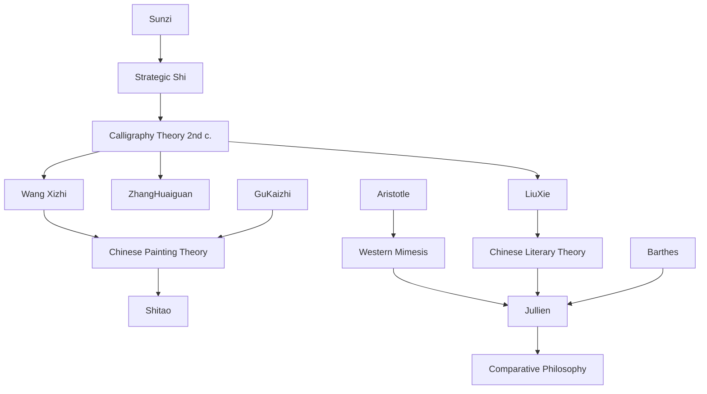

---
cssclasses:
  - Philosophy
  - Arts
subclasses:
  - Aesthetics
  - Continental-Philosophy
  - Philosophy-of-Language
related:
  - "[[Chinese Aesthetics]]"
  - "[[Calligraphy]]"
  - "[[Landscape Painting]]"
  - "[[Literary Theory]]"
  - "[[Shi]]"
  - "[[Configuration]]"
aliases:
  - shi concept
  - propensity things
  - chinese aesthetics
  - force form
  - literary configuration
  - calligraphic dynamism
  - aesthetic tension
  - effect genre
  - pictorial shi
  - literary propensity
reference:
  - "Jullien, F. (1995). The propensity of things: toward a history of efficacy in China. Zone Books ; Distributed by MIT Press. (pp.75-89)"
---

#### Central Problem

François Jullien addresses the fundamental question of how Chinese aesthetic thought conceptualizes artistic creation and its effects—a conceptualization radically different from the Western mimetic tradition. While Western aesthetics, from Plato and Aristotle onward, understood art primarily as *mimesis* (imitation or representation of nature at various levels of ideality or reality), Chinese aesthetic theory never adopted this framework. Instead, it developed around the concept of *shi* (勢): the propensity, potential, or dynamic configuration inherent in any artistic form.

The central problem Jullien investigates is how *shi* functions as a unifying principle across diverse Chinese artistic practices—calligraphy, painting, and literature—and how this concept, originally derived from military strategy, came to structure an entire aesthetic worldview. The question is not merely historical but philosophical: how can we understand artistic efficacy not as representation but as actualization of dynamic potential? How does form itself become a force?

The collapse of the unified Han cosmological system (around the 2nd century A.D.) created the conditions for autonomous aesthetic reflection in China. But from its emergence, this reflection conceptualized artistic activity as a "process of actualization" producing "a particular configuration of the dynamism inherent in reality." Art operates through the tension animating an ideogram's strokes, through the force and movement of painted forms, through the effect created by literary composition. The ancient strategic model thus serves as the foundation for aesthetic theory: art is conceived in terms of *shi*, as a possible setup whose potential must be maximally exploited.

#### Main Thesis

Jullien's main thesis is that Chinese aesthetic thought across calligraphy, painting, and literature operates through the concept of *shi*—a term signifying at once configuration, potential, propensity, tension, and effect. This concept provides a coherent alternative to Western form/content distinctions and mimetic theories by understanding artistic creation as the management and exploitation of dynamic propensities inherent in any particular configuration.

**In Calligraphy:** The art of writing exemplifies *shi* as the force running through and animating the ideogram. Each character is simultaneously a form produced by gesture and a gesture converted into form—these are equivalent, caught at different stages of the same force. The calligrapher must allow *shi* to flow: "When *shi* comes, do not stop it; when it departs, do not hinder it." The dynamism depends on contrast and correlation—tension between top and bottom, lowering and lifting, separating and gathering. The ideogram becomes "a living symbol of the great process of the world."

**In Painting:** The term *shi* finds its fullest expression in landscape painting, where mountains become the privileged site for diverse tensions to operate together. The painter exploits possibilities of height and distance, alternation and contrast, convexity and concavity. The fundamental opposition of emptiness and fullness—central to Chinese aesthetics as to Chinese cosmology—generates the configuration's efficacy: "To bring into play this opposition between emptiness and fullness will be enough to achieve *shi*." The effect of tension operates at "the exact boundary between the visible and the invisible."

**In Literature:** A text is a particular configuration of words whose *propensity for effect* stems naturally from its constitution, "just as a spherical body tends to roll and a cubic one remains still." The writer must determine and exploit this propensity, combining diverse possibilities for maximum efficacy while respecting the text's overall unity. Literary *shi* relates both to genre and to the author's individual identity, but differs fundamentally from Western notions of "style" because it conceives form not as shaped content but as operating configuration.

The unity across these domains lies in *shi*'s role as what animates form, makes it effective, and opens the finite to the infinite—"gesturing toward the invisible" through the visible configuration.

#### Historical Context

The theoretical framework Jullien analyzes emerged following the collapse of the Han dynasty (206 BCE–220 CE) and the subsequent fragmentation of China over several centuries. The unified cosmological, moral, and political system that had characterized Han thought gave way to a period of disunity that, paradoxically, enabled the emergence of autonomous aesthetic reflection. For the first time, artistic criticism could develop as a distinct line of thought, no longer subordinated to the integrated system of correlative cosmology.

The concept of *shi* itself predates this aesthetic application. Its origins lie in classical Chinese strategic thought, particularly the military treatises of the Warring States period (475–221 BCE), including the *Sunzi Bingfa* (Art of War). In strategic contexts, *shi* referred to the positional advantage or potential energy created by the disposition of troops on a battlefield—a potential that, once achieved, ensures success. The explicit transition from military to aesthetic domains occurred around the 2nd century A.D., when writers on calligraphy stressed that "the Ancients" already recognized *shi*'s "paramount importance."

The major theoretical elaborations Jullien examines span from the 4th-5th centuries (calligraphy theory, Gu Kaizhi on painting) through the Tang dynasty commentators (Zhang Huaiguan, 8th century) to the culminating synthesis in Liu Xie's *Wenxin diaolong* (The Literary Mind and the Carving of Dragons, early 6th century)—a work whose "exceptional profundity is only today being rediscovered, after more than a millennium of obscurity." The late imperial period, particularly Shitao's 17th-century painting treatises, continued developing these ideas.

This historical trajectory reveals how a concept from political-military discourse was progressively aestheticized while retaining its fundamental logic of positional efficacy and dynamic potential.

#### Philosophical Lineage

#### Key Thinkers

| Thinker | Dates | Movement | Main Work | Core Concept |
|---------|-------|----------|-----------|--------------|
| [[Gu Kaizhi]] | c. 344–406 | Chinese Painting Theory | *On Painting* | Dynamic configuration in landscape |
| [[Zhang Huaiguan]] | 8th century | Calligraphy Theory | *Shuduan* | Tension through contrast in brush strokes |
| [[Liu Xie]] | c. 465–522 | Literary Criticism | *Wenxin diaolong* | Literary propensity for effect |
| [[Shitao]] | 1642–1707 | Qing Painting | *Huayu lu* | Emptiness-fullness opposition |
| [[Aristotle]] | 384–322 BCE | Classical Philosophy | *Poetics* | Mimesis as artistic principle |
| [[Barthes]] | 1915–1980 | Structuralism | *Writing Degree Zero* | Style as "transmutation of a humor" |

#### Key Concepts

| Concept | Definition | Related to |
|---------|------------|------------|
| Shi (勢) | The propensity, potential, or dynamic configuration inherent in any form; the force that animates a configuration and makes it effective | [[Chinese Aesthetics]], [[Strategic Thought]] |
| Configuration | The particular disposition or setup of elements (strokes, forms, words) that produces potential and effect | [[Shi]], [[Form]] |
| Actualization | The process by which dynamism inherent in reality is realized through artistic form; opposed to Western mimesis | [[Chinese Philosophy]], [[Process]] |
| Tension | The dynamic interplay between contrasting elements (top/bottom, empty/full, curved/straight) that generates *shi* | [[Polarity]], [[Configuration]] |
| Propensity for effect | The natural tendency of a literary or artistic configuration to produce a specific impact on the receiver | [[Liu Xie]], [[Literary Theory]] |
| Emptiness-Fullness | The fundamental polarity in Chinese aesthetics and cosmology whose interplay generates dynamic configuration | [[Chinese Cosmology]], [[Painting Theory]] |
| Internal-link class | The invisible "skeleton" providing structural consistency to an ideogram, opposed to mere flourish | [[Calligraphy]], [[Zhang Huaiguan]] |
| Mimesis | Western concept of art as imitation or representation of nature; explicitly contrasted with Chinese *shi* | [[Aristotle]], [[Western Aesthetics]] |
| Breath (qi) | The vital energy that spreads "beyond" the text; related to but distinct from *shi* as propensity | [[Chinese Philosophy]], [[Literary Creation]] |
| Genre | Literary type defined by its specific propensity for effect; Liu Xie classifies 22 genres by 6 criteria | [[Liu Xie]], [[Literary Theory]] |

#### Authors Comparison

| Theme | [[Jullien]] | Western Tradition |
|-------|-------------|-------------------|
| Artistic principle | Shi as actualization of dynamic potential | Mimesis as representation of nature |
| Form-content relation | Form as operating configuration | Form as shape of material content |
| Efficacy | Natural propensity of setup | Rhetorical intention or expression |
| Style theory | Configuration produces effect | Teleological (classical) or genetic (romantic) |
| Visibility | Tension at boundary of visible/invisible | Representation of visible reality |
| Unity | Process from configuration to effect | Form/content distinction |
| Source of art | Strategic model (positional advantage) | Nature (ideal or real) to be imitated |

#### Influences & Connections

- **Predecessors:** [[Jullien]] ← draws on ← [[Sunzi]], [[Liu Xie]], [[Zhang Huaiguan]], [[Gu Kaizhi]], [[Shitao]]
- **Western context:** [[Jullien]] ↔ contrasts with ↔ [[Aristotle]], [[Plato]], classical rhetoric, romantic style theory
- **Contemporaries:** [[Jullien]] ↔ dialogue with ↔ [[Barthes]], structuralist literary theory
- **Methodological:** [[Jullien]] → contributes to → comparative philosophy, intercultural aesthetics
- **Opposing views:** Chinese *shi* aesthetics ← differs from ← Western mimetic tradition, form/content metaphysics

#### Summary Formulas

- **[[Jullien]]:** Chinese aesthetic thought conceives art not as mimesis but as the actualization of dynamic propensity (*shi*) inherent in any configuration—a force that animates form and opens the finite to the infinite.
- **[[Liu Xie]]:** A literary text is a configuration whose natural propensity for effect must be determined and exploited by the writer, combining diverse possibilities while respecting the unity proper to each genre.
- **[[Zhang Huaiguan]]:** Calligraphic *shi* is achieved through the creation of tension between contrasting elements—top and bottom, lowering and lifting, separating and gathering—producing the ideogram's vital force.
- **Chinese Aesthetics:** Art operates through the interplay of emptiness and fullness, actualizing the universal dynamism through particular configurations that gesture from the visible toward the invisible.

#### Notable Quotes

> "When shi comes, do not stop it; when it departs, do not hinder it." — Early Chinese treatise on calligraphy

> "To bring into play this opposition between emptiness and fullness will be enough to achieve shi." — [[Shitao]]

> "Shi thus creates its effect of tension at the exact boundary between the visible and the invisible, where the explicit nature of the configuration becomes more richly charged with implicit meaning." — [[Jullien]]

---
> [!warning]-
> This annotation was normalised using a large language model and may contain inaccuracies. These texts serve as preliminary study resources rather than exhaustive references.
