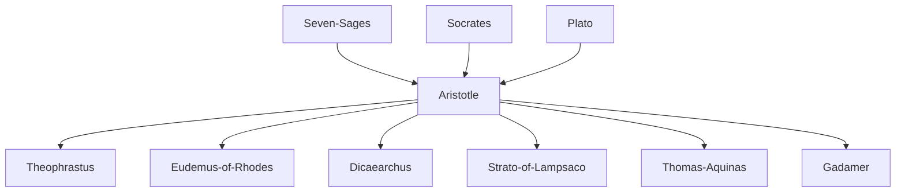

---
cssclasses:
  - Philosophy
subclasses:
  - Ethics
  - Ancient-Greek-and-Roman-Philosophy
  - Social-and-Political-Philosophy
aliases:
  - golden mean
  - practical wisdom
  - political philosophy
  - contemplative life
contributions:
  - Conceptual
authors:
  - "[[Aristotle]]"
  - "[[Plato]]"
reference: "Abbagnano, N., & Fornero, G. (2012). La ricerca del pensiero. Vol. 1A. Dalle origini ad Aristotele. Paravia."
related:
  - "[[Nicomachean Ethics]]"
  - "[[Politics]]"
  - "[[Poetics]]"
  - "[[Virtue Ethics]]"
  - "[[Eudaimonia]]"
  - "[[Practical Wisdom]]"
  - "[[Contemplative Life]]"
  - "[[Peripatetic School]]"
  - "[[Greek Political Philosophy]]"
  - "[[Catharsis]]"
  - "[[Mimesis]]"
---

#### Central Problem

The chapter addresses the fundamental question of human action: what constitutes the good life for human beings, and how should individuals and communities organize themselves to achieve happiness (eudaimonia)? [[Aristotle]] confronts the challenge of determining the supreme good that all human activities pursue, recognizing that while many goods are desired as means to further ends (wealth for satisfaction, health for pleasure), there must be a final end desired for its own sake. This leads to the question of what specific activity defines human flourishing and how virtue, both moral and intellectual, enables humans to realize their proper function.

The investigation extends to the political realm, examining why humans naturally form communities and what constitutes the best form of government. Furthermore, the chapter explores the nature of artistic production, particularly poetry and tragedy, asking what role imitation (mimesis) plays in art and whether artistic representation corrupts or purifies human emotions.

#### Main Thesis

Aristotle argues that happiness (eudaimonia) constitutes the supreme good for human beings, but happiness is not a passive state—it is an activity of the soul in accordance with virtue. Since humanity's distinctive function is rational activity, happiness consists in living according to reason. This thesis carries several implications:

**Virtue as the Path to Happiness:** Virtue is the disposition to act according to reason. [[Aristotle]] distinguishes ethical virtues (moral virtues governing impulses through reason) from dianoetic virtues (intellectual virtues exercising reason itself). Moral virtue lies in the "golden mean" (mesotes) between excess and deficiency—courage between cowardice and recklessness, temperance between insensibility and intemperance.

**Justice as Complete Virtue:** Justice, understood as conformity to law, represents complete virtue in relation to others. [[Aristotle]] further distinguishes distributive justice (distributing goods according to merit, following geometric proportion) from commutative justice (governing contracts, following arithmetic equality). Equity serves as a corrective when law's generality produces injustice in particular cases.

**Intellectual Virtues and Contemplation:** Among dianoetic virtues—art (techne), practical wisdom (phronesis), intelligence, science, and wisdom (sophia)—wisdom represents the highest. While practical wisdom concerns human affairs and determines the mean in moral virtues, wisdom concerns eternal and necessary truths. The contemplative life (bios theoretikos) represents humanity's highest achievement, approximating divine existence.

**Friendship as Essential:** [[Aristotle]] identifies three types of friendship—based on utility, pleasure, or virtue. Only friendship of virtue, where friends love each other for their own sake, proves stable and complete. True friendship requires equality, intimacy, and time to develop.

**Natural Political Community:** The state exists by nature, not convention, because humans are naturally political animals (zoon politikon) who cannot achieve happiness in isolation. The best constitution aims at the prosperity and virtuous life of citizens, with [[Aristotle]] preferring polity (constitutional government by the middle class) as the most stable regime.

**Art as Philosophical Imitation:** Against [[Plato]]'s critique, [[Aristotle]] defends art as imitation (mimesis) that represents not mere particulars but universals—what could happen according to probability or necessity. Poetry is thus more philosophical than history. Tragedy purifies (catharsis) the emotions of pity and fear rather than corrupting spectators.

#### Historical Context

Aristotle's practical philosophy emerges from fourth-century BCE Athens, a period of political transformation following the Peloponnesian War and the decline of Athenian democracy. The philosopher wrote during the reign of his former pupil [[Alexander]] the Great, witnessing the transition from the autonomous polis to the Hellenistic kingdoms. This context shaped his investigation of political constitutions, as he systematically studied 158 Greek constitutions to understand what makes states flourish or decay.

The Greek cultural context emphasized the unity of ethics and politics—the good person and the good citizen were ideally identical. [[Aristotle]]'s ethics reflects aristocratic values of the polis: leisure (schole) as prerequisite for philosophical contemplation, the importance of external goods, and the assumption that slavery and the subordination of women were natural. His elevation of the contemplative life over practical engagement represents both continuity with and transformation of traditional Greek wisdom about moderation (meden agan—nothing in excess) expressed by the Seven Sages.

The discussion of tragedy responds to [[Plato]]'s critique in the Republic, where dramatic poetry was banished for encouraging emotional indulgence. [[Aristotle]]'s defense of catharsis rehabilitates art as psychologically and educationally valuable, reflecting the central place of tragic performance in Athenian civic and religious life.

#### Philosophical Lineage

#### Key Thinkers

| Thinker | Dates | Movement | Main Work | Core Concept |
|---------|-------|----------|-----------|--------------|
| [[Aristotle]] | 384-322 BCE | [[Aristotelianism]] | *Nicomachean Ethics*, *Politics*, *Poetics* | Eudaimonia as activity according to virtue |
| [[Plato]] | 428/7-348/7 BCE | [[Platonism]] | *Republic*, *Timeo* | Good as transcendent principle |
| [[Theophrastus]] | 373/370-288/286 BCE | [[Peripatetic School]] | *History of Plants* | Botanical classification |
| [[Eudemus of Rhodes]] | 4th c. BCE | [[Peripatetic School]] | *Eudemian Ethics* | History of sciences |
| [[Dicaearchus]] | 4th c. BCE | [[Peripatetic School]] | *Tripoliticus* | Superiority of practical life |
| [[Strato of Lampsaco]] | 3rd c. BCE | [[Peripatetic School]] | Physical writings | Naturalistic atomism |

#### Key Concepts

| Concept | Definition | Related to |
|---------|------------|------------|
| Eudaimonia | Supreme good for humans; activity of soul according to virtue, not passive state | [[Aristotle]], [[Ethics]] |
| Mesotes (Golden Mean) | Virtue as disposition to choose the mean between excess and defect | [[Aristotle]], [[Virtue Ethics]] |
| Phronesis | Practical wisdom; capacity to act well in human affairs, determining the mean | [[Aristotle]], [[Prudence]] |
| Sophia | Theoretical wisdom; highest knowledge of eternal and necessary truths | [[Aristotle]], [[Contemplation]] |
| Distributive Justice | Distribution of goods according to merit (geometric proportion) | [[Aristotle]], [[Political Philosophy]] |
| Commutative Justice | Governing contracts, equalizing advantages and disadvantages (arithmetic proportion) | [[Aristotle]], [[Law]] |
| Equity | Correction of law through natural right when general rules produce injustice | [[Aristotle]], [[Jurisprudence]] |
| Bios Theoretikos | Contemplative life; highest human existence, approximating the divine | [[Aristotle]], [[Philosophy]] |
| Zoon Politikon | "Political animal"; humans naturally form communities to achieve the good life | [[Aristotle]], [[Political Philosophy]] |
| Mimesis | Imitation; art represents universals, what could happen according to probability | [[Aristotle]], [[Poetics]] |
| Catharsis | Purification of emotions through artistic representation, especially tragedy | [[Aristotle]], [[Aesthetics]] |
| Philía | Friendship; three types based on utility, pleasure, or virtue (most stable) | [[Aristotle]], [[Ethics]] |

#### Authors Comparison

| Theme | [[Aristotle]] | [[Plato]] |
|-------|---------------|-----------|
| Nature of the Good | Immanent; realized in human action | Transcendent Idea beyond being |
| Virtue | Mean between extremes; practical disposition | Knowledge of the Good |
| Wisdom vs. Prudence | Distinct: sophia (theoretical) vs. phronesis (practical) | Unified concept |
| Best Life | Contemplative life superior to practical | Philosopher-king uniting both |
| Art | Purifies emotions (catharsis); reveals universals | Corrupts soul; mere imitation of imitation |
| Political Community | Natural; precedes individual conceptually | Conventional element in origin |
| Property | Private property natural; motivates care | Communism for guardians |
| Women and Family | Natural hierarchy; private family unit | Equality possible; community of wives |

#### Influences & Connections

- **Predecessors:** [[Aristotle]] ← influenced by ← [[Plato]], [[Socrates]], [[Seven Sages]]
- **Contemporaries:** [[Aristotle]] ↔ dialogue with ↔ [[Plato]] (critique of transcendent Good and communism)
- **Followers:** [[Aristotle]] → influenced → [[Theophrastus]], [[Eudemus of Rhodes]], [[Dicaearchus]], [[Strato of Lampsaco]]
- **Later Reception:** [[Aristotle]] → influenced → [[Aquinas]], [[Gadamer]] (rehabilitation of phronesis)
- **Opposing views:** [[Aristotle]] ← criticized by ← [[Plato]] (on immanence of forms)

#### Summary Formulas

- **[[Aristotle]] on happiness:** Happiness is not a state but an activity of the soul according to virtue; since reason is humanity's distinctive function, the happy life is the life lived according to reason.
- **[[Aristotle]] on virtue:** Moral virtue is the disposition to choose the mean between excess and defect, determined by practical wisdom as the prudent person would determine it.
- **[[Aristotle]] on politics:** The state exists by nature and is prior to the individual; one who cannot live in community is either beast or god.
- **[[Aristotle]] on art:** Poetry is more philosophical than history because it represents the universal—what could happen according to probability or necessity—not mere particulars.

#### Timeline

| Year | Event |
|------|-------|
| 384 BCE | [[Aristotle]] born in Stagira |
| 367 BCE | [[Aristotle]] enters [[Plato]]'s Academy |
| 335 BCE | [[Aristotle]] founds the Lyceum in Athens |
| 322 BCE | [[Aristotle]] dies; [[Theophrastus]] succeeds as head of Peripatetic School |
| 288/286 BCE | [[Theophrastus]] dies; [[Strato of Lampsaco]] becomes scholarch |
| 1st c. BCE | [[Andronicus of Rhodes]] edits Aristotelian corpus |
| 13th c. | [[Aquinas]] synthesizes Aristotelian ethics with Christianity |

#### Notable Quotes

> "Man is by nature a political animal: therefore one who cannot live in community or needs nothing because sufficient to himself is either beast or god."
> — [[Aristotle]]

> "Man should not, as some say, know human things as human, mortal things as mortal, but should make himself, as far as possible, immortal and do everything to live according to what is highest in him."
> — [[Aristotle]]

> "Poetry is more philosophical and more elevated than history; poetry tends rather to represent the universal, history the particular."
> — [[Aristotle]]

---
> [!NOTE]
> *This summary has been created to present the key points from the source text, which was automatically extracted using LLM. Please note that the summary may contain errors. It serves as an essential starting point for study and reference purposes.*
