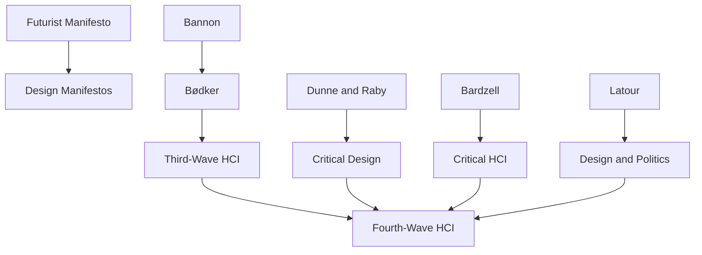

---
cssclasses:
  - Computer-Science
  - Arts
  - Philosophy
subclasses:
  - Human-Computer-Interaction
  - Critical-Design
  - Design-Theory
related:
  - "[[HCI]]"
  - "[[Manifestos]]"
  - "[[Participatory Design]]"
  - "[[Critical Design]]"
  - "[[Political Design]]"
aliases:
  - fourth wave
  - manifesto
  - hci activism
  - design politics
  - chi conference
  - tableau vivant
  - card game
  - creative subversion
  - design values
  - political intervention
reference:
  - Ashby, S., Hanna, J., Matos, S., Nash, C., & Faria, A. (2019). Fourth-Wave HCI Meets the 21st Century Manifesto. Proceedings of the Halfway to the Future Symposium 2019, 1–11. https://doi.org/10.1145/3363384.3363467
---

#### Central Problem

The paper addresses how human-computer interaction (HCI) can move beyond its third-wave focus on individual experience and meaning-making toward a fourth wave that explicitly engages with political values, activism, and collective action. The authors confront the tension between HCI's historical emphasis on usability and efficiency versus the need for the field to address broader societal challenges including sustainability, social justice, and political agency. The central question becomes: how can HCI practitioners and researchers use manifestos and creative interventions to articulate and advocate for values-driven design?

#### Main Thesis

Fourth-wave HCI represents a paradigm shift where political values and activism become central concerns of human-computer interaction research and practice. The authors argue that manifestos—as performative declarations of intent that call communities to action—offer a powerful methodological and rhetorical tool for HCI to address political and ethical dimensions of technology design. Through their MANIFESTO! card game intervention at CHI'19, they demonstrate that creative, playful formats can generate genuine political discourse and collective meaning-making within the HCI community.

The thesis extends [[Bødker]]'s wave framework: if the first wave focused on human factors, the second on workplace collaboration, and the third on experience and meaning, the fourth wave must grapple with values, politics, and the broader societal implications of interactive technologies. Manifestos serve as vehicles for this fourth-wave engagement because they combine theoretical positioning with calls to action.

#### Historical Context

The paper emerges from a rich history of manifesto-writing in design and art, from the Futurist Manifesto (1909) to contemporary critical design manifestos. Within HCI specifically, the wave metaphor introduced by [[Bødker]] (2006, 2015) provides the organizing framework, charting HCI's evolution from cognitive engineering to situated action to experience design.

The early 2000s saw critical design practices by [[Dunne and Raby]] challenging design's complicity with consumer capitalism. Simultaneously, participatory design traditions emphasized democratic engagement in technology development. The authors position their work at the confluence of these traditions, responding to [[Bardzell and Bardzell]]'s call for critical approaches in HCI.

The CHI conference itself becomes a site of intervention—a major international gathering where the HCI community's values and priorities are negotiated and performed. The 2019 conference theme provided an opportunity to test whether playful, manifesto-generating activities could catalyze fourth-wave discourse.

#### Philosophical Lineage

#### Key Thinkers

| Thinker | Dates | Movement | Main Work | Core Concept |
|---------|-------|----------|-----------|--------------|
| [[Bødker]] | 1954- | [[HCI]] | "When Second Wave HCI Meets Third Wave Challenges" | Waves of HCI |
| [[Dunne and Raby]] | 1960s- | [[Critical Design]] | *Speculative Everything* | Design noir, critical design |
| [[Bardzell]] | - | [[Critical HCI]] | "What is Critical About Critical Design?" | Criticality in HCI |
| [[Latour]] | 1947-2022 | [[Science Studies]] | "A Cautious Prometheus?" | Design as politics |
| [[Tonkinwise]] | - | [[Design Theory]] | Various essays | Design futures |

#### Key Concepts

| Concept | Definition | Related to |
|---------|------------|------------|
| Fourth-wave HCI | HCI paradigm emphasizing political values, activism, and collective action beyond individual experience | [[Bødker]], [[HCI]] |
| Manifesto | Performative declaration combining theoretical positioning with calls to action | [[Critical Design]], [[Political Design]] |
| Tableau vivant | Living picture; embodied performance used to present manifesto statements | [[Performance]], [[Intervention]] |
| Creative subversion | Using playful or artistic methods to challenge dominant practices and values | [[Critical Design]], [[Activism]] |
| Values-driven design | Design practice explicitly oriented toward articulated ethical and political commitments | [[Participatory Design]], [[Ethics]] |

#### Authors Comparison

| Theme | [[Bødker]] | [[Dunne and Raby]] | [[Bardzell]] |
|-------|------------|-------------------|--------------|
| Central concern | Evolution of HCI paradigms | Challenging design's status quo | Criticality in interaction design |
| Method | Theoretical analysis | Speculative artifacts | Philosophical critique |
| Political stance | Participatory democracy | Anti-consumerism | Critical theory |
| Role of values | Implicit to explicit | Central and provocative | Object of reflection |

#### Influences & Connections

- **Predecessors:** [[Ashby et al.]] ← influenced by ← [[Bødker]], [[Dunne and Raby]], [[Bardzell]]
- **Contemporaries:** [[Ashby et al.]] ↔ dialogue with ↔ CHI community, [[Critical Design]] practitioners
- **Related movements:** [[Participatory Design]] ↔ resonates with ↔ [[Fourth-wave HCI]]
- **Opposing views:** Traditional HCI ← challenged by ← [[Fourth-wave HCI]]

#### Summary Formulas

- **Fourth-wave HCI:** HCI must evolve beyond experience and meaning-making to explicitly engage with political values, activism, and collective societal transformation.
- **Manifesto as method:** Manifestos combine declarative rhetoric with performative action, making them ideal vehicles for articulating and advocating values in design communities.
- **MANIFESTO! intervention:** Playful card games can generate genuine political discourse by lowering barriers to participation while maintaining critical engagement.

#### Timeline

| Year | Event |
|------|-------|
| 1909 | Futurist Manifesto establishes manifesto as artistic/political form |
| 2001 | [[Dunne and Raby]] publish *Design Noir* |
| 2006 | [[Bødker]] introduces wave metaphor at NordiCHI |
| 2013 | [[Bardzell and Bardzell]] publish "What is Critical About Critical Design?" |
| 2015 | [[Bødker]] revisits third-wave HCI, anticipates fourth wave |
| 2019 | Ashby et al. deploy MANIFESTO! card game at CHI'19 |

#### Notable Quotes

> "Fourth-wave HCI is about values and politics, about taking sides and making commitments."

> "The manifesto is not merely a text but a performative act—a doing that seeks to change the world it describes."

> "Playfulness and politics are not opposites; the card game format opened space for genuine discourse that more formal formats might have foreclosed."
