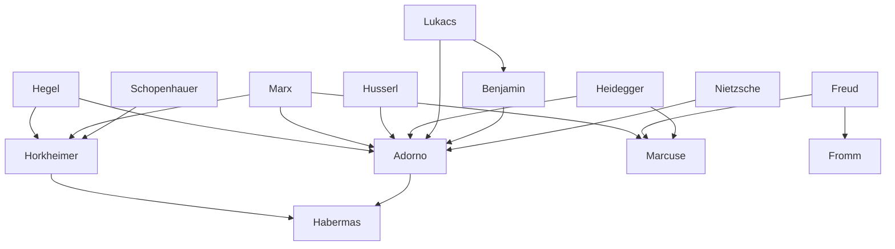

---
cssclasses:
  - Philosophy
  - Sociology
subclasses:
  - Critical-Theory
  - Social-and-Political-Philosophy
  - 20th-Century-Philosophy
related:
  - "[[Western Marxism]]"
  - "[[Psychoanalysis]]"
  - "[[Dialectic of Enlightenment]]"
  - "[[Culture Industry]]"
  - "[[One-Dimensional Man]]"
  - "[[Negative Dialectics]]"
  - "[[Mass Media]]"
  - "[[Totalitarianism]]"
  - "[[Ideology Critique]]"
  - "[[Aesthetic Theory]]"
aliases:
  - frankfurt school
  - critical theory
  - dialectic enlightenment
  - culture industry
  - one dimensional
  - negative dialectics
  - eros civilization
  - great refusal
  - instrumental reason
  - authoritarian personality
  - aura artwork
  - totally other
reference:
  - "[Abbagnano, N., & Fornero, G. (2012). La ricerca del pensiero. Vol. 3B. Dalla fenomenologia a Gadamer. Paravia.](https://archive.org/download/ssp-s06-e06/The%20search%20for%20thought%20-%20Unit%2012%20Chapter%201.pdf)"
tags:
  - Podcast
---

#### Podcast

<iframe src="https://archive.org/embed/ssp-s06-e06" width="100%" height="30" frameborder="0" webkitallowfullscreen="true" mozallowfullscreen="true" allowfullscreen></iframe>

---

#### Central Problem

The Frankfurt School confronts the fundamental paradox of Enlightenment civilization: how did the project of human emancipation through reason produce new and more insidious forms of domination? The critical theorists ask why modern technological society, despite its unprecedented productive capacities and democratic pretensions, generates totalitarianism, mass manipulation, and the systematic destruction of individual autonomy and happiness.

The central problem manifests on multiple levels: epistemologically, how did reason become reduced to mere instrumental calculation? Socially, how does advanced capitalism maintain domination without overt coercion? Psychologically, how are individuals conditioned to accept and even desire their own subjugation? Culturally, how have art, philosophy, and mass media become instruments of social control rather than critique and liberation?

The Frankfurt School seeks to understand why, despite material abundance, modern society remains fundamentally unfree, and how the Enlightenment ideals of reason, progress, and human flourishing have been perverted into their opposites: rationalized irrationality, progress toward barbarism, and systematic unhappiness.

#### Main Thesis

The Frankfurt School argues that Enlightenment reason, in its historical development from [[Descartes]] and Bacon through positivism and pragmatism, has undergone a fateful transformation from objective to subjective rationality. **Objective reason** sought universal truths about reality and values, providing criteria for knowledge and action. **Subjective reason** (instrumental reason) refuses to evaluate ends, concerning itself solely with the efficiency of means — reducing rationality to functionality, knowledge to technique, truth to utility.

This instrumental reason constitutes the "logic of domination" underlying Western civilization: the drive to master nature through rationalization, which inevitably extends to domination over human beings themselves. As [[Horkheimer]] and [[Adorno]] argue in *Dialectic of Enlightenment* (1947), the Enlightenment thus harbors an internal self-destructive dialectic: the drive to increase power over nature reverses into progressive domination of humans over humans and the general subjugation of individuals to the social system.

The **culture industry** represents the most characteristic expression of late capitalism's domination. Mass media (newspapers, cinema, radio, television, advertising) constitute a gigantic apparatus for manipulating consciousness: creating false needs, rendering individuals passive and heterodirected, transforming them from persons into an undifferentiated mass. Even entertainment and leisure are "programmed," becoming mere extensions of labor under capitalism.

[[Marcuse]] extends this analysis by arguing that advanced industrial society creates **one-dimensional man** — an individual so thoroughly integrated into the system that he can no longer perceive the gap between what is and what ought to be. The system's productive efficiency and democratic pluralism mask what is actually "totalitarian administration" of existence, maintained through "repressive tolerance" that permits only what does not challenge the system itself.

Against both Hegelian dialectics of reconciliation and positivist acceptance of facts, [[Adorno]] proposes **negative dialectics** — a philosophical method that refuses synthesis, insisting instead on contradiction, non-identity, and the disharmonies that constitute reality. After Auschwitz, philosophy must break with its past of rationalizing the irrational and harmonizing the disharmonious.

#### Historical Context

The Frankfurt School emerged in 1922 at the Institute for Social Research in Frankfurt, founded by Felix [[Weil]] and initially directed by Grünberg. The original nucleus included sociologists, economists, and philosophers: Wittfogel, Henryk Grossmann, Pollock, Borkenau, [[Horkheimer]], and [[Adorno]]. Later additions included Leo Löwenthal, Neumann, [[Fromm]], [[Marcuse]], and [[Benjamin]]. In 1936, [[Horkheimer]] inaugurated the *Zeitschrift für Sozialforschung*, the School's prestigious journal.

Three historical coordinates define the Frankfurt School's philosophical project: the rise of Nazism and fascism (stimulating reflection on authority and its structural connections with modern industrial society); the establishment of Soviet communism (serving as a negative example of "failed revolution" and capitalism's other face); and the triumph of technological, affluent society (providing material for original meditations on the culture industry and the heterodirected individual).

With Nazism's advent, the Frankfurt group emigrated — first to Geneva, then Paris, finally New York. After World War II, some remained in America ([[Marcuse]], [[Fromm]], Wittfogel), while others ([[Horkheimer]], [[Adorno]], Pollock) returned to Germany to revive the Institute. A new generation emerged, including Schmidt, Oskar Negt, and [[Habermas]], the School's most significant heir.

The Frankfurt theorists drew on three foundational figures: from **Hegel** and **Marx**, the dialectical and totalizing approach to society — dialectical in exposing internal contradictions, totalizing in questioning society as a whole rather than accepting analytical-statistical facts. From **Freud**, analytical tools for studying personality and authority's "introjection" mechanisms (evident in *Studies on Authority and the Family* [1936] and *The Authoritarian Personality* [1950]), plus concepts of pleasure-seeking and libido interpreted as creative instincts requiring liberation from authoritarian impositions.

#### Philosophical Lineage

#### Key Thinkers

| Thinker | Dates | Movement | Main Work | Core Concept |
|---------|-------|----------|-----------|--------------|
| [[Horkheimer]] | 1895-1973 | [[Frankfurt School]] | *Dialectic of Enlightenment* | Instrumental reason |
| [[Adorno]] | 1903-1969 | [[Frankfurt School]] | *Negative Dialectics* | Culture industry |
| [[Marcuse]] | 1898-1979 | [[Frankfurt School]] | *One-Dimensional Man* | Great Refusal |
| [[Benjamin]] | 1892-1940 | [[Frankfurt School]] | *The Work of Art in the Age of Mechanical Reproduction* | Aura |
| [[Fromm]] | 1900-1980 | [[Frankfurt School]] | *Escape from Freedom* | Authoritarian personality |
| [[Habermas]] | 1929- | [[Frankfurt School]] | *Theory of Communicative Action* | Communicative rationality |

#### Key Concepts

| Concept | Definition | Related to |
|---------|------------|------------|
| Instrumental reason | Subjective reason that refuses to evaluate ends, concerning itself solely with efficiency of means | [[Horkheimer]], [[Frankfurt School]] |
| Dialectic of Enlightenment | The internal self-destructive dynamic whereby the drive to master nature reverses into human domination | [[Horkheimer]], [[Adorno]] |
| Culture industry | The apparatus of mass media that manipulates consciousness, creates false needs, and renders individuals passive and heterodirected | [[Adorno]], [[Horkheimer]] |
| Negative dialectics | Philosophical method refusing synthesis, insisting on contradiction, non-identity, and non-conciliated disharmonies | [[Adorno]], [[Critical Theory]] |
| One-dimensional man | The alienated individual of advanced industrial society who identifies reason with reality and sees no alternative modes of existence | [[Marcuse]], [[Frankfurt School]] |
| Performance principle | The capitalist form of the reality principle that demands individuals invest all psychophysical energy in labor and production | [[Marcuse]], [[Critical Theory]] |
| Surplus repression | The additional repression required by class society beyond the basic instinct control needed for any civilization | [[Marcuse]], [[Freud]] |
| Great Refusal | Total opposition to the technological system, incarnated by the excluded and marginalized | [[Marcuse]], [[Frankfurt School]] |
| Repressive desublimation | False sexual freedom that is actually administered liberalization serving repressive adaptation to the system | [[Marcuse]], [[Critical Theory]] |
| Aura | The unique, irreproducible quality of an artwork tied to its specific context of origin and reception | [[Benjamin]], [[Frankfurt School]] |
| Nostalgia for the totally Other | The inextirpable human longing that injustice not have the last word, a form of negative theology | [[Horkheimer]], [[Philosophy of Religion]] |

#### Authors Comparison

| Theme | [[Horkheimer]] | [[Adorno]] | [[Marcuse]] | [[Benjamin]] |
|-------|----------------|------------|-------------|--------------|
| Central problem | Eclipse of reason | After Auschwitz | Repressive civilization | Loss of aura |
| Key dialectic | Enlightenment's self-destruction | Identity vs. non-identity | Freedom vs. domination | Individual vs. collective |
| On capitalism | Administered world | Total system | One-dimensional society | Producer of commodified culture |
| Hope/alternative | Nostalgia for totally Other | Utopian-critical philosophy | Great Refusal, new sensibility | Messianic redemption |
| Art's function | — | Denuncia and utopia | Liberating eros | Politicization vs. aestheticization |
| Late position | Return to theology | Pessimism after '68 | Revolutionary optimism | Messianic Marxism |
| On [[Freud]] | Tool for authority analysis | Critical appropriation | Creative synthesis with [[Marx]] | Marginal influence |

#### Influences & Connections

- **Predecessors:** [[Horkheimer]] ← influenced by ← [[Hegel]], [[Marx]], [[Schopenhauer]]
- **Predecessors:** [[Adorno]] ← influenced by ← [[Hegel]], [[Marx]], [[Husserl]], [[Lukacs]]
- **Contemporaries:** [[Adorno]] ↔ collaboration with ↔ [[Horkheimer]], [[Benjamin]]
- **Contemporaries:** [[Marcuse]] ↔ dialogue with ↔ [[Heidegger]] (early), [[Fromm]]
- **Followers:** [[Adorno]] → influenced → [[Habermas]], contemporary Critical Theory
- **Followers:** [[Benjamin]] → influenced → [[Adorno]]'s aesthetics and philosophy of history
- **Opposing views:** [[Adorno]] ← criticized by ← [[Lukacs]] (on aesthetics), [[Popper]] (positivism debate)
- **Opposing views:** [[Marcuse]] ← criticized by ← orthodox Marxists, liberals

#### Summary Formulas

- **[[Horkheimer]]:** The Enlightenment, pursuing mastery over nature, reverses into domination of humans, revealing the self-destructive dialectic of instrumental reason that must be transcended by a "nostalgia for the totally Other."
- **[[Adorno]]:** After Auschwitz, philosophy must become negative dialectics — refusing false reconciliations, insisting on non-identity and contradiction, exposing the culture industry's manipulation while preserving art's utopian promise.
- **[[Marcuse]]:** Advanced industrial society creates one-dimensional existence through surplus repression and the performance principle; liberation requires the Great Refusal and transformation of labor into creative play.
- **[[Benjamin]]:** In the age of mechanical reproduction, art loses its aura but gains political potential; history awaits messianic redemption that will break catastrophically with the past.

#### Timeline

| Year | Event |
|------|-------|
| 1922 | Foundation of the Institute for Social Research in Frankfurt |
| 1930 | [[Horkheimer]] becomes director of the Institute |
| 1936 | [[Horkheimer]] inaugurates *Zeitschrift für Sozialforschung*; [[Benjamin]] publishes *The Work of Art in the Age of Mechanical Reproduction* |
| 1936 | *Studies on Authority and the Family* published |
| 1940 | [[Benjamin]] commits suicide at Spanish border fleeing Nazis |
| 1941 | [[Marcuse]] publishes *Reason and Revolution* |
| 1947 | [[Horkheimer]] and [[Adorno]] publish *Dialectic of Enlightenment*; [[Horkheimer]] publishes *Eclipse of Reason* |
| 1949 | [[Adorno]] publishes *Philosophy of Modern Music* |
| 1950 | *The Authoritarian Personality* published; [[Horkheimer]] and [[Adorno]] return to Germany |
| 1951 | [[Adorno]] publishes *Minima Moralia* |
| 1955 | [[Marcuse]] publishes *Eros and Civilization* |
| 1964 | [[Marcuse]] publishes *One-Dimensional Man* |
| 1966 | [[Adorno]] publishes *Negative Dialectics* |
| 1968 | Student movement embraces [[Marcuse]] as ideological inspiration |
| 1970 | [[Horkheimer]] publishes *Longing for the Totally Other* |

#### Notable Quotes

> "The fully enlightened earth radiates triumphant disaster." — [[Horkheimer]] and [[Adorno]]

> "A comfortable, smooth, reasonable, democratic unfreedom prevails in advanced industrial civilization." — [[Marcuse]]

> "Dialectics is the consistent consciousness of non-identity." — [[Adorno]]

---
> [!warning]-
> This annotation was normalised using a large language model and may contain inaccuracies. These texts serve as preliminary study resources rather than exhaustive references.
