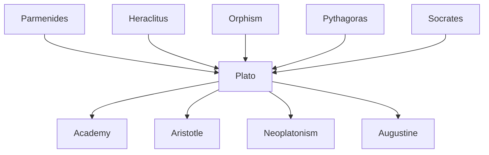

---
cssclasses:
  - Philosophy
  - Political-Science
subclasses:
  - Ancient-Greek-and-Roman-Philosophy
  - Metaphysics
  - Social-and-Political-Philosophy
aliases:
  - theory ideas
  - platonic forms
  - allegory cave
  - philosopher kings
  - platonic republic
  - anamnesis
  - reminiscence
  - immortality soul
  - platonic love
  - demiurge
  - hyperuranion
  - mimesis
contributions:
  - Conceptual
  - Constructive
authors:
  - "[[Plato]]"
  - "[[Socrates]]"
  - "[[Parmenides]]"
  - "[[Heraclitus]]"
reference: "[[01 The search for thought - Unit 3 Chapter 2.pdf]]"
---

#### Central Problem

The central problem addressed in this chapter is the foundational question of Western metaphysics and epistemology: **what is the object of true knowledge, and how can stable, universal certainties be established against sophistical relativism?** If knowledge must possess the characteristics of stability, immutability, and perfection, what reality can serve as its proper object? The sensible world of becoming cannot fulfill this requirement, for it is mutable and imperfect—the domain of mere opinion (doxa).

This epistemological problem generates a series of interconnected questions: How can the soul access the realm of perfect, immutable realities (the Ideas)? What is the relationship between the eternal Ideas and the transient things of our world? And crucially, how can philosophical knowledge be translated into political action to create a just society?

Plato's answer constitutes the most ambitious philosophical synthesis of antiquity: the Theory of Ideas, which provides not only an ontological foundation for knowledge but also a metaphysical basis for ethics and politics. The doctrine emerges from Plato's conviction that the ethical-political crisis of Athens derives fundamentally from an intellectual crisis—the absence of stable truths upon which to ground human life.

#### Main Thesis

Plato's central thesis is that **true knowledge (episteme) has as its object not the mutable things of the sensible world, but eternal, immutable, and perfect realities called Ideas (eide, ideai)**. The Ideas constitute a distinct zone of being—the hyperuranion ("beyond the heavens")—which serves as the model or paradigm for the imperfect copies that populate our world.

**The Ontological Thesis:** Reality is fundamentally dual: there exists the world of becoming (sensible things) and the world of being (Ideas). The Ideas are the "truly real"—immutable, eternal, perfect essences that exist independently of both mind and things. They form a hierarchical structure with the Idea of the Good at the apex, the "idea of ideas" that communicates perfection to all other Ideas.

**The Epistemological Thesis:** To the two levels of reality correspond two levels of knowledge:
- **Opinion (doxa):** knowledge of the sensible world, subdivided into conjecture (eikasia) and belief (pistis)
- **Science (episteme):** knowledge of Ideas, subdivided into mathematical reasoning (dianoia) and philosophical intuition (noesis)

**The Theory of Anamnesis:** Since Ideas cannot be derived from sense experience, knowledge must be recollection (anamnesis) of what the soul contemplated before its incarnation in the body. "To know is to remember."

**The Doctrine of the Soul:** The soul is immortal, tripartite (rational, spirited, appetitive), and capable of ascending from the sensible to the intelligible through love (eros) of beauty and wisdom.

**The Political Thesis:** The just state mirrors the structure of the just soul. Three classes of citizens (rulers, warriors, producers) correspond to three parts of the soul. Justice consists in each part performing its proper function. Only philosophers, who have ascended to knowledge of the Ideas, are fit to rule.

#### Historical Context

This chapter covers Plato's mature philosophy as developed in the great dialogues of his middle period (approximately 385-367 BCE): the *Phaedo*, *Symposium*, *Phaedrus*, and above all the *Republic*. This was the period of the Academy's flourishing, when Plato had fully developed his distinctive philosophical vision beyond the Socratic doctrines of his early dialogues.

The political context remains the aftermath of Athens' defeat in the Peloponnesian War and the execution of Socrates. Plato's political philosophy in the *Republic* represents his systematic response to the crisis of the Greek polis—an attempt to provide philosophical foundations for political order that would transcend the instability of democratic politics and the relativism of sophistical ethics.

Intellectually, Plato's synthesis draws upon multiple traditions:
- From **Heraclitus**: the doctrine that the sensible world is characterized by flux and becoming
- From **Parmenides**: the concept that true being is immutable, eternal, and the proper object of thought
- From **Orphism and Pythagoreanism**: the doctrine of the soul's immortality, transmigration, and purification through knowledge
- From **Socrates**: the method of dialectical inquiry and the identification of virtue with knowledge

#### Philosophical Lineage

#### Key Thinkers

| Thinker | Dates | Movement | Main Work | Core Concept |
|---------|-------|----------|-----------|--------------|
| [[Plato]] | 427-347 BCE | [[Platonism]] | *Republic*, *Phaedo*, *Symposium* | Theory of Ideas, philosopher-kings |
| [[Parmenides]] | c. 515-450 BCE | [[Eleaticism]] | *On Nature* | Being is immutable and eternal |
| [[Heraclitus]] | c. 535-475 BCE | [[Heracliteanism]] | *On Nature* | All things flow, universal becoming |
| [[Pythagoras]] | c. 570-495 BCE | [[Pythagoreanism]] | (Oral teaching) | Soul's immortality, mathematical order |
| [[Socrates]] | 469-399 BCE | [[Socratic Philosophy]] | (Oral teaching) | Virtue as knowledge, dialectical method |

#### Key Concepts

| Concept | Definition | Related to |
|---------|------------|------------|
| Idea (eidos) | Immutable, eternal, perfect entity existing independently; the paradigm or model of which sensible things are imperfect copies | [[Plato]], [[Metaphysics]] |
| Hyperuranion | "Beyond the heavens"—the metaphorical region where Ideas exist, outside space and time | [[Plato]], [[Theory of Forms]] |
| Anamnesis | Recollection—the doctrine that learning is the soul's remembering what it contemplated before incarnation | [[Plato]], [[Epistemology]] |
| Mimesis | Imitation—the relationship by which sensible things imitate their ideal paradigms | [[Plato]], [[Ontology]] |
| Methexis | Participation—things "partake" of the essence of Ideas to the degree of their ontological value | [[Plato]], [[Ontology]] |
| Dianoia | Discursive reasoning—mathematical knowledge that proceeds from hypotheses through demonstration | [[Plato]], [[Epistemology]] |
| Noesis | Intellectual intuition—the highest form of knowledge, direct apprehension of Ideas and the Good | [[Plato]], [[Epistemology]] |
| Philosopher-king | Rulers who possess philosophical knowledge of the Ideas and the Good, fit to govern the just state | [[Plato]], [[Political Philosophy]] |
| Justice (dikaiosyne) | Harmony—each part of soul and state performing its proper function without interfering with others | [[Plato]], [[Ethics]] |
| Tripartite soul | The soul's three parts: rational (logistikon), spirited (thymoeides), appetitive (epithymetikon) | [[Plato]], [[Psychology]] |

#### Authors Comparison

| Theme | [[Plato]] | [[Parmenides]] | [[Heraclitus]] | [[Socrates]] |
|-------|-----------|----------------|----------------|--------------|
| True being | Immutable Ideas | The One, unchanging | Logos within flux | Stable definitions |
| Sensible world | Imperfect copies, becoming | Illusion, mere appearance | Perpetual flux, fire | Domain of inquiry |
| Knowledge | Recollection of Ideas | Thought identical with being | Logos grasped by reason | Dialectical inquiry |
| Soul | Immortal, tripartite | Not explicitly developed | Part of cosmic fire | Seat of virtue |
| Method | Dialectic ascending to Ideas | Logic of being | Paradoxical sayings | Elenchus, maieutics |
| Politics | Philosophers must rule | Not explicitly developed | Aristocratic contempt | Examined life |

#### Influences & Connections

- **Predecessors:** [[Plato]] ← influenced by ← [[Parmenides]], [[Heraclitus]], [[Pythagoras]], [[Socrates]], [[Orphism]]
- **Contemporaries:** [[Plato]] ↔ dialogue with ↔ [[Antisthenes]], [[Aristippus]], [[Euclid of Megara]]
- **Followers:** [[Plato]] → influenced → [[Aristotle]], [[Speusippus]], [[Xenocrates]], [[Neoplatonism]], [[Augustine]]
- **Opposing views:** [[Plato]] ← criticized by ← [[Aristotle]] (on separate Forms), [[Cynics]], [[Cyrenaics]]

#### Summary Formulas

- **[[Plato]] on Ideas:** The Ideas are eternal, immutable, perfect paradigms existing in the hyperuranion; sensible things are their imperfect imitations; true knowledge is knowledge of Ideas.
- **[[Plato]] on Knowledge:** Knowledge is recollection (anamnesis) of what the soul contemplated before incarnation; the soul, being immortal, carries within itself the memory of eternal truths.
- **[[Plato]] on the Soul:** The soul is tripartite (rational, spirited, appetitive); justice in the individual consists in the rational part ruling, aided by the spirited, over the appetitive.
- **[[Plato]] on the State:** The just state has three classes (rulers, warriors, producers) corresponding to the three parts of the soul; philosophers must rule because only they know the Good.
- **[[Plato]] on Love:** Eros is desire for beauty and immortality; it ascends from love of bodily beauty through beauty of soul, laws, and sciences to the vision of Beauty itself.

#### Timeline

| Year | Event |
|------|-------|
| c. 515 BCE | Birth of [[Parmenides]], founder of Eleatic philosophy |
| c. 535 BCE | Birth of [[Heraclitus]], philosopher of flux |
| 427 BCE | Birth of [[Plato]] in Athens |
| 407 BCE | [[Plato]] meets [[Socrates]] and becomes his disciple |
| 399 BCE | Execution of [[Socrates]]; [[Plato]] leaves Athens |
| c. 387 BCE | [[Plato]] founds the Academy in Athens |
| c. 385-370 BCE | [[Plato]] composes the great dialogues: *Phaedo*, *Symposium*, *Republic*, *Phaedrus* |
| 367 BCE | [[Plato]]'s second voyage to Sicily; [[Aristotle]] enters the Academy |
| 347 BCE | Death of [[Plato]] |

#### Notable Quotes

> "What is absolutely is, is absolutely knowable; what in no way is, is in no way knowable." — [[Plato]]

> "The human race will never be freed from evil until either true philosophers come to hold political power, or the holders of political power become true philosophers." — [[Plato]]

> "Unless philosophers rule as kings or those now called kings genuinely and adequately philosophize, there will be no cessation of evils for cities nor for the human race." — [[Plato]]

#### See Also

- [[Theory of Forms]]
- [[Platonic Academy]]
- [[Allegory of the Cave]]
- [[Platonic Love]]
- [[Republic]]
- [[Phaedo]]
- [[Symposium]]
- [[Political Philosophy]]
- [[Immortality of the Soul]]
- [[Greek Ethics]]
- [[Neoplatonism]]

> [!NOTE]
> *This summary has been created to present the key points from the source text, which was automatically extracted using LLM. Please note that the summary may contain errors. It serves as an essential starting point for study and reference purposes.*
