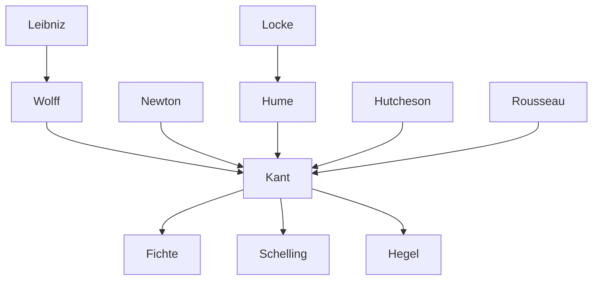

---
cssclasses:
  - Philosophy
subclasses:
  - Epistemology
  - Metaphysics
  - 17th-18th-Century-Philosophy
aliases:
  - kant
  - criticism
  - critical philosophy
  - transcendental
  - precritical period
  - philosophy limit
  - critique reason
  - phenomenon noumenon
  - space time
  - dogmatism
  - finitude
  - pure intuition
contributions:
  - Conceptual
authors:
  - "[[Kant]]"
  - "[[Newton]]"
  - "[[Wolff]]"
  - "[[Hume]]"
  - "[[Leibniz]]"
  - "[[Locke]]"
reference: "[[04 The search for thought - Unit 7 Chapter 1.pdf]]"
---

#### Central Problem

Immanuel Kant (1724-1804) confronts the fundamental question of how to establish the legitimate scope and limits of human reason in the wake of the scientific revolution and the progressive crisis of traditional metaphysics. The central problem emerges from the tension between two competing philosophical traditions: rationalist dogmatism (represented by the Leibniz-Wolff school), which claimed that pure reason could attain metaphysical knowledge beyond experience, and British empiricism (Locke, Hume), which challenged such pretensions but risked collapsing into skepticism.

How can philosophy secure certain knowledge while acknowledging the limitations of human cognitive faculties? Can metaphysics become a genuine science, and if so, under what conditions? What are the boundaries within which human knowledge, morality, and aesthetic judgment can claim validity? These interconnected questions drive Kant's systematic inquiry, which seeks to establish the conditions of possibility for legitimate knowledge, ethical action, and aesthetic experience by examining reason's own structure and limitations.

The problem is not merely epistemological but concerns the entire scope of human existence: knowledge (what can I know?), morality (what ought I to do?), religion (what may I hope?), and ultimately anthropology (what is man?).

#### Main Thesis

Kant's philosophy, known as **criticism** (*Kritizismus*), makes critique the fundamental instrument of philosophy. "Criticize," in Kant's technical language, means to judge, distinguish, evaluate, and weigh—that is, to systematically interrogate the foundations of human experiences to clarify:

- Their **possibility** (the conditions enabling their existence)
- Their **validity** (their titles of legitimacy or illegitimacy)  
- Their **limits** (the boundaries of their validity)

The central and qualifying aspect of Kantian critique is the concept of **limit**. Criticism constitutes a "philosophy of limit" or, as Nicola Abbagnano termed it, a "hermeneutics of finitude"—an interpretation of existence aimed at establishing the "Pillars of Hercules of the human" and recognizing the finite, conditioned character of existential possibilities.

**Key Methodological Innovation:** Unlike empiricism, which merely describes cognitive mechanisms, and unlike dogmatic rationalism, which proceeds without preliminary self-examination, criticism seeks to establish the **conditions of possibility** and **limits of validity** for each domain of human experience. The fundamental principle is "to find in the limit of validity the validity of the limit" (Pietro Chiodi): the impossibility of transcending experiential limits becomes the very foundation of knowledge's validity within those limits.

**Precritical Development:** Kant's path to the transcendental standpoint evolved through distinct phases:
1. Early naturalistic studies influenced by Newtonian physics (1755: *Universal Natural History and Theory of the Heavens*)
2. Critical examination of metaphysics under empiricist influence (1762-1765)
3. The 1770 Inaugural Dissertation establishing the transcendental view of space and time for sensible knowledge
4. From 1781, extension of the critical standpoint to all human faculties

**The 1770 Dissertation's Key Distinctions:**
- **Sensible knowledge** (passive, receptive): apprehends things *as they appear* (phenomena)
- **Intellectual knowledge** (active, spontaneous): aims at things *as they are* (noumena)
- **Space and time** are not derived from sensation but are *pure intuitions*—subjective conditions necessary for coordinating all sensible data

#### Historical Context

Kant was born in 1724 in Königsberg, Prussia, into a modest family of Pietist artisans. His student Johann Gottfried Herder later described him as a teacher who "encouraged and gently compelled one to think for oneself; despotism was foreign to his spirit." Kant's existence was dedicated entirely to thought, marked by rigid habits (his afternoon walk was so punctual that Königsberg citizens reportedly set their clocks by it), few dramatic events, and intense intellectual labor.

The intellectual context was defined by two major developments: the **scientific revolution** (Newton's physics provided the model of legitimate knowledge through description of phenomena without metaphysical speculation) and the **progressive crisis of traditional metaphysics** (the impossibility of resolving disputes by pure reason alone). This situation affected ethics, traditionally derived from metaphysics, generating the need for an autonomous moral foundation.

Kant sympathized with the American War of Independence and the French Revolution, viewing both as realizations of political freedom. His political ideal, articulated in *Perpetual Peace* (1795), envisioned a republican constitution founded on freedom, independence, and equality.

The only notable biographical incident was his conflict with the Prussian government after publishing *Religion within the Limits of Reason Alone* (1794), which led to official censure. With Frederick William III's accession (1797), press freedom was restored, and Kant could vindicate intellectual liberty in *The Conflict of the Faculties* (1798).

Kant died in 1804, murmuring "Es ist gut" ("It is well"). His tombstone bears words from the *Critique of Practical Reason*: "The starry heavens above me and the moral law within me."

#### Philosophical Lineage

#### Key Thinkers

| Thinker | Dates | Movement | Main Work | Core Concept |
|---------|-------|----------|-----------|--------------|
| [[Kant]] | 1724-1804 | [[Criticism]] | *Critique of Pure Reason* | Transcendental philosophy, limits of reason |
| [[Wolff]] | 1679-1754 | [[Rationalism]] | *German Metaphysics* | Systematic dogmatic philosophy |
| [[Newton]] | 1643-1727 | [[Scientific Revolution]] | *Principia* | Mathematical physics, phenomenal description |
| [[Hume]] | 1711-1776 | [[Empiricism]] | *Treatise on Human Nature* | Skeptical critique of causality |
| [[Leibniz]] | 1646-1716 | [[Rationalism]] | *Monadology* | Monads, pre-established harmony |
| [[Hutcheson]] | 1694-1746 | [[Moral Sense Theory]] | *Inquiry into Beauty and Virtue* | Moral sentiment |

#### Key Concepts

| Concept | Definition | Related to |
|---------|------------|------------|
| Criticism (*Kritizismus*) | Philosophical method making critique the primary instrument, examining conditions of possibility, validity, and limits of human faculties | [[Kant]], [[Epistemology]] |
| Critique (*Kritik*) | Systematic examination of reason by reason itself to establish its legitimate scope and boundaries | [[Kant]], [[Enlightenment]] |
| Philosophy of Limit | The characterization of criticism as establishing the "Pillars of Hercules" of human possibilities in each experiential domain | [[Kant]], [[Epistemology]] |
| Transcendental | Pertaining to the a priori conditions of possibility for experience; not what we know but how knowledge is possible | [[Kant]], [[Metaphysics]] |
| Phenomenon | Thing as it appears to the subject in sensible knowledge; object of experience | [[Kant]], [[Epistemology]] |
| Noumenon | Thing as it is in itself, independent of sensible conditions; intelligible object | [[Kant]], [[Metaphysics]] |
| Pure Intuition | Space and time as subjective conditions for coordinating sensible data, prior to and independent of sensation | [[Kant]], [[Epistemology]] |
| Dogmatism | Procedure of pure reason without preliminary critique of its own powers | [[Wolff]], [[Rationalism]] |
| Sensible Knowledge | Knowledge through receptivity/passivity of the subject; apprehends phenomena | [[Kant]], [[Epistemology]] |
| Intellectual Knowledge | Knowledge through the subject's active faculty; aims at noumena | [[Kant]], [[Metaphysics]] |

#### Authors Comparison

| Theme | [[Kant]] | [[Wolff]] | [[Hume]] |
|-------|----------|-----------|----------|
| Method | Transcendental critique | Dogmatic-deductive system | Empirical-psychological analysis |
| Metaphysics | Possible only as critique of reason's limits | Science of necessary truths from pure reason | Impossible; skeptical rejection |
| Space and time | Pure intuitions, subjective forms | Objective relations derived from things | Ideas derived from impressions |
| Causality | Category of understanding valid within experience | Rational principle of sufficient reason | Habit-based expectation, not rational necessity |
| Moral foundation | A priori practical reason | Rational perfection | Moral sentiment, utility |
| Limits of knowledge | Central concern; defines validity | Not systematically addressed | Emphasized, leads to skepticism |

#### Influences & Connections

- **Predecessors:** [[Kant]] ← influenced by ← [[Newton]] (scientific method), [[Leibniz]]-[[Wolff]] (rationalist metaphysics), [[Hume]] (awakening from dogmatic slumber), [[Hutcheson]] (moral sentiment), [[Rousseau]] (moral autonomy)
- **Contemporaries:** [[Kant]] ↔ correspondence with ↔ [[Mendelssohn]], [[Lambert]]
- **Followers:** [[Kant]] → influenced → [[Fichte]], [[Schelling]], [[Hegel]] (German Idealism), [[Neo-Kantianism]]
- **Opposing views:** [[Kant]] ← criticized by ← [[Hamann]] (faith against reason), [[Jacobi]] (nihilism charge)

#### Summary Formulas

- **[[Kant]]:** Philosophy must establish the conditions of possibility and limits of validity for human knowledge, morality, and aesthetic judgment through reason's self-critique; the limit of validity becomes the validity of the limit.

- **[[Wolff]]:** Metaphysics proceeds dogmatically from rational principles to demonstrate necessary truths about God, world, and soul through pure reason alone.

- **[[Hume]]:** All knowledge derives from experience; metaphysical claims beyond experience are unfounded; causality is merely habitual expectation, not rational necessity.

#### Timeline

| Year | Event |
|------|-------|
| 1724 | [[Kant]] born in Königsberg |
| 1740 | Enrolls at University of Königsberg |
| 1755 | *Universal Natural History and Theory of the Heavens*; begins university teaching |
| 1762-1765 | Precritical writings on metaphysics; turn toward English empiricism |
| 1770 | Appointed Professor of Logic and Metaphysics; Inaugural Dissertation on sensible and intelligible worlds |
| 1781 | *Critique of Pure Reason* (first edition) |
| 1783 | *Prolegomena to Any Future Metaphysics* |
| 1785 | *Groundwork of the Metaphysics of Morals* |
| 1787 | *Critique of Pure Reason* (second edition) |
| 1788 | *Critique of Practical Reason* |
| 1790 | *Critique of Judgment* |
| 1793 | *Religion within the Limits of Reason Alone*; condemned by Prussian government |
| 1795 | *Perpetual Peace* |
| 1797 | *Metaphysics of Morals* |
| 1804 | [[Kant]] dies in Königsberg |

#### Notable Quotes

> "The starry heavens above me and the moral law within me." — [[Kant]]

> "The year '69 brought me a great light." — [[Kant]]

> "Metaphysics is the science of the limits of human reason; for it, as for a small country, it matters more to know well and maintain one's possessions than to blindly seek conquests." — [[Kant]]

#### See Also

- [[Critique of Pure Reason]]
- [[Transcendental Philosophy]]
- [[German Idealism]]
- [[Empiricism]]
- [[Rationalism]]
- [[Enlightenment]]
- [[Epistemology]]
- [[Metaphysics]]
- [[Scientific Revolution]]
- [[Moral Philosophy]]

> [!NOTE]
> *This summary has been created to present the key points from the source text, which was automatically extracted using LLM. Please note that the summary may contain errors. It serves as an essential starting point for study and reference purposes.*
