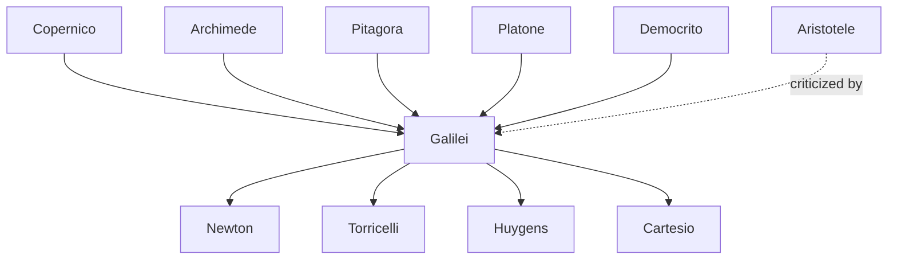

---
cssclasses:
  - Philosophy
  - History
subclasses:
  - Philosophy-of-Science
  - 17th-18th-Century-Philosophy
  - Epistemology
aliases:
  - galileo galilei
  - scientific method
  - experimental science
  - copernicanism
  - heliocentrism
  - principle of
  - falling bodies
  - telescope astronomy
  - science faith
  - book of
  - sensate experiences
  - necessary demonstrations
  - galilean relativity
  - objective properties
  - subjective qualities
contributions:
  - Conceptual
authors:
  - "[[Galilei]]"
  - "[[Copernico]]"
  - "[[Bellarmino]]"
  - "[[Aristotele]]"
  - "[[Newton]]"
  - "[[Keplero]]"
reference: "[[03 The search for thought - Unit 2 Chapter 2.pdf]]"
---

#### Central Problem

The chapter addresses multiple interconnected problems surrounding Galileo Galilei's work and its historical significance. The first fundamental question concerns the autonomy of science: how can the new scientific knowledge establish its independence from both religious authority (personified by the Church) and cultural authority (personified by Aristotelian scholastics)? This battle for scientific freedom was understood by Galilei as a historical necessity of primary importance, destined to influence the future of humanity itself.

The second problem concerns the relationship between science and faith: when scientific discoveries appear to contradict biblical statements, how should this conflict be resolved? The Counter-Reformation had established that all knowledge must harmonize with sacred scriptures as interpreted by the Catholic Church. Cardinal Bellarmino and most theologians held that denying any factual claims in Scripture, even those of a "scientific" character, would invalidate the truth of the Bible as a whole, since it was written under inspiration of the Holy Spirit.

The third problem is methodological: what is the proper procedure for investigating nature? This involves the relationship between observation and theory, between "sensate experiences" and "necessary demonstrations," and the role of mathematics in understanding the natural world.

#### Main Thesis

Galilei develops several interconnected theses that together constitute the foundation of modern scientific methodology:

**On Science and Faith:** Nature (the object of science) and the Bible (the basis of religion) both derive from God, and therefore cannot objectively contradict each other. Apparent conflicts must be resolved by reinterpreting Scripture, not by rejecting scientific findings. The Bible was written to accommodate the understanding of "rough and undisciplined peoples" using anthropomorphic language, while nature follows an inexorable and immutable course. Scripture teaches us "how to go to heaven, not how the heavens go." Science is arbiter in the field of natural truths, while the Bible is arbiter in the ethical-religious field.

**On Scientific Method:** The method of science consists of two fundamental moments: the "resolutive" or analytical moment (resolving complex phenomena into simple, quantitative, measurable elements and formulating mathematical hypotheses about governing laws), and the "compositive" or synthetic moment (verification through experiment, attempting to artificially reproduce phenomena to confirm or refute hypotheses). This combines "sensate experiences" (the observational-inductive moment) with "necessary demonstrations" (the rational, hypothetical-deductive moment). Neither induction nor deduction alone suffices; they are indissolubly conjoined.

**On the Structure of Science:** Nature is an objective, causally structured order of relations governed by laws. Science is experimental-mathematical knowledge that is intersubjectively valid. The scientist must seek efficient causes (how nature operates), not final causes (why nature operates as it does). Science deals with laws regulating facts, not with essences or "virtues."

#### Historical Context

Galileo Galilei (1564-1642) lived during a period of intense religious and political conflict. The Counter-Reformation, following the Council of Trent (1563), had established strict control over intellectual life, requiring all knowledge to conform to Catholic interpretation of Scripture. The execution of Giordano Bruno in 1600 demonstrated the dangers facing those who challenged established cosmological views.

Galilei's career spanned several institutions: he held mathematics chairs at Pisa (1589) and Padua (1592), made his revolutionary astronomical discoveries using the telescope (1609-1610), and published his findings in the Sidereus Nuncius (1610). His defense of Copernicanism led to the "admonition" of 1616 by Cardinal Bellarmino, forbidding him from teaching or defending heliocentric theory. Despite this warning, he published the Dialogue Concerning the Two Chief World Systems (1632), leading to his trial, abjuration, and house arrest (1633). During his final years at Arcetri, he wrote the Discourses and Mathematical Demonstrations Relating to Two New Sciences (1638), his scientific masterpiece on mechanics and dynamics.

The cultural landscape included hostile forces: official scholastic culture attached to Aristotelian physics, the Church defending scriptural literalism, and practitioners of occult sciences. Yet there were also favorable conditions: the alliance between technicians and scientists, urban-bourgeois civilization valuing practical knowledge, and the precedent of Renaissance naturalism.

#### Philosophical Lineage

#### Key Thinkers

| Thinker | Dates | Movement | Main Work | Core Concept |
|---------|-------|----------|-----------|--------------|
| [[Galilei]] | 1564-1642 | [[Scientific Revolution]] | *Dialogue Concerning the Two Chief World Systems* | Scientific method combining sensate experiences and necessary demonstrations |
| [[Copernico]] | 1473-1543 | [[Scientific Revolution]] | *De Revolutionibus* | Heliocentric cosmology |
| [[Bellarmino]] | 1542-1621 | [[Counter-Reformation]] | *Lettera al Foscarini* | Scriptural authority over scientific claims |
| [[Aristotele]] | 384-322 BCE | [[Peripatetic School]] | *Physics*, *On the Heavens* | Geocentric cosmology, natural vs. violent motion |
| [[Newton]] | 1643-1727 | [[Scientific Revolution]] | *Principia Mathematica* | Laws of motion, universal gravitation |
| [[Keplero]] | 1571-1630 | [[Scientific Revolution]] | *Astronomia Nova* | Laws of planetary motion |

#### Key Concepts

| Concept | Definition | Related to |
|---------|------------|------------|
| Sensate experiences | The observational-inductive moment of science, through which general laws are induced from careful observation of particular facts and cases | [[Galilei]], [[Scientific Method]] |
| Necessary demonstrations | Mathematical demonstrations forming the rational, hypothetical-deductive moment of science, through which hypotheses are formulated theoretically before experimental verification | [[Galilei]], [[Scientific Method]] |
| Principle of inertia | A body tends to conserve indefinitely its state of rest or uniform rectilinear motion until external forces intervene to modify that state | [[Galilei]], [[Newton]], [[Dynamics]] |
| Galilean relativity | It is impossible to determine, based on mechanical experiences performed within a "closed" system, whether that system is at rest or in uniform rectilinear motion | [[Galilei]], [[Einstein]] |
| Primary qualities | Objective properties inseparable from bodies: quantity, figure, magnitude, place, time, motion, rest, contact, distance, number | [[Galilei]], [[Locke]] |
| Secondary qualities | Subjective properties existing only in relation to our senses: tastes, odors, colors, sounds—mere names without the perceiving animal | [[Galilei]], [[Locke]] |
| Book of nature | The metaphor that philosophy/science is written in the great book of the universe, in mathematical language using triangles, circles, and geometric figures | [[Galilei]], [[Platonism]] |
| Cimento (Experiment) | The experimental verification through which phenomena are artificially reproduced under controlled conditions to confirm or refute hypotheses | [[Galilei]], [[Scientific Method]] |
| Abjuration | Formal retraction of beliefs under ecclesiastical pressure; Galilei's abjuration of Copernicanism occurred June 22, 1633 | [[Galilei]], [[Inquisition]] |
| Telescopic astronomy | Use of optical instruments to observe celestial phenomena, enabling discoveries of lunar mountains, Jupiter's moons, sunspots, and phases of Venus | [[Galilei]], [[Astronomical Revolution]] |

#### Authors Comparison

| Theme | [[Galilei]] | [[Aristotele]] | [[Bellarmino]] |
|-------|-------------|----------------|----------------|
| Motion | Principle of inertia; motion is natural state equal to rest | Rest is natural state; motion requires continuous force | Accepted Aristotelian physics |
| Cosmology | Heliocentric; Earth moves around Sun | Geocentric; Earth at center, immobile | Scripture supports geocentrism |
| Method | Experimental-mathematical; sensate experiences + necessary demonstrations | Syllogistic logic; observation of essences and final causes | Theological interpretation; authority of Scripture |
| Scripture and science | Bible teaches salvation, not natural science; reinterpret Scripture when conflicting | Natural philosophy confirms theological truths | Scripture true in all statements, scientific and moral |
| Nature of celestial bodies | Same nature as terrestrial; subject to change (sunspots, lunar mountains) | Perfect, incorruptible, unchanging; crystalline spheres | Accepted Aristotelian celestial physics |
| Role of mathematics | Language of nature; key to understanding physical reality | Useful but subordinate to qualitative natural philosophy | Acceptable for hypothetical calculations |

#### Influences & Connections

- **Predecessors:** [[Galilei]] ← influenced by ← [[Copernico]], [[Archimede]], [[Platone]], [[Pitagora]], [[Democrito]]
- **Contemporaries:** [[Galilei]] ↔ dialogue with ↔ [[Keplero]], [[Bellarmino]] ← opposed by ← [[Galilei]]
- **Followers:** [[Galilei]] → influenced → [[Newton]], [[Torricelli]], [[Huygens]], [[Cartesio]]
- **Opposing views:** [[Galilei]] ← criticized by ← Aristotelians, Jesuits (Scheiner, Grassi), Dominican preachers (Lorini, Caccini)

#### Summary Formulas

- **[[Galilei]]:** Science must be independent of both religious and cultural authority; nature and Scripture derive from the same God but speak different languages—nature in mathematics, Scripture in popular imagery—and conflicts are resolved by reinterpreting Scripture, not rejecting science.

- **[[Galilei]] on method:** The scientific method combines "sensate experiences" (observational-inductive moment) with "necessary demonstrations" (hypothetical-deductive moment), neither sufficient alone, together enabling the discovery and verification of natural laws.

- **[[Galilei]] on nature:** The book of nature is written in mathematical language; only quantitative, primary qualities (figure, number, motion) belong to bodies themselves, while qualitative, secondary properties (color, taste, smell) exist only in the perceiving subject.

#### Timeline

| Year | Event |
|------|-------|
| 1564 | [[Galilei]] born in Pisa |
| 1583 | Discovers isochronism of pendulum oscillations |
| 1589 | Appointed to mathematics chair at Pisa; discovers law of falling bodies |
| 1592 | Appointed to mathematics chair at Padua |
| 1609 | Constructs improved telescope |
| 1610 | Publishes *Sidereus Nuncius* announcing astronomical discoveries |
| 1613 | Letter to Castelli on relations between science and Scripture |
| 1616 | Admonished by Cardinal [[Bellarmino]]; *De Revolutionibus* placed on Index |
| 1623 | Publishes *Il Saggiatore* (The Assayer) |
| 1632 | Publishes *Dialogue Concerning the Two Chief World Systems*; immediately placed on Index |
| 1633 | Tried by Inquisition; abjures Copernicanism; condemned to house arrest |
| 1638 | Publishes *Discourses and Mathematical Demonstrations Relating to Two New Sciences* |
| 1642 | [[Galilei]] dies at Arcetri |

#### Notable Quotes

> "Philosophy is written in this grand book, the universe, which stands continually open to our gaze. But the book cannot be understood unless one first learns to comprehend the language and read the characters in which it is written. It is written in the language of mathematics, and its characters are triangles, circles, and other geometric figures." — [[Galilei]]

> "I hold that the sun is located at the center of the revolutions of the heavenly orbs and does not change place, and that the earth rotates on itself and moves around it... The Bible was written to accommodate the understanding of rough and undisciplined peoples... It teaches us how to go to heaven, not how the heavens go." — [[Galilei]]

> "In questions of science, the authority of a thousand is not worth the humble reasoning of a single individual." — [[Galilei]]

#### See Also

- [[Scientific Revolution]]
- [[Copernicanism]]
- [[Heliocentric Theory]]
- [[Scientific Method]]
- [[Principle of Inertia]]
- [[Dynamics]]
- [[Galilean Relativity]]
- [[Primary and Secondary Qualities]]
- [[Science and Religion]]
- [[Counter-Reformation]]
- [[Inquisition]]
- [[Empiricism]]

> [!NOTE]
> *This summary has been created to present the key points from the source text, which was automatically extracted using LLM. Please note that the summary may contain errors. It serves as an essential starting point for study and reference purposes.*
