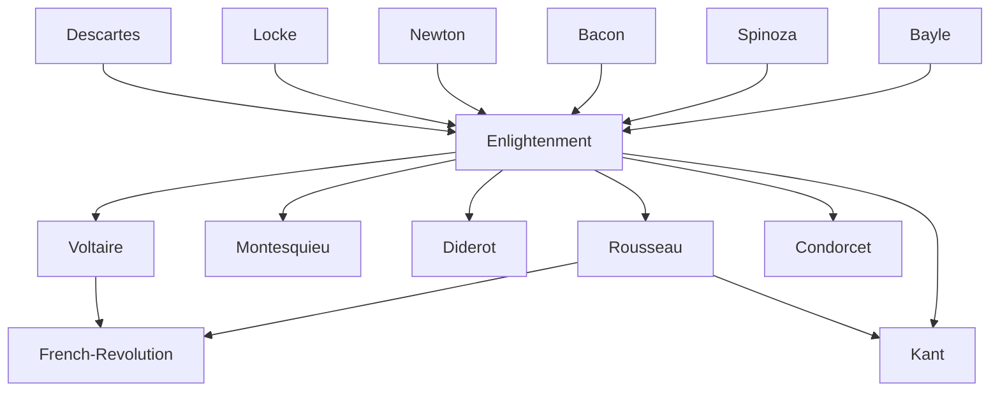

---
cssclasses:
  - Philosophy
  - Political-Science
subclasses:
  - 17th-18th-Century-Philosophy
  - Social-and-Political-Philosophy
  - Epistemology
related:
  - "[[French Revolution]]"
  - "[[Encyclopedia]]"
  - "[[Deism]]"
  - "[[Natural Rights]]"
  - "[[Liberalism]]"
  - "[[Tolerance]]"
  - "[[Scientific Revolution]]"
  - "[[Progress]]"
  - "[[Social Contract Theory]]"
  - "[[Physiocracy]]"
  - "[[Romanticism]]"
aliases:
  - age reason
  - sapere aude
  - natural rights
  - public happiness
  - despotism enlightened
reference:
  - "[Abbagnano, N., & Fornero, G. (2012). La ricerca del pensiero. Vol. 2B. Dall'Illuminismo a Hegel. Paravia.](https://archive.org/download/ssp-s04-e02/The%20search%20for%20thought%20-%20Unit%206%20Chapter%202.pdf)"
tags:
  - Podcast
---

#### Podcast

<iframe src="https://archive.org/embed/ssp-s04-e02" width="100%" height="30" frameborder="0" webkitallowfullscreen="true" mozallowfullscreen="true" allowfullscreen></iframe>

---

#### Central Problem

The Enlightenment confronts the fundamental question of human emancipation: How can humanity escape from its self-imposed "minority" (Unmündigkeit) and achieve genuine progress through the autonomous and public use of reason? This cultural movement, which developed in the eighteenth century across major European countries, represents one of the most significant intellectual turning points in Western modernity.

The central challenge lies in the recognition that humans, despite possessing the precious gift of intellect, have historically failed to employ it properly, remaining in a state of immaturity that has left them prey to irrational forces: tradition, authority, political power, religious dogma, and metaphysical systems. As [[Kant]] famously articulated in his 1784 essay "What is Enlightenment?": "Enlightenment is man's emergence from his self-incurred minority. Minority is the inability to use one's own understanding without the guidance of another."

The problem thus becomes: How can reason be used freely and publicly to achieve genuine improvement in human life? This requires not merely celebrating rational powers in the abstract, but deploying reason critically against all those forces — prejudices, myths, superstitions, inherited authorities — that have obstructed human flourishing. The deeper problem concerns whether such rational critique can be extended from the natural sciences to the domains of religion, politics, and morality, and whether this extension can lead to genuine social reform and the "public happiness" of humankind.

#### Main Thesis

The Enlightenment's fundamental thesis is that the free, public, and critical use of reason can and must be extended to all domains of human life — religion, politics, history, morality, and society — for the purpose of achieving concrete improvements in human existence. The rallying cry is Horace's "Sapere aude!" (Dare to know!) — have the courage to use your own intelligence without external guidance.

**The New Role of the Intellectual:** The Enlightenment transforms the figure of the philosopher from a detached metaphysician into a socially engaged intellectual, one who fights to make the world more habitable and who feels useful to civil society. Philosophy must serve humanity by bringing reason to bear on all aspects of existence.

**Critique of Authority and Tradition:** Everything must be submitted to the "tribunal of reason" — tradition, authority, religious dogma, political power, metaphysical systems. The validity of beliefs cannot be established by their antiquity alone; the "patent of age" is not a guarantee of truth.

**Science as Model:** The scientific method, particularly Newtonian physics, provides the paradigm for genuine knowledge. The Enlightenment represents the true "philosophy" of the scientific revolution, recognizing both the anti-metaphysical implications and the social importance of scientific progress.

**Reason Within Experience:** Unlike Cartesian rationalism, Enlightenment reason is limited to experience (following [[Locke]] and [[Newton]]). It rejects both innate ideas and metaphysical speculation beyond the empirical. However, unlike pure empiricism, it maintains confidence in reason's power to reform society.

**Deism vs. Atheism:** Two major currents emerge regarding religion. Deism (the predominant view) distinguishes between a rational core of natural religion (God as cosmic "clockmaker") and the superstitious accretions of positive religions. Atheism (Meslier, d'Holbach) sees religion as inherently pathological, rooted in fear and political manipulation.

**Philosophy of History:** The Enlightenment inaugurates a secularized view of history, replacing providentialist schemes with a conception of history as humanity's own adventure — problematic, prone to error, but capable of progress through reason and science.

**Political Reform:** The proclamation of natural rights (happiness, equality, liberty, tolerance, property) becomes an "idea-force" capable of transforming society. The goal is "public happiness" achieved through rational reform of institutions.

#### Historical Context

The Enlightenment emerged in the eighteenth century as the theoretical expression and intellectual weapon of the ascending bourgeoisie, the class that since the sixteenth century had been economically expanding and politically rising. The movement can be seen as the philosophical counterpart to this social revolution against feudal institutions and the Church's dominance.

The Enlightenment inherited and radicalized the Renaissance program of human dignity and worldly values, while also building upon the Scientific Revolution (Galileo, [[Newton]]) and the philosophical achievements of both rationalism (Descartes) and empiricism (Locke). Unlike the Renaissance, however, the Enlightenment pursued a more thorough secularization: God, while not typically declared non-existent, was relegated to a sphere having little to do with human affairs (deism).

The French Enlightenment, in particular, emerged as political philosophy became possible after the crisis of Louis XIV's absolutism. The pressing of forces opposed to royal absolutism, especially the bourgeoisie, generated an intense debate that would first provide the theoretical platform for "enlightened despotism" and later constitute the ideological preparation for the French Revolution.

The movement culminated in the Encyclopedia project (1751-1772), edited by Diderot and d'Alembert, which attempted to systematize all human knowledge according to Enlightenment principles — a monumental testimony to the belief in reason's power to organize and advance human civilization.

#### Philosophical Lineage

#### Key Thinkers

| Thinker | Dates | Movement | Main Work | Core Concept |
|---------|-------|----------|-----------|--------------|
| [[Voltaire]] | 1694-1778 | [[Deism]] | *Philosophical Dictionary* | Tolerance, critique of fanaticism |
| [[Montesquieu]] | 1689-1755 | [[Liberalism]] | *The Spirit of the Laws* | Separation of powers |
| [[Diderot]] | 1713-1784 | [[Encyclopedism]] | *Encyclopedia* | Systematic knowledge, materialism |
| [[Rousseau]] | 1712-1778 | [[Social Contract Theory]] | *The Social Contract* | Popular sovereignty, general will |
| [[Condorcet]] | 1743-1794 | [[Progressivism]] | *Sketch for a Historical Picture* | Indefinite progress |
| [[d'Holbach]] | 1723-1789 | [[Materialism]] | *System of Nature* | Atheism, naturalistic ethics |
| [[Kant]] | 1724-1804 | [[Critical Philosophy]] | *Critique of Pure Reason* | Limits of reason, perpetual peace |

#### Key Concepts

| Concept | Definition | Related to |
|---------|------------|------------|
| Sapere aude | "Dare to know!" — the courage to use one's own understanding without guidance | [[Kant]], [[Enlightenment]] |
| Deism | Belief in God as cosmic "clockmaker" who does not intervene in worldly affairs | [[Voltaire]], [[Natural Religion]] |
| Natural rights | Innate human rights (happiness, equality, liberty, property) serving as criteria for criticizing positive law | [[Locke]], [[Enlightenment]] |
| Tolerance | Acceptance of diversity and pluralism of beliefs as method of civilized coexistence | [[Voltaire]], [[Locke]] |
| Enlightened despotism | Reform from above by philosopher-kings guided by rational principles | [[Physiocrats]], [[Quesnay]] |
| Public happiness | The ultimate political goal — collective well-being achieved through rational reform | [[Diderot]], [[Encyclopedists]] |
| Spirit of system | The rejected method of building speculative metaphysical systems detached from experience | [[Condillac]], [[Anti-Cartesianism]] |
| Natural religion | The rational core of religious belief stripped of positive/historical accretions | [[Deism]], [[Voltaire]] |
| Progress | The historical advance of civilization through science, reason, and reform | [[Condorcet]], [[Enlightenment]] |
| Cosmopolitanism | Ideal of human brotherhood transcending national boundaries | [[Kant]], [[Voltaire]] |

#### Authors Comparison

| Theme | [[Voltaire]] | [[Rousseau]] | [[d'Holbach]] |
|-------|--------------|--------------|---------------|
| Religious position | Deist | Deist (Savoyard Vicar) | Atheist |
| View of progress | Optimistic (with reservations) | Ambivalent/critical | Optimistic |
| Political model | Enlightened monarchy | Popular sovereignty | Liberal reform |
| Property | Defended | Criticized | Defended |
| View of people | "Canaille" to be educated | Source of sovereignty | Citizens as property owners |
| Method of reform | Gradual enlightenment | Social contract | Rational critique |
| Origin of evil | Ignorance, superstition | Society, inequality | Religion, fear |

#### Influences & Connections

- **Predecessors:** [[Enlightenment]] ← influenced by ← [[Descartes]] (autonomous reason), [[Locke]] (empiricism, tolerance, rights), [[Newton]] (scientific method)
- **Predecessors:** [[Enlightenment]] ← influenced by ← [[Bacon]] (knowledge as power), [[Spinoza]] (biblical criticism), [[Bayle]] (skeptical method)
- **Contemporaries:** [[Voltaire]] ↔ dialogue with ↔ [[Diderot]], [[d'Alembert]], [[Rousseau]]
- **Followers:** [[Enlightenment]] → influenced → [[French Revolution]], [[American Revolution]], [[Liberalism]]
- **Followers:** [[Enlightenment]] → influenced → [[Kant]] (critical philosophy), [[Hegel]] (philosophy of history)
- **Opposing views:** [[Enlightenment]] ← criticized by ← [[Burke]] (conservatism), [[Romantics]] (nationalism), [[Counter-Enlightenment]]

#### Summary Formulas

- **[[Voltaire]]:** Crush the infamous thing (superstition and intolerance) through the free and critical use of reason, while preserving belief in a rational Deity and the importance of civil liberties.

- **[[Kant]]:** Enlightenment is humanity's emergence from self-incurred immaturity; dare to use your own understanding, for reason is finite and problematic but capable of moral progress.

- **[[Diderot]]:** Knowledge must be systematized and disseminated for human benefit; the Encyclopedia represents reason's capacity to organize all domains of experience.

- **[[Condorcet]]:** Human history demonstrates an indefinite progress of the human mind toward greater knowledge, freedom, and equality.

- **[[d'Holbach]]:** Religion is a pathological phenomenon rooted in fear; atheism is compatible with — indeed necessary for — a rational morality and just society.

#### Timeline

| Year | Event |
|------|-------|
| 1637 | [[Descartes]] publishes *Discourse on Method*, founding rationalism |
| 1687 | [[Newton]] publishes *Principia Mathematica* |
| 1689 | [[Locke]] publishes *Letter Concerning Toleration* and *Two Treatises of Government* |
| 1690 | [[Locke]] publishes *Essay Concerning Human Understanding* |
| 1721 | [[Montesquieu]] publishes *Persian Letters* |
| 1733 | [[Voltaire]] publishes *Letters on the English* |
| 1748 | [[Montesquieu]] publishes *The Spirit of the Laws* |
| 1751 | First volume of the *Encyclopedia* appears |
| 1755 | Lisbon earthquake prompts [[Voltaire]]'s critique of optimism |
| 1762 | [[Rousseau]] publishes *The Social Contract* and *Emile* |
| 1770 | [[d'Holbach]] publishes *System of Nature* |
| 1784 | [[Kant]] publishes "What is Enlightenment?" |
| 1789 | French Revolution begins; Declaration of the Rights of Man |
| 1794 | [[Condorcet]] writes *Sketch for a Historical Picture of the Progress of the Human Mind* |

#### Notable Quotes

> "Enlightenment is man's emergence from his self-incurred minority. Minority is the inability to use one's own understanding without the guidance of another. Sapere aude! Have the courage to use your own understanding!" — [[Kant]]

> "There is only one morality, just as there is only one geometry." — [[Voltaire]]

> "The safety of property is the essential foundation of the economic order of society." — [[Quesnay]]

---
> [!warning]-
> This annotation was normalised using a large language model and may contain inaccuracies. These texts serve as preliminary study resources rather than exhaustive references.
