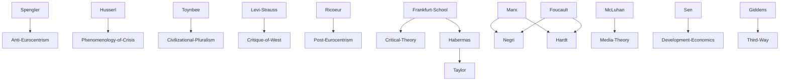

---
cssclasses:
  - Philosophy
  - Sociology
  - Political-Science
subclasses:
  - Social-and-Political-Philosophy
  - 20th-Century-Philosophy
  - Critical-Theory
aliases:
  - global village
  - mass media
  - cultural imperialism
  - empire theory
  - world system
  - media theory
  - anthropological decentering
contributions:
  - Conceptual
  - Empirical
authors:
  - "[[McLuhan]]"
  - "[[Taylor]]"
  - "[[Negri]]"
  - "[[Hardt]]"
  - "[[Giddens]]"
  - "[[Sen]]"
  - "[[Packard]]"
  - "[[Habermas]]"
reference: "Abbagnano, N., & Fornero, G. (2012). La ricerca del pensiero. Vol. 3C. Dalla crisi della modernità agli sviluppi più recenti. Paravia."
related:
  - "[[Mass Media]]"
  - "[[Capitalism]]"
  - "[[Postcolonialism]]"
  - "[[Multiculturalism]]"
  - "[[Eurocentrism]]"
  - "[[World System Theory]]"
  - "[[Digital Revolution]]"
  - "[[Cultural Studies]]"
  - "[[Development Economics]]"
  - "[[Cosmopolitanism]]"
---

#### Central Problem

The central problem addressed in this chapter is how philosophy should understand and evaluate the phenomenon of globalization—its nature, causes, consequences, and normative implications. Globalization represents a complex, multidimensional process involving the intensification of economic exchanges, the decline of state sovereignty, the planetary diffusion of communication technologies, and the spread of homogenized cultural models across the world. The philosophical challenge is to determine whether globalization represents an opportunity for human flourishing and democratic expansion, or whether it constitutes a new form of Western imperialism that threatens cultural diversity and exacerbates inequality.

The problem has several interconnected dimensions: How do mass media and communication technologies shape human consciousness and social relations? Can Western criteria of judgment adequately recognize and respect non-Western cultures, or does the very act of recognition impose Western categories? Is globalization merely an extension of capitalism and Western hegemony, or does it create genuine opportunities for previously marginalized peoples? How should philosophy respond to the collapse of Eurocentrism and the need for what some call an "anthropological decentering" of Western rationality?

#### Main Thesis

The chapter presents a spectrum of philosophical positions on globalization, ranging from critical rejection to cautious optimism, ultimately pointing toward the need for a "Copernican revolution" in Western rationality that acknowledges the limits of Eurocentrism while seeking genuine dialogue among civilizations.

**Media and Communication:** [[McLuhan]] argues that modern communication technologies create a "global village" where physical distance is overcome by instantaneous electronic connection. His thesis that "the medium is the message" emphasizes that technologies shape consciousness independently of their content, producing mechanization and homogenization of thought.

**The Problem of Recognition:** [[Taylor]] identifies a fundamental paradox in Western attempts to recognize other cultures: the very criteria we use for evaluation are products of "North Atlantic civilization," so our judgments inevitably force others into our categories. This constitutes a subtle but pervasive form of cultural imperialism. Taylor calls for "anthropological and ethical modesty" based on recognizing the limits of our perspective in the totality of human history.

**Empire as New Form of Power:** [[Negri]] and [[Hardt]] argue that globalization represents a completely new form of imperialism that cannot be reduced to "Americanization" or extension of any particular state's power. The "Empire" is deterritorialized, decentered, and pervasive—it administers hybrid identities through flexible hierarchies and network commands. This Empire exercises "biopower" over human nature itself, while human rights discourse serves as an ideological tool of domination.

**Globalization as Opportunity:** [[Giddens]] rejects the equation of globalization with Americanization, arguing that it provides genuine opportunities for developing countries to enter the global economic circuit. He points to "reverse colonialism" where non-Western countries influence the West (e.g., Hispanicization of Los Angeles, Brazilian TV programs sold to Portugal). While acknowledging risks, he maintains that protectionism would be the wrong response.

**Globalization Requiring Regulation:** [[Sen]] takes a balanced position: globalization has brought benefits but has also increased inequality between and within nations. The solution is neither to promote nor to obstruct globalization, but to regulate it through common global choices. Each culture must safeguard its specificity while cooperating for mutual advantage—democratizing the economy without requiring all countries to adopt the same political model.

**Anthropological Decentering:** The chapter concludes by calling for a definitive epistemological and practical-moral decentering of the Western worldview. This "Copernican revolution" requires abandoning Eurocentric historiography and value systems, recognizing that different civilizations have autonomous logics and temporalities that cannot be measured against Western standards.

#### Historical Context

The chapter traces the emergence of globalization discourse from the mid-20th century to the present. [[Packard]]'s *The Hidden Persuaders* (1957) drew attention to advertising's manipulation of the subconscious, highlighting how mass media create consensus and homogenize opinion across distances and social classes. [[McLuhan]]'s *The Gutenberg Galaxy* (1962) and *Understanding Media* (1964) analyzed how communication technologies—from print to television—transform consciousness independently of content.

The 1970s saw the planetary diffusion of media and the advent of personal computers (Intel 4004 microprocessor). In 1990, the US military-scientific computer network was opened to civilians, and in 1991 the World Wide Web was born, symbolizing the new communicative interconnection. The term "globalization" first appeared in the 1960s in *The Economist*, while French culture adopted "mondialisation."

The historical context also includes the collapse of Eurocentrism as a self-evident framework. [[Spengler]]'s *Decline of the West* questioned whether Western historical categories applied universally. [[Toynbee]] emphasized the plurality and incommunicability of civilizations. [[Lévi-Strauss]] accused the West of intellectual and practical "cannibalism." [[Ricoeur]] declared Eurocentrism dead in the 20th century. This deconstructive trend has intensified with attention to Asian and African history, which has disrupted traditional periodizations (ancient-medieval-modern) that assumed Western development as the norm.

#### Philosophical Lineage

#### Key Thinkers

| Thinker | Dates | Movement | Main Work | Core Concept |
|---------|-------|----------|-----------|--------------|
| [[Packard]] | 1914-1996 | [[Media Criticism]] | *The Hidden Persuaders* (1957) | Subconscious manipulation by advertising |
| [[McLuhan]] | 1911-1980 | [[Media Theory]] | *Understanding Media* (1964) | Global village, medium is the message |
| [[Taylor]] | 1931- | [[Communitarianism]] | *Multiculturalism* (1994) | Recognition, cultural imperialism problem |
| [[Negri]] | 1933- | [[Post-Marxism]] | *Empire* (2000) | Deterritorialized Empire, biopower |
| [[Hardt]] | 1960- | [[Post-Marxism]] | *Empire* (2000) | New form of imperialism |
| [[Giddens]] | 1938- | [[Third Way]] | *Runaway World* (1999) | Globalization as opportunity |
| [[Sen]] | 1933- | [[Development Economics]] | *Globalization and Its Discontents* | Regulated globalization, democratization |

#### Key Concepts

| Concept | Definition | Related to |
|---------|------------|------------|
| Global Village | World unified by electronic media where physical distance is overcome by instant communication, making messages universally accessible | [[McLuhan]], Mass media |
| Medium is the Message | Communication technologies shape consciousness independently of content, producing mechanization and homogenization | [[McLuhan]], Media theory |
| Globalization | Complex process involving economic intensification, decline of state sovereignty, technological diffusion, and cultural homogenization | Contemporary philosophy |
| Cultural Imperialism | Subtle domination through imposing Western categories of judgment even when attempting to recognize other cultures | [[Taylor]], Multiculturalism |
| Empire | New deterritorialized form of power that transcends states, administering hybrid identities through network commands | [[Negri]], [[Hardt]] |
| Biopower | Power over human nature itself, controlling cultural manifestations and social interactions in service of capital | [[Negri]], [[Hardt]], [[Foucault]] |
| Anthropological Decentering | Epistemological and moral displacement of Western worldview, enabling genuine dialogue among civilizations | Post-Eurocentrism |
| Reverse Colonialism | Influence of non-Western countries on Western development (e.g., Hispanicization of US) | [[Giddens]], Globalization |

#### Authors Comparison

| Theme | [[Taylor]] | [[Negri]]/[[Hardt]] | [[Giddens]] | [[Sen]] |
|-------|------------|---------------------|-------------|---------|
| Globalization assessment | Problematic | Negative (new Empire) | Positive opportunity | Mixed, requires regulation |
| Main concern | Cultural imperialism | Biopower, capital | Opportunity for development | Inequality distribution |
| Western role | Subtle dominator | Empire's instrument | Transforming alongside others | Must cooperate |
| Solution proposed | Anthropological modesty | Multitude resistance | Embrace transformation | Democratic regulation |
| View of capitalism | Culturally imperialist | Structural domination | Transformable | Needs democratic control |
| Optimism level | Cautiously pessimistic | Critical-revolutionary | Optimistic | Cautiously optimistic |

#### Influences & Connections

- **Predecessors:** [[McLuhan]] ← influenced by ← [[Innis]], [[Negri]] ← influenced by ← [[Marx]], [[Foucault]], [[Deleuze]]
- **Contemporaries:** [[Taylor]] ↔ dialogue with ↔ [[Habermas]], [[Sen]] ↔ debate with ↔ development economists
- **Followers:** [[Negri]] → influenced → alter-globalization movement, [[McLuhan]] → influenced → digital humanities
- **Opposing views:** [[Giddens]] ← criticized by ← anti-globalization movements, [[Negri]] ← criticized by ← liberal economists

#### Summary Formulas

- **[[McLuhan]]:** Electronic media create a global village where the medium itself—not its content—shapes consciousness, producing pervasive homogenization.
- **[[Taylor]]:** Western attempts to recognize other cultures paradoxically impose Western categories, requiring anthropological modesty to avoid subtle cultural imperialism.
- **[[Negri]]/[[Hardt]]:** Globalization constitutes a new deterritorialized Empire exercising biopower over human nature itself, using human rights discourse as ideological cover.
- **[[Giddens]]:** Globalization offers opportunities for developing countries and "reverse colonialism," requiring institutional adaptation rather than protectionist resistance.
- **[[Sen]]:** Globalization is irreversible and brings both benefits and increased inequality; it must be regulated through common global choices respecting cultural specificity.

#### Timeline

| Year | Event |
|------|-------|
| 1957 | [[Packard]] publishes *The Hidden Persuaders* |
| 1962 | [[McLuhan]] publishes *The Gutenberg Galaxy* |
| 1964 | [[McLuhan]] publishes *Understanding Media*, coins "global village" |
| 1971 | Intel 4004 microprocessor enables personal computers |
| 1990 | US computer network opened to public |
| 1991 | World Wide Web created |
| 1994 | [[Taylor]] publishes *Multiculturalism and the Politics of Recognition* |
| 1998 | [[Sen]] receives Nobel Prize in Economics |
| 1999 | [[Giddens]] publishes *Runaway World* |
| 2000 | [[Negri]] and [[Hardt]] publish *Empire* |

#### Notable Quotes

> "The medium is the message." — [[McLuhan]]

> "Our politics of difference, by implicitly invoking our criteria as the measure of all civilizations and cultures, can end up making everyone the same." — [[Taylor]]

> "Empire emerges at the twilight of European sovereignty. Unlike imperialism, Empire establishes no center of power and does not rely on fixed borders or barriers. It is a decentered and deterritorializing apparatus of rule." — [[Negri]]

---
> [!NOTE]
> *This summary has been created to present the key points from the source text, which was automatically extracted using LLM. Please note that the summary may contain errors. It serves as an essential starting point for study and reference purposes.*
