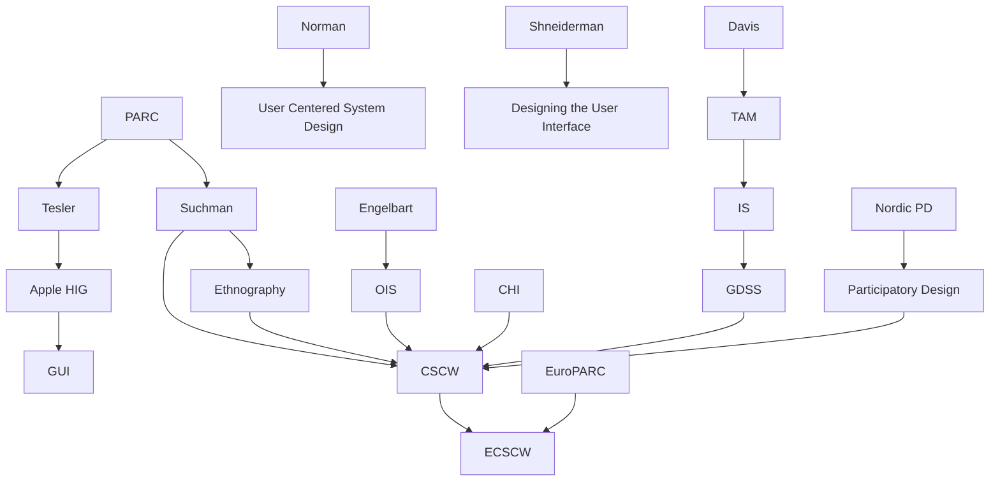

---

cssclasses:
  - Computer-Science
  - History
  - Sociology
subclasses:
  - Human-Computer-Interaction
  - CSCW
  - Information-Retrieval
related:
  - "[[Managing Vacuum Tubes & Transistors, New Vistas (1945–1965) (1 of 7)]]"
  - "[[HCI Prior to Personal Computing (1965–1980) (2 of 7)]]"
  - "[[Discretionary Use Comes into Focus (1980–1985) (3 of 7)]]"
  - "[[Graphical User Interfaces Succeed (1985–1995) (4 of 7)]]"
  - "[[Internet Era Arrives and Survives a Bubble (1995–2005) (5 of 7)]]"
  - "[[Scaling (2005-2015) (6 of 7)]]"
  - "[[Cultures and Bridges & A New Era (7 of 7)]]"
aliases:
  - graphical interfaces
  - gui success
  - macintosh recovery
  - desktop publishing
  - cscw emergence
  - participatory design
  - ethnographic methods
  - group support
  - technology acceptance
  - collaboration technology
  - discretionary users
  - library transformation
reference:
  - "Grudin, J. (2017). From tool to partner: the evolution of human-computer interaction. Morgan & Claypool Publishers. (pp. 55-67)"
tags:
  - Podcast
---

#### Podcast

<iframe allow="autoplay *; encrypted-media *; fullscreen *; clipboard-write" frameborder="0" height="150" style="width:100%;overflow:hidden;border-radius:10px;background:transparent;" sandbox="allow-forms allow-popups allow-same-origin allow-scripts allow-storage-access-by-user-activation allow-top-navigation-by-user-activation" src="https://embed.podcasts.apple.com/us/podcast/from-tool-to-partner-the-evolution-of-human/id1786764068?i=1000683538203&uo=4&l=en-GB&theme=auto"></iframe>

---

#### Central Problem

This section of Grudin's historical account addresses the period 1985–1995, when the graphical user interface finally achieved commercial success and fundamentally transformed human-computer interaction research. The central problem concerns how this "disruptive revolution" affected different HCI communities differently, depending on their relationship to discretionary versus nondiscretionary use contexts.

The GUI's success created methodological challenges: rigorous experimental approaches suited to command-line and form-based interfaces could not scale to design spaces encompassing color, sound, animation, icons, menus, windows, and diverse input devices. The shift from seeking optimal solutions through formal experimentation to finding satisfactory solutions through quicker assessment methods—promoted by [[Nielsen]]—marked a controversial transformation in CHI research culture.

Simultaneously, local area networking and the internet's maturation produced a second transformation: computer-mediated communication and information sharing. The emergence of Computer Supported Cooperative Work (CSCW) brought new tensions between European organizational perspectives and North American small-group focus, between IS researchers and CHI reviewers, and between ethnographic thick description and experimental social psychology. How these communities negotiated—and sometimes failed to negotiate—their differences reveals fundamental tensions about what HCI research should be and who it should serve.

#### Main Thesis

Grudin argues that the 1985–1995 decade saw GUI success transform CHI from psychology-dominated to computer-science-driven research, while simultaneously catalyzing CSCW as a distinct field that brought together—and ultimately divided—researchers from OIS, IS group decision support, and CHI communities focused on collaboration.

The thesis develops across several institutional trajectories:

**CHI's computer science turn:** As GUIs expanded the design space beyond psychological frameworks, software engineering expertise became essential. Psychology gave way to computer science; rigorous experimentation yielded to quicker assessment methods; topics like "user interface management systems" displaced text editing and programming psychology. The 1986–1988 publication burst (Norman/Draper, Baecker/Buxton, Helander, Norman's *POET*, Shneiderman's textbook, Greif's CSCW reader, Suchman's *Plans and Situated Actions*) created enduring shared understanding.

**HF&E's continued nondiscretionary focus:** Government remained the largest computing customer. Human factors addressed military, aviation, telecommunications, census, tax, air traffic control—contexts where technology was assigned and training provided. Smith and Mosier's 944 guidelines (1986) recognized GUIs would make such comprehensive specification impossible, shifting toward specifying interface styles and processes rather than features.

**IS's extension and TAM:** Davis's Technology Acceptance Model (1989) became the most-cited HCI work in IS literature. Its focus on *perceived* usability versus CHI's focus on *demonstrated* usability reflects the difference between mandatory organizational contexts (where useful systems might be rejected) and discretionary consumer markets (where users simply abandon unusable tools).

**CSCW's emergence and fractures:** The 1986 banner attracted OIS, IS, CHI, distributed AI, and anthropology researchers. By 1995, IS had largely departed after paper rejections, organizational behaviorists remained in home disciplines, but ethnographers—marginalized in traditional anthropology—found welcome. EuroPARC bridged Silicon Valley entrepreneurship and government-sponsored European research.

#### Historical Context

The Macintosh's commercial trajectory frames this period. Despite the celebrated 1984 Super Bowl ad, the Mac was failing by mid-1985—Steve Jobs was forced out. The "Fat Mac" (4× RAM) enabled serious applications: PageMaker, PostScript, LaserWriter, Excel, Word. The Mac Plus (January 1986) accelerated recovery. Apple dominated desktop publishing and CHI conferences until Jobs's 1997 return. Larry Tesler's group refined GUI concepts; the 1987 Apple Human Interface Guidelines sought common look-and-feel across developers.

The "look and feel" litigation era began: Lotus v. Borland (1987), Apple v. Microsoft/HP (1988), Xerox v. Apple (1989). Gates's reply to Jobs's accusation of theft—"we both had this rich neighbor named Xerox and I broke into his house to steal the TV set and found out that you had already stolen it"—captured the contested origins of GUI conventions.

The AI summer of the 1980s ended with DARPA's Strategic Computing Initiative failure (1993): no Autonomous Land Vehicle, no Pilot's Associate, no Battle Management system. NSF's Interactive Systems Program channeled funding toward speech/language processing despite meager commercial results. An NSF program manager's proudest accomplishment was "doubling the already ample funding for natural language understanding."

Library schools faced existential crisis: 15 American library schools closed 1978–1995. Survivors added "Information" to names. Technology disrupted faster than institutions could adapt; young information scientists, "eyes fixed on a future in which past lessons might not apply," were reluctant to absorb indexing, classifying, and accessing expertise.

#### Philosophical Lineage

#### Key Thinkers

| Thinker | Dates | Movement | Main Work | Core Concept |
|---------|-------|----------|-----------|--------------|
| [[Norman]] | 1935– | [[Cognitive Engineering]] | *Psychology of Everyday Things* (1988) | User-centered design, affordances |
| [[Suchman]] | 1951– | [[Ethnomethodology]] | *Plans and Situated Actions* (1987) | Situated action, workplace studies |
| [[Shneiderman]] | 1947– | [[Human-Computer Interaction]] | *Designing the User Interface* (1986) | Direct manipulation, guidelines |
| [[Nielsen]] | 1957– | [[Usability Engineering]] | Discount usability methods (1989) | Heuristic evaluation, rapid assessment |
| [[Davis]] | – | [[Information Systems]] | Technology Acceptance Model (1989) | Perceived usefulness, perceived usability |
| [[Tesler]] | 1945–2020 | [[Interface Design]] | Apple Human Interface Guidelines (1987) | Cut/copy/paste, modeless design |
| [[Greif]] | – | [[CSCW]] | *Computer-Supported Cooperative Work* (1988) | Groupware, collaboration support |

#### Key Concepts

| Concept | Definition | Related to |
|---------|------------|------------|
| Graphical User Interface (GUI) | Visual interface using icons, windows, menus replacing command-line interaction | [[Xerox PARC]], [[Apple]], [[Microsoft]] |
| Discount usability | Rapid, less rigorous assessment methods replacing formal experimentation | [[Nielsen]], [[Usability Engineering]] |
| Technology Acceptance Model (TAM) | Framework explaining adoption through perceived usefulness and perceived usability | [[Davis]], [[Information Systems]] |
| CSCW | Computer Supported Cooperative Work—field studying technology for collaboration | [[Suchman]], [[Greif]], [[Engelbart]] |
| Participatory design | User involvement in system design, originating in Nordic union movements | [[Scandinavian Design]], [[Empowerment]] |
| Ethnography | Anthropological method studying technology use in workplace contexts | [[Suchman]], [[Xerox PARC]] |
| Look and feel | Distinctive visual and interactive characteristics of software, subject of litigation | [[Apple]], [[GUI]], [[Intellectual Property]] |
| Group Decision Support System (GDSS) | Technology supporting managerial meetings: brainstorming, voting, organization | [[Information Systems]], [[CSCW]] |
| Media Richness Theory | Hypothesis that adding video improves decision-making in unclear situations | [[Daft]], [[Lengel]], [[Videoconferencing]] |
| iSchools | Information schools evolved from library science, adding technology focus | [[Library Science]], [[Information Science]] |

#### Authors Comparison

| Theme | [[Grudin]] | [[Suchman]] | [[Davis]] |
|-------|-----------|-------------|-----------|
| Central concern | Historical sociology of HCI fields | Situated practice vs. AI planning | Organizational technology adoption |
| Methodology | Archival, interview-based history | Ethnomethodology, video analysis | Survey-based, quantitative |
| View of users | Discretionary vs. nondiscretionary distinction | Competent actors in situated contexts | Potential adopters/resisters |
| Design approach | Documents multiple traditions | Participatory, ethnographic | Managerial, perception-focused |
| On AI | Cyclical hype/failure pattern | Fundamental critique of planning models | Not primary focus |
| Field affiliations | CHI historian | CSCW, anthropology | Information Systems |

#### Influences & Connections

- **Predecessors:** [[Tesler]] ← brought from ← [[Xerox PARC]] to Apple; [[Suchman]] ← influenced by ← [[Garfinkel]], ethnomethodology
- **Contemporaries:** [[Norman]] ↔ collaborated with ↔ [[Draper]]; [[Suchman]] ↔ EuroPARC ↔ European CSCW
- **Institutional formations:** [[CSCW]] ← emerged from ← [[OIS]], [[GDSS]], [[CHI]]; [[ECSCW]] ← split from ← [[CSCW]]
- **Opposing views:** [[IS]] ← paper rejections from ← [[CSCW]]; CHI ← distanced from ← [[Human Factors]]
- **Technology transfers:** [[Desktop publishing]] ← enabled by ← [[PageMaker]], [[PostScript]], [[LaserWriter]]

#### Summary Formulas

- **[[Grudin]]:** The 1985–1995 decade transformed CHI from psychology to computer science orientation as GUIs succeeded, while CSCW emerged to address collaboration but fractured along European/North American and IS/CHI methodological lines.

- **[[Suchman]]:** Plans are resources for action, not determinants of it; ethnographic studies of situated workplace practice reveal how people actually accomplish coordination, critiquing AI planning assumptions.

- **[[Davis]] (TAM):** Technology adoption depends on perceived usefulness and perceived ease of use; unlike CHI's demonstrated usability, organizational contexts require understanding why useful systems may be rejected.

- **[[Nielsen]]:** Discount usability methods—heuristic evaluation, rapid prototyping—enable practitioners to identify problems quickly without formal experimentation, controversial among researchers seeking statistical significance.

#### Timeline

| Year | Event |
|------|-------|
| 1985 | Mac failing; Jobs forced out; Fat Mac released; Participatory Design conference Aarhus; Greif's CSCW reader |
| 1986 | Mac Plus; CSCW banner emerges; SIGOA becomes SIGOIS; Smith-Mosier 944 guidelines; Daft-Lengel Media Richness; Shneiderman textbook |
| 1987 | Apple Human Interface Guidelines; Lotus v. Borland; Suchman *Plans and Situated Actions*; EuroPARC founded |
| 1988 | Apple v. Microsoft/HP; Norman *POET*; Helander *Handbook*; Greif *CSCW* book; CSCW'88 conference |
| 1989 | Xerox v. Apple; Davis TAM; Nielsen discount methods; ECSCW begins |
| 1990 | Windows 3.0 succeeds; GDSS products marketed; Grudin "Computer Reaches Out" |
| 1991 | TOOIS becomes TOIS; terminology shifts away from "office" |
| 1992 | *CSCW: An International Journal* (European editors); Groupware conference series |
| 1993 | DARPA Strategic Computing Initiative ends; "productivity paradox" identified |
| 1994 | TOCHI launched; HBR discovers usability ("still in its infancy") |
| 1995 | 15 library schools closed since 1978; Cronin depicts LIS "deep professional malaise" |

#### Notable Quotes

> "There will never be a mouse at the Ford Motor Company." — High-level acquisition manager, 1985

> "Well, Steve, I think there's more like we both had this rich neighbor named Xerox and I broke into his house to steal the TV set and found out that you had already stolen it." — [[Gates]]

> "It is too early to tell how GUIs would fare... we would not be surprised if experts are slower with Direct manipulation systems than with command language systems." — [[Hutchins]] et al.

---
> [!warning]-
> This annotation was normalised using a large language model and may contain inaccuracies. These texts serve as preliminary study resources rather than exhaustive references.
