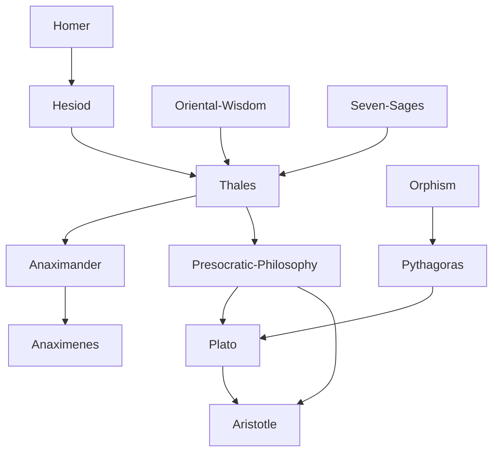

---
cssclasses:
  - Philosophy
  - History
subclasses:
  - Ancient-Greek-and-Roman-Philosophy
  - Metaphysics
  - Epistemology
related:
  - "[[Presocratic Philosophy]]"
  - "[[Ancient Greek Philosophy]]"
  - "[[Milesian School]]"
  - "[[Pythagoreanism]]"
  - "[[Orphism]]"
  - "[[Greek Polis]]"
  - "[[Myth and Logos]]"
  - "[[Oriental Philosophy]]"
  - "[[Seven Sages]]"
  - "[[Greek Democracy]]"
aliases:
  - greek philosophy
  - birth philosophy
  - orientalism debate
  - greek rationality
  - myth logos
  - seven sages
reference:
  - "Abbagnano, N., & Fornero, G. (2012). La ricerca del pensiero. Vol. 1A. Dalle origini ad Aristotele. Paravia."
---

#### Central Problem

The central problem addressed in this text concerns the origins of Western philosophy and science: did philosophy arise as an original creation of the Greek "genius," or was it derived from earlier Oriental civilizations? This question, known as the Orientalist-Occidentalist debate, touches on fundamental issues about the nature of philosophical inquiry itself—what distinguishes genuinely philosophical thinking from religious, mythical, or merely practical wisdom?

The Orientalists argue that before or contemporaneous with Greek philosophy, great philosophical-religious traditions already existed in the Far East (Hinduism, Buddhism, Taoism, Confucianism), and that pre-Greek civilizations possessed significant scientific knowledge in medicine, astronomy, and mathematics. They point to commercial and cultural exchanges between Greece and the Orient as evidence of intellectual transmission.

The Occidentalists counter that while Greeks may have received empirical knowledge from other peoples, they transformed this material into something qualitatively different—a free, rational, critical inquiry that recognized no sacred authority and was accessible to all free citizens. The question thus becomes: what specific conditions in Greek civilization made possible the emergence of philosophy as "free rational investigation"?

#### Main Thesis

The text defends a nuanced Occidentalist position: while acknowledging Greek indebtedness to Oriental learning in specific sciences, it argues that philosophy and theoretical science—as distinct from religious wisdom and practical technique—are genuinely original Greek creations.

**The distinctiveness of Greek philosophy** lies in several characteristics:

1. **Rational autonomy:** Greek philosophy emerged as free inquiry independent of religious tradition, priestly authority, or sacred texts. Unlike Oriental wisdom, which was the privileged possession of sacerdotal castes and anchored to immutable sacred traditions, Greek philosophy recognized reason as its sole guide.

2. **Universal accessibility:** Philosophy was potentially open to all "reasonable" human beings (i.e., free citizens), based on the premise that humans are "rational animals" capable of autonomous truth-seeking.

3. **Theoretical orientation:** While Egyptians and Babylonians developed sciences for practical purposes (measuring land, predicting omens), Greeks cultivated knowledge for its own sake, seeking to understand the "why" (the causes) of phenomena rather than merely recording them.

4. **Critical stance:** Philosophy's characteristic opponent was received opinion, tradition, and religion—it sought rational justification rather than authoritative pronouncement.

**Historical conditions** facilitating philosophy's emergence included: the absence of powerful priestly castes; the development of the polis with its democratic institutions; commercial dynamism creating a mobile, "open" society; and the practice of public debate that cultivated critical, rational argumentation.

#### Historical Context

Philosophy emerged in the Greek world between the 7th and 6th centuries BCE, first in the Ionian colonies of Asia Minor (Miletus, Ephesus) before flourishing in mainland Greece, particularly Athens after the Persian Wars.

The political context was decisive: unlike the authoritarian, centralized monarchies of the ancient Near East with their powerful priestly castes, Greek civilization developed a distinctive form of political organization—the polis (city-state). These small, independent communities evolved from aristocratic oligarchies toward democratic forms of government, especially in Athens during the 5th century BCE.

Key factors in this evolution included:
- The rise of a commercial plutocratic class whose wealth derived from trade rather than land
- The struggle between this new class and the old landed aristocracy
- The development of isonomia (equality before the law) and public deliberation

The Ionian colonies were particularly favorable to philosophy because they combined commercial dynamism, cultural openness (contact with Oriental peoples), and free political institutions before the mainland. Sparta, by contrast—militaristic and rigidly conservative—produced no philosophers.

The cultural background included: Homeric and Hesiodic poetry, which had already articulated concepts of cosmic justice (Díke) and universal law; the mystery religions (especially Orphism), which introduced ideas about the soul's immortality and purification; and the practical wisdom of the Seven Sages with their moral maxims emphasizing self-knowledge and moderation.

#### Philosophical Lineage

#### Key Thinkers

| Thinker | Dates | Movement | Main Work | Core Concept |
|---------|-------|----------|-----------|--------------|
| [[Hesiod]] | 8th-7th c. BCE | [[Greek Mythology]] | *Theogony* | Cosmic origins from Chaos |
| [[Thales]] | c. 624-546 BCE | [[Presocratic Philosophy]] | — | Water as first principle |
| [[Pythagoras]] | c. 570-495 BCE | [[Pythagoreanism]] | — | Number, soul transmigration |
| [[Plato]] | 428-348 BCE | [[Platonism]] | *Republic*, *Phaedo* | Theory of Forms |
| [[Aristotle]] | 384-322 BCE | [[Aristotelianism]] | *Metaphysics* | Being qua being |

#### Key Concepts

| Concept | Definition | Related to |
|---------|------------|------------|
| Pólis | The Greek city-state; a self-governing political community of free citizens that provided the social conditions for philosophy | [[Ancient Greek Philosophy]], [[Political Philosophy]] |
| Lógos | Reason, discourse, rational account; the faculty distinguishing Greek philosophy from mythical and religious thought | [[Presocratic Philosophy]], [[Epistemology]] |
| Mýthos | Traditional narrative explaining origins and nature of things through divine personifications; the "other" against which philosophy defined itself | [[Greek Mythology]], [[Hesiod]] |
| Díke | Justice; the universal law governing both cosmic and human order, personified as daughter of Zeus | [[Hesiod]], [[Greek Ethics]] |
| Hýbris | Excess, transgression of proper limits; the violation of cosmic-moral order punished by divine justice | [[Greek Ethics]], [[Tragedy]] |
| Isonomía | Equality before the law; the democratic principle that emerged from struggles between social classes in the polis | [[Greek Democracy]], [[Political Philosophy]] |
| Theōría | Contemplation, disinterested observation; the specifically Greek attitude toward knowledge as an end in itself | [[Aristotle]], [[Epistemology]] |
| Orphism | Mystery religion teaching soul's immortality, transmigration, and need for purification; influenced Pythagoras and [[Plato]] | [[Pythagoras]], [[Plato]] |
| Cosmology | Inquiry into the origins and structure of the universe; the first form taken by Greek philosophical speculation | [[Presocratic Philosophy]], [[Metaphysics]] |
| Arché | First principle, origin; what the earliest philosophers sought as the fundamental element underlying all things | [[Thales]], [[Presocratic Philosophy]] |

#### Authors Comparison

| Theme | [[Orientalists]] | [[Occidentalists]] |
|-------|------------------|-------------------|
| Origin of philosophy | Derived from Oriental wisdom | Original Greek creation |
| Oriental knowledge | Genuine philosophy and science | Religious/practical, not philosophical |
| Greek achievement | Transmission and synthesis | Qualitative transformation |
| Nature of Greek thought | Continuation of Oriental trends | Radical break: free rational inquiry |
| Role of religion | Similar in East and West | Greek thought liberated from priestly control |
| Scientific character | Present in both cultures | Theoretical orientation unique to Greeks |

#### Influences & Connections

- **Predecessors:** [[Thales]] ← influenced by ← [[Egyptian Mathematics]], [[Babylonian Astronomy]], [[Seven Sages]]
- **Predecessors:** [[Greek Philosophy]] ← cultural background ← [[Homer]], [[Hesiod]], [[Orphism]]
- **Contemporaries:** [[Thales]] ↔ dialogue with ↔ [[Anaximander]], [[Anaximenes]]
- **Followers:** [[Presocratic Philosophy]] → influenced → [[Plato]], [[Aristotle]]
- **Opposing views:** [[Orientalists]] ← criticized by ← [[Occidentalists]]

#### Summary Formulas

- **[[Aristotle]]:** "All men by nature desire to know"—philosophy is the distinctively human activity of rational inquiry into causes, accessible to all rational beings.
- **[[Orientalists]]:** Greek philosophy derived from and was indebted to the more ancient wisdom traditions of Egypt, Mesopotamia, and the Far East.
- **[[Occidentalists]]:** Philosophy as free, critical, rational inquiry is an original Greek creation, made possible by the unique social and political conditions of the polis.
- **[[Hesiod]]:** Cosmic order originates from Chaos through the generative power of Eros—the mythical precursor to philosophical cosmology.

#### Timeline

| Year | Event |
|------|-------|
| c. 1300-1200 BCE | Earliest parts of Indian Rig Veda composed |
| 8th-7th c. BCE | [[Hesiod]] composes *Theogony* |
| c. 700 BCE | [[Homer]]'s epics establish Greek cultural foundations |
| 7th c. BCE | [[Zarathustra]] in Persia; Lao-Tze in China |
| c. 624 BCE | Birth of [[Thales]], first philosopher |
| c. 600 BCE | Pherecydes of Syros develops cosmological speculation |
| 6th c. BCE | Mystery religions (Orphism) spread in Greece |
| 6th c. BCE | [[Pythagoras]] founds philosophical-religious community |
| 5th c. BCE | Athenian democracy reaches its height |
| 338 BCE | Greece incorporated into Macedonian kingdom |

#### Notable Quotes

> "All men by nature desire to know." — [[Aristotle]]

> "The most difficult thing of all is to grasp the invisible measure of wisdom, which alone contains within itself the limits of all things." — [[Solon]]

> "First of all was Chaos, then broad-bosomed Earth [...] and Love, who excels among the immortal gods." — [[Hesiod]]

---
> [!warning]-
> This annotation was normalised using a large language model and may contain inaccuracies. These texts serve as preliminary study resources rather than exhaustive references.
