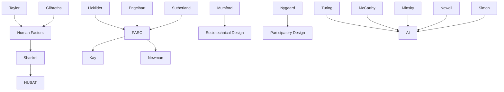

---

cssclasses:
  - Computer-Science
  - History
subclasses:
  - Human-Computer-Interaction
  - Design-History
  - Artificial-Intelligence
related:
  - "[[Managing Vacuum Tubes & Transistors, New Vistas (1945–1965) (1 of 7)]]"
  - "[[HCI Prior to Personal Computing (1965–1980) (2 of 7)]]"
  - "[[Discretionary Use Comes into Focus (1980–1985) (3 of 7)]]"
  - "[[Graphical User Interfaces Succeed (1985–1995) (4 of 7)]]"
  - "[[Internet Era Arrives and Survives a Bubble (1995–2005) (5 of 7)]]"
  - "[[Scaling (2005-2015) (6 of 7)]]"
  - "[[Cultures and Bridges & A New Era (7 of 7)]]"
aliases:
  - hci history
  - personal computing
  - mainframe era
  - minicomputer era
  - ai winter
  - computer graphics
  - management information
  - sociotechnical design
  - hardware generations
  - xerox parc
reference:
  - "Grudin, J. (2017). From tool to partner: the evolution of human-computer interaction. Morgan & Claypool Publishers. (pp. 25-40)"
tags:
  - Podcast
---

#### Podcast

<iframe allow="autoplay *; encrypted-media *; fullscreen *; clipboard-write" frameborder="0" height="150" style="width:100%;overflow:hidden;border-radius:10px;background:transparent;" sandbox="allow-forms allow-popups allow-same-origin allow-scripts allow-storage-access-by-user-activation allow-top-navigation-by-user-activation" src="https://embed.podcasts.apple.com/us/podcast/from-tool-to-partner-the-evolution-of-human/id1786764068?i=1000683538203&uo=4&l=en-GB&theme=auto"></iframe>

---

#### Central Problem

How did the pre-personal computing era (1965–1980) shape the distinct trajectories of Human-Computer Interaction, and why did fields that seemed logically related—AI and HCI—develop such different relationships to actual users? Grudin traces the emergence of multiple HCI-related disciplines in this period, each tied to different computing platforms, user populations, and institutional contexts.

The central tension lies between visionary predictions of intelligent machines that would render user interface concerns trivial, and the practical reality of expensive, limited computers requiring careful attention to human factors. While AI researchers promised machines would achieve human-level intelligence "within a decade," HCI researchers focused on the mundane but essential work of making existing systems usable. This divergence had lasting consequences: funds and talented students gravitated toward AI, while HCI remained underfunded and undervalued.

#### Main Thesis

Grudin advances several interconnected arguments about HCI's development in the pre-personal computing era:

**1. Three Distinct HCI Research Streams:** The three computing roles—operation, management, and programming—each generated distinct research traditions. Human factors and ergonomics (HF&E) focused on operators and data entry personnel, addressing efficiency, error reduction, and physical workspace design. Management Information Systems (MIS) addressed managers who "used" computers through printed reports without direct interaction, emphasizing cognitive styles and organizational dynamics. Software psychology studied programmer behavior, with over 1,000 papers published in the 1960s-70s on programming performance variables.

**2. Hardware Generations Determine Research Fields:** Every decade brought a new platform two orders of magnitude smaller and an order of magnitude less expensive, yet more capable. Mainframes (1964) filled rooms; minicomputers (1971) filled cabinets; microcomputers (1980) sat on desks. Each platform was "delivered by companies that did not build the previous platform." Research fields rose and fell with platforms: MIS reached its apogee with mainframes; CHI dominated with PCs. The insight that "the resource competition of that era is difficult to imagine today" explains why advanced work concentrated in a few centers.

**3. The AI-HCI Divergence:** AI and HCI are "logically closely related"—intelligent machines should interact with people—yet AI did not transform HCI. Hyperbolic predictions ("within 20 years, machines will do any work that a man can do") attracted funding and students, leaving HCI undervalued. The pattern of "AI winters" following failed predictions recurred: optimism in the late 1960s, ARPA cuts in 1975, the British Lighthill report in 1973. Ironically, HCI thrived during AI downturns: Sutherland's Sketchpad consumed TX-2 cycles when Lincoln Lab allowed it during AI's first disappointment.

**4. The Xerox PARC Divergence:** Two research centers founded in 1970—HUSAT at Loughborough and Xerox PARC—took different paths. HUSAT focused on ergonomics "anchored in the tradition of nondiscretionary use." PARC focused on computing "anchored in visions of discretionary use." PARC researchers, influenced by cognitive psychology, extended human factors to higher-level mental processes. HUSAT, influenced by sociotechnical design, extended human factors to organizational factors. Computer graphics researchers at PARC faced a choice: high-end graphics or "more primitive features that could run on widely affordable machines." Those who chose interaction—Newman, Baecker, Foley—became HCI pioneers.

**5. Sociotechnical and Participatory Approaches:** Enid Mumford and others developed sociotechnical approaches to system design in response to user difficulties and resistance, involving representative workers in design to increase acceptance. Kristin Nygaard's cooperative design from Scandinavian trade unions focused on "empowering future hands-on users." Sophisticated views of social dynamics around system adoption emerged from Rob Kling and Lynne Markus.

#### Historical Context

Business computing took off with mainframes in the late 1960s. IBM System/360 (1965) established computing in the business realm. The high cost of hardware generated intense interest in efficiency—a hallmark of human factors since Taylor and the Gilbreths. Brian Shackel founded HUSAT in 1970; James Martin's *Design of Man-Computer Dialogues* (1973) was the first widely-read HCI book.

AI burst onto the scene with extravagant promises. Minsky in 1970 predicted "a machine with the general intelligence of an average human being" in "three to eight years." The Cuban missile crisis of 1962 and Cold War anxieties made machine saviors appealing; competition with the USSR (their chess machine defeated Stanford/MIT's in 1968) drove funding. ARPA sponsored extensive AI research, but disappointment with progress led to funding cuts in 1975. The British Lighthill report (1973) cut government AI funding in the UK.

Information science evolved from documentalism. The term dates to 1960; by 1968, ADI became ASIS. Library schools added "information" to their titles throughout the 1970s. Pittsburgh's information science Ph.D. (1970) declared humans "the central factor in the development of an understanding of information phenomena."

The geographic shift westward began in the 1960s. Evans and Sutherland's Utah students—Kay, Newman, Lampson—went to California, founding key companies. Engelbart at SRI and Xerox PARC attracted graphics researchers. When microcomputers arrived, Bay Area hobbyists were ready.

#### Philosophical Lineage

#### Key Thinkers

| Thinker | Dates | Movement | Main Work | Core Concept |
|---------|-------|----------|-----------|--------------|
| [[Shackel]] | 1927-2007 | [[Human Factors]] | HUSAT (1970) | Computer ergonomics |
| [[Martin]] | 1933-2013 | [[Information Systems]] | *Design of Man-Computer Dialogues* (1973) | Operator-centered design |
| [[Minsky]] | 1927-2016 | [[Artificial Intelligence]] | MIT AI Lab | Strong AI predictions |
| [[Negroponte]] | 1943- | [[Media Studies]] | Architecture Machine Group | Intelligent environments |
| [[Mumford]] | 1924-2006 | [[Sociotechnical Design]] | ETHICS methodology | Worker participation |
| [[Nygaard]] | 1926-2002 | [[Participatory Design]] | Scandinavian approach | User empowerment |

#### Key Concepts

| Concept | Definition | Related to |
|---------|------------|------------|
| AI winter | Period of reduced funding and interest following failed predictions about artificial intelligence | [[AI]], [[Funding]] |
| Nondiscretionary use | Computer use required by job role; users have no choice whether to use system | [[Human Factors]], [[HCI]] |
| Discretionary use | Computer use chosen by user; system must attract and retain users voluntarily | [[HCI]], [[PARC]] |
| Hardware platform | Generation of computing hardware with characteristic size, cost, and capability | [[Computing History]], [[HCI]] |
| Sociotechnical design | Approach involving workers in system design to address social and organizational factors | [[Mumford]], [[Design]] |
| Participatory design | Design approach empowering future hands-on users through involvement in development | [[Nygaard]], [[Scandinavian]] |
| Cognitive styles | Individual differences in how people perceive and process information; MIS research focus | [[MIS]], [[Psychology]] |
| Software psychology | Study of programmer behavior and factors affecting programming performance | [[Weinberg]], [[Shneiderman]] |
| Information science | Discipline combining behavioral science and technical grounding for information management | [[Library Science]], [[Computing]] |
| Christensen's dilemma | Pattern where new platforms are delivered by companies that did not build previous platform | [[Innovation]], [[Markets]] |

#### Authors Comparison

| Theme | [[Grudin]] | [[Minsky]] | [[Licklider]] |
|-------|-----------|-----------|---------------|
| AI timeline | Skeptical; documents failed predictions | Optimistic; "3-8 years" to human-level AI | Uncertain; "10 to 500 years" |
| HCI value | Central to computing's future | Trivial; ultra-intelligence will solve it | Important until AI arrives |
| Human role | Users as partners; diverse needs | Users replaced by intelligent machines | Symbiosis between human and machine |
| Funding priorities | Critiques AI's dominance | Sought maximum AI funding | Funded both AI and HCI |
| Research approach | Historical, empirical | Theoretical, mathematical | Visionary, pragmatic |

#### Influences & Connections

- **Predecessors:** HF&E ← influenced by ← [[Taylor]], [[Gilbreths]] (scientific management)
- **Contemporaries:** [[Mumford]] ↔ sociotechnical with ↔ [[Nygaard]] (participatory design)
- **Institutional shifts:** MIT Lincoln Lab → BBN → ARPA → Xerox PARC → Silicon Valley
- **Followers:** PARC → influenced → Apple Macintosh, Microsoft Windows
- **Opposing views:** [[Minsky]], [[McCarthy]] (AI) ← tension with ← HCI research priorities

#### Summary Formulas

- **[[Grudin]] on platforms:** Every decade brought a new platform two orders of magnitude smaller, an order of magnitude less expensive, yet more capable; research fields rose and fell with these platforms.

- **[[Grudin]] on AI-HCI divergence:** Funds and good students gravitated to AI; an ultra-intelligent machine would clean up all user interfaces, so why focus on such trivialities?

- **[[Martin]] on transition:** "The terminal operator, instead of being a peripheral consideration, will become the tail that wags the whole dog… The computer industry will be forced to become increasingly concerned with the usage of people."

- **[[Licklider]] on graphics:** "Interactive computer graphics appears likely to be one of the main forces that will bring computers directly into the lives of very large numbers of people during the next two or three decades."

#### Timeline

| Year | Event |
|------|-------|
| 1964 | Control Data 6000 series; integrated circuits in mainframes |
| 1965 | IBM System/360; Utah computer science department founded |
| 1967 | *Management Science* initiates "Information Systems" column |
| 1968 | MIS center at University of Minnesota; ADI becomes ASIS |
| 1969 | *International Journal of Man-Machine Studies* begins; ARPANET debuts |
| 1970 | Xerox PARC founded; HUSAT founded; Pittsburgh IS Ph.D. program |
| 1971 | [[Weinberg]] publishes *The Psychology of Computer Programming*; large-scale integration |
| 1972 | Computer Systems Technical Group (CSTG) formed |
| 1973 | [[Martin]] publishes *Design of Man-Computer Dialogues*; Xerox Alto; Lighthill report |
| 1975 | ARPA cuts AI funding; "Human Factors in Interactive Graphics" paper |
| 1976 | UODIGS'76 workshop at SIGGRAPH |
| 1977 | *MIS Quarterly* launched |
| 1979 | Three Mile Island disaster |
| 1980 | [[Shneiderman]] publishes *Software Psychology*; VLSI circuits enable microcomputers |

#### Notable Quotes

> "The terminal or console operator, instead of being a peripheral consideration, will become the tail that wags the whole dog… The computer industry will be forced to become increasingly concerned with the usage of people, rather than with the computer's intestines." — [[Martin]]

> "In from three to eight years we will have a machine with the general intelligence of an average human being. I mean a machine that will be able to read Shakespeare, grease a car, play office politics, tell a joke, and have a fight." — [[Minsky]] (1970)

> "Interactive computer graphics appears likely to be one of the main forces that will bring computers directly into the lives of very large numbers of people during the next two or three decades." — [[Licklider]] (1976)

---
> [!warning]-
> This annotation was normalised using a large language model and may contain inaccuracies. These texts serve as preliminary study resources rather than exhaustive references.
