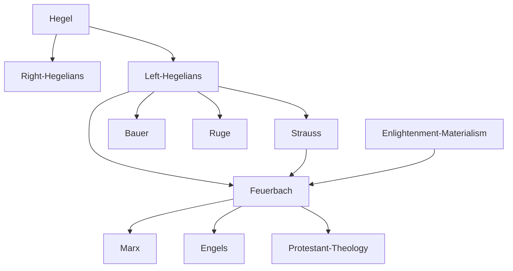

---
cssclasses:
  - Philosophy
subclasses:
  - 19th-Century-Philosophy
  - Philosophy-of-Religion
  - Metaphysics
aliases:
  - left hegelians
  - young hegelians
  - alienation religion
  - anthropological theology
  - projection theory
  - essence christianity
  - subject predicate
  - humanistic naturalism
  - religious critique
  - right hegelians
  - god projection
contributions:
  - Conceptual
authors:
  - "[[Feuerbach]]"
  - "[[Hegel]]"
  - "[[Strauss]]"
  - "[[Bauer]]"
  - "[[Ruge]]"
  - "[[Marx]]"
reference: "Abbagnano, N., & Fornero, G. (2012). La ricerca del pensiero. Vol. 3A. Da Schopenhauer a Freud. Paravia."
related:
  - "[[German Idealism]]"
  - "[[Left Hegelianism]]"
  - "[[Materialism]]"
  - "[[Alienation]]"
  - "[[Philosophy of Religion]]"
  - "[[Atheism]]"
  - "[[Marx]]"
  - "[[Historical Materialism]]"
  - "[[Essence of Christianity]]"
  - "[[Young Hegelians]]"
---

#### Central Problem

The chapter addresses the fundamental question of how to interpret [[Hegel]]'s philosophical legacy following his death in 1831, and more specifically, how to understand the relationship between religion and philosophy. The central tension lies in the ambiguity of [[Hegel]]'s system: his claim that religion and philosophy express the same content but in different forms (representation vs. concept) could be interpreted either conservatively (philosophy preserves religion) or revolutionarily (philosophy destroys religion).

This problem extends beyond theology into politics, given the close connection between throne and altar in 19th-century Germany. The split in the Hegelian school raised urgent questions: Does the identity of reason and reality justify the existing order, or does it demand its revolutionary transformation? Is the divine truly transcendent, or merely a projection of human qualities? And if the latter, what are the implications for human self-understanding and social organization?

The chapter focuses particularly on [[Feuerbach]]'s radical answer: that theology is nothing but "inverted" anthropology, and that religious alienation must be overcome through a new philosophy centered on concrete, sensuous human beings rather than abstract Spirit.

#### Main Thesis

[[Feuerbach]]'s central thesis involves a systematic reversal of the relationship between subject and predicate established by idealism and religion. His core argument runs as follows:

**The Inversion Method:** Idealism and religion share a fundamental error: they make the concrete (being, nature, humanity, the finite) into a predicate or attribute of the abstract (thought, Spirit, God, the infinite), when in reality the relationship is reversed. The true philosophical task is to "turn [[Hegel]] right-side up" — recognizing that thought derives from being, not being from thought.

**God as Human Projection:** God is nothing other than the illusory projection or fantastic objectification of human qualities — particularly reason, will, and love. The divine is simply the human in general, projected into a mythical beyond and worshiped as such. As [[Feuerbach]] states: "The mystery of theology is anthropology."

**The Sources of Religion:** [[Feuerbach]] identifies multiple origins for religious consciousness: (1) the distinction between individual limitation and species-consciousness of infinity; (2) the opposition between willing and being able, desire and attainment; (3) the feeling of dependence upon nature that led primitive humanity to worship natural forces.

**Religion as Alienation:** Religion constitutes a pathological state in which humans, splitting themselves, project outside themselves a superior power (God) to which they then submit. The more humans place in God, the more they subtract from themselves.

**Atheism as Moral Duty:** If religion is alienated self-consciousness, then atheism becomes both an act of philosophical honesty and a moral imperative — the reappropriation by humanity of its own projected essence.

**Naturalistic Humanism:** The new "philosophy of the future" takes the form of a naturalistic humanism: "humanism" because it makes humanity the object and purpose of philosophical discourse; "naturalistic" because it makes nature the primary reality on which everything depends, including humanity itself.

#### Historical Context

Following [[Hegel]]'s death in 1831, his numerous disciples continued to dominate German intellectual culture, but divisions soon emerged. In 1837, David [[Strauss]] designated these factions, borrowing terms from French parliamentary usage, as the "Right" and "Left" Hegelians (he also identified a "Center" around Rosenkranz).

The split was made possible by what Löwith called "the fundamental ambiguity of [[Hegel]]'s dialectical 'supersessions,' which could be interpreted in either a conservative or a revolutionary sense." The Right Hegelians (Göschel, Conradi, Gabler) insisted on the identity of content between religious representation and philosophical concept, using Hegelian reason to rationally justify religious beliefs — a kind of "Hegelian scholasticism." The Left Hegelians instead insisted on the inadequacy of representational form, making philosophy an instrument for the rational contestation of religion.

The political implications were equally significant. The Right, following [[Hegel]]'s polemic against the "ought," maintained the ontological identity of reality and reason, adopting a globally justificatory and conservative attitude toward the existing order. The Left interpreted Hegel dynamically and revolutionarily, conceiving philosophy as critique of the existing and a project for revolutionary transformation.

[[Feuerbach]] (1804-1872) studied under [[Hegel]] in [[Berlin]] but was barred from university teaching after publishing *Thoughts on Death and Immortality* (1830). His major works — *The Essence of Christianity* (1841) and *The Essence of Religion* (1845) — had enormous influence on the young [[Marx]] and [[Engels]], the latter describing its "liberating effect" as making them all "momentary Feuerbachians."

#### Philosophical Lineage

#### Key Thinkers

| Thinker | Dates | Movement | Main Work | Core Concept |
|---------|-------|----------|-----------|--------------|
| [[Feuerbach]] | 1804-1872 | [[Left Hegelianism]] | *The Essence of Christianity* | God as human projection |
| [[Strauss]] | 1808-1874 | [[Left Hegelianism]] | *Life of Jesus* | Religion as myth |
| [[Bauer]] | 1809-1882 | [[Left Hegelianism]] | *The Trumpet of the Last Judgment* | Pure criticism |
| [[Ruge]] | 1802-1880 | [[Left Hegelianism]] | *Philosophy of Right and Our Time* | Political critique |
| [[Hegel]] | 1770-1831 | [[German Idealism]] | *Phenomenology of Spirit* | Absolute Spirit |
| [[Marx]] | 1818-1883 | [[Historical Materialism]] | *Capital* | Material conditions |

#### Key Concepts

| Concept | Definition | Related to |
|---------|------------|------------|
| Reversal of predication | Method of inverting idealist subject-predicate relations; making concrete being the subject and abstract thought the predicate | [[Feuerbach]], critique of idealism |
| Alienation (Entfremdung) | Pathological state where humans project their essence outside themselves and submit to it as to a foreign power | [[Feuerbach]], [[Hegel]], [[Marx]] |
| God as projection | Theory that God is the objectification of human qualities (reason, will, love) in an imaginary transcendent being | [[Feuerbach]], anthropological theology |
| Inverted anthropology | Religion conceived as humanity's first, indirect self-knowledge, where human essence appears as divine | [[Feuerbach]], essence of religion |
| Species-consciousness | Human awareness of belonging to an infinite species, distinguished from limited individual existence | [[Feuerbach]], origin of religion |
| Naturalistic humanism | Philosophy making humanity its object and nature the primary reality from which all depends | [[Feuerbach]], philosophy of future |
| Masked theology | Critique of Hegelianism as rationalized theology that perpetuates religious alienation in speculative form | [[Feuerbach]], anti-Hegelianism |
| Myth (religious) | Metaphysical idea expressed in the form of an imaginary narrative; neither history nor philosophy | [[Strauss]], biblical criticism |
| Philanthropy | Love of humanity replacing love of God; the practical-ethical consequence of [[Feuerbach]]'s atheism | [[Feuerbach]], positive atheism |
| I-Thou relation | Essential social nature of human existence; the self requires the other for knowledge and being | [[Feuerbach]], philosophical communism |

#### Authors Comparison

| Theme | [[Feuerbach]] | [[Strauss]] | [[Bauer]] |
|-------|---------------|-------------|-----------|
| View of religion | Alienated anthropology | Religion as myth | Historical fiction |
| Method | Subject-predicate reversal | Historical-philological criticism | Pure criticism |
| Christ | Symbol of human species | Mythical figure | Non-historical |
| Philosophical goal | Naturalistic humanism | Demythologization | Intellectual aristocratism |
| Relation to [[Hegel]] | Masked theology | Partial application | From Right to Left |
| Political stance | Philanthropic humanism | Academic | Radical atheism |

#### Influences & Connections

- **Predecessors:** [[Feuerbach]] ← influenced by ← [[Hegel]], [[Enlightenment materialism]] (Diderot, d'Holbach, Helvétius)
- **Contemporaries:** [[Feuerbach]] ↔ dialogue with ↔ [[Strauss]], [[Bauer]], [[Ruge]]
- **Followers:** [[Feuerbach]] → influenced → [[Marx]], [[Engels]], Protestant theology of 20th century
- **Opposing views:** [[Feuerbach]] ← criticized by ← Right Hegelians, [[Marx]] (for remaining too abstract)

#### Summary Formulas

- **[[Feuerbach]]:** The mystery of theology is anthropology; God is humanity's essence projected outward, and atheism is the moral duty to reclaim that alienated essence.
- **[[Strauss]]:** The content of religious faith reduces to "myth" — metaphysical ideas expressed in imaginary narratives that are neither history nor philosophy.
- **[[Bauer]]:** Philosophy must be "pure criticism" opposing intellectual spirit to the masses, though this aristocratic stance led to isolation from concrete historical engagement.
- **[[Ruge]]:** The transition from religious to political critique reveals [[Hegel]]'s conservative absolutization of contemporary political reality.

#### Timeline

| Year | Event |
|------|-------|
| 1830 | [[Feuerbach]] publishes *Thoughts on Death and Immortality*, loses university career |
| 1831 | Death of [[Hegel]], beginning of school divisions |
| 1835 | [[Strauss]] publishes *Life of Jesus*, crystallizing Hegelian school split |
| 1837 | [[Strauss]] coins terms "Right" and "Left" Hegelians |
| 1838 | [[Ruge]] begins editing *Hallische Jahrbücher* |
| 1839 | [[Feuerbach]] publishes *Critique of Hegelian Philosophy* |
| 1841 | [[Feuerbach]] publishes *The Essence of Christianity*; [[Bauer]] publishes *The Trumpet of the Last Judgment* |
| 1842 | [[Bauer]] dismissed from university; [[Ruge]] publishes critique of [[Hegel]]'s political philosophy |
| 1843 | [[Feuerbach]] publishes *Provisional Theses for the Reform of Philosophy* |
| 1844 | [[Feuerbach]] publishes *Principles of the Philosophy of the Future*; [[Marx]] and [[Engels]] break with [[Bauer]] |
| 1845 | [[Feuerbach]] publishes *The Essence of Religion* |
| 1848-49 | [[Feuerbach]] lectures on religion at Heidelberg |

#### Notable Quotes

> "The mystery of theology is anthropology... All the qualifications of the divine being are qualifications of the human being." — [[Feuerbach]]

> "Religion is humanity's first, though indirect, self-consciousness. Man first places his essence outside himself before finding it within himself." — [[Feuerbach]]

> "The true relationship of thinking to being can only be this: being is subject, thinking is predicate. Thinking derives from being, not being from thinking." — [[Feuerbach]]

---
> [!NOTE]
> *This summary has been created to present the key points from the source text, which was automatically extracted using LLM. Please note that the summary may contain errors. It serves as an essential starting point for study and reference purposes.*
