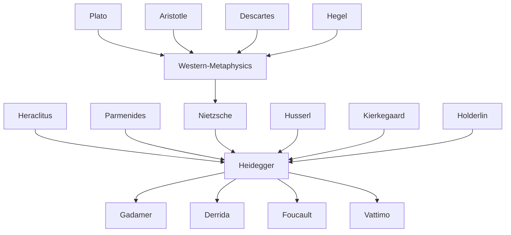

---
cssclasses:
  - Philosophy
subclasses:
  - 20th-Century-Philosophy
  - Continental-Philosophy
  - Hermeneutics
related:
  - "[[Being and Time]]"
  - "[[Phenomenology]]"
  - "[[Hermeneutics]]"
  - "[[Existentialism]]"
  - "[[Nihilism]]"
  - "[[Technology Philosophy]]"
  - "[[Gadamer]]"
  - "[[Derrida]]"
  - "[[Deconstruction]]"
  - "[[Post-Structuralism]]"
aliases:
  - second heidegger
  - being question
  - ontological difference
  - oblivion being
  - metaphysics critique
  - technology philosophy
  - truth essence
reference:
  - "[Abbagnano, N., & Fornero, G. (2012). La ricerca del pensiero. Vol. 3B. Dalla fenomenologia a Gadamer. Paravia.](https://archive.org/download/ssp-s06-e15/The%20search%20for%20thought%20-%20Unit%209%20Chapter%201.pdf)"
tags:
  - Podcast
---

#### Podcast

<iframe src="https://archive.org/embed/ssp-s06-e15" width="100%" height="30" frameborder="0" webkitallowfullscreen="true" mozallowfullscreen="true" allowfullscreen></iframe>

---

#### Central Problem

The second [[Heidegger]] confronts the fundamental question that remained unresolved in *Being and Time*: how can we think being itself, rather than merely thinking about beings? The earlier work had attempted to approach being through an analysis of human existence (Dasein), but [[Heidegger]] came to recognize that this path remained trapped within metaphysical thinking that inevitably confuses being with beings.

The central difficulty lies in the very language of metaphysics, which has always spoken of beings rather than being itself. The entire Western philosophical tradition, from [[Plato]] to [[Nietzsche]], has been characterized by what [[Heidegger]] calls the "oblivion of being" (Seinsvergessenheit) — a forgetting not just of being, but of the forgetting itself. Philosophy has consistently asked about beings (what is this or that entity?) while failing to ask about being as such (what is the meaning of being itself?).

This represents not merely an intellectual oversight but the fundamental characteristic of Western thought: metaphysics has been "onto-theo-logic" — ontology (concerned with being as being), theology (concerned with the supreme being), and logic (thinking being through reason) — but never genuine thinking about being in its difference from beings.

#### Main Thesis

The "Kehre" (turn or reversal) in [[Heidegger]]'s thought represents a fundamental shift from approaching being through existence to thinking from the perspective of being itself. This is not a change of problem but a change of approach: instead of ascending to being from human existence, Heidegger now attempts to think "man in relation to being" rather than "being in relation to man."

**The Ontological Difference:** Being is not a being, not even the supreme being, but that which "entifies" beings — that which lets beings be and makes them manifest. Being is the horizon, the "clearing" (Lichtung), within which beings become visible. The metaphysical tradition has consistently confused being with beings, thereby forgetting being itself.

**Being as Event (Ereignis):** Being is not a static presence or stable structure but a historical happening, an "event" that gives itself in different epochs and destiny-words. Being is inseparable from its history — from the various ways it manifests itself through time: Physis, Logos, Hen, Idea, Energeia, substance, objectivity, subjectivity, will to power, will to will.

**The Epochal Character of Being:** Being reveals itself while simultaneously concealing itself. Each revelation of being in beings is accompanied by a parallel concealment of being in itself. This accounts for the "epochal" nature of being — its self-manifestation through distinct historical epochs.

**The Co-belonging of Man and Being:** Man and being are coessential — man is never without being, and being never gives itself without man. Yet this relationship should not be understood through the metaphysical subject-object schema. Rather, through the concept of Ereignis (event/appropriation), man and being belong to each other in mutual appropriation.

**Metaphysics as Nihilism:** The history of metaphysics, from Anaximander to [[Nietzsche]], is the history of the oblivion of being. Metaphysics, as onto-theo-logic, has always been concerned with beings rather than being. This oblivion reaches its completion in [[Nietzsche]], who reduces being to will to power, and in technology, which is metaphysics realized.

#### Historical Context

Heidegger's "second" philosophy developed against the backdrop of some of the most turbulent decades of the twentieth century. In 1933, Heidegger became rector of Freiburg University and joined the Nazi party, a controversial episode that would haunt his reputation throughout his life and after. His rectoral address, "The Self-Assertion of the German University," called for the university to serve the destiny of the German people through the threefold service of labor, military defense, and knowledge.

After resigning the rectorship in 1934 (officially due to conflicts with Nazi authorities), Heidegger withdrew from political engagement and devoted himself to teaching and research. His lectures on [[Nietzsche]] (1936-1940) represent a critical engagement with Nazi appropriations of [[Nietzsche]]'s philosophy, presenting the thinker not as a prophet of the superman but as the culmination of Western metaphysics.

The post-war denazification process led to [[Heidegger]]'s suspension from teaching (1946-1951). During this period he suffered a psychological breakdown and underwent treatment. The 1947 "Letter on Humanism," addressed to Beaufret, publicly announced the turn in his thinking and distanced his philosophy from Sartrean existentialism.

From the 1950s onward, Heidegger's influence on continental philosophy grew enormously. His reflections on technology, language, art, and the end of philosophy shaped structuralism, post-structuralism, hermeneutics, and deconstruction. Thinkers from [[Gadamer]] to Foucault, from Lacan to Derrida acknowledged their debt to his thought.

#### Philosophical Lineage

#### Key Thinkers

| Thinker | Dates | Movement | Main Work | Core Concept |
|---------|-------|----------|-----------|--------------|
| [[Heidegger]] | 1889-1976 | [[Phenomenology]] | *Being and Time*, *Contributions to Philosophy* | Kehre, Ereignis, Lichtung |
| [[Nietzsche]] | 1844-1900 | [[Nihilism]] | *Thus Spoke Zarathustra* | Will to power as completion of metaphysics |
| [[Plato]] | 428-348 BCE | [[Ancient Philosophy]] | *Republic* | Origin of truth as correctness |
| [[Husserl]] | 1859-1938 | [[Phenomenology]] | *Logical Investigations* | Phenomenological method |
| [[Jaspers]] | 1883-1969 | [[Existentialism]] | *Philosophy* | Boundary situations |
| [[Sartre]] | 1905-1980 | [[Existentialism]] | *Being and Nothingness* | Existence precedes essence |

#### Key Concepts

| Concept | Definition | Related to |
|---------|------------|------------|
| Kehre | The "turn" from approaching being through existence to thinking from being's perspective | [[Heidegger]], ontological difference |
| Ontological difference | The fundamental distinction between being (Sein) and beings (Seiendes), forgotten by metaphysics | [[Heidegger]], oblivion of being |
| Lichtung | "Clearing" — the open space in which beings become manifest; being as horizon of visibility | [[Heidegger]], truth, aletheia |
| Ereignis | "Event" or "appropriation" — being as historical happening and mutual belonging of man and being | [[Heidegger]], history of being |
| Seinsvergessenheit | "Oblivion of being" — metaphysics' constitutive forgetting of being in favor of beings | [[Heidegger]], metaphysics |
| Aletheia | "Unconcealment" — Greek term for truth as disclosure, implying simultaneous concealment | [[Heidegger]], truth |
| Onto-theo-logic | The structure of metaphysics as unity of ontology, theology, and logic | [[Heidegger]], metaphysics |
| Epoché of being | The "withholding" of being that accounts for its epochal character | [[Heidegger]], history |
| Gestell | "Enframing" — the essence of modern technology as way of revealing | [[Heidegger]], technology |
| Nihilism | The condition in which being is reduced to nothing; completed in [[Nietzsche]] and technology | [[Heidegger]], [[Nietzsche]] |

#### Authors Comparison

| Theme | [[Heidegger]] | [[Nietzsche]] | [[Sartre]] |
|-------|---------------|---------------|------------|
| Central question | What is the meaning of being? | How to overcome nihilism? | What is human freedom? |
| On metaphysics | Must be overcome by returning to being | Must be overcome through transvaluation | Remains within metaphysical horizon |
| Human essence | Man as "shepherd of being" | Man as bridge to overman | Existence precedes essence |
| On technology | Essence of modern nihilism | Expression of will to power | Instrument of human freedom |
| On truth | Aletheia as unconcealment | Perspective, useful illusion | Authenticity vs. bad faith |
| Historical stance | History of being determines epochs | Eternal return overcomes history | Radical freedom makes history |
| Assessment by [[Heidegger]] | — | Culmination of metaphysics | Still trapped in metaphysics |

#### Influences & Connections

- **Predecessors:** [[Heidegger]] ← influenced by ← [[Husserl]], [[Kierkegaard]], [[Nietzsche]], [[Hölderlin]], Pre-Socratics
- **Contemporaries:** [[Heidegger]] ↔ dialogue with ↔ [[Jaspers]], [[Jünger]]; [[Heidegger]] ← criticized by ← [[Carnap]], [[Adorno]]
- **Followers:** [[Heidegger]] → influenced → [[Gadamer]], [[Derrida]], [[Foucault]], [[Vattimo]], [[Lacan]]
- **Opposing views:** [[Sartre]] ← criticized by ← [[Heidegger]] (Letter on Humanism); [[Heidegger]] ← criticized by ← Analytic philosophy

#### Summary Formulas

- **[[Heidegger]]:** Being is not a being but the clearing (Lichtung) that lets beings appear; the history of metaphysics is the history of the oblivion of being, completed in [[Nietzsche]] and technology.
- **[[Nietzsche]]:** Represents the culmination of metaphysics, reducing being to will to power and thereby bringing the oblivion of being to its extreme; philosophy of the "end of metaphysics" that remains within metaphysics.
- **[[Sartre]]:** Criticized by [[Heidegger]] for remaining within metaphysics despite inverting the essence-existence relation; fails to think the priority of being over existence.

#### Timeline

| Year | Event |
|------|-------|
| 1927 | [[Heidegger]] publishes *Being and Time* |
| 1929 | [[Heidegger]] delivers "What Is Metaphysics?" inaugural lecture |
| 1930 | [[Heidegger]] composes "On the Essence of Truth" (marks beginning of Kehre) |
| 1933 | [[Heidegger]] becomes rector of Freiburg University; joins Nazi party |
| 1934 | [[Heidegger]] resigns rectorship |
| 1935 | [[Heidegger]] delivers *Introduction to Metaphysics* lectures |
| 1936 | [[Heidegger]] announces the Kehre in Rome lecture on Hölderlin |
| 1936-1940 | [[Heidegger]] delivers [[Nietzsche]] lectures |
| 1946 | [[Heidegger]] suspended from teaching; writes "Letter on Humanism" |
| 1949 | [[Heidegger]] delivers Bremen lectures on technology |
| 1951-1952 | [[Heidegger]] returns to teaching |
| 1953 | [[Heidegger]] publishes *Introduction to Metaphysics* |
| 1966 | [[Heidegger]] gives "Der Spiegel" interview (published posthumously 1976) |
| 1976 | [[Heidegger]] dies in Freiburg |

#### Notable Quotes

> "The thinking of the turn is a transformation in my thinking. But this transformation does not result from a change in my point of view or from an abandonment of the question posed in *Being and Time*. The thinking of the turn results from my staying with the matter-to-be-thought: 'Being and Time.'" — [[Heidegger]]

> "Man is not the lord of beings. Man is the shepherd of being." — [[Heidegger]]

> "Metaphysics is the history in which essentially nothing comes of being itself: metaphysics as such is authentic nihilism." — [[Heidegger]]

---
> [!warning]-
> This annotation was normalised using a large language model and may contain inaccuracies. These texts serve as preliminary study resources rather than exhaustive references.
