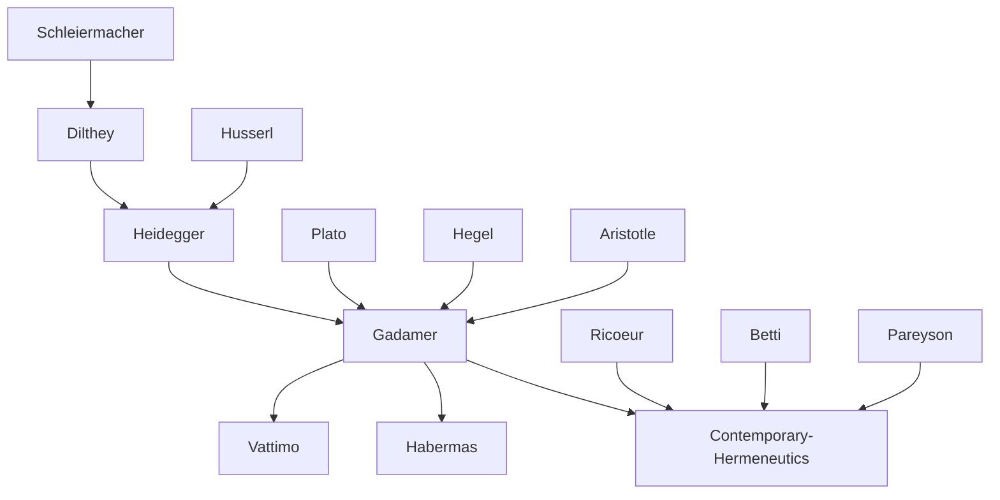

---
cssclasses:
  - Philosophy
subclasses:
  - Hermeneutics
  - 20th-Century-Philosophy
  - Continental-Philosophy
related:
  - "[[Phenomenology]]"
  - "[[Heidegger]]"
  - "[[Being and Time]]"
  - "[[Historicism]]"
  - "[[Philosophy of Language]]"
  - "[[Aesthetics]]"
  - "[[Critical Theory]]"
  - "[[Ricoeur]]"
  - "[[Schleiermacher]]"
  - "[[Dilthey]]"
aliases:
  - truth method
  - hermeneutic circle
  - fusion horizons
  - interpretation theory
  - effective history
  - language being
  - aesthetic experience
reference:
  - "[Abbagnano, N., & Fornero, G. (2012). La ricerca del pensiero. Vol. 3B. Dalla fenomenologia a Gadamer. Paravia.](https://archive.org/download/ssp-s06-e16/The%20search%20for%20thought%20-%20Unit%209%20Chapter%202.pdf)"
tags:
  - Podcast
---

#### Podcast

<iframe src="https://archive.org/embed/ssp-s06-e16" width="100%" height="30" frameborder="0" webkitallowfullscreen="true" mozallowfullscreen="true" allowfullscreen></iframe>

---

#### Central Problem

Hermeneutics confronts the fundamental question: what are the conditions that make understanding possible? While human beings have always faced interpretive problems — deciphering inscriptions, laws, religious or poetic texts — hermeneutics as a systematic theory of interpretation is a distinctly modern development, emerging from the Renaissance and Protestant Reformation.

The central tension lies between the modern scientific ideal of objective, methodically verifiable knowledge and the distinctive character of humanistic understanding. Can the human sciences (Geisteswissenschaften) achieve the same kind of objective truth as the natural sciences? Or does understanding operate according to different principles altogether?

Gadamer, building on [[Heidegger]]'s existential analysis, argues that understanding is not merely one possible attitude among others, but constitutes "the mode of being of existence as such." This universalization of hermeneutics challenges the Enlightenment assumption that prejudice must be eliminated for true knowledge, and instead reveals how all understanding necessarily operates within historical tradition and through pre-understandings that cannot be bracketed away.

#### Main Thesis

Gadamer's fundamental thesis, expressed in the title of his masterwork *Truth and Method*, is that there exist genuine experiences of truth that lie outside the domain of scientific methodology. Philosophy, art, and history represent such "extra-methodical" zones of truth that cannot be verified by scientific means but remain essential for human self-understanding.

**The Hermeneutic Circle:** Understanding is always circular — we can only approach what we seek to understand through pre-understandings inherited from our social and historical context. Rather than a vicious circle to be escaped, Heidegger showed this to be the ontological structure of understanding itself. The task is not to exit the circle but to enter it properly, remaining open to having our pre-suppositions challenged by the "otherness of the text."

**Rehabilitation of Prejudice:** Against the Enlightenment's "prejudice against prejudice," [[Gadamer]] argues that prejudices are not necessarily false. Legitimate prejudices constitute our historical being — we always already understand ourselves "according to unreflected schemas, in the family, in society, and in the State." Their elimination would mean the annihilation of our concrete selfhood.

**Rehabilitation of Authority and Tradition:** Authority, properly understood, rests not on blind obedience but on rational recognition of another's superior judgment. Similarly, tradition is not opposed to reason and freedom but requires free rational acceptance to be authentically human.

**Fusion of Horizons (Horizontverschmelzung):** Understanding requires neither impossible self-forgetting nor mere reproduction of the past, but a productive mediation between the interpreter's present horizon and the historical horizon of the interpreted. This fusion is made possible by tradition, the living connection between past and present.

**Effective-Historical Consciousness (Wirkungsgeschichtliches Bewußtsein):** We can approach the past only through its effects — the interpretive tradition that connects us to it. Historical consciousness must recognize that it is itself historically conditioned, never achieving a "view from nowhere."

**Being as Language:** "Being that can be understood is language." All forms of life are linguistic and can be experienced and understood as such. This ontological equation of being with language is the condition of hermeneutics itself.

#### Historical Context

[[Gadamer]] (1900-2002) studied philosophy with the neo-Kantians at Marburg and completed his habilitation under [[Heidegger]] in 1929. After teaching at Marburg, Leipzig, and Frankfurt, he succeeded Jaspers at Heidelberg in 1949, becoming one of the most influential figures in German academic life during the 1950s and 1960s.

The development of hermeneutics reflects the modern struggle to legitimate the human sciences. [[Schleiermacher]] (early 19th century) extended interpretation beyond biblical exegesis to any text whose meaning is obscured by linguistic, historical, or psychological distance. Dilthey further universalized hermeneutics as the methodology for all historical-spiritual knowledge.

Heidegger's existential transformation of hermeneutics in *Being and Time* (1927) — where understanding becomes a constitutive structure of Dasein's being-in-the-world — provided the decisive foundation for [[Gadamer]]'s philosophical hermeneutics. The publication of *Truth and Method* in 1960 marked the emergence of hermeneutics as a major philosophical movement with implications for epistemology, aesthetics, ethics, and social theory.

The postwar context of German reconstruction, the confrontation with scientific positivism, and the question of how to relate to a compromised historical tradition all shaped [[Gadamer]]'s rehabilitation of tradition and his critique of both Enlightenment objectivism and romantic subjectivism.

#### Philosophical Lineage

#### Key Thinkers

| Thinker | Dates | Movement | Main Work | Core Concept |
|---------|-------|----------|-----------|--------------|
| [[Gadamer]] | 1900-2002 | [[Hermeneutics]] | *Truth and Method* | Fusion of horizons, effective history |
| [[Heidegger]] | 1889-1976 | [[Phenomenology]] | *Being and Time* | Hermeneutic circle as ontological |
| [[Schleiermacher]] | 1768-1834 | [[Romanticism]] | *Hermeneutics* | Universal theory of interpretation |
| [[Dilthey]] | 1833-1911 | [[Historicism]] | *Introduction to Human Sciences* | Understanding vs. explanation |
| [[Betti]] | 1890-1968 | [[Hermeneutics]] | *General Theory of Interpretation* | Objectivist hermeneutics |
| [[Pareyson]] | 1918-1991 | [[Existentialism]] | *Truth and Interpretation* | Personalist ontology |
| [[Ricoeur]] | 1913-2005 | [[Hermeneutics]] | *Conflict of Interpretations* | Hermeneutics of suspicion |

#### Key Concepts

| Concept | Definition | Related to |
|---------|------------|------------|
| Hermeneutic circle | The circular structure of understanding whereby what is to be understood is already preliminarily understood through pre-conceptions | [[Heidegger]], [[Gadamer]] |
| Pre-understanding | The anticipations, prejudices, and expectations the interpreter brings to any act of understanding | [[Gadamer]], tradition |
| Effective history | The way past events and texts influence interpretation through their effects and interpretive tradition | [[Gadamer]], historical consciousness |
| Fusion of horizons | The mediation between interpreter's present horizon and historical horizon of the interpreted | [[Gadamer]], understanding |
| Aesthetic differentiation | The abstraction that separates artworks from their vital context for "pure" aesthetic appreciation | [[Gadamer]], art criticism |
| Belonging (Zugehörigkeit) | The primacy of the thing (truth, tradition, language) over the subject in understanding | [[Gadamer]], ontology |
| Play (Spiel) | The self-movement of understanding where truth happens through us rather than by us | [[Gadamer]], art, ontology |
| Wirkungsgeschichte | "History of effects" — the influence of past events/texts on all subsequent interpretation | [[Gadamer]], historicity |
| Rehabilitation of prejudice | Recognition that prejudices are constitutive of historical being, not merely obstacles | [[Gadamer]], Enlightenment critique |
| Being as language | The thesis that all being is linguistic and understanding is always linguistic interpretation | [[Gadamer]], ontology |

#### Authors Comparison

| Theme | [[Gadamer]] | [[Betti]] | [[Ricoeur]] |
|-------|-------------|-----------|-------------|
| Central concern | Conditions of understanding | Methodology of interpretation | Conflict of interpretations |
| Approach | Ontological-philosophical | Methodological-normative | Mediating, phenomenological |
| On objectivity | Impossible and unnecessary | Essential goal of interpretation | Dialectical tension |
| On tradition | Constitutive of understanding | Context to be transcended | Resource and obstacle |
| On method | Truth exceeds method | Method ensures valid interpretation | Explanation and understanding complement |
| Relation to [[Heidegger]] | Direct inheritance | Critical distance | Creative appropriation |
| Key accusation | Relativism (by Betti) | Objectivism (by [[Gadamer]]) | Masters of suspicion |

#### Influences & Connections

- **Predecessors:** [[Gadamer]] ← influenced by ← [[Heidegger]], [[Husserl]], [[Dilthey]], [[Schleiermacher]], [[Plato]], [[Hegel]]
- **Contemporaries:** [[Gadamer]] ↔ dialogue with ↔ [[Habermas]], [[Betti]], [[Derrida]]
- **Followers:** [[Gadamer]] → influenced → [[Vattimo]], [[Rorty]], theology, literary criticism
- **Opposing views:** [[Gadamer]] ← criticized by ← [[Betti]] (relativism), [[Habermas]] (conservatism)

#### Summary Formulas

- **[[Gadamer]]:** Being that can be understood is language; truth is an extra-methodical event of self-presentation that happens to us through belonging to tradition, not a conquest of method.
- **[[Betti]]:** Interpretation requires objective methodology to preserve the autonomy of the hermeneutic object against subjective arbitrariness.
- **[[Pareyson]]:** Truth is one but its interpretations are many; the task is to think both the metatemporal unity of truth and the historical plurality of its manifestations.
- **[[Ricoeur]]:** The "masters of suspicion" (Marx, [[Nietzsche]], [[Freud]]) reveal the need to integrate hermeneutics of trust with hermeneutics of suspicion in mediating the conflict of interpretations.

#### Timeline

| Year | Event |
|------|-------|
| 1900 | [[Gadamer]] born in Marburg |
| 1922 | [[Gadamer]] completes doctorate with [[Natorp]] |
| 1927 | [[Heidegger]] publishes *Being and Time* |
| 1929 | [[Gadamer]] completes habilitation under [[Heidegger]] |
| 1949 | [[Gadamer]] succeeds [[Jaspers]] at Heidelberg |
| 1955 | [[Betti]] publishes *General Theory of Interpretation* |
| 1960 | [[Gadamer]] publishes *Truth and Method* |
| 1969 | [[Ricoeur]] publishes *Conflict of Interpretations* |
| 1971 | [[Pareyson]] publishes *Truth and Interpretation* |
| 1976 | [[Gadamer]] publishes *Reason in the Age of Science* |
| 2002 | [[Gadamer]] dies in Heidelberg |

#### Notable Quotes

> "Being that can be understood is language." — [[Gadamer]]

> "Not history belongs to us, but we belong to history." — [[Gadamer]]

> "The true authority does not need to assert itself in an authoritarian manner." — [[Gadamer]]

---
> [!warning]-
> This annotation was normalised using a large language model and may contain inaccuracies. These texts serve as preliminary study resources rather than exhaustive references.
