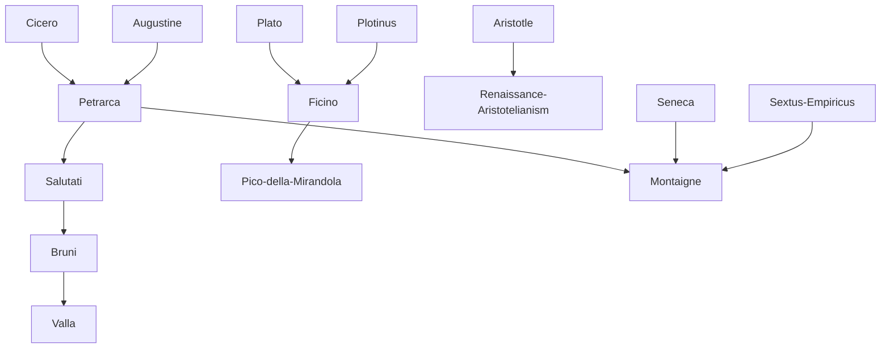

---
cssclasses:
  - Philosophy
  - History
subclasses:
  - Medieval-and-Renaissance-Philosophy
  - Social-and-Political-Philosophy
  - Epistemology
aliases:
  - humanism
  - renaissance
  - homo faber
  - dignity man
  - return antiquity
  - anthropocentrism
  - secular knowledge
  - historical perspective
  - lay intellectual
  - civic humanism
  - microcosm
  - active life
contributions:
  - Conceptual
authors:
  - "[[Petrarca]]"
  - "[[Salutati]]"
  - "[[Bruni]]"
  - "[[Valla]]"
  - "[[Pico]]"
  - "[[Montaigne]]"
  - "[[Burckhardt]]"
  - "[[Garin]]"
reference: "[[03 The search for thought - Unit 1 Chapter 1.pdf]]"
---

#### Central Problem

The Renaissance confronts a fundamental question about the nature of human existence and the sources of knowledge and value: what is the proper relationship between humanity and the classical past, and how should human beings understand their place in the cosmos? This problem emerges from the crisis of medieval universalism — the collapse of unified political structures (Empire and Papacy) and the inadequacy of scholastic philosophy to express the new consciousness of urban-mercantile civilization.

The central tension lies between the medieval worldview, which placed God at the center (theocentrism) and saw humans as pilgrims awaiting the afterlife, and the emerging Renaissance perspective, which increasingly places humanity at the center (anthropocentrism) while not necessarily rejecting religious faith. The humanists ask: can human beings forge their own destiny through reason, virtue, and engagement with the world? Can the wisdom of classical antiquity provide models for human flourishing that transcend the "dark ages" of medieval culture?

The movement also confronts methodological questions: how should we approach ancient texts? What is the relationship between literary-philological studies (studia humanitatis) and genuine philosophy? The debate between those who see humanism as merely literary and those who recognize its philosophical substance reflects deeper questions about the nature of wisdom itself.

#### Main Thesis

The Renaissance thesis, crystallized in the formula "homo faber ipsius fortunae" (man is the maker of his own fortune), holds that human beings possess a unique dignity consisting in their capacity to shape themselves and their destiny. Unlike medieval philosophy, which understood humans as occupying a fixed place within a divinely ordained cosmic order, Renaissance thinkers affirm human plasticity and self-determination.

**The Dignity of Man:** [[Pico della Mirandola]]'s Oration on the Dignity of Man presents humanity as "free and sovereign artisan of itself" — a being with an indeterminate nature capable of assuming any form, from bestial to angelic. Humans are not merely part of creation but its "copula," "microcosm," and "bond" — synthesizing all levels of being within themselves.

**Return to the Principle:** Renaissance renewal operates through "return to the beginning" (ritorno al principio), understood in multiple senses: religiously as return to God and primitive Christianity; historically as return to classical antiquity; and naturally as return to authentic nature beyond medieval abstractions.

**Historical Perspective:** The humanists discover historical distance — the recognition that ancient texts must be understood in their original context, not assimilated to present concerns. This philological consciousness distinguishes Renaissance from medieval uses of antiquity and founds modern historical method.

**Autonomy of Knowledge:** Against the medieval encyclopedia of knowledge subordinated to theology, the Renaissance initiates a process of secularization whereby each discipline claims autonomy: politics from morality (Machiavelli), religion from philosophy (Luther), law from theology (Grotius), science from metaphysics (Galileo).

**Active Life over Contemplation:** The humanists valorize vita activa over vita contemplativa, practical engagement over pure speculation, moral philosophy over physics and metaphysics.

#### Historical Context

The Renaissance (15th-16th centuries) coincides with epochal transformations marking the transition from medieval to modern civilization: the flowering of European monarchies, geographic discoveries, the inventions of printing and gunpowder, and the Protestant Reformation. The political landscape shifts from universal institutions (Empire, Papacy) to a mosaic of national kingdoms in Europe and regional states in Italy.

In Italy, the transformation of Communes into Signorie and regional principalities creates a fragmented political situation. After the Peace of Lodi (1454), a fragile equilibrium exists among Milan, Venice, Florence, the Papal States, and Naples — an equilibrium shattered by French and Spanish invasions, culminating in Spanish domination after Cateau-Cambrésis (1559).

Economically, urban civilization and mercantile economy replace the "closed" economy of medieval feudalism. A dynamic bourgeoisie engaged in commerce and finance — particularly strong in Italian banking centers like Florence, Venice, and Genoa — provides the social basis for humanist culture. However, from the late 15th century, the shift of commercial axes from Mediterranean to Atlantic marginalizes Italy economically.

The culture-bearing class shifts from ecclesiastics to lay intellectuals, often merchants, financiers, or professionals who become "professionals of the pen" serving princely courts. Academies (Platonic Academy in Florence, Roman Academy, Neapolitan Academy) emerge as alternative centers of learning alongside medieval universities.

#### Philosophical Lineage

#### Key Thinkers

| Thinker | Dates | Movement | Main Work | Core Concept |
|---------|-------|----------|-----------|--------------|
| [[Petrarca]] | 1304-1374 | [[Humanism]] | *Secretum* | Return to self, inner conflict |
| [[Salutati]] | 1331-1406 | [[Civic Humanism]] | *On the Nobility of Laws and Medicine* | Active life, human freedom |
| [[Bruni]] | 1370-1444 | [[Civic Humanism]] | *Life of Cicero* | Unity of ancient wisdom |
| [[Valla]] | 1407-1457 | [[Humanism]] | *On Pleasure* | Pleasure as good, philological critique |
| [[Pico della Mirandola]] | 1463-1494 | [[Neoplatonism]] | *Oration on the Dignity of Man* | Human dignity, self-creation |
| [[Montaigne]] | 1533-1592 | [[Skepticism]] | *Essays* | Self-knowledge, acceptance of limits |
| [[Ficino]] | 1433-1499 | [[Neoplatonism]] | *Platonic Theology* | Platonic revival |
| [[Guarino Veronese]] | 1374-1460 | [[Humanism]] | Educational works | Humanist pedagogy |

#### Key Concepts

| Concept | Definition | Related to |
|---------|------------|------------|
| Homo faber ipsius fortunae | Man is the maker of his own fortune; human self-determination | [[Humanism]], [[Pico della Mirandola]] |
| Rebirth (Rinascita) | Renewal of humanity through return to classical models | [[Renaissance]], [[Humanism]] |
| Studia humanitatis | Liberal arts studies (grammar, rhetoric, poetry, history, moral philosophy) | [[Humanism]], [[Bruni]] |
| Anthropocentrism | Placing humanity at the center of concern, versus medieval theocentrism | [[Renaissance]], [[Humanism]] |
| Historical perspective | Recognizing temporal distance and context of past events and texts | [[Philology]], [[Humanism]] |
| Vita activa | Active life of civic engagement, valued over contemplative life | [[Civic Humanism]], [[Salutati]] |
| Microcosm | Man as "small world" containing all levels of being | [[Pico della Mirandola]], [[Neoplatonism]] |
| Return to the principle | Recovery of authentic origins through engagement with classical sources | [[Renaissance]], [[Humanism]] |
| Secularization | Autonomy of disciplines from theology; lay intellectuals replace clergy | [[Renaissance]], [[Modernity]] |
| Acedia | Spiritual torpor or melancholy; medieval "disease of cloisters" | [[Petrarca]], [[Medieval Philosophy]] |

#### Authors Comparison

| Theme | [[Petrarca]] | [[Valla]] | [[Montaigne]] |
|-------|--------------|-----------|---------------|
| Central concern | Inner life, self-knowledge | Pleasure as natural good | Human nature through experience |
| Relation to antiquity | Cicero + Augustine synthesis | Critical philology | Socratic self-examination |
| View of human nature | Divided, conflicted | Optimistic naturalism | Limited but dignified |
| Method | Introspective, autobiographical | Philological, polemical | Essayistic, comparative |
| Religious stance | Christian, Augustinian | Critical of ecclesiastical power | Tolerant skepticism |
| Key virtue | Concentration on self | Authentic pleasure | Acceptance of finitude |

#### Influences & Connections

- **Predecessors:** [[Petrarca]] ← influenced by ← [[Cicero]], [[Augustine]], [[Seneca]]
- **Predecessors:** [[Ficino]] ← influenced by ← [[Plato]], [[Plotinus]], [[Proclus]]
- **Contemporaries:** [[Salutati]] ↔ dialogue with ↔ [[Bruni]], [[Valla]]
- **Followers:** [[Petrarca]] → influenced → [[Salutati]], [[Bruni]], entire humanist tradition
- **Followers:** [[Montaigne]] → influenced → [[Descartes]], [[Pascal]]
- **Opposing views:** [[Humanism]] ← criticized by ← Averroists, Scholastics

#### Summary Formulas

- **[[Petrarca]]:** True wisdom lies in self-knowledge through classical models; the conflict between worldly attachment and spiritual aspiration defines human existence.
- **[[Salutati]]:** Active civic engagement surpasses pure contemplation; the science of human affairs exceeds natural philosophy in value.
- **[[Valla]]:** Pleasure is the natural end of human action, and critical philology liberates us from medieval falsifications and ecclesiastical pretensions.
- **[[Pico della Mirandola]]:** Human dignity consists in our indeterminate nature — we are free artisans of ourselves, capable of ascending to the divine or descending to the bestial.
- **[[Montaigne]]:** Human life is an inexhaustible experiment; wisdom lies in accepting our limits and knowing ourselves through constant self-examination.

#### Timeline

| Year | Event |
|------|-------|
| 1304 | Birth of [[Petrarca]], initiator of Humanism |
| 1337-1338 | [[Petrarca]] writes *On His Own Ignorance and That of Many Others* |
| 1347-1353 | [[Petrarca]] composes *Secretum* |
| 1374 | Death of [[Petrarca]] |
| 1431 | [[Valla]] publishes *On Pleasure* |
| 1440 | [[Valla]] demonstrates falsity of Donation of Constantine |
| 1454 | Peace of Lodi establishes Italian equilibrium |
| 1462 | [[Ficino]] founds Platonic Academy in Florence |
| 1486 | [[Pico della Mirandola]] writes *Oration on the Dignity of Man* |
| 1559 | Peace of Cateau-Cambrésis; Spanish domination of Italy |
| 1580 | [[Montaigne]] publishes first edition of *Essays* |
| 1860 | [[Burckhardt]] publishes *The Civilization of the Renaissance in Italy* |

#### Notable Quotes

> "Man is the maker of his own fortune." — Classical maxim central to [[Renaissance]] anthropology

> "Do not go outside yourself; return into yourself. Truth dwells in the inner man." — [[Augustine]], adopted by [[Petrarca]] as humanist motto

> "We have no communication with being, because the entire human nature is always between birth and death." — [[Montaigne]]

#### See Also

- [[Scholasticism]]
- [[Medieval Philosophy]]
- [[Neoplatonism]]
- [[Civic Humanism]]
- [[Platonic Academy]]
- [[Protestant Reformation]]
- [[Scientific Revolution]]
- [[Philology]]
- [[Dignity of Man]]
- [[Italian Renaissance]]

> [!NOTE]
> *This summary has been created to present the key points from the source text, which was automatically extracted using LLM. Please note that the summary may contain errors. It serves as an essential starting point for study and reference purposes.*
