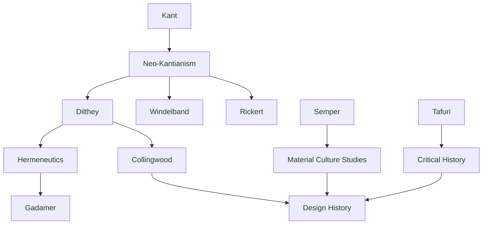

---
cssclasses:
  - Philosophy
  - Arts
  - History
subclasses:
  - Design-History
  - Design-Theory
  - Hermeneutics
related:
  - "[[Design History]]"
  - "[[Neo-Kantianism]]"
  - "[[Hermeneutics]]"
  - "[[Historiography]]"
  - "[[Contextualism]]"
aliases:
  - design history
  - design historiography
  - neo kantian
  - dilthey method
  - rickert values
  - windelband idiographic
  - design canon
  - contextualism history
  - hermeneutic circle
  - value history
reference:
  - Baljon, C. J. (2002). History of history and canons of design. Design Studies, 23(3), 333–343. https://doi.org/10.1016/S0142-694X(01)00042-4
---

#### Central Problem

The paper confronts a foundational question in design studies: what is the proper relationship between history and theory in understanding design? Baljon examines how design history should be conducted methodologically, challenging approaches that treat design artifacts merely as illustrations of theoretical claims or as isolated aesthetic objects. The central tension lies between nomothetic approaches (seeking general laws) and idiographic approaches (attending to unique particulars) in the study of design's past.

#### Main Thesis

Design history requires a philosophical foundation drawn from Neo-Kantian thought, particularly the work of [[Dilthey]], [[Rickert]], and [[Windelband]]. This tradition offers resources for understanding design as a value-laden cultural activity that cannot be reduced to either natural-scientific explanation or purely subjective interpretation. The author argues for a contextualist approach grounded in the hermeneutic circle—understanding parts through wholes and wholes through parts—as the proper method for design historical inquiry.

The thesis challenges both positivist approaches that seek covering laws for design development and purely formalist approaches that abstract designs from their cultural contexts. Instead, design history must navigate between universal claims and particular instances, recognizing that design canons emerge from historically situated value judgments rather than timeless aesthetic truths.

#### Historical Context

The paper emerges from ongoing debates in design studies about disciplinary identity and methodology. The professionalization of design history since the 1970s raised questions about whether design history should model itself on art history, social history, or develop its own distinctive methods.

Neo-Kantian philosophy, developed in late 19th-century Germany, provided crucial distinctions between natural sciences (Naturwissenschaften) and human sciences (Geisteswissenschaften). [[Dilthey]]'s elaboration of understanding (Verstehen) versus explanation (Erklären) and [[Rickert]] and [[Windelband]]'s distinction between nomothetic and idiographic sciences offered conceptual tools for cultural disciplines seeking methodological rigor without scientific reductionism.

Contemporary design history debates about the canon—which designers and designs merit historical attention—implicitly invoke value frameworks that Neo-Kantian philosophy makes explicit. Baljon intervenes in these debates by providing philosophical grounding for contextualist methodology.

#### Philosophical Lineage

#### Key Thinkers

| Thinker | Dates | Movement | Main Work | Core Concept |
|---------|-------|----------|-----------|--------------|
| [[Dilthey]] | 1833-1911 | [[Hermeneutics]] | *Introduction to the Human Sciences* | Verstehen, lived experience |
| [[Windelband]] | 1848-1915 | [[Neo-Kantianism]] | "Rectoral Address" | Nomothetic vs. idiographic |
| [[Rickert]] | 1863-1936 | [[Neo-Kantianism]] | *The Limits of Concept Formation* | Value-relation in history |
| [[Collingwood]] | 1889-1943 | [[Philosophy of History]] | *The Idea of History* | Re-enactment, historical imagination |
| [[Semper]] | 1803-1879 | [[Architecture Theory]] | *Style in the Technical and Tectonic Arts* | Material determinism |
| [[Tafuri]] | 1935-1994 | [[Critical History]] | *Architecture and Utopia* | Ideology critique in history |

#### Key Concepts

| Concept | Definition | Related to |
|---------|------------|------------|
| Nomothetic | Scientific approach seeking general laws applicable across cases | [[Windelband]], [[Natural Sciences]] |
| Idiographic | Historical approach attending to unique, unrepeatable particulars | [[Windelband]], [[Human Sciences]] |
| Hermeneutic circle | Methodological principle that parts are understood through wholes and wholes through parts | [[Dilthey]], [[Hermeneutics]] |
| Verstehen | Understanding through empathetic re-experiencing of historical agents' meanings | [[Dilthey]], [[Hermeneutics]] |
| Value-relation | The role of values in selecting and organizing historical materials | [[Rickert]], [[Historiography]] |
| Design canon | The body of designs and designers deemed historically significant | [[Design History]], [[Value]] |

#### Authors Comparison

| Theme | [[Dilthey]] | [[Rickert]] | [[Collingwood]] |
|-------|-------------|-------------|-----------------|
| Central concern | Foundation of human sciences | Logic of historical knowledge | Nature of historical thought |
| Method | Lived experience, understanding | Value-relation, individuation | Re-enactment of past thought |
| Objectivity | Intersubjective validity | Value-grounded selection | Historical imagination |
| Role of values | Implicit in life | Constitutive of historical objects | Presupposed in questions |

#### Influences & Connections

- **Predecessors:** [[Baljon]] ← influenced by ← [[Dilthey]], [[Rickert]], [[Windelband]], [[Collingwood]]
- **Contemporaries:** [[Baljon]] ↔ dialogue with ↔ design history debates
- **Related traditions:** [[Art History]] ↔ methodological debates with ↔ [[Design History]]
- **Opposing views:** Positivist historiography ← challenged by ← Neo-Kantian approaches

#### Summary Formulas

- **Neo-Kantian foundation:** Design history requires philosophical grounding in the distinction between natural-scientific explanation and humanistic understanding.
- **Hermeneutic method:** Understanding design requires circular movement between parts and wholes, text and context, particular artifact and cultural totality.
- **Value-laden history:** Design canons are not discovered but constituted through historically situated value judgments that must be made explicit and examined.
- **Contextualism:** Design artifacts can only be understood within their full cultural, social, and material contexts, not as isolated formal objects.

#### Timeline

| Year | Event |
|------|-------|
| 1833 | [[Dilthey]] born |
| 1883 | [[Dilthey]] publishes *Introduction to the Human Sciences* |
| 1894 | [[Windelband]] delivers "Rectoral Address" distinguishing nomothetic and idiographic |
| 1902 | [[Rickert]] publishes *The Limits of Concept Formation in Natural Science* |
| 1936 | [[Collingwood]] develops re-enactment theory of historical understanding |
| 1977 | Journal of Design History founded, professionalizing the field |

#### Notable Quotes

> "The hermeneutic circle is not a vicious circle but the essential structure of all understanding—we understand parts through wholes and wholes through parts."

> "Design canons are not natural kinds waiting to be discovered but cultural achievements requiring value judgments that historians must make explicit."

> "The distinction between nomothetic and idiographic disciplines is not absolute but marks different orientations toward knowledge—both have their place in design studies."

---
> [!warning]-
> This annotation was normalised using a large language model and may contain inaccuracies. These texts serve as preliminary study resources rather than exhaustive references.
