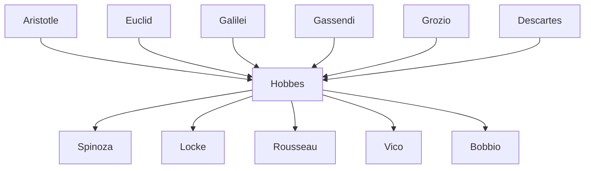

---
cssclasses:
  - Philosophy
subclasses:
  - Social-and-Political-Philosophy
  - Epistemology
  - 17th-18th-Century-Philosophy
aliases:
  - hobbes
  - leviathan
  - social contract
  - state of
  - materialism
  - absolutism
  - political philosophy
  - natural law
  - natural right
  - bellum omnium
  - homo homini
  - sovereign
contributions:
  - Conceptual
authors:
  - "[[Hobbes]]"
  - "[[Descartes]]"
  - "[[Gassendi]]"
  - "[[Galilei]]"
  - "[[Mersenne]]"
  - "[[Spinoza]]"
  - "[[Locke]]"
  - "[[Grozio]]"
reference: "[[03 The search for thought - Unit 5 Chapter 1.pdf]]"
---

#### Central Problem

The central problem addressed by Thomas Hobbes concerns the foundations of political order and peaceful coexistence among human beings. How can a stable and orderly society be established given the fundamentally egoistic and conflictual nature of humans? Hobbes rejects the Aristotelian conception of man as a naturally political animal, arguing instead that without a supreme authority, humans would exist in a perpetual "state of nature" characterized by a war of all against all (bellum omnium contra omnes).

The philosophical challenge Hobbes confronts is twofold: first, to establish a purely rational foundation for political philosophy that excludes supernatural revelation and ancient authorities, finding inspiration solely in the world of nature; second, to demonstrate how reason itself can lead humans out of their miserable natural condition toward a commonwealth that guarantees peace and security. This requires reconceiving the nature of reason itself—not as a faculty for discovering eternal truths, but as a calculative technique for predicting consequences and making advantageous choices.

Hobbes's project also involves addressing fundamental metaphysical questions about the nature of reality and knowledge. His materialist framework holds that only bodies exist and can be objects of scientific knowledge, which has profound implications for understanding human nature, morality, and the foundations of political authority.

#### Main Thesis

Hobbes's main thesis is that reason, understood as a calculative faculty operating through language, reveals that the only path out of the destructive state of nature is the establishment of an absolute sovereign through a social contract. This thesis unfolds across several interconnected claims:

**On Reason and Knowledge:** Human reason differs from animal cognition through its use of conventional linguistic signs, which enable generalization and long-term planning. Reasoning is fundamentally calculation—the addition and subtraction of concepts. True scientific knowledge (demonstrative knowledge that proceeds from causes to effects) is possible only for objects created by humans: mathematics, ethics, and politics. Natural objects, created by God, can only be known probabilistically through a posteriori demonstrations from effects to causes.

**On Materialism:** Only bodies exist; the word "incorporeal" is meaningless. All phenomena—including sensation, imagination, and thought—are movements in matter. Even the human soul is corporeal, and all moral valuations (good and evil) are subjective, relative to individual desires. There is no absolute good or ultimate end in human life, for "life is an incessant movement."

**On Natural Right and Natural Law:** In the state of nature, every person has a right to everything (ius omnium in omnia), including the bodies of others, resulting in the famous formula homo homini lupus (man is a wolf to man). This natural right must be distinguished from natural law, which is a rational precept directing humans toward self-preservation. The three fundamental laws of nature prescribe: (1) seek peace (pax est quaerenda); (2) renounce the unlimited right to all things when others do likewise (ius in omnia est retinendum); (3) keep covenants (pacta servanda sunt).

**On the State:** The social contract creates the Leviathan—an absolute sovereign who embodies the will of all citizens. The sovereign's power is indivisible, irreversible, and unlimited; the sovereign is legibus solutus (unbound by law) because justice and injustice only exist where there is law, and law only exists where there is sovereign power.

#### Historical Context

Thomas Hobbes (1588-1679) lived through one of the most turbulent periods in English history, marked by civil war, regicide, and the struggle between parliamentary and royal authority. Born in Westport, England, his education at Oxford was supplemented by extensive travels on the European continent, where he encountered the leading intellectual figures of his age: [[Galilei]], [[Gassendi]], [[Mersenne]], and through the latter, [[Descartes]] (to whom he sent his Objections to the Meditations).

The English Civil War (1642-1651), the execution of Charles I (1649), and Cromwell's Commonwealth profoundly shaped Hobbes's political thought. His masterwork, the Leviathan (1651), appeared during this period of upheaval, offering a philosophical justification for absolute sovereignty that could, in principle, be exercised by any form of government capable of maintaining order.

Hobbes's intellectual context includes the Scientific Revolution and the new mechanical philosophy. His materialism and mechanicism reflect the influence of Galilean physics, while his geometric method in political philosophy parallels the mathematical approach to nature championed by the new science. His nominalism about language and conventionalism about morality represent a decisive break with scholastic philosophy.

The natural law tradition, particularly as represented by [[Grozio]]'s De iure belli ac pacis (1625), provided both a framework and a foil for Hobbes's political theory. While accepting the possibility of treating politics as a science and the need to prescind from historical contingency, Hobbes radically transformed the content of natural law from a set of eternal moral principles to prudential rules for self-preservation.

#### Philosophical Lineage

#### Key Thinkers

| Thinker | Dates | Movement | Main Work | Core Concept |
|---------|-------|----------|-----------|--------------|
| [[Hobbes]] | 1588-1679 | [[Materialism]] | *Leviathan* | Social contract, absolute sovereignty |
| [[Grozio]] | 1583-1645 | [[Natural Law]] | *De iure belli ac pacis* | Natural rights as pre-political |
| [[Descartes]] | 1596-1650 | [[Rationalism]] | *Meditations* | Thinking substance |
| [[Galilei]] | 1564-1642 | [[Scientific Revolution]] | *Dialogue* | Mechanical physics |
| [[Spinoza]] | 1632-1677 | [[Rationalism]] | *Ethics* | Substance monism |
| [[Locke]] | 1632-1704 | [[Empiricism]] | *Two Treatises* | Limited government |

#### Key Concepts

| Concept | Definition | Related to |
|---------|------------|------------|
| State of nature | Hypothetical pre-political condition characterized by war of all against all due to natural equality in vulnerability and competing desires | [[Hobbes]], [[Social Contract]] |
| Ius omnium in omnia | Natural right of everyone to everything, including others' bodies, which makes the state of nature a condition of war | [[Hobbes]], [[Natural Right]] |
| Bellum omnium contra omnes | War of all against all; the inevitable result of the state of nature where no common power exists | [[Hobbes]], [[Political Philosophy]] |
| Homo homini lupus | "Man is a wolf to man"; expresses the dangerous and predatory nature of humans in the state of nature | [[Hobbes]], [[Anthropology]] |
| Natural law (lex naturalis) | Rational precept discovered by reason that prohibits actions destructive of life and commands what preserves it | [[Hobbes]], [[Natural Law]] |
| Leviathan | The absolute sovereign (individual or assembly) created by social contract; a "mortal god" | [[Hobbes]], [[Absolutism]] |
| Social contract | Agreement among individuals to transfer their natural rights to a sovereign in exchange for peace and security | [[Hobbes]], [[Political Philosophy]] |
| Legibus solutus | "Unbound by law"; the sovereign's position above the laws, since law derives from sovereign authority | [[Hobbes]], [[Absolutism]] |
| Pactum unionis | Pact of union among individuals; in Hobbes, coincides with the pactum subiectionis | [[Hobbes]], [[Contract Theory]] |
| Geometric method | Application of mathematical-deductive reasoning to moral and political philosophy | [[Hobbes]], [[Method]] |

#### Authors Comparison

| Theme | [[Hobbes]] | [[Grozio]] | [[Locke]] |
|-------|------------|------------|-----------|
| Human nature | Egoistic, asocial, driven by fear and desire | Naturally sociable, rational | Rational, naturally free |
| State of nature | War of all against all | Peaceful but precarious | State of freedom and equality |
| Natural law | Prudential rules for self-preservation | Universal moral principles | Moral law discoverable by reason |
| Source of rights | Convention (social contract) | Nature and reason | God and nature |
| Sovereignty | Absolute, indivisible, irrevocable | Limited by natural law | Limited, revocable, based on consent |
| Property | Created by sovereign, not natural | Natural right | Natural right, pre-political |
| Right of resistance | None (except self-preservation) | Limited | Extensive when contract violated |

#### Influences & Connections

- **Predecessors:** [[Hobbes]] ← influenced by ← [[Aristotle]] (polemically), [[Euclid]], [[Galilei]], [[Gassendi]], [[Grozio]]
- **Contemporaries:** [[Hobbes]] ↔ dialogue with ↔ [[Descartes]], [[Mersenne]], [[Bramhall]]
- **Followers:** [[Hobbes]] → influenced → [[Spinoza]], [[Locke]], [[Rousseau]], [[Vico]]
- **Opposing views:** [[Hobbes]] ← criticized by ← [[Locke]], [[Rousseau]], [[Natural Law Theorists]]

#### Summary Formulas

- **[[Hobbes]]:** Human reason, as calculative faculty, reveals that the only escape from the war of all against all is absolute sovereignty established through an irrevocable social contract.
- **[[Grozio]]:** Natural law consists of universal moral principles discoverable by reason that would be valid even if God did not exist.
- **[[Locke]]:** Government is legitimate only when based on consent and limited by natural rights; citizens retain the right to resist tyranny.

#### Timeline

| Year | Event |
|------|-------|
| 1588 | [[Hobbes]] born at Westport, England |
| 1603 | [[Hobbes]] enters Magdalen Hall, Oxford |
| 1608 | [[Hobbes]] becomes tutor to William Cavendish |
| 1625 | [[Grozio]] publishes *De iure belli ac pacis* |
| 1628 | [[Hobbes]] translates Thucydides; discovers Euclidean geometry |
| 1629 | [[Hobbes]] travels to France and Geneva |
| 1634-1636 | [[Hobbes]] meets [[Galilei]] and followers of [[Mersenne]] |
| 1640-1641 | [[Hobbes]] writes *Elements of Law*; moves to Paris; sends Objections to [[Descartes]] |
| 1642 | [[Hobbes]] publishes *De cive*; English Civil War begins |
| 1649 | Charles I executed |
| 1651 | [[Hobbes]] publishes *Leviathan*; returns to London |
| 1655 | [[Hobbes]] publishes *De corpore* |
| 1658 | [[Hobbes]] publishes *De homine* |
| 1679 | [[Hobbes]] dies at Hardwicke |

#### Notable Quotes

> "The life of man is solitary, poor, nasty, brutish, and short." — [[Hobbes]]

> "Covenants without the sword are but words, and of no strength to secure a man at all." — [[Hobbes]]

> "The condition of man is a condition of war of everyone against everyone." — [[Hobbes]]

#### See Also

- [[Social Contract Theory]]
- [[Natural Law]]
- [[Absolutism]]
- [[Materialism]]
- [[Political Philosophy]]
- [[State of Nature]]
- [[Sovereignty]]
- [[Leviathan]]
- [[English Civil War]]
- [[Rationalism]]

> [!NOTE]
> *This summary has been created to present the key points from the source text, which was automatically extracted using LLM. Please note that the summary may contain errors. It serves as an essential starting point for study and reference purposes.*
