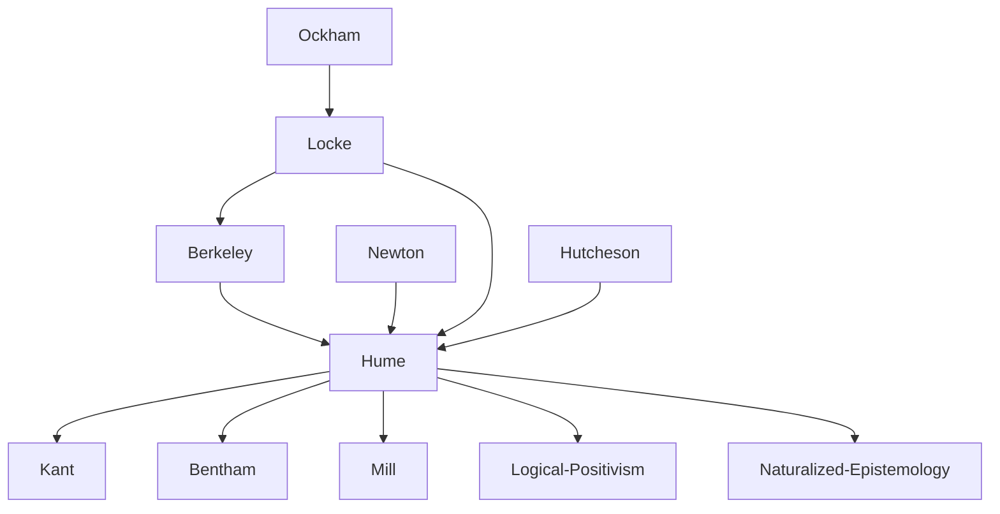

---
cssclasses:
  - Philosophy
subclasses:
  - Epistemology
  - Metaethics
  - 17th-18th-Century-Philosophy
related:
  - "[[British Empiricism]]"
  - "[[Skepticism]]"
  - "[[Problem of Induction]]"
  - "[[Causation]]"
  - "[[Personal Identity]]"
  - "[[Moral Sense Theory]]"
  - "[[Treatise of Human Nature]]"
  - "[[Is-Ought Problem]]"
  - "[[Kant]]"
  - "[[Scottish Enlightenment]]"
  - "[[Naturalism]]"
aliases:
  - impressions ideas
  - causation critique
  - habit custom
  - matter fact
  - relations ideas
  - association principle
  - moral sentiment
  - sympathy ethics
  - external world
  - personal identity
  - belief nature
reference:
  - "Abbagnano, N., & Fornero, G. (2012). La ricerca del pensiero. Vol. 2A. Dall'Umanesimo all'empirismo. Paravia."
---

#### Central Problem

[[Hume]] confronts the ultimate epistemological challenge: can empiricism, when pursued with rigorous consistency, provide any foundation for knowledge at all? While [[Locke]] accepted the validity of knowledge within the limits of experience, and Berkeley preserved spiritual substance while denying material substance, [[Hume]] asks whether experience can justify even our most basic beliefs—in causation, the external world, and personal identity.

The problem has both theoretical and practical dimensions. Theoretically, if all our ideas derive from impressions (sensory experiences), what justifies our belief that the future will resemble the past, that causes necessarily produce effects, or that there exists a unified self persisting through time? Practically, given that our lives depend entirely on such beliefs, what is their actual foundation if not reason?

Hume's investigation represents the culmination and crisis of modern empiricism. By rigorously applying the principle that every legitimate idea must trace back to a corresponding impression, he exposes the lack of rational foundation for beliefs that humans cannot help holding. This creates a profound tension between philosophical skepticism and natural belief.

#### Main Thesis

Hume's central thesis is that human knowledge, when rigorously examined, proves to be founded not on reason but on habit, custom, and natural instinct. The necessity we attribute to causal connections is merely subjective—a product of psychological habit rather than objective rational insight. This leads to a "mitigated skepticism" that limits knowledge to relations of ideas (mathematics) and matters of fact (probable empirical generalizations).

**Impressions and Ideas:** All mental contents ("perceptions") divide into impressions (vivid, forceful sensations, passions, emotions) and ideas (faint copies of impressions in memory and imagination). Every legitimate idea must derive from a corresponding impression—this is [[Hume]]'s fundamental principle and criterion for evaluating concepts.

**Relations of Ideas vs. Matters of Fact:** [[Hume]] distinguishes:
- *Relations of ideas*: Propositions true by definition, discoverable by pure thought, whose denial is contradictory (mathematics, logic). These are certain but tell us nothing about existence.
- *Matters of fact*: Propositions about existence, based on experience, whose denial is always conceivable. These tell us about the world but lack certainty.

**Critique of Causation:** The causal relation cannot be known *a priori*—we cannot deduce effects from causes by pure reason. Experience shows only *constant conjunction* (A regularly followed by B), never *necessary connection*. The "necessity" we feel is merely subjective—a product of habit. After repeatedly observing A followed by B, we form the *expectation* that B will follow A, but this expectation has no rational justification.

**The Role of Habit:** Habit (custom) is the "great guide of human life." It produces in us the disposition to expect the future to resemble the past, to believe in causal connections, to act as if our beliefs were certain. Habit explains *why* we believe, but cannot *justify* our beliefs.

**Belief in External World and Personal Identity:** We have no impression of "substance" underlying our perceptions, nor of a unified, persisting "self." The mind is merely "a bundle of perceptions" succeeding one another. Yet we naturally believe in external objects and personal identity—beliefs produced by imagination and habit, not reason.

**Moral Sentiment:** Morality is founded on sentiment, not reason. Reason alone cannot motivate action—only passion can. Moral judgments express feelings of approval or disapproval based on the perceived utility of actions for human happiness. The "moral sense" is grounded in natural sympathy with others.

#### Historical Context

[[Hume]] (1711-1776) lived during the Scottish Enlightenment, a remarkable period of intellectual flourishing in Edinburgh that produced major figures in philosophy, economics, and science. Scotland, though recently united with England (1707), developed its own distinctive intellectual culture, less ecclesiastical and more cosmopolitan than English thought.

Born in Edinburgh, [[Hume]] came to philosophy young, composing his *Treatise of Human Nature* (1739-40) before age 30 while living in France. The work's initial failure ("It fell dead-born from the press") led him to recast its ideas in more accessible form in the *Enquiries* (1748, 1751). His celebrity came through his *Essays* and *History of England*, making him the most famous British man of letters of his time.

The intellectual context included [[Newton]]'s triumph in natural philosophy, which inspired [[Hume]]'s ambition to become "the [[Newton]] of the moral sciences"—applying empirical, experimental method to human nature itself. [[Hume]] admired [[Newton]]'s achievement while questioning whether similar certainty was attainable for knowledge of human affairs.

Hume's religious skepticism, expressed in *Dialogues Concerning Natural Religion* (published posthumously, 1779) and *Natural History of Religion* (1757), made him controversial. He was twice denied university positions on grounds of alleged atheism. Yet he was personally admired for his good humor, sociability, and moral character—demonstrating that philosophical skepticism need not undermine practical virtue.

Hume's influence was decisive for [[Kant]], who acknowledged that [[Hume]] "awakened me from my dogmatic slumber" and stimulated the critical philosophy that sought to overcome Humean skepticism.

#### Philosophical Lineage

#### Key Thinkers

| Thinker | Dates | Movement | Main Work | Core Concept |
|---------|-------|----------|-----------|--------------|
| [[Hume]] | 1711-1776 | [[British Empiricism]] | *Treatise of Human Nature* | Skepticism about causation, habit |
| [[Locke]] | 1632-1704 | [[British Empiricism]] | *Essay Concerning Human Understanding* | Ideas from experience |
| [[Berkeley]] | 1685-1753 | [[British Empiricism]] | *Principles of Human Knowledge* | Esse est percipi |
| [[Newton]] | 1642-1727 | [[Scientific Revolution]] | *Principia Mathematica* | Experimental method |
| [[Kant]] | 1724-1804 | [[German Idealism]] | *Critique of Pure Reason* | Transcendental idealism |

#### Key Concepts

| Concept | Definition | Related to |
|---------|------------|------------|
| Impressions | Vivid, forceful perceptions: sensations, passions, emotions as originally experienced | [[Hume]], [[Empiricism]] |
| Ideas | Faint copies or images of impressions in memory and thought | [[Hume]], [[Epistemology]] |
| Relations of ideas | Propositions true by definition, certain but not about existence (mathematics, logic) | [[Hume]], [[Logic]] |
| Matters of fact | Propositions about existence, based on experience, always uncertain | [[Hume]], [[Epistemology]] |
| Constant conjunction | The observed regularity of one event following another; all we perceive of causation | [[Hume]], [[Causation]] |
| Habit/Custom | The psychological disposition, produced by repetition, to expect future to resemble past | [[Hume]], [[Psychology]] |
| Association of ideas | The natural tendency of mind to connect ideas by resemblance, contiguity, or causation | [[Hume]], [[Psychology]] |
| Belief | A vivid idea associated with present impression; natural instinct, not rational judgment | [[Hume]], [[Epistemology]] |
| Bundle theory | The self is nothing but a bundle of perceptions succeeding one another | [[Hume]], [[Personal Identity]] |
| Moral sentiment | Feelings of approval/disapproval based on perceived utility; foundation of ethics | [[Hume]], [[Ethics]] |

#### Authors Comparison

| Theme | [[Hume]] | [[Locke]] | [[Berkeley]] |
|-------|----------|-----------|--------------|
| Source of knowledge | Impressions only | Experience (sensation and reflection) | Ideas perceived by mind |
| Causation | Habit, no objective necessity | Real connection in nature | God's regular action |
| External world | Belief without rational justification | Exists, known through ideas | Does not exist independently |
| Personal identity | Bundle of perceptions | Continuous consciousness | Spiritual substance |
| Substance | Unintelligible fiction | Unknown substratum | Spirit only |
| Abstract ideas | Particular ideas as signs | General ideas by abstraction | Particular ideas as signs |
| Role of reason | Limited to relations of ideas | Guide within experience | Instrument of religion |
| Moral foundation | Sentiment, sympathy | Rational demonstration | Divine command |

#### Influences & Connections

- **Predecessors:** [[Hume]] ← influenced by ← [[Locke]] (empiricism), [[Berkeley]] (nominalism, critique of abstraction)
- **Predecessors:** [[Hume]] ← influenced by ← [[Newton]] (experimental method), [[Hutcheson]] (moral sense theory)
- **Contemporaries:** [[Hume]] ↔ dialogue with ↔ [[Smith]] (sympathy, economics), [[Rousseau]] (brief friendship/quarrel)
- **Followers:** [[Hume]] → influenced → [[Kant]] (critical philosophy), [[Bentham]] (utilitarianism)
- **Followers:** [[Hume]] → influenced → [[Mill]] (empiricism, utilitarianism), [[Logical Positivism]] (verification principle)
- **Opposing views:** [[Hume]] ← criticized by ← [[Reid]] (common sense philosophy), [[Kant]] (transcendental response)

#### Summary Formulas

- **[[Hume]]:** All ideas derive from impressions; causation is mere constant conjunction plus psychological habit; reason is the slave of the passions; the self is a bundle of perceptions; morality rests on sentiment and sympathy.
- **[[Locke]]:** Experience is the source and limit of knowledge; within those limits, reason can attain certainty about self, God, and present sensations.
- **[[Berkeley]]:** All that exists are minds and their ideas; God guarantees the order and continuity of our perceptions.
- **[[Kant]]:** [[Hume]]'s skepticism must be overcome by showing that the mind's a priori categories make objective experience possible.

#### Timeline

| Year | Event |
|------|-------|
| 1711 | [[Hume]] born in Edinburgh, Scotland |
| 1734-1737 | [[Hume]] lives in France, composes *Treatise of Human Nature* |
| 1739-1740 | [[Hume]] publishes *Treatise of Human Nature* (unsuccessful) |
| 1741-1742 | [[Hume]] publishes *Essays, Moral and Political* (successful) |
| 1748 | [[Hume]] publishes *Enquiry Concerning Human Understanding* |
| 1751 | [[Hume]] publishes *Enquiry Concerning the Principles of Morals* |
| 1752 | [[Hume]] becomes librarian in Edinburgh; begins *History of England* |
| 1757 | [[Hume]] publishes *Natural History of Religion* |
| 1763-1766 | [[Hume]] serves as secretary to British embassy in Paris |
| 1776 | [[Hume]] dies in Edinburgh |
| 1779 | [[Hume]]'s *Dialogues Concerning Natural Religion* published posthumously |

#### Notable Quotes

> "When we run over libraries, persuaded of these principles, what havoc must we make? If we take in our hand any volume—of divinity or school metaphysics, for instance—let us ask, Does it contain any abstract reasoning concerning quantity or number? No. Does it contain any experimental reasoning concerning matter of fact and existence? No. Commit it then to the flames, for it can contain nothing but sophistry and illusion." — [[Hume]]

> "Reason is, and ought only to be the slave of the passions, and can never pretend to any other office than to serve and obey them." — [[Hume]]

> "The mind is a kind of theatre, where several perceptions successively make their appearance; pass, re-pass, glide away, and mingle in an infinite variety of postures and situations." — [[Hume]]

---
> [!NOTE]
> *This summary has been created to present the key points from the source text, which was automatically extracted using LLM. Please note that the summary may contain errors. It serves as an essential starting point for study and reference purposes.*
