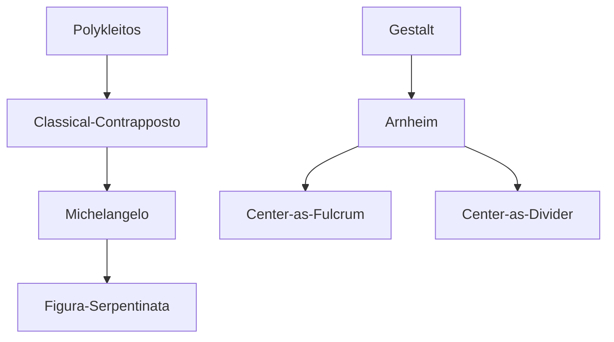

---
cssclasses:
  - Philosophy
  - Arts
  - Psychology
subclasses:
  - Aesthetics
  - Design-Theory
related:
  - "[[Arnheim]]"
  - "[[Picasso]]"
  - "[[Michelangelo]]"
  - "[[Rembrandt]]"
  - "[[Tiziano]]"
  - "[[El Greco]]"
aliases:
  - visual equilibrium
  - center composition
  - compositional stability
  - bipolar composition
  - eccentric vectors
  - contrapposto sculpture
  - figure serpentinata
  - diagonal tension
  - visual centrality
  - pictorial balance
reference:
  - "Arnheim, R. (1994). Il potere del centro: psicologia della composizione nelle arti visive (Nuova versione). Einaudi. (pp. 125-165)"
---

#### Central Problem

How does the center of equilibrium function in visual composition? What are its dual functions—stabilizing and dividing—and how can the artist exploit the tension between central and eccentric positions to create dynamic meaning in artworks?

#### Main Thesis

The visual center of equilibrium performs two fundamental and apparently opposed functions: on one hand it provides stability and permanence, conferring predominance and atemporality to elements placed in central position; on the other it can act as a divisive element in bipolar compositions, separating and at the same time connecting distinct parts through a compositional "bolt." Creative tension arises from deviation from the center—through contrapposto, figura serpentinata, and diagonal vectors—which enriches the dynamics of visual form without losing reference to the central fulcrum.

#### Historical Context

The text situates itself within the tradition of Gestalt psychology applied to the analysis of visual arts. Arnheim traverses Western art history from Byzantine art to the twentieth century, analyzing how artists of different periods have manipulated the relationship between centricity and eccentricity. Particular attention is given to Greek contrapposto (Polykleitos), its Renaissance evolution into the figura serpentinata (Michelangelo), the Baroque style characterized by perceptual ambiguity (Rembrandt, El Greco), up to Picasso's modern compositions. The discourse also includes references to dance (Isadora Duncan, Eastern vs Western dance) and Japanese Nō theater.

#### Philosophical Lineage

#### Key Thinkers

| Thinker | Dates | Movement | Main Work | Core Concept |
|---------|-------|----------|-----------|--------------|
| [[Arnheim]] | 1904–2007 | [[Gestalt]] | *The Power of the Center* | Visual center of equilibrium |
| [[Polykleitos]] | 5th c. BCE | [[Classical Greek Sculpture]] | *Doryphoros* | Contrapposto |
| [[Michelangelo]] | 1475–1564 | [[High Renaissance]] | *Victory*, *Crucifixion* | Figura serpentinata |
| [[Rembrandt]] | 1606–1669 | [[Dutch Baroque]] | *Self-Portrait*, *Night Watch* | Compositional ambiguity |
| [[Picasso]] | 1881–1973 | [[Modernism]] | *Guernica*, *Family of Saltimbanques* | Tripartite centric symmetry |
| [[El Greco]] | 1541–1614 | [[Mannerism]] | *Cleansing of the Temple*, *Agony in the Garden* | Mannerist tension |
| [[Titian]] | 1488–1576 | [[Venetian Renaissance]] | *Noli me tangere*, *Holy Family* | Bipolar composition |

#### Key Concepts

| Concept | Definition | Related to |
|---------|------------|------------|
| Center of equilibrium | Compositional fulcrum that confers stability, permanence, and predominance to centrally placed elements | [[Arnheim]], symmetry |
| Contrapposto | Sculptural technique that shifts body weight to one leg, creating oscillations in horizontal axes | [[Polykleitos]], Greek sculpture |
| Figura serpentinata | Three-dimensional evolution of contrapposto: the figure coils spirally around its internal axis | [[Michelangelo]], Renaissance |
| Bipolar composition | Compositional schema based on the encounter of two separate agents, divided and balanced by a central axis | [[Arnheim]], dialogue |
| Compositional bolt | Element that simultaneously divides and unites the two parts of a bipolar composition | [[Arnheim]], Tree of Knowledge |
| Eccentric vector | Dynamic direction that deviates from normal spatial structure (vertical/horizontal), creating tension | [[Arnheim]], diagonals |
| Perceptual induction | The center of equilibrium can be virtually present even when no element physically occupies it | [[Arnheim]], Franz Kline |

#### Authors Comparison

| Theme | [[Arnheim]] | Traditional View |
|-------|-------------|------------------|
| Center function | Dual: stabilize and divide | Only stabilize |
| Empty center | Can be more powerful than occupied center | Requires physical presence |
| Deviation | Enriches compositional dynamics | Disturbs equilibrium |
| Ambiguity | Positive characteristic (Baroque) | Compositional defect |
| Diagonals | Mediate between vertical hierarchy and horizontal parity | Mere decoration |

#### Influences & Connections

- **Predecessors:** [[Arnheim]] ← influenced by ← [[Gestalt]], [[Vitruvius]], [[Burckhardt]]
- **Historical sources:** [[Polykleitos]] → developed by → [[Michelangelo]], [[Rembrandt]]
- **Contemporary dialogue:** [[Arnheim]] ↔ references ↔ [[Barthes]], [[Zevi]], [[Hogarth]]
- **Applications:** [[Arnheim]] → applied to → painting, sculpture, dance, theater

#### Summary Formulas

- **[[Arnheim]] on the center:** The visual center of equilibrium provides stability and permanence, but creative tension arises from deviation—through contrapposto, oblique vectors, and bipolar compositions.
- **[[Arnheim]] on bipolar composition:** The central axis divides the two parts but requires a "bolt" to connect them; the eccentric vector crosses the separation creating dynamic interaction.
- **[[Arnheim]] on the human figure:** Organized around two rival centers (head and pelvic area), it offers the artist the choice of emphasizing man's spiritual or material nature.

#### Notable Quotes

> "Central position implies a sense of permanence. Geometrically, of course, the center is a point. Perceptually it extends as far as the condition of balanced stability holds." — [[Arnheim]]

> "The image comes alive and acquires organizational unity only if the play of its vectors is seen as oriented around a central fulcrum—which is given, however, only indirectly through perceptual induction." — [[Arnheim]]

> "If the two parts did not interact, there would be no good reason to unite them in the same composition. Therefore, the axis that divides usually also carries an element of union." — [[Arnheim]]

---

> [!warning]-
> This annotation was normalised using a large language model and may contain inaccuracies. These texts serve as preliminary study resources rather than exhaustive references.
