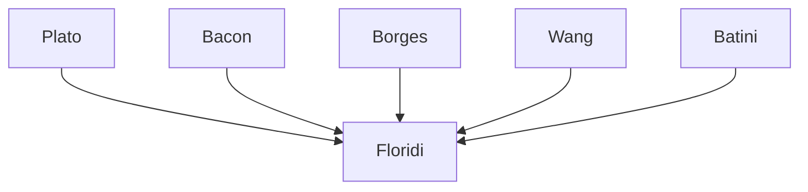

---

cssclasses:
  - Philosophy
  - Computer-Science
subclasses:
  - Epistemology
  - Philosophy-of-Science
  - Information-Retrieval
related:
  - "[[Philosophy as Conceptual Design (1 of 9)]]"
  - "[[Constructionism as Non-naturalism (2 of 9)]]"
  - "[[Perception and Testimony as Data Providers (3 of 9)]]"
  - "[[Information Quality (4 of 9)]]"
  - "[[Informational Scepticism and the Logically Possible (5 of 9)]]"
  - "[[A Defence of Information Closure (6 of 9)]]"
  - "[[Logical Fallacies as Bayesian Informational Shortcuts (7 of 9)]]"
  - "[[Maker’s Knowledge, between A Priori and A Posteriori (8 of 9)]]"
  - "[[Logic of Design as a Conceptual Logic of Information (9 of 9)]]"
aliases:
  - big data
  - small patterns
  - information quality
  - fit purpose
  - data quality
  - zettabyte era
  - bicategorical approach
  - purpose depth
  - purpose scope
  - data epistemology
reference:
  - "Floridi, L. (2019). The logic of information: A theory of philosophy as conceptual design (First edition). Oxford University Press. (pp. 101-112)"
tags:
  - Podcast
---

#### Podcast

<iframe allow="autoplay *; encrypted-media *; fullscreen *; clipboard-write" frameborder="0" height="150" style="width:100%;overflow:hidden;border-radius:10px;background:transparent;" sandbox="allow-forms allow-popups allow-same-origin allow-scripts allow-storage-access-by-user-activation allow-top-navigation-by-user-activation" src="https://embed.podcasts.apple.com/us/podcast/the-logic-of-information-a-theory-of/id1786764068?i=1000681417145&uo=4&l=en-GB&theme=auto"></iframe>

> [!tip] This episode is part of a series — click "See More" for all the episodes.

---

#### Central Problem

What is the real epistemological problem posed by big data, and how can we evaluate information quality (IQ) in an era characterized by data overabundance? The chapter addresses two interconnected issues: (1) the epistemological problem of big data is not the excessive quantity of data, but the identification of "small patterns" — the subtle and meaningful patterns hidden in oceans of data; (2) the standard definition of information quality as "fit-for-purpose" is correct but insufficient, since it does not account for the multi-purpose and re-purposable nature of information.

The fundamental difficulty lies in the tension between "purpose-depth" (how well information serves its original purpose) and "purpose-scope" (how easily it can be re-used for new purposes). Information can be highly suited to a specific purpose but terrible for other unforeseen uses — as demonstrated by the dramatic cases of the Dutch census during the Holocaust or British postal codes used for purposes other than mail delivery.

#### Main Thesis

The central thesis is twofold. First: the problem with big data is not that there is too much of it, but that small and meaningful patterns ("small patterns") are invisible to the computationally naked eye. The solution is not purely technological but epistemological: competencies are needed to know which questions to ask, which data to collect, curate, and query. As Plato states in the *Cratylus* (390c), the game will be won by those who "know how to ask and answer questions."

Second: information quality (IQ) must be analyzed through a **bi-categorical approach** that distinguishes between:
- **P–purpose** (Production purpose): the purpose for which information is originally produced
- **C–purpose** (Consumption purpose): the purposes (potentially unlimited) for which the same information can be consumed/reused

This approach allows evaluating the different dimensions of IQ (accuracy, completeness, timeliness, accessibility, etc.) relative to purpose, avoiding both relativism and absolutism. IQ is not an absolute but a relational property: the same information can have high quality for one use and low for another.

#### Historical Context

The chapter is situated in the era of the "zettabyte flood" — the term coined by Floridi to describe the data tsunami characterizing post-industrial societies. In 2006, humanity had accumulated 180 exabytes of data; by 2011 the zettabyte barrier (1,600 exabytes) was surpassed, with projections of 44 zettabytes by 2020.

The institutional context includes failed attempts to define information quality: the US Information Quality Act (2000) left key concepts undefined; the British Kennedy Report (2001) recognized that "all healthcare is information-driven" but as late as 2004 the NHS admitted there was no agreement on what IQ is. The first International Conference on Information Quality dates to 1996, the ACM's Journal of Data and Information Quality to 2006.

From a technological standpoint, since 2007 the world produces more data than available storage: we have moved from the problem of what to save to the problem of what to delete.

#### Philosophical Lineage

#### Key Thinkers

| Thinker | Dates | Movement | Main Work | Core Concept |
|---------|-------|----------|-----------|--------------|
| [[Plato]] | 428-348 BCE | [[Ancient Philosophy]] | *Cratylus* | Knowing = knowing how to ask and answer questions |
| [[Wang]] | contemporary | [[Information Quality (4 of 9)]] | Data Quality (1998) | IQ dimensions and categories |
| [[Batini]] | contemporary | [[Data Management]] | *Data Quality* (2006) | IQ taxonomies, fit-for-purpose |
| [[Borges]] | 1899-1986 | [[Literature]] | *The Analytical Language of John Wilkins* | Arbitrary taxonomies |
| [[Bacon]] | 1561-1626 | [[Empiricism]] | *Novum Organum* | Open marketplace of ideas |

#### Key Concepts

| Concept | Definition | Related to |
|---------|------------|------------|
| Small patterns | Subtle and meaningful patterns hidden in big data, invisible without epistemological analysis | [[Big Data]], [[Epistemology]] |
| Zettabyte flood | The era characterized by data accumulation in the zettabyte order | [[Floridi]], [[Information Society]] |
| Fit-for-purpose | Standard conception of IQ as adequacy to purpose | [[Information Quality (4 of 9)]], [[Pragmatism]] |
| P–purpose | Purpose for which information is originally produced (Production) | [[Floridi]], [[IQ]] |
| C–purpose | Purpose(s) for which information is consumed/reused (Consumption) | [[Floridi]], [[IQ]] |
| Purpose-depth | How well information serves the specific original purpose | [[Floridi]], [[IQ]] |
| Purpose-scope | How easily information can be re-used for new purposes | [[Floridi]], [[IQ]] |
| Bi-categorical approach | IQ analysis method distinguishing P–purpose and C–purpose | [[Floridi]], [[Methodology]] |
| IQ dimensions | Information properties: accuracy, completeness, timeliness, accessibility, etc. | [[Information Quality (4 of 9)]], [[Data Science]] |
| Relationalism | Position that IQ is relative to purpose, neither absolute nor relativist | [[Floridi]], [[Epistemology]] |

#### Authors Comparison

| Theme | [[Floridi]] | [[Batini]] | Posizione standard |
|-------|-------------|------------|-------------------|
| IQ definition | Bi-categorical: P–purpose vs C–purpose | Fit-for-purpose with objective dimensions | Generic fit-for-purpose |
| Big data problem | Small patterns (epistemological) | Volume and complexity (technological) | Too much data (quantitative) |
| Solution | Epistemology + technology | Quantitative metrics | More computational power |
| Relativism | Relationalism (no relativism) | Objective measures possible | Often implicit |
| Re-purposing | Central, source of tension | Recognized but not systematized | Ignored or undervalued |

#### Influences & Connections

- **Predecessors:** [[Floridi]] ← influenced by ← [[Plato]], [[Bacon]], [[Wang]], [[Batini]]
- **Contemporaries:** [[Floridi]] ↔ dialogue with ↔ MIT Information Quality Program, ACM JDIQ
- **Followers:** [[Floridi]] → influenced → Data ethics, Information governance, Analytics philosophy
- **Opposing views:** [[Floridi]] ← criticized by ← Tecnologisti (soluzione puramente tecnologica), Relativisti IQ

#### Summary Formulas

- **[[Floridi]]:** The problem of big data is small patterns; the solution is epistemological, not just technological. IQ requires a bi-categorical approach distinguishing P–purpose and C–purpose.
- **[[Plato]]:** "The one who knows is the one who knows how to ask and answer questions" — fundamental criterion for navigating the ocean of data.
- **Bi-categorical approach:** For any information I, IQ must be evaluated with respect to both P–purpose (production) and C–purpose (consumption), recognizing that values may differ.

#### Timeline

| Year | Event |
|------|-------|
| 1996 | First International Conference on Information Quality |
| 2000 | USA: Information Quality Act (Data Quality Act) |
| 2001 | UK: Kennedy Report on information in NHS |
| 2006 | ACM launches Journal of Data and Information Quality |
| 2006 | Humanity reaches 180 exabytes of data |
| 2007 | Data production surpasses available storage |
| 2011 | Zettabyte barrier surpassed (1,600 exabytes) |

#### Notable Quotes

> "The real, epistemological problem with big data is small patterns." — [[Floridi]]

> "The game will be won by those who 'know how to ask and answer questions'." — [[Floridi]], citando [[Plato]] (*Cratylus* 390c)

> "Half of our data is junk, we just do not know which half." — [[Floridi]]

---
> [!warning]-
> This annotation was normalised using a large language model and may contain inaccuracies. These texts serve as preliminary study resources rather than exhaustive references.
