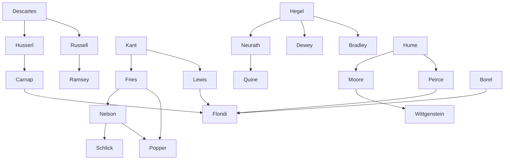

---
cssclasses:
  - Philosophy
  - Computer-Science
subclasses:
  - Epistemology
  - Philosophy-of-Mind
  - Analytic-Philosophy
related:
  - "[[Epistemology]]"
  - "[[Scepticism]]"
  - "[[Possible Worlds]]"
  - "[[Peirce]]"
  - "[[Descartes]]"
  - "[[Information Theory]]"
aliases:
  - informational scepticism
  - borel numbers
  - hamming distance
  - radical scepticism
  - moderate scepticism
  - possible worlds
  - edit distance
  - modal metrics
  - fallibilist epistemology
  - leibniz identity
  - epistemic redundancy
reference:
  - "Floridi, L. (2019). The logic of information: A theory of philosophy as conceptual design (First edition). Oxford University Press. (pp. 113-148)"
---

#### Central Problem

How can we know that the world really is as our informational constructs tell us it is? This is the classic sceptical challenge applied to the domain of semantic information. After establishing that perception and testimony provide data for constructing semantic artefacts, and that information quality can be evaluated through bi-categorical analysis, the fundamental question remains about the truthfulness of our information — whether our data-based models accurately represent external reality.

The problem becomes acute because informational scepticism does not claim that the distance between our model and the system is greater than zero, but rather that such distance *cannot be established*. Using scenarios like dreaming, being a brain in a vat, or living in a Matrix, the sceptic argues that we might be radically misinformed: our model M might be indistinguishable from another model D (dreamt), which carries information about a possible virtual world V that could be very different from the real system S.

The chapter also addresses a meta-epistemological dimension: beyond asking whether knowledge is possible (K), there is the question of whether epistemology itself is possible (KK) — whether we can have a theory of knowledge that answers the first question without circular reasoning.

#### Main Thesis

[[Floridi]] defends a twofold answer to informational scepticism through a "co-optation strategy": either informational scepticism is radical, in which case it is epistemologically innocuous because informationally redundant; or it is moderate, in which case it is epistemologically beneficial because informationally useful.

The argument proceeds through a novel formal apparatus:

**Borel Numbers as World Descriptions:** Every possible world can be characterized by its Borel number (β) — a binary string encoding answers to Boolean questions asked relative to specific Context, Level of Abstraction, and Purpose (CLP) parameters. These numbers are the minimal computational resources needed to specify a possible world.

**Hamming Distance as Modal Metrics:** The edit distance between Borel numbers provides a precise metric for comparing possible worlds. The Hamming distance measures the minimum substitutions required to change one string into another, satisfying all four axioms of a metric space (non-negativity, identity of indiscernibles, symmetry, triangle inequality).

**The Redundancy Argument:** Through the constrained identity of co-informatives principle (derived from Leibniz), if βM and βS are co-informative at given CLP parameters, they are identical at those parameters. Since the agent continuously edits their model until no further information could make a difference, the Hamming distance between model and system must be zero. All sceptical scenarios collapse: hd₁ = hd₄ = hd₆ = 0.

**Moderate Scepticism as Methodology:** While radical scepticism is redundant, moderate scepticism provides essential benchmarks for testing information under extreme but plausible conditions. Following Peirce rather than Descartes, genuine doubt drives inquiry and the scientific method.

#### Historical Context

The chapter situates the sceptical problem within the "renaissance of epistemology" between the two world wars, which formed a bridge between early modern and contemporary epistemology. This period witnessed an anti-metaphysical and naturalist reaction against nineteenth-century Neo-Kantian and Neo-Hegelian idealism.

Three major traditions emerged:

**German Non-Naturalist Tradition:** Rooted in Helmholtz's scientific reinterpretation of Kant, Brentano's phenomenology, and Mach's neutral monism. Husserl formulated the principle that epistemology's justificatory ground cannot come from other instances of knowledge — violating this constitutes a "naturalistic fallacy" in epistemology. The Fries-Nelson tradition posed the trilemma: premises can be dogmatically assumed, justified by infinite regress, or anchored to psychology.

**British Naturalist Tradition:** Moore's defence of common sense against scepticism through presumptive and pervasive credibility, Russell's foundationalism based on sense data and degrees of complexity, and the protocol sentence debate between Schlick's externalist foundationalism (Konstatierungen as indubitable affirmations) and Neurath's coherentism (the ship metaphor: rebuilding while sailing).

**American Pragmatist Tradition:** Dewey's anti-Cartesian contextualism rejecting foundationalism, the primacy of knowledge, and the spectator theory; Lewis's pragmatic apriorism combining phenomenalist foundationalism with a theory of the a priori as modifiable interpretive criteria.

#### Philosophical Lineage

#### Key Thinkers

| Thinker | Dates | Movement | Main Work | Core Concept |
|---------|-------|----------|-----------|--------------|
| [[Descartes]] | 1596-1650 | [[Rationalism]] | *Meditations* | Methodological doubt, clearing ground for foundations |
| [[Peirce]] | 1839-1914 | [[Pragmatism]] | *The Fixation of Belief* | Fallibilism, scientific method through genuine doubt |
| [[Husserl]] | 1859-1938 | [[Phenomenology]] | *The Idea of Phenomenology* | Index of questionability, non-naturalism |
| [[Neurath]] | 1882-1945 | [[Logical Positivism]] | *Protocol Sentences* | Ship metaphor, coherentism, holism |
| [[Lewis]] | 1883-1964 | [[Pragmatism]] | *Mind and the World-Order* | Pragmatic apriorism, terminating judgements |
| [[Borel]] | 1871-1956 | [[Mathematics]] | *Leçons sur la théorie des fonctions* | Borel numbers, mathematical finitism |

#### Key Concepts

| Concept | Definition | Related to |
|---------|------------|------------|
| Borel Number (β) | Binary string encoding answers to Boolean questions about a possible world relative to CLP parameters; the minimal computational resources to specify a world | [[Floridi]], [[Information Theory]] |
| Hamming Distance | Metric measuring minimum substitutions to change one string into another; satisfies all four metric axioms | [[Floridi]], [[Modal Logic]] |
| CLP Parameters | Context, Level of Abstraction, Purpose — the framework within which questions acquire meaning and comparisons become valid | [[Floridi]], [[Epistemology]] |
| Co-informativeness | Two items p and q are co-informative iff all information in p is inferable from q and vice versa; they exclude exactly the same possible worlds | [[Floridi]], [[Leibniz]] |
| Radical Scepticism | Metaphysical doubt about logically possible worlds (dreams, Matrix, brains in vats); argued to be informationally redundant | [[Descartes]], [[Epistemology]] |
| Moderate Scepticism | Methodological doubt concerning actual errors, biases, and fallibility; essential for information refinement | [[Peirce]], [[Epistemology]] |
| Constrained Identity | If p and q are co-informative at given CLP parameters, they are identical at those parameters | [[Floridi]], [[Leibniz]] |
| Inverse Relationship Principle | Inverse relation between probability of information i and semantic content carried by i | [[Bar-Hillel]], [[Carnap]] |
| Protocol Sentences | Basic observation statements; debated between Schlick's externalist and Neurath's coherentist interpretations | [[Logical Positivism]] |
| Fregean Numbers | One-digit Borel numbers (1 or 0); trivial because complex systems require finer-grained analysis | [[Floridi]], [[Frege]] |

#### Authors Comparison

| Theme | [[Descartes]] | [[Peirce]] | [[Floridi]] |
|-------|---------------|------------|-------------|
| Role of doubt | Clearing ground for static foundations | Keeping inquiry open, falsificationist | Co-optation: redundant if radical, useful if moderate |
| Epistemological goal | Certainty, indubitable foundations | Fallibilism, community consensus | High-quality information, zero Hamming distance |
| Agent conception | Individual mind, internal monologue | Community of inquirers | Embedded information processor (a) |
| Sceptical scenarios | Dreaming, evil demon | Genuine vs. paper doubts | Matrix, brains in vats, virtual worlds |
| Method | Foundationalism | Scientific method | Information-theoretic formalization |
| Truth criterion | Clear and distinct ideas | Successful inquiry outcomes | Commutative relation, model-target fitness |

#### Influences & Connections

- **Predecessors:** [[Floridi]] ← influenced by ← [[Peirce]], [[Leibniz]], [[Borel]], [[Carnap]], [[Lewis]]
- **Contemporaries:** [[Floridi]] ↔ engages with ↔ [[Chaitin]], [[Hamming]], [[Williamson]]
- **Historical roots:** [[Husserl]] → formulated → non-naturalist principle against psychologism
- **Tradition:** [[Schlick]] ↔ debated ↔ [[Neurath]] on protocol sentences and foundationalism
- **Opposing views:** [[Descartes]] (static foundations) ← contrasted with ← [[Peirce]] (dynamic inquiry)

#### Summary Formulas

- **[[Floridi]]:** Radical informational scepticism is informationally redundant; moderate scepticism is methodologically essential. Borel numbers and Hamming distances formalize modal closeness, proving that co-informative models are identical at given CLP parameters.

- **[[Peirce]]:** Genuine doubt drives inquiry through the scientific method; fallibilism accepts we might be wrong while pursuing inter-subjective agreement constrained by reality.

- **[[Husserl]]:** The justificatory ground of epistemology cannot be provided by other instances of knowledge; positing the question asks normatively whether what counts as knowledge deserves that description.

- **[[Neurath]]:** We are like sailors rebuilding our ship on the open sea — sentences can only be compared with other sentences, no external position is achievable, coherence replaces correspondence.

#### Timeline

| Year | Event |
|------|-------|
| 1641 | [[Descartes]] publishes *Meditations* with dreaming argument |
| 1807 | [[Fries]] publishes *Neue Kritik der Vernunft* with foundational trilemma |
| 1877 | [[Peirce]] publishes *The Fixation of Belief* |
| 1907 | [[Husserl]] delivers *The Idea of Phenomenology* lectures |
| 1927 | [[Borel]] introduces "know-it-all number" defending mathematical finitism |
| 1932 | Schlick-Neurath protocol sentence debate in *Erkenntnis* |
| 1950 | [[Hamming]] introduces error-detecting codes using edit distance |
| 1973 | [[Lewis]] publishes *Counterfactuals* with possible worlds semantics |

#### Notable Quotes

> "The real epistemological problem with big data is small patterns." — [[Floridi]]

> "We are like sailors who have to rebuild their ship on the open sea, without ever being able to dismantle it in dry-dock and reconstruct it from its best components." — [[Neurath]]

> "By doubt indeed we come to questioning; by questioning, we perceive the truth." — [[Abelard]]

---
> [!warning]-
> This annotation was normalised using a large language model and may contain inaccuracies. These texts serve as preliminary study resources rather than exhaustive references.
