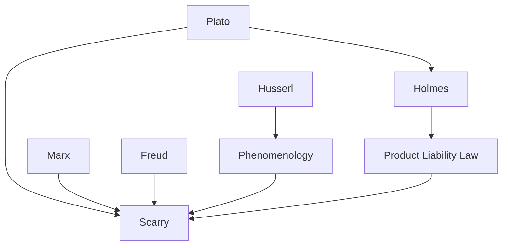

---
cssclasses:
  - Philosophy
subclasses:
  - Aesthetics
  - Ethics
  - Phenomenology
related:
  - "[[Sentience]]"
  - "[[Artifact]]"
  - "[[Making]]"
  - "[[Body]]"
  - "[[Marx]]"
  - "[[Imagination]]"
aliases:
  - body pain
  - artifact making
  - sentient awareness
  - material culture
  - object animism
  - projection sentience
  - making unmaking
  - creation labor
  - disembodiment objects
  - cultural artifice
reference:
  - "Scarry, E. (1987). The body in pain: the making and unmaking of the world. University of Oxford Press. (pp. 278-326)"
---

#### Central Problem

How do human beings transform their interior, private experience of sentience—particularly pain—into the external, shareable world of made objects? Scarry investigates the structural relationship between the human body, physical pain, and the creation of artifacts. The central philosophical puzzle concerns the paradox of creation: artifacts appear to possess a kind of sentience or "awareness" despite being inanimate, and this quasi-animate quality is essential to their capacity to serve human beings.

The text grapples with the widespread perceptual confusion that occurs in contexts of political power, torture, and war, where the structure of making collapses into its opposite—unmaking. When physical pain destroys mental content and language, observers too become unable to perceive what is occurring. Scarry argues that understanding political justice requires first understanding the structure of making and unmaking. The problem extends to how artifacts, once created, exercise power back upon their creators in ways that can either liberate or enslave.

#### Main Thesis

Scarry advances a complex phenomenological argument about the nature of artifacts and human creation:

**1. Artifacts as Projections of the Body:** Made objects are not merely tools but material records of human sentience. This projection occurs in three ways: (a) artifacts mime body parts (clothing as second skin, the pump as externalized heart, the computer as projected nervous system); (b) artifacts embody bodily capacities and needs (memory externalized in libraries, desire in economic structures); (c) most radically, artifacts make the external world "sentient"—they invest the inanimate with awareness of human pain.

**2. The Animism of Objects:** While animism is often dismissed as primitive fallacy, Scarry argues it reveals something true about creation: artifacts genuinely do contain a "materialized structure of compassion." A chair is not simply mimetic of the spine or body weight—it is the embodied form of "perceived-pain-wished-gone." When we punish objects that hurt us (legally or by kicking a door), we reveal our deep expectation that the made world should "know" about and respond to human sentience.

**3. The Artifact as Lever:** The made object is merely a midpoint in a total arc of action. Creation includes both the making of the object and the object's remaking of the human being. The key structural feature is asymmetry: the action of reciprocation vastly exceeds the action of creation. A few weeks of labor yields years of warmth; a single invention benefits millions. This excess is not accidental but constitutive of what an artifact is.

**4. The Self-Revising Imagination:** The imagination has an inherent tendency toward largesse, self-revision, and ultimately self-effacement. It works continuously to project the facts of sentience outward, diminishing the isolation of pain while amplifying the acuities of consciousness. Culture itself is the "made-lever" across which human evolution occurs.

#### Historical Context

Written in the aftermath of the Vietnam War and amid Cold War tensions, *The Body in Pain* (1985) emerges from a period of intense philosophical reflection on violence, power, and human vulnerability. The text engages with the Western tradition of thinking about artifacts—from Plato's *Laws* through Oliver Wendell Holmes's legal theory to contemporary product liability law.

The chapter draws on multiple historical moments: the Old Testament's treatment of graven images and passover objects; the medieval and early modern development of the pump (from ancient Egypt through Harvey's discovery of circulation); the 1976 Korean demilitarized zone incident; and contemporary American legal practice. The reference to the Carter administration's human rights policy and the comparison of U.S. and Soviet rights frameworks situates the argument in specific Cold War debates about civil versus economic rights.

Scarry's intervention occurs at the intersection of phenomenology, Marxist theory, psychoanalysis, and legal studies. Her approach synthesizes Continental and Anglo-American philosophical traditions in ways unusual for 1980s American humanities scholarship.

#### Philosophical Lineage

#### Key Thinkers

| Thinker | Dates | Movement | Main Work | Core Concept |
|---------|-------|----------|-----------|--------------|
| [[Marx]] | 1818-1883 | [[Historical Materialism]] | *Capital* | Commodity fetishism, alienated labor |
| [[Freud]] | 1856-1939 | [[Psychoanalysis]] | *Civilization and Its Discontents* | Projection, bodily desire in artifacts |
| [[Plato]] | c. 428-348 BCE | [[Ancient Philosophy]] | *Laws* | Object-punishment, legal animism |
| [[Holmes]] | 1841-1935 | [[Legal Realism]] | *The Common Law* | Liability, moral impulse in tort law |
| [[Harvey]] | 1578-1657 | [[Natural Philosophy]] | *De Motu Cordis* | Heart as pump |
| [[von Neumann]] | 1903-1957 | [[Mathematics]] | Computer architecture | Nervous system as computational model |

#### Key Concepts

| Concept | Definition | Related to |
|---------|------------|------------|
| Making sentient | The process by which artifacts invest the external world with awareness of human pain, as if objects could perceive and respond to sentience | [[Phenomenology]], [[Scarry]] |
| Object-stupidity | The failure of an artifact to be responsive to human sentience; the inanimate's privilege of indifference to the problems of the body | [[Ethics]], [[Product Liability]] |
| Artifact as lever | The made object as a midpoint in a total arc of action, where creation's force is magnified and returned to remake the makers | [[Phenomenology]], [[Making]] |
| Reciprocation excess | The structural asymmetry wherein the artifact's action of remaking humans vastly exceeds the labor invested in creating it | [[Marx]], [[Creation]] |
| Made-up/Made-real | Two stages of creation: first mentally inventing an object (making-up), then giving it material form (making-real) | [[Imagination]], [[Artifice]] |
| Materialized compassion | The artifact as embodied form of "perceived-pain-wished-gone"—not merely mimetic of body but of sentient awareness itself | [[Ethics]], [[Phenomenology]] |
| General human signature | The trace of human labor visible in made objects (seams, marks) that allows recovery of their "madeness" | [[Marx]], [[Artifact]] |
| Self-effacing imagination | The tendency of creation to obscure its own activity, allowing artifacts to appear as natural givens rather than human projections | [[Phenomenology]], [[Imagination]] |
| Caritas of objects | The anonymous benevolence built into mass-produced artifacts: "Whoever you are... in at least this small way, be well" | [[Ethics]], [[Material Culture]] |
| Categories of madeness | Three types: super-real objects (gods, hiding their human origin), ordinary artifacts (general signature, recoverable), and art (self-announcing fictionality) | [[Aesthetics]], [[Scarry]] |

#### Authors Comparison

| Theme | [[Scarry]] | [[Marx]] |
|-------|------------|----------|
| Object animism | Reveals truth about creation: artifacts genuinely contain projected sentience | Critiqued as fetishism, yet unavoidably used in analysis |
| Labor | Embodied projection of wish for others' well-being | Source of value, alienated under capitalism |
| Artifact's power | Recreates and liberates human makers | Appears to create humans when the reverse is true |
| Material wealth | Champions of human beings; should be equitably distributed | Site of exploitation; obscures relations of production |
| Imagination | Central to human identity; self-revising and self-effacing | Superstructural; determined by material conditions |

#### Influences & Connections

- **Predecessors:** [[Scarry]] ← influenced by ← [[Marx]], [[Freud]], [[Plato]], [[Holmes]]
- **Contemporaries:** [[Scarry]] ↔ dialogue with ↔ [[Phenomenology]], [[Legal Theory]]
- **Themes:** [[Scarry]] → developed → material culture theory, design philosophy, ethics of making
- **Opposing views:** [[Scarry]] ← critiques ← naive dismissal of animism as "pathetic fallacy"

#### Summary Formulas

- **[[Scarry]]:** The artifact is a materialized structure of compassion—the embodied form of perceived-pain-wished-gone—that makes the inanimate world responsive to human sentience.

- **On creation's asymmetry:** Making is a lever: the labor of creation is vastly exceeded by the artifact's power to remake its makers, and this excess is constitutive of what an artifact is.

- **On imagination:** The imagination is large-spirited, self-revising, and self-effacing; it works to project sentience outward while eventually obscuring its own activity.

- **On ethics:** Artifacts are, however modestly, the champions of human beings; by crediting objects we reach the insight that their benefits must be equitably distributed.

#### Timeline

| Year | Event |
|------|-------|
| c. 350 BCE | [[Plato]] writes *Laws*, including statutes on object-punishment |
| 1628 | [[Harvey]] publishes *De Motu Cordis*, identifying heart's pumping action |
| 1867 | [[Marx]] publishes *Capital*, analyzing commodity fetishism |
| 1881 | [[Holmes]] delivers *The Common Law* lectures on liability |
| 1945 | [[von Neumann]] develops computer architecture based on neuronal model |
| 1976 | Korean DMZ tree incident illustrates object-animism in military action |
| 1985 | [[Scarry]] publishes *The Body in Pain* |

#### Notable Quotes

> "The shape of the chair is not the shape of the skeleton, the shape of body weight, nor even the shape of pain-perceived, but the shape of perceived-pain-wished-gone. The chair is therefore the structure of a wish; it is sentient awareness materialized into a design." — [[Scarry]]

> "Anonymous, mass-produced objects contain a quiet and equally important message: Whoever you are, and whether or not I like or even know you, in at least this small way, be well." — [[Scarry]]

> "It is not objects but human beings who require champions, but the realm of objects has been briefly attended to here because they are, however modestly, the champions of human beings." — [[Scarry]]

---
> [!warning]-
> This annotation was normalised using a large language model and may contain inaccuracies. These texts serve as preliminary study resources rather than exhaustive references.
