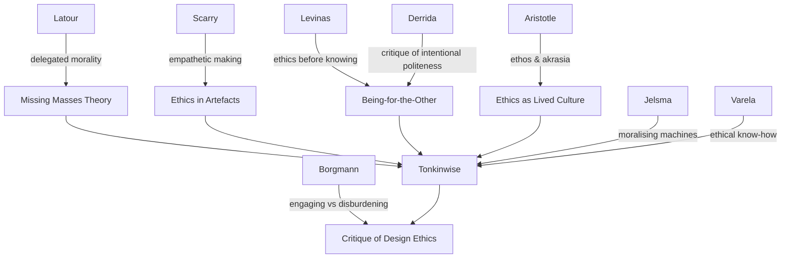

---
cssclasses:
  - Philosophy
subclasses:
  - Phenomenology
  - Aesthetics
related:
  - "[[Latour]]"
  - "[[Levinas]]"
  - "[[Derrida]]"
  - "[[Borgmann]]"
  - "[[Scarry]]"
  - "[[Aristotle]]"
aliases:
  - ethics ethos
  - materialised ethics
  - ethics design
  - moralising machines
  - akrasia ethos
  - delegated morality
  - missing masses
  - ethical things
  - design ethics
  - embodied ethics
  - sustainable ethics
  - material culture
reference:
  - Tonkinwise, C. (2004). Is Design Finished? Dematerialisation and Changing Things. Design Philosophy Papers, 2(3), 177–195. https://doi.org/10.2752/144871304X13966215068191
---

#### Central Problem

How can ethics be sustained as a lived cultural practice (*ethos*) rather than a codified set of rules (*morality*), and what role do designed things play in forming and preserving ethical ways of being in a culture that has lost its embedded ethics?

#### Main Thesis

Ethics only ever exists as *ethos* — an embedded, lived culture — and designed things are the "missing masses" that generate and sustain ethical ways of being. Design does not merely serve ethics but *is* ethical: objects inscribe empathetic care for human fragility and prescribe moral conduct, making design the primary vehicle through which cultures maintain their ethical coherence without requiring explicit moralising.

#### Historical Context

Writing in 2004 amid the sustainability crisis, Tonkinwise addresses the persistent failure of moral education and awareness campaigns to produce sustainable behaviour — what Aristotle called *akrasia* (knowing the right thing but not doing it). Post-Enlightenment culture's separation of knowing from doing has created an unsustainable gap that information alone cannot bridge. Tonkinwise synthesizes Actor-Network Theory, Levinasian ethics, phenomenology of artefacts, and design theory to propose that ethical change must be materialised in designed things rather than merely taught to human subjects.

#### Philosophical Lineage

#### Key Thinkers

| Thinker | Dates | Movement | Main Work | Core Concept |
|---------|-------|----------|-----------|--------------|
| [[Levinas]] | 1906–1995 | Phenomenology/Ethics | *Totality and Infinity* | Ethics as being-for-the-other before knowledge |
| [[Latour]] | 1947–2022 | Actor-Network Theory | "Where Are the Missing Masses?" | Delegated morality to non-human actors |
| [[Scarry]] | 1946– | Philosophy/Aesthetics | *The Body in Pain* | Making as ethical empathy materialised |
| [[Borgmann]] | 1937– | Philosophy of Technology | *Technology and the Character of Contemporary Life* | Engaging things vs disburdening devices |
| [[Aristotle]] | 384–322 BCE | Classical Philosophy | *Nicomachean Ethics* | *Akrasia* — knowing without doing |
| [[Jelsma]] | fl. 2000s | Design Theory | "Innovating for Sustainability" | Moralising machines and behaviour scripts |

#### Key Concepts

| Concept | Definition | Related to |
|---------|------------|------------|
| **Ethos** | Embedded, lived culture where ethics manifest as naturalised practices beyond conscious knowing | Morality, *paideia*, *Bildung* |
| **Morality** | Codified performance criteria meant to evidence ethical being, but always at risk of hollow mimicry | Ethos, ethics, convention |
| **Akrasia** | Knowing the right thing to do yet failing to do it; the gap between moral knowledge and ethical action | Sustainability, education |
| **Missing Masses** | Latour's theory that designed things constitute the hidden ethical force holding society together | Actor-Network Theory, hybrids |
| **Delegated Morality** | The inscription of ethical prescriptions into designed objects that then prescribe human behaviour | Scripts, affordances |
| **Engaging Things** | Borgmann's concept of objects that foster sustained, active attention and creative outcomes | Disburdening devices |
| **Disburdening Devices** | Designed things that relieve users of effort but risk reducing them to passive receptors | Engaging things, ethics |
| **Scripts** | The behavioural patterns inscribed in designed things that prompt, influence, or force certain actions | Affordances, design |

#### Authors Comparison

| Theme | Cameron Tonkinwise | Bruno Latour | Elaine Scarry | Albert Borgmann |
|-------|-------------------|--------------|---------------|-----------------|
| Primary concern | Sustainability through materialised ethics | Symmetry of human/non-human actors | Pain and the body in making | Focal practices vs device paradigm |
| Role of things | Generate and sustain ethos | Moral actors prescribing behaviour | Embody empathetic care for fragility | Either engage or disburden humans |
| View of design | Essential ethical practice | Inscription/prescription mechanism | Projection of empathy into matter | Risk of total disburdenment |
| Ethical formation | Through material culture, not education | Through human-thing hybrids | Through making as ethical act | Through engaging practices |

#### Influences & Connections

- **Draws from**: [[Levinas]] (ethics before ontology), [[Latour]] (missing masses, delegated morality), [[Scarry]] (making as empathy), [[Borgmann]] (engaging vs disburdening), [[Aristotle]] (*akrasia*, *ethos*), [[Varela]] (ethical know-how), [[Derrida]] (critique of intentional politeness)
- **Responds to**: Sustainability crisis, failure of moral education, separation of knowing and doing in modernity
- **Influences**: Design for sustainable behaviour, material culture studies, post-human ethics in design
- **Critique of**: Information-based behaviour change, purely technological efficiency solutions, user-centred design's reductive projections

#### Summary Formulas

1. **Ethics ≠ Morality**: Ethics is lived ethos; morality is codified rules that can be mimicked without ethical being
2. **Missing Masses Thesis**: Designed things constitute the hidden ethical force that prevents society's collapse into immorality
3. **Making = Ethics**: To make is to empathetically project care for another's pain into enduring material form
4. **Akrasia Crisis**: Modern culture knows what is right but cannot do it because ethics has been severed from embedded material practice
5. **Design Prescribes**: Things not only describe human being but *prescribe* how to be, scripting moral behaviour

#### Timeline

- **384–322 BCE**: [[Aristotle]] develops concept of *akrasia* and *ethos* as lived virtue
- **20th century**: [[Levinas]] develops ethics as being-for-the-other prior to ontology
- **1984**: [[Borgmann]] publishes *Technology and the Character of Contemporary Life*
- **1985**: [[Scarry]] publishes *The Body in Pain* on making and empathy
- **1992**: [[Latour]] publishes "Where Are the Missing Masses?"
- **1999**: [[Varela]] publishes *Ethical Know-How*
- **2003**: [[Jelsma]] develops "moralising machines" for sustainable behaviour
- **2004**: Tonkinwise publishes "Ethics by Design, or the Ethos of Things"

#### Notable Quotes

> "A viable ethos is not only sustained by a material culture, but exists in that materiality; an immaterial culture is an impossibility." — [[Tonkinwise]]

> "What things design, that is to say, the intentions, actions, understandings and relations that things are designed to design, that they design beyond what their designers intended, and that they are redesigned to design by those who use them, must be a vital part of any ethos with a future." — [[Tonkinwise]]

> "By being embedded in material culture, in the only ever semi-conscious everyday rituals of making use of designed products, environments and communications, ethics by/in design is the only sustainable form of ethics, the only form of ethics that can sustain itself." — [[Tonkinwise]]

---
> [!warning]-
> This annotation was normalised using a large language model and may contain inaccuracies. These texts serve as preliminary study resources rather than exhaustive references.
