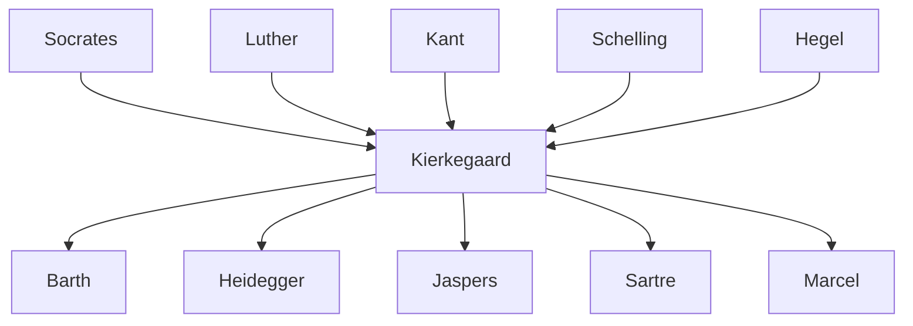

---
cssclasses:
  - Philosophy
subclasses:
  - Existentialism
  - Philosophy-of-Religion
  - 19th-Century-Philosophy
related:
  - "[[Existentialism]]"
  - "[[German Idealism]]"
  - "[[Hegel]]"
  - "[[Angst]]"
  - "[[Faith]]"
  - "[[Stages of Existence]]"
  - "[[Subjectivity]]"
  - "[[Either/Or]]"
  - "[[Fear and Trembling]]"
  - "[[The Sickness unto Death]]"
aliases:
  - single individual
  - stages existence
  - leap faith
  - subjective truth
  - aesthetic ethical
  - religious stage
  - either or
  - paradox scandal
reference:
  - "Abbagnano, N., & Fornero, G. (2012). La ricerca del pensiero. Vol. 3A. Da Schopenhauer a Freud. Paravia."
---

#### Central Problem

How should a human being exist authentically when confronted with radical uncertainty, infinite possibility, and the impossibility of objective certainty about life's most fundamental questions? Kierkegaard challenges the Hegelian system's claim to comprehend existence within rational categories and dialectical synthesis. Against [[Hegel]]'s view that the individual is absorbed into the universal movement of Spirit, Kierkegaard defends the irreducible singularity of the existing individual (den Enkelte) who must choose without guarantees.

The problem is both existential and religious: how can the finite individual relate to the infinite God? How can temporal existence connect with eternity? Kierkegaard discovers that human existence is constituted by possibility, which always includes the threat of nothingness — every "possibility-that-yes" is simultaneously a "possibility-that-no." This structure generates angst (anxiety) as the fundamental human condition, making authentic existence a matter of passionate, risky choice rather than detached rational comprehension.

#### Main Thesis

[[Kierkegaard]] maintains that existence precedes and exceeds conceptual thought — "existence corresponds to singular reality, to the single individual; it remains outside the concept." Against [[Hegel]]'s objective reflection, Kierkegaard champions subjective reflection: "Truth is truth only when it is truth for me." Truth is not the object of thought but the process by which one appropriates it, makes it one's own, and lives it.

Human existence unfolds through three irreducibly distinct stages or spheres, separated not by dialectical mediation but by "leaps":

**The Aesthetic Stage:** Life lived in the immediate moment, seeking novelty, variety, and refined pleasure. Embodied by Don Giovanni and the seducer, the aesthete treats existence as art, avoiding commitment and repetition. Yet this life leads inevitably to boredom, emptiness, and despair — revealing its inadequacy.

**The Ethical Stage:** Through the "choice of despair," one leaps to ethical existence characterized by commitment, duty, fidelity, and self-continuity. Embodied by the married man and the worker, ethical life involves choosing oneself in one's "eternal validity." Yet ethics too reveals its insufficiency through repentance, which discloses guilt and the need for a higher dimension.

**The Religious Stage:** The leap to faith, exemplified by Abraham who obeys God's command to sacrifice Isaac even against moral law. Faith is a "private rapport between man and God," an "absolute relation to the absolute" that suspends ethics. It is paradox and scandal — certitude born from uncertainty, requiring passionate commitment without rational guarantees.

The key categories are angst (anxiety before pure possibility), despair (the self's failed relation to itself), and faith (which alone can overcome both by anchoring the self in the power that established it — God).

#### Historical Context

[[Kierkegaard]] (1813-1855) lived in Copenhagen during the dominance of Hegelian philosophy. Educated in a severe Protestant religiosity by his father, he studied theology at Copenhagen (where Hegelianism prevailed) and completed a dissertation on Socratic irony (1841). In 1841-42 he attended Schelling's lectures in [[Berlin]], initially enthusiastic but soon disappointed. He never became a pastor despite his theological training.

Key biographical events profoundly shaped his thought: the mysterious "great earthquake" involving family guilt; the "thorn in the flesh" that led him to break his engagement to Regine Olsen; attacks from the satirical journal "The Corsair"; and his final polemics against the Danish Church and theologian Martensen. He published under multiple pseudonyms to distance himself from the positions described, maintaining a "poetic relation" to his own work.

Kierkegaard's anti-Hegelianism remained largely uninfluential in the nineteenth century, overshadowed by historicism, positivism, and Marxism. Only in the early twentieth century did the "[[Kierkegaard]] renaissance" begin — first in theology (Barth, Bultmann), then in existentialist philosophy (Heidegger, Jaspers, [[Sartre]]). [[Scheler]] called him a "deserter from Europe and its faith in history."

#### Philosophical Lineage

#### Key Thinkers

| Thinker | Dates | Movement | Main Work | Core Concept |
|---------|-------|----------|-----------|--------------|
| [[Kierkegaard]] | 1813-1855 | [[Existentialism]] | *Either/Or* | Single individual, stages of existence |
| [[Hegel]] | 1770-1831 | [[German Idealism]] | *Phenomenology of Spirit* | Absolute Spirit, dialectical synthesis |
| [[Schelling]] | 1775-1854 | [[German Idealism]] | *Philosophy of Revelation* | Distinction of reason and reality |
| [[Abraham]] | Biblical | [[Faith]] | Genesis 22 | Leap of faith, teleological suspension |

#### Key Concepts

| Concept | Definition | Related to |
|---------|------------|------------|
| Single Individual (den Enkelte) | The irreducible category of human existence; the individual is superior to the species | [[Kierkegaard]], [[Existentialism]] |
| Stages of Existence | Three spheres of life — aesthetic, ethical, religious — separated by qualitative leaps, not dialectical synthesis | [[Kierkegaard]], [[Existentialism]] |
| Angst (Anxiety) | The fundamental mood generated by possibility; dread of the nothing, of what may be | [[Kierkegaard]], [[Heidegger]] |
| Despair | The self's failed relation to itself; "mortal sickness" of wanting or not wanting to be oneself | [[Kierkegaard]], [[Existentialism]] |
| Leap of Faith | The non-rational transition between stages, especially to religious existence; decision without guarantees | [[Kierkegaard]], [[Faith]] |
| Subjective Truth | Truth as appropriation: "Truth is truth only when it is truth for me" | [[Kierkegaard]], [[Existentialism]] |
| Qualitative Dialectic | Opposition without synthesis (aut-aut vs. et-et); the tragic concreteness of life versus Hegelian reconciliation | [[Kierkegaard]], [[Anti-Hegelianism]] |
| Paradox and Scandal | The essence of Christian faith: God becoming a singular suffering man (Christ) | [[Kierkegaard]], [[Christianity]] |
| Contemporaneity | Every believer relates directly to Christ regardless of historical distance | [[Kierkegaard]], [[Christianity]] |

#### Authors Comparison

| Theme | [[Kierkegaard]] | [[Hegel]] | [[Schopenhauer]] |
|-------|-----------------|-----------|------------------|
| The individual | Singular, irreducible, superior to genus | Absorbed into universal Spirit | Manifestation of universal Will |
| Truth | Subjective appropriation | Objective systematic knowledge | Metaphysical insight into Will |
| Existence | Possibility, choice, risk | Rational necessity | Suffering, desire |
| Dialectic | Qualitative: aut-aut (either/or) | Speculative: et-et (both/and) synthesis | None (non-dialectical) |
| History | Not revelation of Absolute; individual before God | Theodicy, progress of Spirit | Meaningless repetition |
| Religion | Faith as paradox and scandal | Religion as picture-thinking of philosophy | Asceticism, denial of will |
| Freedom | Radical choice without guarantees | Recognition of rational necessity | Liberation through negation of will |

#### Influences & Connections

- **Predecessors:** [[Kierkegaard]] ← influenced by ← [[Socrates]], [[Luther]], [[Kant]], [[Schelling]]
- **Contemporaries:** [[Kierkegaard]] ← opposed to ← [[Hegel]], [[Martensen]], [[Danish Hegelians]]
- **Followers:** [[Kierkegaard]] → influenced → [[Heidegger]], [[Jaspers]], [[Sartre]], [[Barth]], [[Bultmann]], [[Marcel]]
- **Opposing views:** [[Kierkegaard]] ← criticized by ← [[Lukács]] (as irrationalism)

#### Summary Formulas

- **[[Kierkegaard]]:** The existing individual, irreducible to any system, must choose authentically among qualitatively distinct life-spheres through leaps of passionate commitment; only faith in the paradoxical God-man overcomes the angst and despair constitutive of human existence.

- **[[Hegel]]:** Reality is the self-development of Absolute Spirit through dialectical mediation, in which oppositions are reconciled in higher syntheses and the individual is a moment in universal history.

#### Timeline

| Year | Event |
|------|-------|
| 1813 | [[Kierkegaard]] born in Copenhagen |
| 1830 | [[Kierkegaard]] enrolls in theology at Copenhagen University |
| 1840 | [[Kierkegaard]] becomes engaged to Regine Olsen |
| 1841 | [[Kierkegaard]] breaks engagement; publishes dissertation *On the Concept of Irony* |
| 1841-42 | [[Kierkegaard]] attends [[Schelling]]'s lectures in [[Berlin]] |
| 1843 | [[Kierkegaard]] publishes *Either/Or*, *Fear and Trembling*, *Repetition* |
| 1844 | [[Kierkegaard]] publishes *The Concept of Anxiety*, *Philosophical Fragments* |
| 1845 | [[Kierkegaard]] publishes *Stages on Life's Way* |
| 1846 | [[Kierkegaard]] publishes *Concluding Unscientific Postscript* |
| 1849 | [[Kierkegaard]] publishes *The Sickness unto Death* |
| 1850 | [[Kierkegaard]] publishes *Training in Christianity* |
| 1855 | [[Kierkegaard]] dies in Copenhagen after attacking Danish Church in *The Moment* |

#### Notable Quotes

> "The Single Individual is the category through which, from the religious point of view, time, history, and humanity must pass." — [[Kierkegaard]]

> "Anxiety is the dizziness of freedom." — [[Kierkegaard]]

> "Truth is subjectivity; the appropriation of truth is truth." — [[Kierkegaard]]

---
> [!NOTE]
> *This summary has been created to present the key points from the source text, which was automatically extracted using LLM. Please note that the summary may contain errors. It serves as an essential starting point for study and reference purposes.*
