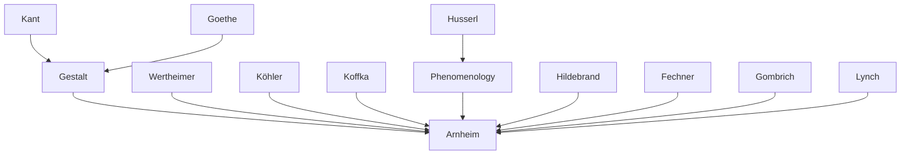

---
cssclasses:
  - Philosophy
  - Arts
  - Psychology
subclasses:
  - Aesthetics
  - Phenomenology
  - Design-Theory
related:
  - "[[Arnheim]]"
  - "[[Gestalt]]"
  - "[[Composition]]"
  - "[[Visual Perception]]"
  - "[[Pictorial Space]]"
aliases:
  - autocentric vision
  - visual composition
  - pictorial frame
  - observer center
  - compositional balance
  - eccentric vectors
  - centric systems
  - perspective center
  - vanishing point
  - visual equilibrium
  - frame function
  - rectangular format
reference:
  - "Arnheim, R. (1994). Il potere del centro: psicologia della composizione nelle arti visive (Nuova versione). Einaudi. (pp. 42-84)"
---

#### Central Problem

How does the relationship between observer and artwork determine the compositional structure of visual images? Arnheim investigates a fundamental tension in visual perception: the observer functions as a dynamic center of their own perceptual world, yet must negotiate this autocentric position with the compositional demands of the artwork. This creates a complex interplay where the observer is simultaneously the origin of visual vectors directed toward the artwork and the recipient of vectors emanating from the work itself.

The problem extends to the role of frames and boundaries in pictorial composition. Unlike sculpture and architecture that share physical space with the viewer, paintings require delimitation through frames that both separate the image from its environment and establish an internal compositional center. This dual function—isolation and organization—creates specific challenges when pictorial space extends into depth through Renaissance perspective, as the observer must then reconcile their physical viewing position with the spatial structure represented within the image.

A further complication arises from the mismatch between the observer's lateral viewing angle and the internal organization of depicted scenes, particularly in theatrical representation where action unfolds on a horizontal plane viewed obliquely.

#### Main Thesis

[[Arnheim]] argues that visual composition emerges from the dynamic interaction between two types of centers: the autocentric perceptual system of the observer and the structural centers established within the artwork itself. The observer, positioned as the primary center of their visual world, perceives secondary, eccentric centers in objects around them. When viewing art, vectors operate bidirectionally—the observer emits visual vectors toward the work while the work emanates energy toward the observer.

The frame performs essential compositional functions: it defines the image as a closed entity with its own center of equilibrium, separates the represented world from physical surroundings, and provides gravitational coordinates (horizontal and vertical) against which all internal vectors are measured. The combined action of the frame's borders creates an induced center roughly coinciding with the geometric center, around which all compositional weights must balance.

Crucially, compositional balance does not mean uniform distribution of visual weight. The relationship between the frame's equilibrium center and eccentric compositional centers (such as dominant figures or perspective vanishing points) creates the dynamic tension that constitutes artistic expression. An object placed eccentrically gains visual tension through what Arnheim calls the "rubber band effect"—its deviation from center adds energy to its function as a compositional fulcrum.

#### Historical Context

This text emerges from the mature phase of Gestalt-influenced art theory in the late twentieth century, representing Arnheim's sustained effort to apply perceptual psychology to compositional analysis. The intellectual background includes the phenomenological tradition's emphasis on the embodied observer and the Gestalt school's demonstration that perception actively organizes visual stimuli according to structural principles.

The discussion references artworks spanning from prehistoric cave paintings through Byzantine mosaics, Renaissance perspective compositions (Leonardo, Tintoretto, Poussin), Baroque ceiling paintings (Pozzo, Cortona), to modern and contemporary works (Degas, Monet, Mondrian, Picasso's *Guernica*, Hann Trier's suspended installation in Cologne). This historical range demonstrates that compositional principles transcend stylistic periods while manifesting differently according to each period's representational conventions.

The specific attention to Renaissance central perspective and its conflicts with observer positioning reflects art historical debates about the status of the viewing subject inaugurated by [[Brunelleschi]]'s perspective demonstrations and theorized by [[Alberti]]. Arnheim's treatment engages with [[Hildebrand]]'s late nineteenth-century insistence on frontal surface organization in sculpture, [[Gombrich]]'s analysis of frames as fields of force, and [[Kemp]]'s discussions of photographic perspective.

#### Philosophical Lineage

#### Key Thinkers

| Thinker | Dates | Movement | Main Work | Core Concept |
|---------|-------|----------|-----------|--------------|
| [[Arnheim]] | 1904-2007 | [[Gestalt Psychology]] | *The Power of the Center* | Visual dynamics, compositional balance |
| [[Hildebrand]] | 1847-1921 | [[Neo-Idealism]] | *The Problem of Form in Fine Arts* | Frontal surface conception in sculpture |
| [[Gombrich]] | 1909-2001 | [[Art History]] | *The Sense of Order* | Frame as field of force |
| [[Lynch]] | 1918-1984 | [[Urban Planning]] | *The Image of the City* | Landmarks and districts as spatial orientation |
| [[Fechner]] | 1801-1887 | [[Experimental Aesthetics]] | *Vorschule der Aesthetik* | Golden section preferences |
| [[Palladio]] | 1508-1580 | [[Renaissance Architecture]] | *Four Books of Architecture* | Harmonic proportions in rooms |

#### Key Concepts

| Concept | Definition | Related to |
|---------|------------|------------|
| Autocentric vision | The perceptual mode in which the observer experiences themselves as the primary center of the visual world, with all objects arranged as secondary, eccentric centers around them | [[Arnheim]], [[Phenomenology]] |
| Visual vectors | Directional forces experienced in perception that operate bidirectionally between observer and observed objects, creating dynamic relationships of approach and recession | [[Arnheim]], [[Gestalt]] |
| Frame-induced center | The equilibrium point created by the combined inward pressure of a frame's borders, functioning as the compositional fulcrum around which all visual weights must balance | [[Arnheim]], [[Composition]] |
| Rubber band effect | The increased visual tension gained by an object positioned eccentrically within a composition, as deviation from center adds dynamic energy to its function as a fulcro | [[Arnheim]], [[Gestalt]] |
| Perceptual constancy | The compensatory mechanism that maintains stable perception of forms despite optical distortions caused by oblique viewing angles | [[Arnheim]], [[Gestalt Psychology]] |
| Centric vs eccentric systems | The fundamental duality in composition between systems organized around a central fulcrum (centric) and systems organized along directional axes (eccentric) | [[Arnheim]], [[Design-Theory]] |
| Pictorial depth vector | The additional dimension created by the observer's gaze penetrating the picture plane perpendicularly, reinforcing depth effects created by compositional means like central perspective | [[Arnheim]], [[Perspective]] |
| Partial closure | The condition in representational painting where depicted space continues beneath the frame but objects cannot add to what is compositionally given, creating an open centric system | [[Arnheim]], [[Composition]] |

#### Authors Comparison

| Theme | [[Arnheim]] | [[Gombrich]] |
|-------|-------------|--------------|
| Frame function | Creates compositional center through dynamic interaction of borders | Delimits field of force with gradient of significance toward center |
| Observer role | Active dynamic center emitting and receiving visual vectors | Interpreter guided by expectations and schemata |
| Compositional balance | Necessary for complete artistic expression; unbalanced = interrupted movement | Functional requirement for perceptual closure |
| Historical range | Universal principles across all periods, demonstrated through diverse examples | Emphasis on decorative arts and pattern-making traditions |
| Theoretical basis | Gestalt psychology, phenomenology of perception | Perceptual psychology, information theory |

#### Influences & Connections

- **Predecessors:** [[Arnheim]] ← influenced by ← [[Wertheimer]], [[Köhler]], [[Koffka]], [[Hildebrand]], [[Fechner]]
- **Contemporaries:** [[Arnheim]] ↔ dialogue with ↔ [[Gombrich]], [[Kemp]]
- **Followers:** [[Arnheim]] → influenced → contemporary visual studies, design theory, art education
- **Artistic references:** Analysis includes [[Leonardo]], [[Tintoretto]], [[Poussin]], [[Velázquez]], [[Canova]], [[Michelangelo]], [[Degas]], [[Monet]], [[Mondrian]], [[Picasso]]

#### Summary Formulas

- **[[Arnheim]] on autocentric vision:** The observer functions as a dynamic center from which visual vectors emanate toward perceived objects, while simultaneously receiving vectors from the artwork—creating a bidirectional exchange that constitutes the perceptual experience of art.

- **[[Arnheim]] on frame function:** The frame defines a closed compositional space by inducing an equilibrium center through the combined pressure of its borders, while providing gravitational coordinates against which all internal vectors are measured as deviations.

- **[[Arnheim]] on compositional balance:** Equilibrium is necessary for complete artistic expression; an unbalanced composition appears as interrupted movement aspiring to a state of rest, leaving the observer with an incomplete statement requiring formal elaboration.

- **[[Arnheim]] on eccentric tension:** The most potent compositional effects arise from the relationship between frame-induced centers and eccentrically placed dominant objects, whose deviation from center adds dynamic tension through the "rubber band effect."

#### Notable Quotes

> "Un'opera d'arte è un'immagine il cui centro è carico di energia visiva che si emana verso l'osservatore." — [[Arnheim]]

> "La cornice definisce l'immagine come entità chiusa, un centro che esercita i suoi effetti dinamici su ciò che lo circonda come sul suo campo interno." — [[Arnheim]]

> "Se la composizione è sbilanciata, apparirà come un movimento interrotto, un'azione paralizzata nel suo aspirare a uno stato di quiete." — [[Arnheim]]

---
> [!warning]-
> This annotation was normalised using a large language model and may contain inaccuracies. These texts serve as preliminary study resources rather than exhaustive references.
