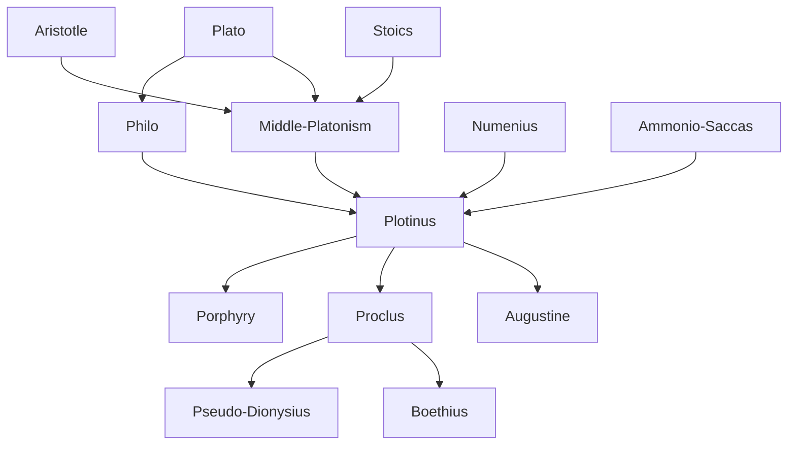

---
cssclasses:
  - Philosophy
subclasses:
  - Ancient-Greek-and-Roman-Philosophy
  - Metaphysics
  - Philosophy-of-Religion
related:
  - "[[Platonism]]"
  - "[[Middle Platonism]]"
  - "[[Hellenistic Philosophy]]"
  - "[[Mysticism]]"
  - "[[Negative Theology]]"
  - "[[Christian Philosophy]]"
  - "[[Emanationism]]"
  - "[[Henology]]"
  - "[[Late Antiquity]]"
  - "[[Byzantine Philosophy]]"
aliases:
  - the one
  - philo alexandria
  - return one
reference:
  - "Abbagnano, N., & Fornero, G. (2012). La ricerca del pensiero. Vol. 1B. Dall'ellenismo alla scolastica. Paravia."
---

#### Central Problem

The final phase of ancient Greek philosophy confronts the problem of how to reconcile rational philosophical inquiry with the intensifying religious yearnings of the late antique world. Beginning in the 1st century BCE, a dominant tendency emerged to synthesize Greek philosophical doctrines with Oriental wisdom traditions, seeking to demonstrate their fundamental concordance and to trace Greek philosophy itself back to Eastern religious sources.

The central metaphysical problem becomes: How can the absolute unity and transcendence of the divine principle be maintained while simultaneously explaining the existence of the multiple, finite world? If the One is utterly beyond being and thought, how can it be the source of the many? And how can human beings, trapped in the multiplicity of bodily existence, return to unity with the divine?

[[Plotinus]] addresses this by developing the doctrine of emanation: the One necessarily "overflows" from its superabundant perfection, generating successive levels of reality (hypostases) that progressively diminish in unity and perfection. The human soul, placed between the intelligible and sensible worlds, can either sink further into multiplicity or undertake the arduous ascent back to the One through virtue, contemplation, and ultimately mystical ecstasy.

#### Main Thesis

[[Plotinus]] establishes that all reality derives from a single, absolutely transcendent principle—the One (*to hen*)—which is beyond being, beyond thought, and beyond all determination. The One is infinite (*ápeiron*) in the sense of unlimited power (*pánton dýnamis*, "potency of all things"), not in the mathematical sense of endless quantity.

**The Ineffability of the One:** Since the One transcends all categories, it cannot be positively defined but only approached through negative theology—saying what it is not. It is neither being nor essence, neither thought nor thinker, neither in space nor in time. Yet it may be called "Good" insofar as all things desire it, and "Cause" insofar as all things derive from it.

**The Necessity of Emanation:** From its superabundant perfection, the One necessarily "overflows" (*hyperpléres*), generating the multiple world. This is not a temporal event but an eternal process. Unlike creation ex nihilo, emanation produces beings that remain ontologically connected to their source. Unlike divine craftsmanship (Plato's demiurge), emanation is not intentional but necessary.

**The Three Hypostases:** The process generates three primary levels of reality: (1) the One itself; (2) *Nous* (Intellect/Spirit), which arises from contemplating the One and contains the Platonic Ideas; (3) *Psyche* (Soul), which arises from contemplating Intellect and mediates between the intelligible and sensible worlds.

**Matter and Evil:** At the furthest point from the One lies matter—pure privation, non-being, darkness where light has ceased. Matter is evil not as positive opposition to good but as absence of good.

**The Return to the One:** Through ethical purification, aesthetic contemplation, philosophical dialectic, and ultimately mystical *ecstasis* ("standing outside" oneself), the soul can reverse the descent and return to unity with the One—a "flight of the alone to the Alone."

#### Historical Context

Neoplatonism emerged during the declining centuries of the Roman Empire (3rd-6th centuries CE), when traditional religious beliefs were in crisis and Oriental mystery religions were spreading throughout the Mediterranean world. The era was marked by political instability, social upheaval, and an intensified longing for salvation and transcendence.

[[Philo of Alexandria]] (c. 30 BCE - 50 CE) had earlier attempted to synthesize Jewish revelation with Greek philosophy, interpreting the Hebrew Bible allegorically through Platonic concepts. His identification of the Platonic world of Ideas with the divine *Logos* (Word/Reason) prepared the ground for both Christian theology and Neoplatonism.

[[Plotinus]] (205-270 CE), born in Egypt, studied for eleven years with Ammonio Saccas in Alexandria before establishing his school in Rome, where he attracted senators and even imperial attention (Emperor Gallienus and Empress Salonina). His writings were collected and arranged by his student [[Porphyry]] into six books of nine treatises each—the *Enneads*.

[[Proclus]] (410-485 CE) gave Neoplatonism its definitive systematic form in Athens, elaborating the triadic structure of "remaining-proceeding-returning" (*moné-próodos-epistrophé*) that characterizes every emanative process. In 529 CE, Emperor Justinian closed the Platonic Academy in Athens, marking the symbolic end of ancient philosophy—though Neoplatonic thought had already been absorbed into Christian theology.

#### Philosophical Lineage

#### Key Thinkers

| Thinker | Dates | Movement | Main Work | Core Concept |
|---------|-------|----------|-----------|--------------|
| [[Philo]] | c. 30 BCE - 50 CE | [[Hellenistic Judaism]] | Biblical commentaries | Logos as divine intermediary |
| [[Plotinus]] | 205-270 CE | [[Neoplatonism]] | *Enneads* | The One, emanation, ecstasy |
| [[Porphyry]] | 233-305 CE | [[Neoplatonism]] | *Life of [[Plotinus]]*, *Isagoge* | Defense of paganism |
| [[Proclus]] | 410-485 CE | [[Neoplatonism]] | *Elements of Theology* | Triadic emanation |
| [[Numenius]] | 2nd c. CE | [[Middle Platonism]] | Lost works | [[Plato]] as "Moses speaking Greek" |

#### Key Concepts

| Concept | Definition | Related to |
|---------|------------|------------|
| The One (to hen) | Absolutely transcendent first principle, beyond being and thought; source of all reality through emanation | [[Plotinus]], [[Neoplatonism]] |
| Emanation | Necessary "overflow" from the One's superabundant perfection, generating successive levels of reality | [[Plotinus]], [[Proclus]] |
| Hypostasis | Substantial, self-subsisting level of reality; the three primary hypostases are One, Intellect, Soul | [[Plotinus]], [[Neoplatonism]] |
| Nous (Intellect) | Second hypostasis; contains Platonic Ideas; arises from contemplating the One | [[Plotinus]], [[Neoplatonism]] |
| World Soul | Third hypostasis; mediates between intelligible and sensible realms; governs cosmic order | [[Plotinus]], [[Neoplatonism]] |
| Negative theology | Approach to the divine by negation, saying what God is not rather than what God is | [[Plotinus]], [[Pseudo-Dionysius]] |
| Logos | Divine Word/Reason; intermediary between God and world; identified with Platonic Ideas in [[Philo]] | [[Philo]], [[Christian Philosophy]] |
| Ecstasy | "Standing outside" oneself; mystical union with the One transcending rational knowledge | [[Plotinus]], [[Mysticism]] |
| Creatio ex nihilo | Creation from nothing; contrasted with emanation; developed by [[Philo]] from biblical sources | [[Philo]], [[Christian Philosophy]] |
| Triadic structure | Every process involves remaining (moné), proceeding (próodos), and returning (epistrophé) | [[Proclus]], [[Neoplatonism]] |

#### Authors Comparison

| Theme | [[Philo]] | [[Plotinus]] | [[Proclus]] |
|-------|-----------|--------------|-------------|
| First principle | God (personal, biblical) | The One (impersonal, beyond being) | The One (systematized) |
| Creation/emanation | Creation ex nihilo (with ambiguity) | Necessary emanation | Triadic procession |
| Intermediary | Logos (divine Ideas) | Nous (Intellect) | Henads (divine unities) |
| Source of knowledge | Revelation and reason | Reason and mystical intuition | Dialectic and faith |
| Goal | Union with God | Ecstatic return to the One | Faith beyond knowledge |
| Relation to religion | Jewish monotheism | Philosophical religion | Systematic paganism |
| Historical influence | Christian theology | Christian and Islamic mysticism | Medieval philosophy |

#### Influences & Connections

- **Predecessors:** [[Plotinus]] ← influenced by ← [[Plato]], [[Aristotle]], [[Stoics]], [[Philo]], [[Numenius]]
- **Contemporaries:** [[Plotinus]] ↔ teaching with ↔ [[Porphyry]], [[Amelius]]
- **Followers:** [[Plotinus]] → influenced → [[Proclus]], [[Augustine]], [[Pseudo-Dionysius]], [[Boethius]]
- **Later reception:** [[Plotinus]] → influenced → [[Eriugena]], [[Eckhart]], [[Ficino]], [[Hegel]]
- **Opposing views:** [[Plotinus]] ← criticized by ← [[Christians]] (on creation), [[Gnostics]] (on matter)

#### Summary Formulas

- **[[Philo]]:** The transcendent God of Israel creates through his Logos, the divine Word that contains the Platonic Ideas and mediates between infinite deity and finite world.
- **[[Plotinus]]:** All reality emanates necessarily from the absolutely transcendent One; the soul, fallen into multiplicity, can return through purification, contemplation, and mystical ecstasy to union with its source.
- **[[Proclus]]:** Every emanative process unfolds through a triad of remaining-proceeding-returning; faith, not knowledge, achieves final union with the ineffable One.

#### Timeline

| Year | Event |
|------|-------|
| c. 30 BCE | [[Philo]] of Alexandria born |
| 40 CE | [[Philo]] leads embassy to Emperor Caligula |
| 175-242 CE | Life of Ammonio Saccas, founder of Neoplatonism |
| 205 CE | [[Plotinus]] born in Licopolis, Egypt |
| 232 CE | [[Plotinus]] joins Ammonio Saccas's school in Alexandria |
| 244 CE | [[Plotinus]] establishes school in Rome |
| 253 CE | [[Plotinus]] begins writing; [[Porphyry]] collects his treatises |
| 270 CE | Death of [[Plotinus]] |
| 410 CE | [[Proclus]] born in Constantinople |
| 485 CE | Death of [[Proclus]] |
| 529 CE | Emperor Justinian closes Platonic Academy in Athens |

#### Notable Quotes

> "All beings are beings by virtue of the One... there is no army if it does not present itself as one, no chorus or flock unless they are 'one.'" — [[Plotinus]]

> "The One must be conceived as infinite not because it is endless in magnitude or number, but because its power is uncircumscribed." — [[Plotinus]]

> "This is the life of gods and of divine and blessed men: separation from all things here below, a life that takes no pleasure in earthly things, flight of the alone to the Alone." — [[Plotinus]]

---
> [!warning]-
> This annotation was normalised using a large language model and may contain inaccuracies. These texts serve as preliminary study resources rather than exhaustive references.
