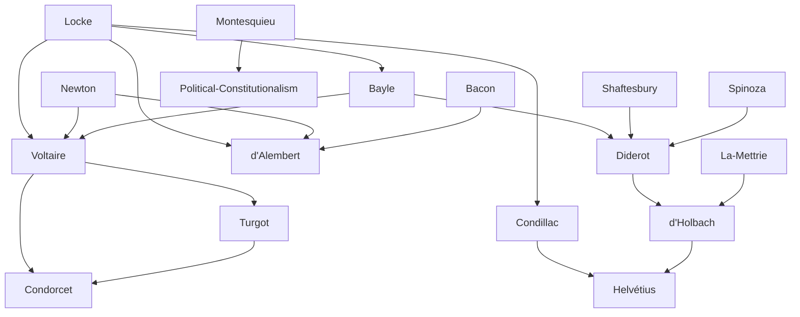

---
cssclasses:
  - Philosophy
  - History
subclasses:
  - 17th-18th-Century-Philosophy
  - Epistemology
  - Social-and-Political-Philosophy
aliases:
  - french enlightenment
  - encyclopedists
  - bayle
  - montesquieu
  - voltaire
  - separation powers
  - deism
  - tolerance
  - condillac
  - sensism
  - materialism
  - encyclopedie
  - progress
contributions:
  - Conceptual
authors:
  - "[[Bayle]]"
  - "[[Montesquieu]]"
  - "[[Voltaire]]"
  - "[[Turgot]]"
  - "[[Condorcet]]"
  - "[[Diderot]]"
  - "[[d'Alembert]]"
  - "[[Condillac]]"
  - "[[Mettrie]]"
  - "[[d'Holbach]]"
  - "[[Helvétius]]"
reference: "[[04 The search for thought - Unit 6 Chapter 3.pdf]]"
---

#### Central Problem

This chapter addresses the central question of how philosophical enlightenment developed in France through its major protagonists, each contributing distinct but interconnected approaches to key Enlightenment themes. The fundamental problems examined include: How can reason serve as a critical tool against prejudice and tradition? What is the proper relationship between historical facts and rational judgment? How should political power be organized to guarantee liberty? What is the foundation of religious tolerance? How do human faculties originate and develop? And what role does material causation play in human behavior?

The French Enlightenment faced the challenge of dismantling traditional authorities—religious, political, and intellectual—while constructing new foundations for knowledge, morality, and society based on reason, experience, and natural law. Each thinker addressed these challenges from different angles: [[Bayle]] through historical criticism, [[Montesquieu]] through political science, [[Voltaire]] through deism and tolerance, the Encyclopedists through systematization of knowledge, [[Condillac]] through sensationalist epistemology, and the materialists through naturalistic ethics.

#### Main Thesis

The French Enlightenment protagonists collectively advanced the thesis that human reason, properly applied to experience and facts, can liberate humanity from superstition, prejudice, and tyranny, enabling both intellectual progress and social reform.

**Bayle** established that tradition is not synonymous with truth. The mere fact that a belief is accepted by the majority or transmitted through generations provides no guarantee of validity. Historical inquiry must employ rigorous source criticism, and the historian must achieve objectivity by transcending all personal, national, and religious biases.

**Montesquieu** demonstrated that historical events follow discernible laws rather than resulting from chance or caprice. His theory of the separation of powers (legislative, executive, judicial) provides the constitutional framework for political liberty: "For liberty to exist, power must check power."

**Voltaire** articulated a practical philosophy combining deistic religion with radical tolerance. His critique of Leibnizian optimism ("the best of all possible worlds") emphasizes that evil is real and inexplicable by reason, yet humans should accept their finite condition serenely and work to improve it: "We must cultivate our garden."

**Turgot and Condorcet** developed the idea of indefinite human progress through reason's increasing dominance over passions, with Condorcet affirming humanity's unlimited perfectibility.

**Diderot and d'Alembert** organized the Encyclopedia as both a compendium of knowledge and an instrument of rational criticism against tradition.

**Condillac** provided the epistemological foundation through sensationalism: all human faculties derive from sensation alone, as demonstrated through his famous statue experiment.

**The Materialists** (La Mettrie, d'Holbach, Helvétius) radicalized Enlightenment naturalism by reducing all human phenomena to material causation, making self-interest the sole motive of human behavior.

#### Historical Context

The French Enlightenment flourished between approximately 1715 and 1789, spanning the reigns of Louis XV and the early reign of Louis XVI. This period witnessed growing tension between Enlightenment ideas and the political-religious establishment of the Ancien Régime.

[[Bayle]], writing in exile in Rotterdam due to Protestant persecution in France, experienced firsthand the horrors of religious intolerance that the Revocation of the Edict of Nantes (1685) had unleashed. His *Historical and Critical Dictionary* (1697) established the model of critical scholarship.

[[Montesquieu]]'s extended travels, particularly his stay in England (1729-1731), allowed direct observation of the post-Glorious Revolution constitutional monarchy that would inform his political theory. The contrast between English liberties and French absolutism shaped his thinking.

[[Voltaire]]'s imprisonment in the Bastille (1726) and subsequent exile in England (1726-1728) proved transformative. His *Philosophical Letters* (1734) introduced English thought—Bacon, Locke, Newton—to French readers. The Lisbon earthquake of 1755, killing tens of thousands, provided the occasion for his critique of optimistic theodicy.

The Encyclopedia project (1751-1772) faced repeated censorship and suppression by religious and royal authorities, yet emerged as the defining monument of the French Enlightenment. [[Diderot]] persevered through two decades of difficulties to complete the work.

The materialist current developed against this background of conflict with religious authority. Medical advances accumulated evidence for the dependence of mental activities on bodily organs, challenging traditional soul-body dualism.

The chapter spans from [[Bayle]]'s late 17th-century critical dictionary through [[Condorcet]]'s optimistic *Sketch* (1795), written while hiding from Revolutionary tribunals—a work affirming progress even as its author faced death.

#### Philosophical Lineage

#### Key Thinkers

| Thinker | Dates | Movement | Main Work | Core Concept |
|---------|-------|----------|-----------|--------------|
| [[Bayle]] | 1647-1706 | [[Enlightenment]] | *Historical and Critical Dictionary* | Historical criticism, tolerance |
| [[Montesquieu]] | 1689-1755 | [[Enlightenment]] | *The Spirit of the Laws* | Separation of powers |
| [[Voltaire]] | 1694-1778 | [[Enlightenment]] | *Philosophical Dictionary* | Deism, tolerance |
| [[Turgot]] | 1727-1781 | [[Enlightenment]] | *Plan for Universal History* | Economic liberty, progress |
| [[Condorcet]] | 1743-1794 | [[Enlightenment]] | *Sketch of Human Progress* | Indefinite perfectibility |
| [[Diderot]] | 1713-1784 | [[Enlightenment]] | *Encyclopedia* | Universal critical reason |
| [[d'Alembert]] | 1717-1783 | [[Enlightenment]] | *Preliminary Discourse* | Classification of knowledge |
| [[Condillac]] | 1715-1780 | [[Sensationalism]] | *Treatise on Sensations* | Sensation as origin of faculties |
| [[La Mettrie]] | 1709-1751 | [[Materialism]] | *Man a Machine* | Mechanistic anthropology |
| [[d'Holbach]] | 1723-1789 | [[Materialism]] | *System of Nature* | Atheistic naturalism |
| [[Helvétius]] | 1715-1771 | [[Materialism]] | *On the Mind* | Self-interest as sole motive |

#### Key Concepts

| Concept | Definition | Related to |
|---------|------------|------------|
| Historical criticism | Method of verifying facts by tracing sources, critically evaluating testimony, and rejecting unfounded claims | [[Bayle]], [[Enlightenment]] |
| Separation of powers | Constitutional principle dividing government into legislative, executive, and judicial branches to prevent tyranny | [[Montesquieu]], [[Political-Constitutionalism]] |
| Deism | Rational religion based on God's existence known through reason, rejecting revelation and supernatural intervention | [[Voltaire]], [[Enlightenment]] |
| Tolerance | Moral-political principle requiring acceptance of religious and intellectual diversity based on human fallibility | [[Voltaire]], [[Bayle]] |
| Progress | Historical thesis that humanity advances toward greater rationality and happiness through reason's increasing dominance | [[Voltaire]], [[Condorcet]] |
| Encyclopedia | Systematic compendium of all knowledge organized to spread Enlightenment and combat tradition | [[Diderot]], [[d'Alembert]] |
| Sensationalism | Epistemological doctrine that all ideas and mental faculties derive from sensation alone | [[Condillac]], [[Empiricism]] |
| Statue experiment | Thought experiment isolating senses to show how all faculties develop from sensation alone | [[Condillac]], [[Sensationalism]] |
| Fundamental sentiment | Touch-based awareness of one's own body that allows distinction between self and external world | [[Condillac]], [[Sensationalism]] |
| Man-machine | Materialist thesis that humans are entirely physical mechanisms governed by natural laws | [[La Mettrie]], [[Materialism]] |
| Self-interest | The sole motive of human behavior according to materialist ethics; virtue means aligning personal with public interest | [[Helvétius]], [[d'Holbach]] |

#### Authors Comparison

| Theme | [[Bayle]] | [[Montesquieu]] | [[Voltaire]] | [[Condillac]] | [[d'Holbach]] |
|-------|-----------|-----------------|--------------|---------------|---------------|
| Central concern | Historical truth | Political liberty | Tolerance, progress | Origin of knowledge | Natural ethics |
| Method | Source criticism | Comparative analysis | Satire, irony | Genetic analysis | Systematic naturalism |
| View of tradition | Source of error | Object of study | Enemy of reason | Irrelevant | Obstacle to happiness |
| Religious position | Skeptical fideism | Deism | Deism | Spiritualism | Atheism |
| View of human nature | Fallible, requiring tolerance | Determined by laws, climate | Limited but improvable | Sensory being | Physical machine |
| Political stance | Tolerance advocate | Moderate constitutionalism | Enlightened despotism | Non-political | Utilitarian reform |
| Role of reason | Critical, negative | Legislative, constructive | Practical, liberating | Analytical | Subordinate to nature |

#### Influences & Connections

- **Predecessors:** [[Bayle]] ← influenced by ← [[Protestantism]], [[Skepticism]]
- **Predecessors:** [[Montesquieu]] ← influenced by ← [[English Constitution]], [[Locke]]
- **Predecessors:** [[Voltaire]] ← influenced by ← [[Locke]], [[Newton]], [[Shaftesbury]]
- **Predecessors:** [[Condillac]] ← influenced by ← [[Locke]]
- **Predecessors:** [[La Mettrie]] ← influenced by ← [[18th-century medicine]]
- **Contemporaries:** [[Voltaire]] ↔ dialogue with ↔ [[Frederick II of Prussia]]
- **Contemporaries:** [[Diderot]] ↔ collaboration with ↔ [[d'Alembert]], [[Rousseau]]
- **Followers:** [[Bayle]] → influenced → [[Voltaire]], [[Diderot]]
- **Followers:** [[Montesquieu]] → influenced → [[American Founding Fathers]], [[Constitutionalism]]
- **Followers:** [[Voltaire]] → influenced → [[Turgot]], [[Condorcet]]
- **Followers:** [[Condillac]] → influenced → [[French Ideologues]]
- **Opposing views:** [[Voltaire]] ← criticized by ← [[Pascal]] (on human condition)
- **Opposing views:** [[Materialists]] ← criticized by ← [[Diderot]] (Refutation of Helvétius)

#### Summary Formulas

- **[[Bayle]]:** Tradition is not truth; only rigorous source criticism and historian's objectivity can establish historical facts; the problem of evil remains rationally insoluble.
- **[[Montesquieu]]:** Political liberty requires the separation of powers so that power checks power; laws must suit the nature, principle, and circumstances of each government.
- **[[Voltaire]]:** Deism provides rational religion purified of superstition; humans must accept their finite condition and "cultivate their garden" through practical engagement rather than metaphysical speculation.
- **[[Turgot]]:** Human progress consists in developing mechanical arts and liberating from despotism; economic freedom follows from natural order.
- **[[Condorcet]]:** Human perfectibility is indefinite and progress unstoppable; reason will lead humanity to maximum possible happiness.
- **[[Diderot]]:** Philosophy must combine reason with attention to facts; dogmatism (even materialist) must be avoided in favor of hypotheses and questions.
- **[[d'Alembert]]:** All knowledge derives from senses and divides into memory (history), reason (philosophy), and imagination (arts); metaphysics should analyze scientific principles rather than transcendent realities.
- **[[Condillac]]:** All mental faculties—attention, memory, judgment, imagination—derive from sensation alone through the transforming power of touch.
- **[[La Mettrie]]:** Man is a machine; the soul is merely a word for the thinking part; natural law commands pursuit of happiness.
- **[[d'Holbach]]:** Man is a purely physical being subject to necessary natural causation; atheism liberates from superstition and enables following nature's law of happiness.
- **[[Helvétius]]:** Self-interest is the universal motive; virtue consists in aligning personal with public interest through wise legislation.

#### Timeline

| Year | Event |
|------|-------|
| 1682 | [[Bayle]] publishes *Various Thoughts on the Comet* |
| 1697 | [[Bayle]] publishes *Historical and Critical Dictionary* |
| 1721 | [[Montesquieu]] publishes *Persian Letters* |
| 1733-34 | [[Voltaire]] publishes *Philosophical Letters* |
| 1734 | [[Montesquieu]] publishes *Considerations on the Romans* |
| 1745 | [[La Mettrie]] publishes *Natural History of the Soul* |
| 1746 | [[Condillac]] publishes *Essay on the Origin of Human Knowledge* |
| 1748 | [[Montesquieu]] publishes *The Spirit of the Laws* |
| 1748 | [[La Mettrie]] publishes *Man a Machine* |
| 1751 | First volume of the *Encyclopedia* appears |
| 1751 | [[Turgot]] writes *Plan of Two Discourses on Universal History* |
| 1754 | [[Condillac]] publishes *Treatise on Sensations* |
| 1755 | Lisbon earthquake; [[Voltaire]] writes *Poem on the Disaster of Lisbon* |
| 1756 | [[Voltaire]] publishes *Essay on the Customs and Spirit of Nations* |
| 1758 | [[Helvétius]] publishes *On the Mind* |
| 1759 | [[Voltaire]] publishes *Candide* |
| 1763 | [[Voltaire]] publishes *Treatise on Tolerance* |
| 1764 | [[Voltaire]] publishes *Philosophical Dictionary* |
| 1770 | [[d'Holbach]] publishes *System of Nature* |
| 1772 | *Encyclopedia* completed under [[Diderot]]'s direction |
| 1795 | [[Condorcet]]'s *Sketch of Human Progress* published posthumously |

#### Notable Quotes

> "One who knows the duties of the historian must strip himself of the spirit of flattery and malice and place himself as much as possible in the state of a Stoic agitated by no passion. Insensible to everything else, he must attend only to the interests of truth." — [[Bayle]]

> "When legislative power is united with executive power in a single person or body, there is no liberty, because one may fear that the same monarch or senate will make tyrannical laws to execute them tyrannically." — [[Montesquieu]]

> "What is tolerance? It is the prerogative of humanity. We are all full of weakness and errors: let us mutually pardon each other's follies—it is the first law of nature." — [[Voltaire]]

#### See Also

- [[Enlightenment]]
- [[Deism]]
- [[Materialism]]
- [[Sensationalism]]
- [[Encyclopedia]]
- [[Separation of Powers]]
- [[Natural Law]]
- [[Progress]]
- [[Empiricism]]
- [[Tolerance]]
- [[French Revolution]]
- [[Locke]]
- [[Newton]]

> [!NOTE]
> *This summary has been created to present the key points from the source text, which was automatically extracted using LLM. Please note that the summary may contain errors. It serves as an essential starting point for study and reference purposes.*
