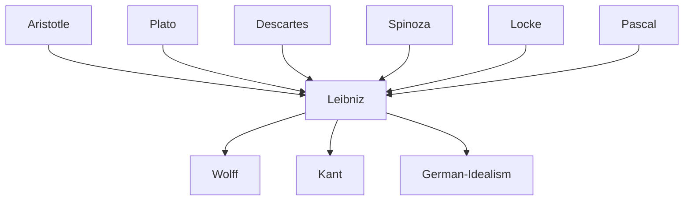

---
cssclasses:
  - Philosophy
subclasses:
  - Metaphysics
  - 17th-18th-Century-Philosophy
  - Epistemology
aliases:
  - preestablished harmony
  - best possible
  - sufficient reason
  - infinitesimal calculus
  - eternal truths
contributions:
  - Conceptual
authors:
  - "[[Leibniz]]"
  - "[[Descartes]]"
  - "[[Spinoza]]"
  - "[[Locke]]"
  - "[[Newton]]"
reference: "Abbagnano, N., & Fornero, G. (2012). La ricerca del pensiero. Vol. 2A. Dall'Umanesimo all'empirismo. Paravia."
related:
  - "[[Rationalism]]"
  - "[[Monadology]]"
  - "[[Pre-established Harmony]]"
  - "[[Theodicy]]"
  - "[[Problem of Evil]]"
  - "[[Mind-Body Problem]]"
  - "[[Infinitesimal Calculus]]"
  - "[[Descartes]]"
  - "[[Spinoza]]"
  - "[[Kant]]"
---

#### Central Problem

[[Leibniz]] confronts the fundamental metaphysical question of what constitutes the ultimate reality of the universe and how to reconcile the mechanical explanations of modern science with a metaphysical framework that preserves purpose, freedom, and divine providence. Against Cartesian dualism (which separated extended substance from thinking substance) and Spinozan monism (which collapsed everything into a single necessary substance), [[Leibniz]] seeks to articulate a pluralistic metaphysics that can account for both the physical and spiritual dimensions of reality.

The central tension in [[Leibniz]]'s philosophy lies in explaining how individual substances can be genuinely autonomous and self-sufficient while nonetheless forming a harmonious, ordered universe. If monads have "no windows" through which anything can enter or exit, how do they coordinate their activities? How can we account for the apparent interaction between mind and body, between soul and physical world? Furthermore, [[Leibniz]] must address the theological problem of evil: if God is omnipotent, omniscient, and perfectly good, why does evil exist in the world He created?

#### Main Thesis

Leibniz's central thesis holds that reality is composed of infinitely many simple, immaterial substances called **monads** — spiritual atoms that are the true elements of all things. Unlike Cartesian extended substance, monads have no parts, no extension, and cannot be divided. Each monad is a unique perspective on the universe, a "living mirror" that represents the entire cosmos from its particular point of view.

**The Nature of Monads:** Monads are centers of force and activity, characterized by two fundamental operations: perception (the representation of multiplicity within unity) and appetition (the tendency from one perception to another). The hierarchy of monads is determined by the clarity of their perceptions — from bare monads with only confused perceptions, through animal souls with memory, to rational spirits capable of apperception (self-conscious awareness).

**Pre-established Harmony:** Since monads cannot interact causally (having "no windows"), their coordination must be explained by God's pre-established harmony. Like two perfectly synchronized clocks, soul and body follow their own laws independently, yet correspond perfectly because God designed them to do so from the beginning.

**The Principle of Sufficient Reason:** Nothing exists or occurs without a sufficient reason why it is so and not otherwise. This principle grounds both the contingent truths of fact (which depend on God's free choice of the best) and distinguishes them from necessary truths of reason (which are grounded in the principles of identity and non-contradiction).

**Theodicy and the Best Possible World:** Among infinitely many possible worlds (logically consistent combinations of compossible substances), God's wisdom recognizes this one as the best, and His goodness wills it into existence. Evil exists not because God wills it, but because He permits it as a necessary condition for greater goods — particularly human freedom.

#### Historical Context

[[Leibniz]] (1646-1716) lived during the height of the Scientific Revolution and the consolidation of early modern rationalism. The mechanical philosophy of [[Descartes]] and the new physics of [[Galileo]] and [[Newton]] had transformed understanding of the natural world, explaining phenomena through matter and motion rather than Aristotelian forms and final causes. Yet this mechanical worldview raised profound metaphysical questions: What is the ultimate nature of matter? How do mind and body interact? What role remains for God, purpose, and value in a clockwork universe?

The religious context was equally turbulent. The Thirty Years' War (1618-1648) had devastated Europe, and confessional divisions between Catholics and Protestants remained deep. [[Leibniz]] spent considerable effort on ecumenical projects aimed at reuniting Christianity. His philosophical optimism — the doctrine that this is the best of all possible worlds — must be understood against this backdrop of religious conflict and the need to justify divine providence.

Intellectually, [[Leibniz]] engaged with the major philosophical alternatives of his time: Cartesian dualism, Spinozan monism, Lockean empiricism, and the occasionalism of Malebranche. His monadology represents an ambitious attempt to synthesize insights from all these traditions while avoiding their perceived deficiencies — particularly [[Spinoza]]'s necessitarianism, which [[Leibniz]] saw as a threat to human freedom and divine choice.

#### Philosophical Lineage

#### Key Thinkers

| Thinker | Dates | Movement | Main Work | Core Concept |
|---------|-------|----------|-----------|--------------|
| [[Leibniz]] | 1646-1716 | [[Rationalism]] | *Monadology* | Monads, pre-established harmony |
| [[Descartes]] | 1596-1650 | [[Rationalism]] | *Meditations* | Mind-body dualism |
| [[Spinoza]] | 1632-1677 | [[Rationalism]] | *Ethics* | Substance monism, necessitarianism |
| [[Locke]] | 1632-1704 | [[Empiricism]] | *Essay Concerning Human Understanding* | Tabula rasa, experience |
| [[Malebranche]] | 1638-1715 | [[Occasionalism]] | *Search After Truth* | Divine causation |
| [[Newton]] | 1643-1727 | [[Natural Philosophy]] | *Principia* | Absolute space, calculus |

#### Key Concepts

| Concept | Definition | Related to |
|---------|------------|------------|
| Monad | Simple, immaterial substance; spiritual atom without parts, extension, or windows; the true element of reality | [[Leibniz]], [[Metaphysics]] |
| Pre-established harmony | God's coordination of all monads so they correspond without causal interaction | [[Leibniz]], [[Mind-Body Problem]] |
| Perception | The representation of multiplicity within the simple unity of the monad | [[Leibniz]], [[Philosophy of Mind]] |
| Apperception | Self-conscious awareness; reflective knowledge of one's own perceptions | [[Leibniz]], [[Consciousness]] |
| Appetition | The tendency or striving from one perception to another; internal principle of change | [[Leibniz]], [[Metaphysics]] |
| Principle of sufficient reason | Nothing exists without a reason why it is so and not otherwise | [[Leibniz]], [[Epistemology]] |
| Principle of identity of indiscernibles | No two substances can be perfectly alike; each monad is unique | [[Leibniz]], [[Metaphysics]] |
| Truths of reason | Necessary truths based on identity and non-contradiction; cannot be otherwise | [[Leibniz]], [[Logic]] |
| Truths of fact | Contingent truths about actual existence; based on sufficient reason | [[Leibniz]], [[Epistemology]] |
| Theodicy | Justification of God's goodness despite the existence of evil in the world | [[Leibniz]], [[Philosophy of Religion]] |
| Best possible world | This world as chosen by God because it maximizes perfection among all possible alternatives | [[Leibniz]], [[Theodicy]] |
| Materia prima | Passive potency (inertia, resistance) within the monad; corresponds to confused perceptions | [[Leibniz]], [[Metaphysics]] |

#### Authors Comparison

| Theme | [[Leibniz]] | [[Descartes]] | [[Spinoza]] |
|-------|-------------|---------------|-------------|
| Ultimate reality | Infinite monads (pluralism) | Two substances: thought and extension | One substance: God/Nature |
| Mind-body relation | Pre-established harmony | Interactionism (pineal gland) | Parallelism (attributes of one substance) |
| Space and time | Relations between monads, not absolute | Identified with extension | Modes of God's attributes |
| Causation | No inter-substantial causation | Mechanical plus mind-body | Immanent within one substance |
| Freedom | Compatible with determination through reasons | Free will in rational soul | Illusion; all is necessary |
| God's role | Creator who chooses the best world | Guarantor of truth, sustainer | Identical with Nature |
| Innate ideas | Total innatism; soul innate to itself | Innate ideas of God, self, extension | True ideas from adequate knowledge |
| Eternal truths | In God's intellect, not created | Created by God's will | Necessary properties of substance |

#### Influences & Connections

- **Predecessors:** [[Leibniz]] ← influenced by ← [[Descartes]], [[Spinoza]], [[Aristotle]], [[Plato]], [[Augustine]]
- **Contemporaries:** [[Leibniz]] ↔ dialogue with ↔ [[Locke]] (*New Essays*), [[Newton]] (calculus priority dispute), [[Malebranche]]
- **Followers:** [[Leibniz]] → influenced → [[Wolff]], [[Kant]], [[German Idealism]]
- **Opposing views:** [[Leibniz]] ← criticized by ← [[Voltaire]] (*Candide*), [[Empiricists]]

#### Summary Formulas

- **[[Leibniz]]:** Reality consists of infinitely many windowless monads hierarchically ordered by perceptual clarity, coordinated by God's pre-established harmony in the best of all possible worlds.
- **[[Descartes]]:** Extended and thinking substances are radically distinct, interacting mysteriously at the pineal gland, with God guaranteeing the correspondence of clear ideas to reality.
- **[[Spinoza]]:** There exists only one infinite substance (God or Nature), of which minds and bodies are parallel modes; everything follows necessarily from the divine nature.

#### Timeline

| Year | Event |
|------|-------|
| 1646 | [[Leibniz]] born in Leipzig |
| 1666 | [[Leibniz]] writes *De Arte Combinatoria* on universal characteristic |
| 1672-1676 | [[Leibniz]] in Paris; develops infinitesimal calculus |
| 1676 | [[Leibniz]] meets [[Spinoza]] in The Hague |
| 1684 | [[Leibniz]] publishes first paper on differential calculus |
| 1686 | [[Leibniz]] writes *Discourse on Metaphysics* |
| 1695 | [[Leibniz]] publishes *New System of Nature* introducing pre-established harmony |
| 1704 | [[Leibniz]] completes *New Essays on Human Understanding* (response to [[Locke]]) |
| 1710 | [[Leibniz]] publishes *Theodicy* |
| 1714 | [[Leibniz]] writes *Monadology* and *Principles of Nature and Grace* |
| 1716 | [[Leibniz]] dies in Hanover |

#### Notable Quotes

> "The monads have no windows through which anything could enter or depart." — [[Leibniz]]

> "Why is there something rather than nothing? For nothing is simpler and easier than something." — [[Leibniz]]

> "This is the best of all possible worlds." — [[Leibniz]]

---
> [!NOTE]
> *This summary has been created to present the key points from the source text, which was automatically extracted using LLM. Please note that the summary may contain errors. It serves as an essential starting point for study and reference purposes.*
