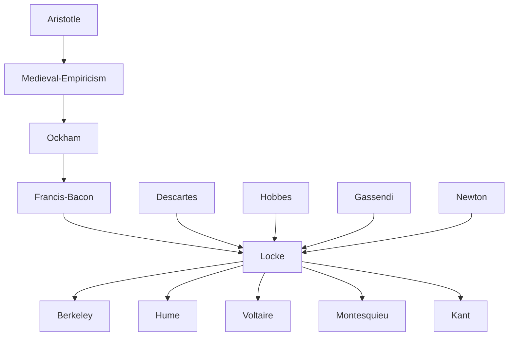

---
cssclasses:
  - Philosophy
subclasses:
  - Epistemology
  - 17th-18th-Century-Philosophy
  - Social-and-Political-Philosophy
related:
  - "[[British Empiricism]]"
  - "[[Essay Concerning Human Understanding]]"
  - "[[Two Treatises of Government]]"
  - "[[Letter Concerning Toleration]]"
  - "[[Social Contract Theory]]"
  - "[[Liberalism]]"
  - "[[Natural Rights]]"
  - "[[Primary and Secondary Qualities]]"
  - "[[Problem of Substance]]"
  - "[[Enlightenment Philosophy]]"
  - "[[Berkeley]]"
  - "[[Hume]]"
aliases:
  - simple ideas
  - complex ideas
  - primary qualities
  - secondary qualities
  - substance critique
  - social contract
  - natural rights
  - religious tolerance
  - separation powers
  - intuitive knowledge
  - demonstrative knowledge
  - sense experience
  - liberal government
reference:
  - "[Abbagnano, N., & Fornero, G. (2012). La ricerca del pensiero. Vol. 2A. Dall'Umanesimo all'empirismo. Paravia.](https://archive.org/download/ssp-s03-e16/The%20search%20for%20thought%20-%20Unit%205%20Chapter%203.pdf)"
tags:
  - Podcast
---

#### Podcast

<iframe src="https://archive.org/embed/ssp-s03-e16" width="100%" height="30" frameborder="0" webkitallowfullscreen="true" mozallowfullscreen="true" allowfullscreen></iframe>

---

#### Central Problem

[[Locke]] addresses the fundamental epistemological question: what are the origin, extent, and limits of human knowledge? Unlike rationalists who believed reason could attain truth independently of experience, [[Locke]] investigates whether the mind possesses innate ideas or whether all knowledge derives from experience. This critical inquiry represents the first systematic examination in modern philosophy of human cognitive capacities and their boundaries.

The problem extends beyond pure epistemology to practical domains. [[Locke]] asks: given that reason is finite and fallible, what can we legitimately know about reality, morality, and politics? The stakes are high—without establishing the proper foundations and limits of knowledge, humans risk pursuing chimeric metaphysical speculations while neglecting attainable practical wisdom about ethics, government, and religion.

Central to [[Locke]]'s investigation is the relationship between ideas and external reality. If the mind operates only with ideas, how can we verify that these ideas correspond to things existing outside the mind? This problem of the "veil of ideas" threatens to reduce all knowledge to mere internal fantasy unless [[Locke]] can demonstrate some reliable connection between mental representations and the world.

#### Main Thesis

Locke's central thesis is that all knowledge derives from experience—there are no innate ideas. The mind at birth is a *tabula rasa* (blank slate), and all ideas come either from external sensation (perceiving the world through the senses) or from internal reflection (observing the operations of our own minds). This empiricist foundation yields several crucial positions:

**Against Innatism:** [[Locke]] argues that if ideas were truly innate, they would be present in all humans universally—including children, the mentally impaired, and people from all cultures. Since this is demonstrably not the case, no ideas can be considered innate. Even seemingly self-evident logical principles like identity and non-contradiction must be acquired through experience.

**Simple and Complex Ideas:** Simple ideas are the irreducible atoms of cognition, received passively from experience—colors, sounds, tastes, extension, motion. The mind cannot create or destroy simple ideas but can only combine them into complex ideas (modes, substances, relations). This sets an absolute limit on human knowledge: we cannot think beyond what experience provides.

**Primary vs. Secondary Qualities:** Following [[Galileo]] and Boyle, [[Locke]] distinguishes objective qualities truly existing in bodies (extension, figure, motion, solidity) from subjective qualities existing only in perception (colors, sounds, tastes, smells). This distinction grounds the mechanical worldview of modern science.

**Critique of Substance:** The concept of substance as an underlying substratum supporting qualities is merely a confused supposition—we perceive only collections of qualities but imagine an unknown "something" beneath them. This critique anticipates Berkeley's and [[Hume]]'s more radical conclusions.

**Types of Knowledge:** Certain knowledge comes through intuition (immediate perception of agreement between ideas), demonstration (mediated chains of intuition), or current sensation (perceiving external objects now affecting our senses). Beyond these, we have only probable opinion.

#### Historical Context

[[Locke]] (1632-1704) lived through one of the most turbulent periods in English history. Born during the reign of Charles I, he witnessed the English Civil War, the execution of the king (1649), Cromwell's Commonwealth, the Restoration (1660), and finally the Glorious Revolution (1688) that established constitutional monarchy and parliamentary supremacy.

The publication of [[Newton]]'s *Principia Mathematica* in 1687 and [[Locke]]'s *Essay Concerning Human Understanding* in 1690 together defined the intellectual orientation of the coming Enlightenment. Voltaire captured their significance: "Philosophy is [[Newton]] and [[Locke]] is its prophet." [[Newton]] provided the model of successful empirical science; [[Locke]] provided its philosophical justification.

Locke's political involvement was intense. As secretary and physician to Lord [[Shaftesbury]] (leader of the Whig opposition), [[Locke]] was implicated in political intrigues against the Stuart monarchy. He fled to Holland in 1683, where he participated in planning William of Orange's invasion of England. After the Glorious Revolution succeeded, [[Locke]] returned triumphantly and was seen as the philosophical champion of the new liberal constitutional order.

The religious context was equally crucial. [[Locke]] witnessed intense conflicts between Catholics, Anglicans, and various Protestant dissenting groups. The revocation of the Edict of Nantes (1685) by Louis XIV, forcing French Protestants into exile, demonstrated the catastrophic consequences of religious intolerance. [[Locke]]'s *Letter Concerning Toleration* (1689) responded to these crises.

#### Philosophical Lineage

#### Key Thinkers

| Thinker | Dates | Movement | Main Work | Core Concept |
|---------|-------|----------|-----------|--------------|
| [[Locke]] | 1632-1704 | [[British Empiricism]] | *Essay Concerning Human Understanding* | Experience as source of all ideas |
| [[Hobbes]] | 1588-1679 | [[Materialism]] | *Leviathan* | State of nature as war of all |
| [[Descartes]] | 1596-1650 | [[Rationalism]] | *Meditations* | Innate ideas, cogito |
| [[Newton]] | 1642-1727 | [[Scientific Revolution]] | *Principia Mathematica* | Empirical scientific method |
| [[Berkeley]] | 1685-1753 | [[British Empiricism]] | *Principles of Human Knowledge* | Denial of material substance |
| [[Hume]] | 1711-1776 | [[British Empiricism]] | *Treatise of Human Nature* | Radical empiricism, skepticism |

#### Key Concepts

| Concept | Definition | Related to |
|---------|------------|------------|
| Tabula rasa | The mind at birth is a blank slate with no innate ideas; all knowledge comes from experience | [[Locke]], [[Empiricism]] |
| Simple ideas | Basic, irreducible ideas passively received from sensation or reflection; cannot be created by the mind | [[Locke]], [[Epistemology]] |
| Complex ideas | Ideas formed by combining simple ideas into modes, substances, and relations | [[Locke]], [[Epistemology]] |
| Primary qualities | Objective qualities existing in bodies independently of perception: extension, figure, motion, solidity | [[Locke]], [[Galileo]] |
| Secondary qualities | Subjective qualities existing only in perception: colors, sounds, tastes, odors | [[Locke]], [[Epistemology]] |
| Substance | A supposed but unknown substratum underlying perceived qualities; [[Locke]] critiques this as confused | [[Locke]], [[Metaphysics]] |
| Intuitive knowledge | Immediate perception of agreement or disagreement between ideas; highest certainty | [[Locke]], [[Epistemology]] |
| Demonstrative knowledge | Knowledge derived through chains of intuitive connections; mathematical proofs | [[Locke]], [[Epistemology]] |
| State of nature | Pre-political condition of perfect freedom and equality governed by natural law | [[Locke]], [[Liberalism]] |
| Natural rights | Pre-political rights to life, liberty, and property that government must protect | [[Locke]], [[Liberalism]] |

#### Authors Comparison

| Theme | [[Locke]] | [[Hobbes]] | [[Descartes]] |
|-------|-----------|------------|---------------|
| Source of ideas | Experience only | Experience via sensation | Innate ideas plus experience |
| Nature of reason | Finite, fallible, limited | Calculating faculty | Infinite, infallible within its domain |
| Innate ideas | Rejected entirely | Rejected | Accepted (God, self, mathematics) |
| Substance | Unknown substratum | Material bodies only | Thinking and extended substances |
| State of nature | Equality of rights, governed by natural law | War of all against all | Not a central concern |
| Basis of government | Consent to protect natural rights | Fear and need for security | Not a central concern |
| Religious tolerance | Strongly advocated | State controls religion | Subordinate to rational theology |
| Epistemological attitude | Critical, empirical | Nominalist, materialist | Foundationalist, rationalist |

#### Influences & Connections

- **Predecessors:** [[Locke]] ← influenced by ← [[Aristotle]] (anti-innatism), [[Ockham]] (nominalism), [[Bacon]] (empirical method)
- **Predecessors:** [[Locke]] ← influenced by ← [[Descartes]] (terminology, method of ideas), [[Hobbes]] (finite reason, political theory)
- **Contemporaries:** [[Locke]] ↔ dialogue with ↔ [[Newton]] (scientific method), [[Boyle]] (primary/secondary qualities)
- **Followers:** [[Locke]] → influenced → [[Berkeley]], [[Hume]] (British empiricist tradition)
- **Followers:** [[Locke]] → influenced → [[Voltaire]], [[Montesquieu]] (Enlightenment political theory)
- **Opposing views:** [[Locke]] ← criticized by ← [[Leibniz]] (*New Essays on Human Understanding*), [[Rationalists]] (defense of innate ideas)

#### Summary Formulas

- **[[Locke]]:** All knowledge derives from experience through sensation and reflection; the mind is a blank slate that actively combines simple ideas into complex knowledge, but reason remains our only guide though limited and fallible.
- **[[Hobbes]]:** Reason is a calculating instrument serving self-preservation; the state of nature is war requiring absolute sovereign power for peace.
- **[[Descartes]]:** Reason possesses innate ideas providing certain foundations for knowledge independent of potentially deceptive sensory experience.
- **[[Berkeley]]:** Material substance is unintelligible; only minds and ideas exist (*esse est percipi*).
- **[[Hume]]:** Experience provides only habits and associations; causality, substance, and self are psychological constructs without rational foundation.

#### Timeline

| Year | Event |
|------|-------|
| 1632 | [[Locke]] born at Wrington, near Bristol |
| 1649 | Execution of Charles I; English Civil War concludes |
| 1652 | [[Locke]] enters Oxford University |
| 1658 | [[Locke]] becomes Master of Arts, begins teaching at Oxford |
| 1667 | [[Locke]] becomes secretary to Lord Shaftesbury; writes *Essay on Toleration* |
| 1668 | [[Locke]] elected Fellow of Royal Society |
| 1675 | [[Locke]] retires to France after [[Shaftesbury]]'s fall |
| 1683 | [[Locke]] flees to Holland in political exile |
| 1687 | [[Newton]] publishes *Principia Mathematica* |
| 1688 | Glorious Revolution; William of Orange becomes King of England |
| 1689 | [[Locke]] returns to England; publishes *Letter Concerning Toleration* |
| 1690 | [[Locke]] publishes *Essay Concerning Human Understanding* and *Two Treatises of Government* |
| 1693 | [[Locke]] publishes *Some Thoughts Concerning Education* |
| 1695 | [[Locke]] publishes *The Reasonableness of Christianity* |
| 1704 | [[Locke]] dies at Oates, Essex |

#### Notable Quotes

> "No man's knowledge here can go beyond his experience." — [[Locke]]

> "The idea to which we give the general name of substance is nothing but the supposed but unknown support of those qualities we find existing." — [[Locke]]

> "The state of nature has a law of nature to govern it, which obliges everyone; and reason, which is that law, teaches all mankind that being all equal and independent, no one ought to harm another in his life, health, liberty, or possessions." — [[Locke]]

---
> [!warning]-
> This annotation was normalised using a large language model and may contain inaccuracies. These texts serve as preliminary study resources rather than exhaustive references.
