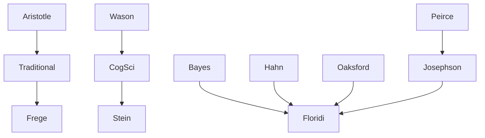

---
cssclasses:
  - Philosophy
  - Computer-Science
subclasses:
  - Logic-and-Philosophy-of-Logic
  - Epistemology
  - Cognitive-Science
related:
  - "[[Philosophy as Conceptual Design (1 of 9)]]"
  - "[[Constructionism as Non-naturalism (2 of 9)]]"
  - "[[Perception and Testimony as Data Providers (3 of 9)]]"
  - "[[Information Quality (4 of 9)]]"
  - "[[Informational Scepticism and the Logically Possible (5 of 9)]]"
  - "[[A Defence of Information Closure (6 of 9)]]"
  - "[[Logical Fallacies as Bayesian Informational Shortcuts (7 of 9)]]"
  - "[[Maker’s Knowledge, between A Priori and A Posteriori (8 of 9)]]"
  - "[[Logic of Design as a Conceptual Logic of Information (9 of 9)]]"
aliases:
  - logical fallacies
  - formal fallacies
  - bayes theorem
  - affirming consequent
  - denying antecedent
  - informational shortcuts
  - bayesian reasoning
  - inference explanation
  - modus ponens
  - modus tollens
reference:
  - "Floridi, L. (2019). The logic of information: A theory of philosophy as conceptual design (First edition). Oxford University Press. (pp. 162-170)"
---

#### Central Problem

Are formal logical fallacies mere errors, fit only for the conceptual junkyard, or do they provide any informational value? Traditional logic, since [[Aristotle]], has condemned fallacies like denying the antecedent (DA) and affirming the consequent (AC) as worthless rubbish to be eradicated. Cognitive science experiments have used these fallacies to demonstrate human irrationality — that people systematically make reasoning errors.

However, this "wasteful" or "ungreen policy" toward logical fallacies may miss their potential contribution to information processes. If intelligent people consistently commit these fallacies despite training, perhaps the fallacies serve some epistemic function. The chapter asks: can we develop a "greener" interpretation that shows these fallacies provide quick and dirty, though riskier, ways to extract useful information from available resources?

The challenge connects to two standard explanations for why people accept fallacies as valid: (1) confusing "if" with "if and only if" (biconditional reading), or (2) confusing necessity with probability. Both explanations may be compatible through Bayes' theorem.

#### Main Thesis

[[Floridi]] argues that formal logical fallacies — particularly affirming the consequent (AC) and denying the antecedent (DA) — are not mere mistakes proving human irrationality, but **informational shortcuts** that provide quick and dirty ways of extracting useful information. They are **degraded versions of Bayes' theorem**, stripped of some probabilities.

**The Bayesian Analysis:**

For AC (A → B, B ∴ A):
- If there are no false positives (P(B|Ac) = 0), then P(A|B) = 1 and the reasoning degrades to a valid biconditional: A ↔ B, B ∴ A
- If there are some false positives (P(B|Ac) > 0), then P(A|B) < 1, and the formula resembles the AC fallacy

For DA (A → B, ¬A ∴ ¬B):
- If there are no false positives (P(B|Ac) = 0), then P(Bc|Ac) = 1 and the formula degrades to: A ↔ B, ¬A ∴ ¬B
- If there are some false positives, the formula resembles the DA fallacy

**The Key Insight:** The less the probabilities count (the fewer false positives/negatives), the closer these fallacies become to logically valid reasoning. They are "Bayesian 'quick and dirty' informational shortcuts" — when we use them, we bet that the improbable cases are negligible.

**Conditions for increased information gain:**
1. **Soundness:** A is true and A → B valid
2. **Relevance:** A and B are relevantly related (not independent)
3. **Constraints:** Events are mutually exclusive with defined sample space

#### Historical Context

The chapter situates itself against a long tradition of denouncing formal fallacies. [[Aristotle]]'s *De Sophisticis Elenchis* first condemned these reasoning patterns, arguing that people mistakenly suppose "the relation of consequence is convertible" — believing that because rain makes ground wet, wet ground implies rain.

Since the 1960s, cognitive science experiments (notably the Wason selection task, 1966) have systematically demonstrated that humans commit these fallacies, allegedly proving human irrationality. This research tradition, surveyed by Stein (1996), concluded that "cognitive science can and should play a role in determining whether or not humans are rational."

However, semantic and social interpretations of the Wason selection task (Griggs and Cox 1982) challenged the reductionist tendency to equate rational thinking with logical reasoning. More recent Bayesian analyses of informal fallacies (Hahn and Oaksford 2006) have shown that argumentum ad ignorantiam, petitio principii, and slippery slope arguments "match structurally arguments which are widely accepted" — suggesting the problem lies in content, not form.

The connection between AC and abduction (inference to the best explanation) has become common in AI, where "backward modus ponens" is identified with abduction when properly constrained.

#### Philosophical Lineage

#### Key Thinkers

| Thinker | Dates | Movement | Main Work | Core Concept |
|---------|-------|----------|-----------|--------------|
| [[Aristotle]] | 384-322 BCE | [[Ancient Philosophy]] | *De Sophisticis Elenchis* | Fallacies as convertibility error |
| [[Bayes]] | 1701-1761 | [[Mathematics]] | *Essay towards solving a problem* | Posterior probability theorem |
| [[Wason]] | 1924-2003 | [[Cognitive Science]] | Selection Task (1966) | Testing logical reasoning |
| [[Stein]] | — | [[Philosophy of Mind]] | *Without Good Reason* (1996) | Human irrationality thesis |
| [[Josephson]] | — | [[Artificial Intelligence]] | Abduction research | AC as inference to best explanation |

#### Key Concepts

| Concept | Definition | Related to |
|---------|------------|------------|
| Formal Logical Fallacy (FLF) | Deductively invalid argument with appearance of validity; problem is morphological, not semantic | [[Logic]], [[Aristotle]] |
| Affirming the Consequent (AC) | A → B, B ∴ A — invalid inference that affirms the consequent to conclude the antecedent | [[Logic]], [[Bayes]] |
| Denying the Antecedent (DA) | A → B, ¬A ∴ ¬B — invalid inference that denies the antecedent to conclude negation of consequent | [[Logic]], [[Bayes]] |
| Bayes' Theorem | P(A\|B) = P(B\|A)P(A) / [P(B\|A)P(A) + P(B\|Ac)P(Ac)] — calculates posterior probability | [[Bayes]], [[Probability]] |
| Informational Shortcut | Quick and dirty but riskier way to extract information; trades logical validity for speed | [[Floridi]], [[Epistemology]] |
| False Positives | Cases where B occurs without A (P(B\|Ac) > 0); their absence validates biconditional reading | [[Bayes]], [[Logic]] |
| Inference to Best Explanation (IBE) | Abductive reasoning; AC read as IBE effort (retrodiction) | [[Peirce]], [[Josephson]] |
| Greener Logic | Approach that recycles fallacies for informational value rather than discarding as waste | [[Floridi]], [[Epistemology]] |
| Degraded Biconditional | When fallacy approximates valid A ↔ B because probabilities approach certainty | [[Floridi]], [[Logic]] |
| Ontological Thrift | Trusting fewer items (being cautious) by relying on "logically greener" reasoning | [[Floridi]], [[Epistemology]] |

#### Authors Comparison

| Theme | [[Floridi]] | [[Aristotle]] | [[Stein]] |
|-------|-------------|---------------|-----------|
| Value of fallacies | Informational shortcuts, recyclable | Worthless errors to eradicate | Proof of human irrationality |
| Human rationality | Rationality regained through Bayesian lens | Rational when avoiding fallacies | Empirically undermined |
| Proper framework | Information-gathering and gain | Dialectical and argumentative strength | Cognitive science testing |
| Treatment | Greener policy — recycle | Ungreen policy — discard | Diagnose as systematic error |
| Role of probability | Central — degraded Bayes | Not considered | Background assumption |

#### Influences & Connections

- **Predecessors:** [[Floridi]] ← revises ← [[Aristotle]]'s condemnation of fallacies
- **Mathematical basis:** [[Floridi]] ← applies ← [[Bayes]]' theorem to logic
- **Contemporaries:** [[Floridi]] ↔ converges with ↔ [[Hahn]], [[Oaksford]] on Bayesian informal fallacies
- **AI connection:** [[Josephson]] → shows → AC as abduction/IBE
- **Opposing views:** [[Stein]] ← claims → human irrationality from fallacy experiments

#### Summary Formulas

- **[[Floridi]]:** Formal logical fallacies (DA and AC) are degraded versions of Bayes' theorem stripped of probabilities; they function as informational shortcuts that trade logical validity for quick information extraction from available resources.

- **[[Aristotle]]:** Fallacies arise because people mistakenly suppose the relation of consequence is convertible — believing that if A implies B, then B implies A.

- **[[Bayes]]:** The posterior probability P(A|B) depends on prior probability P(A) and likelihood P(B|A); when false positives approach zero, Bayesian updating approaches logical certainty.

- **[[Josephson]]:** Affirming the consequent (backward modus ponens) approximates inference to the best explanation when properly constrained; it is "smart to the degree that it implements IBE."

#### Timeline

| Year | Event |
|------|-------|
| c. 350 BCE | [[Aristotle]] condemns fallacies in *De Sophisticis Elenchis* |
| 1763 | [[Bayes]]' theorem published posthumously |
| 1966 | [[Wason]] introduces selection task experiment |
| 1979 | Marcus and Rips study participants' judgements of MP, MT, DA, AC |
| 1982 | Griggs and Cox challenge Wason task interpretation |
| 1996 | [[Stein]] publishes *Without Good Reason* |
| 2006 | [[Hahn]] and [[Oaksford]] provide Bayesian analysis of informal fallacies |
| 2008 | Chater and [[Oaksford]] show cognitive science moving beyond mathematical logic |

#### Notable Quotes

> "Logical fallacies are not mere mistakes, of no value, but informational shortcuts that can be epistemically fruitful, if carefully managed." — [[Floridi]]

> "AC and DA are very powerful informational tools — inferentially, they are the equivalent of shoot first and ask questions later — developed by embedded and embodied agents to cope, as quickly and successfully as possible, with a hostile environment." — [[Floridi]]

> "The refutation which depends upon the consequent arises because people suppose that the relation of consequence is convertible." — [[Aristotle]]

---
> [!warning]-
> This annotation was normalised using a large language model and may contain inaccuracies. These texts serve as preliminary study resources rather than exhaustive references.
