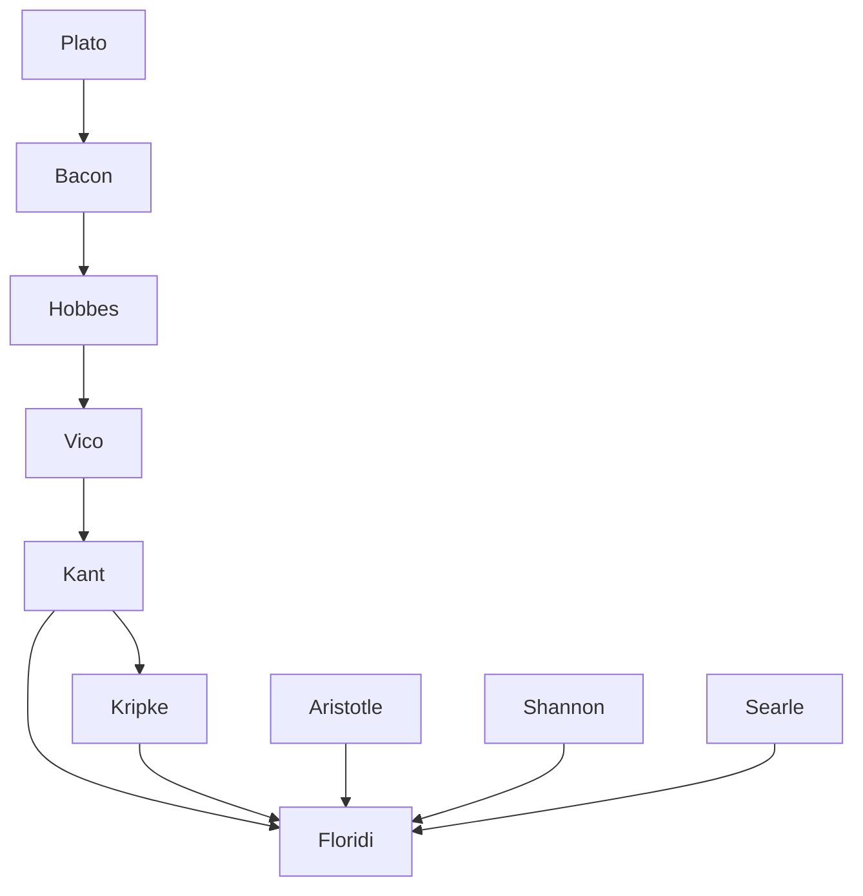

---
cssclasses:
  - Philosophy
  - Computer-Science
subclasses:
  - Epistemology
  - Philosophy-of-Mind
  - Philosophy-of-Language
related:
  - "[[Philosophy as Conceptual Design (1 of 9)]]"
  - "[[Constructionism as Non-naturalism (2 of 9)]]"
  - "[[Perception and Testimony as Data Providers (3 of 9)]]"
  - "[[Information Quality (4 of 9)]]"
  - "[[Informational Scepticism and the Logically Possible (5 of 9)]]"
  - "[[A Defence of Information Closure (6 of 9)]]"
  - "[[Logical Fallacies as Bayesian Informational Shortcuts (7 of 9)]]"
  - "[[Maker’s Knowledge, between A Priori and A Posteriori (8 of 9)]]"
  - "[[Logic of Design as a Conceptual Logic of Information (9 of 9)]]"
aliases:
  - maker knowledge
  - ab anteriori
  - poietic knowledge
  - constructionist epistemology
  - multiagent epistemology
  - synthetic priori
  - analytic posteriori
  - epistemic access
  - blueprint knowledge
  - source information
reference:
  - "Floridi, L. (2019). The logic of information: A theory of philosophy as conceptual design (First edition). Oxford University Press. (pp. 171-187)"
---

#### Central Problem

How can maker's knowledge—the knowledge enjoyed by an agent who brings about a state of affairs—be characterized according to the classic epistemological distinctions: necessary vs. contingent, analytic vs. synthetic, and a priori vs. a posteriori? The chapter confronts a fundamental gap in mainstream analytic epistemology: while the maker's knowledge tradition (from Bacon through Vico to Kant) is philosophically significant, it lacks precise grounding in terms of what sort of knowledge is actually involved.

The central tension emerges from recognizing that when Alice moves a chess pawn (e2–e4), her knowledge that the move occurred differs fundamentally from Bob's (the observer) and Carol's (who receives the message). Yet traditional epistemology, focused on passive observation and single-agent models, cannot adequately capture this difference. The problem requires distinguishing between: (1) holding the same information (which all three agents do), and (2) having different accounts or justifications for that information (where the maker's position is unique).

#### Main Thesis

[[Floridi]] argues that maker's knowledge requires introducing a fourth distinction—informative vs. uninformative—decoupled from the traditional three dichotomies, and adopting a multiagent perspective rather than the monoagent approach inherited from Cartesian epistemology.

**Core claims:**

1. **Same Information, Different Account:** The maker (Alice), observer (Bob), and receiver (Carol) hold the same synthetic, contingent information p. The difference lies not in the information itself but in how each agent can account for it.

2. **The Ab Anteriori:** Between a priori and a posteriori lies a third epistemic position—*ab anteriori*—knowledge acquired neither before nor after experience, but *through* experience as interaction. The maker's knowledge is contingent, synthetic, weakly a priori (ab anteriori), and uninformative to the maker herself.

3. **Poiesis and Alethization:** For the maker, making s happen (poiesis) and making p about s true (alethization) are two sides of the same coin. Alice is not merely the sender of information but the source of its referent.

4. **Multiagent Mapping:** A sixteen-cell matrix maps all possible combinations of the four dichotomies, revealing distinct epistemic positions: Classic/Carol (column a/r), Innatist (column n), Kantian synthetic a priori (column l), Kripkean analytic a posteriori (column f), Bob the observer (column q), and Alice the maker (column m).

5. **Commutative Diagram:** The maker's knowledge can be represented using category-theoretic commutative diagrams showing how blueprints (backward-fitting models) relate to implemented systems differently from how observational models (forward-fitting) relate to observed systems.

#### Historical Context

The maker's knowledge tradition stretches from Plato through Bacon, Hobbes, and Vico to Kant and neo-Kantian philosophy. Bacon's concept of "vexation of nature" exemplifies the classic position where epistemology assumes passive, message-receiving information gathering—whether in Plato's cave or before Descartes' fire.

The Kantian revolution introduced the synthetic a priori (challenging the Classic position), while Kripke's analysis made room for the analytic a posteriori. Both positions share two assumptions: the truths are informative and a single agent holds them. This monoagent focus explains why the maker's knowledge tradition remained marginal.

The chapter engages with dynamic epistemic logic (DEL), which models information change through communication but typically lacks explicit treatment of the "source" of messages—senders remain outside the system. This limitation prevents DEL from distinguishing knowledge acquired by observation from knowledge acquired through making.

Nineteenth-century German philosophy of technology criticized Kant for failing to recognize that through technology, agents create and manipulate noumenal objects, not just phenomenal perceptions. When Alice builds an Ikea table, she builds a noumenal something.

#### Philosophical Lineage

#### Key Thinkers

| Thinker | Dates | Movement | Main Work | Core Concept |
|---------|-------|----------|-----------|--------------|
| [[Bacon]] | 1561-1626 | [[Empiricism]] | *Novum Organum* | Vexation of nature, maker's knowledge |
| [[Vico]] | 1668-1744 | [[Humanism]] | *Scienza Nuova* | Verum factum (truth = made) |
| [[Kant]] | 1724-1804 | [[German Idealism]] | *Critique of Pure Reason* | Synthetic a priori |
| [[Kripke]] | 1940-2022 | [[Analytic Philosophy]] | *Naming and Necessity* | Analytic a posteriori, rigid designators |
| [[Searle]] | 1932- | [[Philosophy of Language]] | *Speech Acts* | Performatives, institutional facts |
| [[Hintikka]] | 1929-2015 | [[Epistemic Logic]] | *Knowledge and Belief* | Scandal of deduction |

#### Key Concepts

| Concept | Definition | Related to |
|---------|------------|------------|
| Ab anteriori | Third epistemic position between a priori and a posteriori; knowledge acquired through experience as interaction, not perception | [[Floridi]], [[Epistemology]] |
| Maker's knowledge | Knowledge enjoyed by agent who brings about the state of affairs modelled by the proposition | [[Bacon]], [[Vico]] |
| Poiesis | The making of s happen; constructive intervention that determines truth | [[Aristotle]], [[Constructionism]] |
| Alethization | Making p about s true; the truth-making aspect of poiesis | [[Floridi]], [[Epistemology]] |
| Blueprint | Model that backward-fits a system not yet existing but to be designed/created | [[Floridi]], [[Design]] |
| Forward-fitting | Relation where model fits already existing system (observation) | [[Floridi]], [[Epistemology]] |
| Backward-fitting | Relation where blueprint fits system that will exist if implemented (design) | [[Floridi]], [[Design]] |
| Uninformative truth | Truth that tells agent nothing new because already held; redundant message | [[Floridi]], [[Information Theory]] |
| Performative | Speech act where saying makes it so (e.g., "you are fired") | [[Searle]], [[Austin]] |
| Dynamic epistemic logic | Logic modelling information change through communication | [[Hintikka]], [[van Ditmarsch]] |

#### Authors Comparison

| Theme | [[Floridi]] | [[Kant]] | [[Kripke]] |
|-------|-------------|----------|------------|
| Central innovation | Ab anteriori (through experience) | Synthetic a priori (before experience) | Analytic a posteriori (after experience) |
| Agent model | Multiagent (maker, observer, receiver) | Monoagent (transcendental subject) | Monoagent (ideal knower) |
| Role of interaction | Constitutive of knowledge | Subordinate to perception | Not thematized |
| Information | Explicitly decoupled fourth distinction | Implicit in analysis | Implicit in analysis |
| Noumena | Accessible through making/design | Inaccessible to knowledge | Not central concern |
| Exemplar | Chess move, sweetened coffee | Mathematical judgments | Water = H₂O, Hesperus = Phosphorus |

#### Influences & Connections

- **Predecessors:** [[Floridi]] ← influenced by ← [[Bacon]], [[Vico]], [[Kant]], [[Kripke]], [[Aristotle]]
- **Contemporaries:** [[Floridi]] ↔ dialogue with ↔ [[van Ditmarsch]], [[Hintikka]]
- **Technical frameworks:** [[Floridi]] ← borrows from ← [[Category Theory]] (commutative diagrams), [[Dynamic Epistemic Logic]]
- **Opposing views:** [[Floridi]] ← contrasts with ← Cartesian passive epistemology, monoagent traditions

#### Summary Formulas

- **[[Floridi]]:** The maker's knowledge is ab anteriori: contingent, synthetic, weakly a priori, and uninformative—acquired through experience as interaction, not perception, with poiesis and alethization as two sides of the same coin.
- **[[Kant]]:** Synthetic a priori truths are possible because the mind structures experience according to its own forms, yet this analysis remains trapped in a monoagent, perception-based framework.
- **[[Kripke]]:** Analytic a posteriori truths reveal that necessity and apriority are distinct, but the analysis still assumes a single epistemic agent accessing information passively.
- **[[Bacon]]/[[Vico]]:** We know best what we make ourselves (*verum factum*)—the maker's privileged epistemic access derives from being the source, not merely the observer.

#### Timeline

| Year | Event |
|------|-------|
| 1620 | [[Bacon]] publishes *Novum Organum*, develops vexation of nature |
| 1725 | [[Vico]] publishes *Scienza Nuova*, articulates verum factum principle |
| 1781 | [[Kant]] publishes *Critique of Pure Reason*, introduces synthetic a priori |
| 1962 | [[Austin]] publishes *How to Do Things with Words*, develops performatives |
| 1969 | [[Hintikka]] identifies "scandal of deduction" problem |
| 1972 | [[Kripke]] delivers *Naming and Necessity* lectures, argues for analytic a posteriori |
| 1989 | [[Searle]] reformulates performatives in institutional terms |
| 2007 | [[van Ditmarsch]] et al. publish *Dynamic Epistemic Logic* |
| 2019 | [[Floridi]] introduces ab anteriori in *The Logic of Information* |

#### Notable Quotes

> "The maker's knowledge is ab anteriori knowledge. A contingent, synthetic proposition p about s (the information p) is an ab anteriori truth if and only if it can be known by interacting with s to make p true." — [[Floridi]]

> "In the maker's knowledge case, poiesis (making s happen) and alethization (making p about s true) are two sides of the same coin. Alice is not merely the sender of the information that p, she is the source of the referent of p." — [[Floridi]]

> "Scientia est scire per causas." — [[Aristotle]]

---
> [!warning]-
> This annotation was normalised using a large language model and may contain inaccuracies. These texts serve as preliminary study resources rather than exhaustive references.
