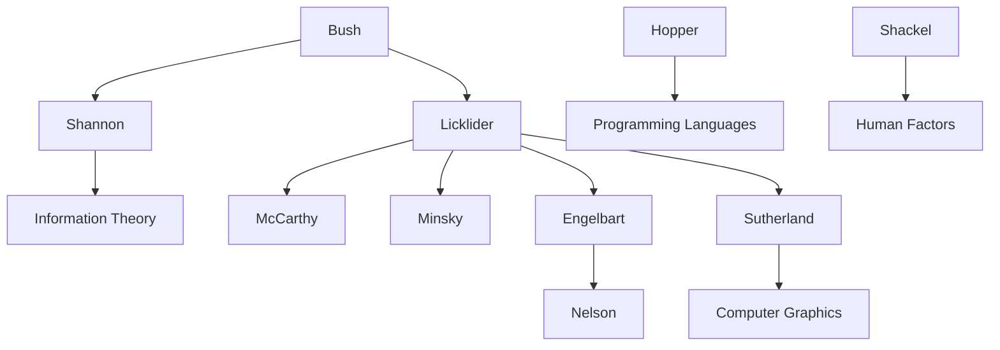

---
cssclasses:
  - Computer-Science
  - History
subclasses:
  - Human-Computer-Interaction
  - Design-History
related:
  - "[[Human-Computer Interaction]]"
  - "[[Licklider]]"
  - "[[Engelbart]]"
  - "[[Sutherland]]"
  - "[[Information Science]]"
aliases:
  - vacuum tubes
  - early computing
  - batch processing
  - time sharing
  - computer graphics
  - human factors
  - augmenting intellect
  - man machine
  - sketchpad system
  - interactive computing
reference:
  - "Grudin, J. (2017). From tool to partner: the evolution of human-computer interaction. Morgan & Claypool Publishers. (pp. 15-24)"
---

#### Central Problem

How did the transition from special-purpose computation machines to general-purpose interactive computers reshape the relationship between humans and computing technology? Grudin traces the foundational period of Human-Computer Interaction (1945–1965), examining how wartime technological breakthroughs created unprecedented possibilities for human engagement with computational systems.

The central tension lies between the immense cost and scarcity of early computing resources and the emerging vision of computers as tools for augmenting individual human intellect. When computers occupied entire rooms, consumed vast amounts of power, and required teams of specialists to operate, the question of who would use them and how was determined by economic constraints. Yet visionaries like Licklider, Engelbart, and Sutherland imagined a future where professionals of all kinds—"attorneys, doctors, chemists, and designers"—would choose to interact directly with computers as congenial tools.

#### Main Thesis

Grudin argues that the period 1945–1965 established the conceptual and technical foundations for modern HCI, driven by three parallel developments:

**1. The Evolution of Computing Roles:** Early computing required three distinct human roles: managers (who specified programs and handled output), programmers (mathematically adept individuals who decomposed tasks), and operators (who physically loaded programs and maintained hardware). Each role eventually became a major focus of HCI research: management information systems, computer science, and human factors respectively. Grace Hopper's pioneering work on compilers and programming languages exemplified the HCI goal of "freeing users to do their work"—in this era, mathematicians were the users.

**2. Hardware Advances Enabling Interaction:** The transition from vacuum tubes to transistors (commercially available in 1958) transformed computing reliability and economics. Vacuum tube computers like ENIAC required constant maintenance; operators "wheeled vacuum tubes around in shopping carts." Transistor-based computers, while still expensive, made feasible the vision of computers operated by non-specialists. Brian Shackel's 1959 paper "Ergonomics for a Computer" marked the first formal HCI study, applying human factors methods to console design.

**3. Visionary Conceptual Frameworks:** Licklider's "human-machine symbiosis" (1960) outlined requirements for interactive computing: time-sharing, electronic input-output surfaces, real-time programming support, large-scale information storage, and facilitation of human cooperation. Engelbart's "augmenting human intellect" (1962) envisioned computers as tools for approaching complex problems. Sutherland's Sketchpad thesis (1963) demonstrated computer graphics, object-oriented concepts, and novel interaction techniques. Ted Nelson coined "hypertext" (1963) and envisioned democratized computing through interconnected digital objects.

**4. The Vision-Demo-Deployment Gap:** The conceptual foundations for graphical user interfaces were in place by 1965, yet widespread deployment awaited hardware advances that would make computers "millions of times more powerful" at far lower cost. Engelbart's 1968 "Mother of All Demos" was a "success disaster"—DARPA found NLS too difficult to use, illustrating the tension between optimizing for skilled use versus initial use that still resonates in HCI.

#### Historical Context

World War II fundamentally transformed computing and research funding. Before the war, most U.S. government research funding was managed by the Department of Agriculture. The war brought unprecedented investment culminating in the atomic bomb, demonstrating that massive funding could address national goals. Post-war, sophisticated cryptographic machines that helped win the war by breaking enemy codes spurred interest in general-purpose computation.

ENIAC, revealed publicly in 1946, was arguably the first general-purpose computer—its first unpublicized use was calculations for hydrogen bomb development. It stood 8-10 feet high, occupied 1,800 square feet, and consumed as much energy as a small town while providing less computation than a modern pocket device. Memory was so expensive that computers were used for calculation, not information processing.

The Soviet launch of Sputnik in 1957 challenged the West to invest in science and technology. ARPA (later DARPA) funding created the first computer science departments, established AI as a discipline, and produced ARPANET (1969-1985), the internet's predecessor. The Boston area became a center for computer research through MIT's Lincoln Laboratory, where the TX-0 and TX-2 demonstrated time-sharing and other innovations.

Information science emerged from documentalism in this period. Merriam-Webster dates "information science" to 1960; conferences at Georgia Tech (1961-1962) shifted focus from information as technology to information as incipient science. The divide between technology-oriented researchers and the humanities-focused library tradition widened.

#### Philosophical Lineage

#### Key Thinkers

| Thinker | Dates | Movement | Main Work | Core Concept |
|---------|-------|----------|-----------|--------------|
| [[Licklider]] | 1915-1990 | [[Human-Computer Interaction]] | "Man-Computer Symbiosis" (1960) | Human-machine symbiosis |
| [[Engelbart]] | 1925-2013 | [[Human-Computer Interaction]] | "Augmenting Human Intellect" (1962) | Augmentation of intellect |
| [[Sutherland]] | 1938- | [[Computer Graphics]] | *Sketchpad* (1963) | Interactive graphics |
| [[Hopper]] | 1906-1992 | [[Computer Science]] | COBOL development | Programming languages |
| [[Nelson]] | 1937- | [[Hypertext]] | Project Xanadu (1960) | Hypertext, interconnectedness |
| [[Shackel]] | 1927-2007 | [[Human Factors]] | "Ergonomics for a Computer" (1959) | Computer ergonomics |

#### Key Concepts

| Concept | Definition | Related to |
|---------|------------|------------|
| Human-machine symbiosis | Vision of computers as partners in formulative parts of technical problems, requiring real-time interaction | [[Licklider]], [[HCI]] |
| Augmenting human intellect | Increasing capability to approach complex problems, gain comprehension, and derive solutions through computing | [[Engelbart]], [[HCI]] |
| Batch processing | Programs and data read from cards/tape, run without interruption until termination; no real-time interaction | [[Computing History]], [[HCI]] |
| Time-sharing | Multiple simultaneous users working at terminals connected to single computer; enabled interactive computing | [[McCarthy]], [[Computing]] |
| Sketchpad | First computer graphics system; demonstrated object-oriented concepts, light pen interaction, visualization | [[Sutherland]], [[Graphics]] |
| Hypertext | Interconnected network of digital objects enabling non-linear navigation; coined by Nelson in 1963 | [[Nelson]], [[Information]] |
| Human factors | Improving skilled performance through efficiency, fewer errors, better training; "knobs and dials" approach | [[Ergonomics]], [[HCI]] |
| Glass teletype | CRT display showing scrolling commands and responses; replaced paper-based teletype | [[Interface]], [[Computing]] |
| NLS system | Engelbart's prototype integrating word processing, mouse, hypertext, video; demonstrated 1968 | [[Engelbart]], [[HCI]] |
| Information science | Discipline emerging from documentalism; focus on information management using digital technology | [[Library Science]], [[Computing]] |

#### Authors Comparison

| Theme | [[Licklider]] | [[Engelbart]] | [[Sutherland]] |
|-------|--------------|---------------|----------------|
| Central vision | Human-machine symbiosis | Augmenting human intellect | Making computers approachable |
| Focus | Systems requirements | Integrated applications | Computer graphics |
| Role | Funder and visionary | Engineer and inventor | Researcher and administrator |
| Key contribution | ARPA/IPTO direction | Mouse, hypertext, word processing | Sketchpad, graphics |
| Approach to users | Researchers and professionals | Professionals willing to train | Engineers and designers |
| Legacy | Computer science funding | Interactive systems | Computer graphics field |

#### Influences & Connections

- **Predecessors:** [[Licklider]] ← influenced by ← [[Bush]], [[Shannon]], [[Weaver]]
- **Contemporaries:** [[Licklider]] ↔ supported ↔ [[McCarthy]], [[Minsky]], [[Engelbart]], [[Sutherland]]
- **Funding relationships:** [[Licklider]] → funded → [[Engelbart]] (via ARPA); [[Sutherland]] → funded → [[Engelbart]] (as IPTO director)
- **Followers:** [[Engelbart]] → influenced → [[Nelson]], Xerox PARC researchers
- **Institutional connections:** MIT Lincoln Lab → BBN → ARPA/IPTO → Stanford Research Institute

#### Summary Formulas

- **[[Grudin]] on the period:** The conceptual foundations for today's graphical user interfaces were in place by 1965, but widespread deployment awaited hardware advances producing devices millions of times more powerful at far lower cost.

- **[[Licklider]] on symbiosis:** The computer was "a fast information-retrieval and data-processing machine" destined for a larger role in "the formulative parts of technical problems," requiring real-time interaction rather than batch processing.

- **[[Engelbart]] on augmentation:** By "augmenting human intellect" we mean increasing capability to approach complex problems where "hunches, cut-and-try, intangibles, and the human 'feel for a situation' usefully co-exist with powerful concepts."

- **[[Hopper]] on liberation:** Her goal was "freeing mathematicians to do mathematics"—echoed in the HCI goal of freeing users to do their work.

#### Timeline

| Year | Event |
|------|-------|
| 1946 | ENIAC publicly revealed as "giant brain" |
| 1949 | [[Shannon]] and [[Weaver]] publish work on information theory |
| 1956 | Human Engineering Society founded (later Human Factors Society) |
| 1957 | Sputnik launch; FORTRAN released |
| 1958 | First solid-state computers commercially available; *Human Factors* journal initiated |
| 1959 | [[Shackel]] publishes first HCI paper "Ergonomics for a Computer" |
| 1960 | [[Licklider]] publishes "Man-Computer Symbiosis"; PDP-1 minicomputer appears; [[Nelson]] founds Project Xanadu |
| 1962 | [[Engelbart]] publishes "Augmenting Human Intellect"; [[Licklider]] heads IPTO |
| 1963 | [[Sutherland]] completes Sketchpad thesis; [[Nelson]] coins "hypertext" |
| 1964 | [[Sutherland]] succeeds [[Licklider]] as IPTO director; JOSS language for time-sharing |
| 1968 | [[Engelbart]]'s "Mother of All Demos" at Fall Joint Computer Conference |

#### Notable Quotes

> "In the beginning, the computer was so costly that it had to be kept gainfully occupied for every second; people were almost slaves to feed it." — [[Shackel]]

> "By 'augmenting human intellect' we mean increasing the capability of a man to approach a complex problem situation, to gain comprehension to suit his particular needs, and to derive solutions to problems." — [[Engelbart]]

> "There are many human-machine systems. At present, however, there are no human-computer symbioses." — [[Licklider]]

---
> [!warning]-
> This annotation was normalised using a large language model and may contain inaccuracies. These texts serve as preliminary study resources rather than exhaustive references.
