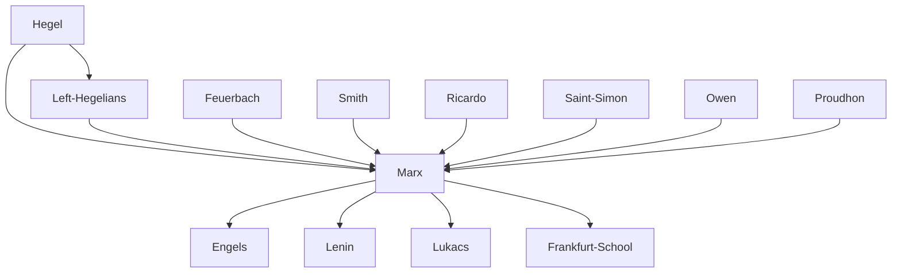

---
cssclasses:
  - Philosophy
  - Political-Science
  - Economics
subclasses:
  - 19th-Century-Philosophy
  - Social-and-Political-Philosophy
  - Critical-Theory
related:
  - "[[Historical Materialism]]"
  - "[[Left Hegelianism]]"
  - "[[Alienation]]"
  - "[[Class Struggle]]"
  - "[[Capital]]"
  - "[[Communist Manifesto]]"
  - "[[Surplus Value]]"
  - "[[Engels]]"
  - "[[Dialectical Materialism]]"
  - "[[Critical Theory]]"
aliases:
  - historical materialism
  - class struggle
  - surplus value
  - base superstructure
  - communist manifesto
  - dialectical materialism
reference:
  - "Abbagnano, N., & Fornero, G. (2012). La ricerca del pensiero. Vol. 3A. Da Schopenhauer a Freud. Paravia."
---

#### Central Problem

The chapter addresses the fundamental question of how to understand history, society, and human existence in material rather than idealist terms. [[Marx]] confronts several interconnected problems: What are the real driving forces of historical change? How does capitalist society function, and why does it generate systematic exploitation? What is the nature of human alienation under capitalism, and how can it be overcome?

[[Marx]] criticizes both Hegelian idealism (which sees Spirit as the subject of history) and [[Feuerbach]]'s abstract materialism (which conceives humanity outside of social-historical relations). He seeks a scientific understanding of society that can explain how economic structures determine political, legal, and cultural phenomena, while also providing the theoretical basis for revolutionary transformation.

The central tension lies between the ideological representations of society (which present capitalism as natural, eternal, and rational) and the actual material reality of exploitation, class conflict, and historical change. [[Marx]] aims to unmask the "mystifications" of bourgeois ideology and reveal the concrete mechanisms by which the capitalist mode of production generates alienation, surplus value, and its own eventual supersession.

#### Main Thesis

[[Marx]]'s central thesis is that material economic conditions — specifically, the mode of production — constitute the real foundation of society and determine the legal, political, and ideological superstructure. His historical materialism holds that:

**The Materialist Conception of History:** History is not primarily a spiritual or intellectual process, but a material one founded on the dialectic of need and satisfaction. Humans distinguish themselves from animals through the production of their means of subsistence. The productive forces (labor power, means of production, technical knowledge) and relations of production (property relations governing production and distribution) constitute the economic "base" of society.

**Base and Superstructure:** The economic structure (base) determines the legal, political, religious, artistic, and philosophical superstructure. As [[Marx]] states: "The mode of production of material life conditions the social, political and intellectual life process in general." This does not render ideas superfluous but explains their derivation from material conditions.

**Dialectic of History:** When productive forces develop beyond existing relations of production, a period of social revolution ensues. The new forces are always embodied by an ascending class, while old property relations are defended by a declining dominant class. This generates class struggle as the motor of history.

**Alienation:** Under capitalism, the worker is alienated in four ways: from the product of labor (which belongs to the capitalist), from the activity of labor (which becomes forced and instrumental), from species-being (which demands free, creative, universal labor), and from fellow humans (especially the exploitative capitalist). The root cause is private property of the means of production.

**Surplus Value:** The capitalist's profit derives from surplus value — the difference between the value workers create and the wages they receive. Workers must labor beyond the "necessary labor time" (required to reproduce their own subsistence) to create unpaid surplus value for the capitalist.

**Revolutionary Praxis:** Philosophy must not merely interpret the world but change it. The proletariat, as the class that suffers most from alienation, is destined to abolish private property and establish communism — not as an ideal to be realized, but as "the real movement that abolishes the present state of things."

#### Historical Context

[[Marx]] (1818-1883) was born in Trier to a Jewish family that had converted to Protestantism. He studied law and philosophy in Bonn and [[Berlin]], where he encountered the Young Hegelians. Unable to pursue an academic career due to the reactionary Prussian government, he turned to political journalism, becoming editor of the *Rheinische Zeitung* before its suppression in 1843.

Exiled to Paris, [[Marx]] began his lifelong friendship with [[Engels]] and deepened his economic studies, producing the *Economic and Philosophic Manuscripts* (1844). Further expulsions led him to Brussels, where he and [[Engels]] wrote *The German Ideology* (1845-46) and *The Communist Manifesto* (1848). After the failed revolutions of 1848-49, [[Marx]] settled permanently in London, where he spent decades researching and writing *Capital* (Volume 1 published 1867) at the British Museum, supported financially by [[Engels]].

The intellectual context includes three main influences: German classical philosophy (especially [[Hegel]]'s dialectic and [[Feuerbach]]'s materialism), British political economy ([[Smith]], [[Ricardo]]), and French socialism ([[Saint-Simon]], [[Owen]], [[Proudhon]]). [[Marx]] synthesized and transcended these sources, creating a comprehensive critique of bourgeois society and a theory of revolutionary transformation.

The 1848 revolutions across Europe, the growth of industrial capitalism with its visible exploitation of workers, the formation of the International Workingmen's Association (1864), and the Paris Commune (1871) provided the practical-political context for [[Marx]]'s theoretical work.

#### Philosophical Lineage

#### Key Thinkers

| Thinker | Dates | Movement | Main Work | Core Concept |
|---------|-------|----------|-----------|--------------|
| [[Marx]] | 1818-1883 | [[Marxism]] | *Capital* | Historical materialism, surplus value |
| [[Engels]] | 1820-1895 | [[Marxism]] | *Anti-Dühring* | Dialectical materialism |
| [[Hegel]] | 1770-1831 | [[German Idealism]] | *Phenomenology of Spirit* | Dialectic, Absolute Spirit |
| [[Feuerbach]] | 1804-1872 | [[Left Hegelianism]] | *The Essence of Christianity* | Anthropological materialism |
| [[Ricardo]] | 1772-1823 | [[Classical Economics]] | *Principles of Political Economy* | Labor theory of value |
| [[Saint-Simon]] | 1760-1825 | [[Utopian Socialism]] | *The New Christianity* | Industrial society |

#### Key Concepts

| Concept | Definition | Related to |
|---------|------------|------------|
| Historical materialism | The theory that material economic conditions (the mode of production) are the real foundation determining social, political, and intellectual life | [[Marx]], base-superstructure |
| Base and superstructure | Economic base (forces and relations of production) determines the legal-political-ideological superstructure | [[Marx]], social formation |
| Productive forces | Elements necessary for production: labor power, means of production, technical-scientific knowledge | [[Marx]], mode of production |
| Relations of production | Social relations governing ownership and distribution of means of production; expressed juridically as property relations | [[Marx]], class structure |
| Alienation | The worker's estrangement from product, activity, species-being, and fellow humans under capitalism | [[Marx]], [[Feuerbach]] |
| Surplus value | The unpaid labor extracted from workers beyond "necessary labor time," constituting capitalist profit | [[Marx]], exploitation |
| Class struggle | The motor of history; conflict between classes embodying advancing productive forces and those defending existing property relations | [[Marx]], [[Engels]] |
| Ideology | False or mystified representation of reality serving class interests; contrasted with scientific understanding | [[Marx]], false consciousness |
| Praxis | Unity of theory and practice; philosophy must change the world, not merely interpret it | [[Marx]], revolutionary action |
| Communism | The real movement abolishing private property and class society; not an ideal but historical necessity | [[Marx]], [[Engels]] |

#### Authors Comparison

| Theme | [[Marx]] | [[Hegel]] | [[Feuerbach]] |
|-------|----------|-----------|---------------|
| Subject of history | Material production, classes | Absolute Spirit | Abstract "Man" |
| Nature of alienation | Socio-economic condition | Moment of Spirit's development | Religious consciousness |
| Role of philosophy | Transform the world | Comprehend the Rational | Unmask religious illusion |
| View of religion | Opium of the people, social symptom | Representation of Absolute | Projection of human essence |
| Historical method | Materialist dialectic | Idealist dialectic | Static naturalism |
| Political stance | Revolutionary communism | Conservative | Contemplative humanism |

#### Influences & Connections

- **Predecessors:** [[Marx]] ← influenced by ← [[Hegel]] (dialectic), [[Feuerbach]] (materialism), [[Ricardo]] (labor theory of value), [[Saint-Simon]] (socialism)
- **Contemporaries:** [[Marx]] ↔ collaboration with ↔ [[Engels]]; [[Marx]] ↔ polemic with ↔ [[Proudhon]], [[Bakunin]]
- **Followers:** [[Marx]] → influenced → [[Lenin]], [[Lukács]], [[Gramsci]], [[Frankfurt School]], [[Althusser]]
- **Opposing views:** [[Marx]] ← criticized by ← liberal economists, anarchists ([[Bakunin]]), revisionist socialists

#### Summary Formulas

- **[[Marx]]:** The history of all hitherto existing society is the history of class struggles; the mode of production determines social consciousness; philosophers have only interpreted the world, the point is to change it.
- **[[Engels]]:** The determining factor in history is, in the final instance, the production and reproduction of real life; the economic factor is not the only determining one.
- **[[Feuerbach]]:** (As interpreted by [[Marx]]) Correctly identified the need to invert [[Hegel]] but failed to grasp humanity's social-historical nature and the necessity of revolutionary praxis.

#### Timeline

| Year | Event |
|------|-------|
| 1818 | [[Marx]] born in Trier |
| 1841 | [[Marx]] completes doctoral dissertation on Democritus and Epicurus |
| 1843 | [[Marx]] writes *Critique of [[Hegel]]'s Philosophy of Right*; moves to Paris |
| 1844 | [[Marx]] writes *Economic and Philosophic Manuscripts*; meets [[Engels]] |
| 1845 | [[Marx]] writes *Theses on Feuerbach* |
| 1845-46 | [[Marx]] and [[Engels]] write *The German Ideology* |
| 1847 | [[Marx]] publishes *The Poverty of Philosophy* against [[Proudhon]] |
| 1848 | [[Marx]] and [[Engels]] publish *The Communist Manifesto* |
| 1849 | [[Marx]] settles permanently in London |
| 1859 | [[Marx]] publishes *A Contribution to the Critique of Political Economy* |
| 1864 | International Workingmen's Association founded |
| 1867 | [[Marx]] publishes *Capital*, Volume 1 |
| 1883 | [[Marx]] dies in London |

#### Notable Quotes

> "The philosophers have only interpreted the world in various ways; the point is to change it." — [[Marx]]

> "The history of all hitherto existing society is the history of class struggles." — [[Marx]] and [[Engels]]

> "Religion is the sigh of the oppressed creature, the heart of a heartless world, and the soul of soulless conditions. It is the opium of the people." — [[Marx]]

---
> [!NOTE]
> *This summary has been created to present the key points from the source text, which was automatically extracted using LLM. Please note that the summary may contain errors. It serves as an essential starting point for study and reference purposes.*
