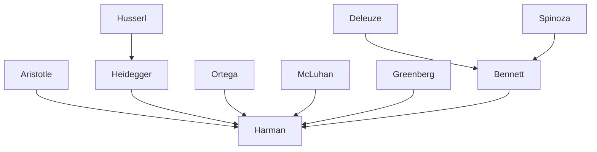

---
cssclasses:
  - Philosophy
  - Arts
subclasses:
  - Aesthetics
  - Metaphysics
  - Continental-Philosophy
related:
  - "[[Object-Oriented Ontology]]"
  - "[[Materialism]]"
  - "[[Formalism]]"
  - "[[Mimesis]]"
  - "[[Phenomenology]]"
aliases:
  - object oriented
  - formalism aesthetics
  - materialism critique
  - mimesis art
  - jane bennett
  - heidegger aesthetics
  - mcluhan media
  - greenberg formalism
  - withdrawn objects
  - allure aesthetics
reference:
  - Harman, G. (2016). Materialism is Not the Solution. The Nordic Journal of Aesthetics, 24(47). https://doi.org/10.7146/nja.v24i47.23057
---

#### Central Problem

The article addresses the problematic tendency to classify object-oriented philosophy as a form of materialism, a categorization [[Harman]] firmly rejects. The central philosophical issue concerns how we understand the fundamental structure of reality: is it composed of material elements (either privileged physical particles or a formless cosmic whole), or is it composed of formed objects at multiple scales that cannot be reduced either upward or downward?

[[Harman]] identifies two types of materialism inherited from pre-Socratic philosophy: first, the reductive materialism that identifies ultimate physical elements as the root of everything (Thales, Democritus); second, the holistic materialism that posits a formless apeiron from which all entities emerge as temporary intensities (Anaximander). Both approaches fail to account for genuine emergence and the autonomous existence of mid-level entities like lakes, hammers, and artworks.

The deeper problem extends to aesthetics: how should we understand the relationship between form and its opposites—matter, function, and content? [[Harman]] argues that mainstream formalism (as in [[Greenberg]]) and materialism are actually "two faces of the same error," both failing to grasp the withdrawn, formed character of objects that exists beneath both surface appearances and material substrates.

#### Main Thesis

[[Harman]] defends a new sense of "formalism" against contemporary materialist fashion, arguing that reality consists of objects at all scales, each possessing structure or form that cannot be reduced to either material components or relational contexts. The form of an object is precisely "that which hides midway between its material substrate and its concrete manifestation."

Against [[Bennett]]'s "throbbing whole" of matter-energy containing temporary "swirls," [[Harman]] maintains that objects are genuinely autonomous—they "cut themselves off from their neighbors and their own causal components," enduring through environmental fluctuation until actually destroyed. Relations between objects are neither automatic nor easy; things are not always affecting each other.

On aesthetics, [[Harman]] revives the concept of mimesis but reinterprets it radically: art is imitation not in the sense of fabricating copies, but in the theatrical sense of method acting. The artist "imitates not by producing copies of external things, but by becoming external things." In aesthetic experience, the spectator herself becomes the real object that does not withdraw—she becomes the cypress enslaved by flame-qualities, standing in for real objects that cannot attend the aesthetic scene in person.

This leads to a striking conclusion: "all art would be a branch of the performing arts," and sincerity—personal investment and genuine participation—must return to aesthetics against irony, distance, and quotation marks.

#### Historical Context

The article responds to the "new materialism" movement prominent in early 2010s Continental philosophy, represented by thinkers like [[Bennett]], [[Barad]], and [[DeLanda]]. This movement sought to overcome the correlationism of post-Kantian philosophy by affirming the vitality and agency of matter itself, often drawing on [[Deleuze]], [[Spinoza]], and process philosophy.

[[Harman]]'s object-oriented philosophy emerged around the same time as part of the broader Speculative Realism movement (alongside [[Meillassoux]], [[Brassier]], and [[Grant]]), which shared the goal of moving beyond human-world correlations but took different approaches. While new materialists emphasized flux, assemblages, and distributed agency, [[Harman]] insisted on the discrete, autonomous character of objects.

The aesthetic dimension of the argument engages with twentieth-century debates in art theory: [[Greenberg]]'s modernist formalism (which demanded that paintings acknowledge their flat medium), [[Heidegger]]'s analysis of the artwork as strife between "world" and "earth," and [[McLuhan]]'s media theory (which privileged the hidden background medium over manifest content). [[Harman]] argues all three theorists ultimately face "the revenge of the surface"—their theories of depth require unexpected recourse to surface phenomena.

#### Philosophical Lineage

#### Key Thinkers

| Thinker | Dates | Movement | Main Work | Core Concept |
|---------|-------|----------|-----------|--------------|
| [[Harman]] | 1968– | [[Object-Oriented Ontology]] | *Tool-Being* | Withdrawn objects, allure |
| [[Bennett]] | 1957– | [[New Materialism]] | *Vibrant Matter* | Throbbing matter-energy |
| [[Heidegger]] | 1889-1976 | [[Phenomenology]] | *Being and Time* | Tool-analysis, earth/world |
| [[Greenberg]] | 1909-1994 | [[Formalism]] | *Art and Culture* | Medium specificity, flatness |
| [[McLuhan]] | 1911-1980 | [[Media Theory]] | *Understanding Media* | Medium is the message |
| [[Ortega y Gasset]] | 1883-1955 | [[Perspectivism]] | *Phenomenology and Art* | Metaphor as allure |

#### Key Concepts

| Concept | Definition | Related to |
|---------|------------|------------|
| Object-oriented philosophy | Philosophy treating objects as formed entities at all scales that withdraw from relations and cannot be reduced to components or effects | [[Harman]], [[Metaphysics]] |
| Undermining | Strategy of reducing objects to smaller components (atoms, matter-energy) | [[Materialism]], [[Reductionism]] |
| Overmining | Strategy of reducing objects to their relations, effects, or social constructions | [[Relationism]], [[Correlationism]] |
| Withdrawn objects | Objects as hiding from all access, including causal contact; possessing surplus beyond any relation | [[Heidegger]], [[OOO]] |
| Allure | Breakdown of normal object-quality unity; when an object seems to stand at distance from its qualities | [[Harman]], [[Aesthetics]] |
| Substantial form | Medieval/Leibnizian concept of deep structure distinguishing each thing; revived by [[Harman]] | [[Aristotle]], [[Leibniz]] |
| Throbbing whole | [[Bennett]]'s concept of unified matter-energy with local intensities; rejected by [[Harman]] | [[Bennett]], [[New Materialism]] |
| Mimesis as performance | Art as theatrical becoming rather than production of copies; spectator becomes the real object | [[Harman]], [[Aesthetics]] |

#### Authors Comparison

| Theme | [[Harman]] | [[Bennett]] |
|-------|-----------|-------------|
| Ontological unit | Discrete formed objects at all scales | Throbbing matter-energy with temporary swirls |
| Relations | Rare, difficult, require explanation | Pre-established in unified whole |
| Form | Primary; excess is always formed | Secondary to matter-energy |
| Depth | Plural (each object has own depth) | Singular (one cosmic apeiron) |
| Emergence | Genuine autonomy at each level | Derivative local intensities |
| Pre-Socratic affinity | Aristotle over pre-Socratics | Anaximander, Heraclitus |

#### Influences & Connections

- **Predecessors:** [[Harman]] ← influenced by ← [[Heidegger]], [[Husserl]], [[Ortega y Gasset]], [[Whitehead]]
- **Contemporaries:** [[Harman]] ↔ debate with ↔ [[Bennett]], [[Morton]], [[Meillassoux]], [[Latour]]
- **Followers:** [[Harman]] → influenced → [[Bogost]], [[Morton]], [[Bryant]]
- **Opposing views:** [[Harman]] ← criticized by ← [[Bennett]], [[Barad]], [[Process philosophers]]

#### Summary Formulas

- **[[Harman]]:** Reality consists of formed objects at all scales that withdraw from access and relation; materialism must be destroyed in favor of a deeper formalism where even the excess beneath appearances is always formed.
- **[[Bennett]]:** The cosmos is a throbbing matter-energy whole containing local swirls that temporarily coalesce into what we call objects; all things are interconnected in the embrace of vibrant matter.
- **[[Greenberg]]:** Advanced art must incorporate reference to its background medium (flatness for painting); content that ignores its medium degenerates into literary anecdote.
- **[[McLuhan]]:** The medium is the message; hidden background conditions of any medium make its content irrelevant compared to the medium's structuring of consciousness.

#### Notable Quotes

> "Materialism is a reductionism that falls short of the true task of philosophy: the study of the elusive forms which are never identical either to that of which they are made or the ways in which they are described or known." — [[Harman]]

> "The artist imitates not by producing copies of external things, but by becoming external things." — [[Harman]]

> "Each of us as readers becomes the cypress tree, just as method actors are supposed to become the tree or rock they are assigned to portray." — [[Harman]]

---
> [!warning]-
> This annotation was normalised using a large language model and may contain inaccuracies. These texts serve as preliminary study resources rather than exhaustive references.
