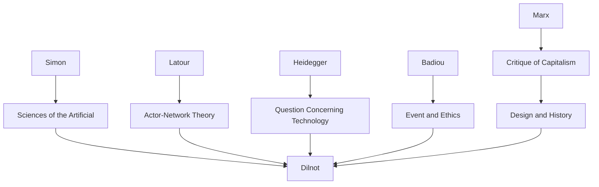

---
cssclasses:
  - Philosophy
  - Arts
  - History
subclasses:
  - Design-Theory
  - Philosophy-of-Science
  - 20th-Century-Philosophy
related:
  - "[[Design]]"
  - "[[Artificial]]"
  - "[[Simon]]"
  - "[[Philosophy of Design]]"
  - "[[Contingency]]"
aliases:
  - design history
  - artificial world
  - herbert simon
  - matter mattering
  - configuration design
  - contingency design
  - proposition design
  - designing mediation
  - metaphysics artificial
  - design futures
reference:
  - Dilnot, C. (2015). The matter of design. Design Philosophy Papers, 13(2), 115–123. https://doi.org/10.1080/14487136.2015.1133137
---

#### Central Problem

The paper confronts a fundamental historical transition: we are moving into an epoch where the artificial—not nature—becomes the horizon, medium, and prime condition of human existence. [[Dilnot]] addresses how this shift transforms the meaning and practice of design, challenging inherited frameworks that positioned design as a subaltern practice serving industrial capitalism. The central question becomes: what does it mean to design in a world where the artificial constitutes reality itself?

#### Main Thesis

Design, understood as configurative activity, becomes essential—perhaps the essential mode of acting—in a world where the artificial is the formative totality of existence. [[Dilnot]] argues that since 1945, the quantitative expansion of artifice has become a qualitative transformation in the conditions of our being. In this new epoch, three meta-conditions obtain: absolute dependence on how we relate to the artificial; absolute dependence on the quality of mediation between humans and the artificial; and the collapse of certainty—things no longer "are" as facts but exist only as propositions.

The thesis challenges [[Simon]]'s influential definition of design as concerned with "how things ought to be rather than how they are." [[Dilnot]] extends this: in the artificial, there is no "is"—only possible becoming. The artificial has no ontology, only propositions. Configuration—the way things are structured and disposed to act—becomes the locus of both making and knowing in this new metaphysical condition.

#### Historical Context

The paper combines remarks from a 2014 Design Research Society conference debate and a 2015 symposium on "Matter/Matter(ing) by Design." [[Dilnot]] situates this intervention within the longer history of design's emergence as a professional activity, dating to industrialization in the early 19th century.

The pivotal transition point is 1973-1974: the oil crisis, collapse of manufacturing profitability, and shift toward financialized accumulation marks the moment when industry ceases to be socially formative. If design was called into being by industry, what happens to design when industry is no longer formative? This question drives the analysis.

The philosophical context includes [[Latour]]'s claim that "we have never been Modern" (questioning subject-object divisions) and [[Heidegger]]'s analysis of technology's relationship to metaphysics. [[Dilnot]] synthesizes these with [[Simon]]'s sciences of the artificial to develop a new metaphysics appropriate to our historical condition.

#### Philosophical Lineage

#### Key Thinkers

| Thinker | Dates | Movement | Main Work | Core Concept |
|---------|-------|----------|-----------|--------------|
| [[Simon]] | 1916-2001 | [[Decision Sciences]] | *The Sciences of the Artificial* | Design as satisficing, artificial |
| [[Latour]] | 1947-2022 | [[Science Studies]] | *We Have Never Been Modern* | Hybrids, matters of concern |
| [[Heidegger]] | 1889-1976 | [[Phenomenology]] | "Question Concerning Technology" | Enframing, revealing |
| [[Badiou]] | 1937- | [[Continental Philosophy]] | *Ethics* | Event, fidelity, situation |
| [[Dilnot]] | - | [[Design Theory]] | Various essays | Artificial as horizon |

#### Key Concepts

| Concept | Definition | Related to |
|---------|------------|------------|
| Artificial as horizon | Condition where artifice, not nature, constitutes the formative totality of human existence | [[Dilnot]], [[Modernity]] |
| Configuration | The structuring of artifacts that determines how they act and are disposed to act | [[Dilnot]], [[Design Theory]] |
| Proposition | Status of things in the artificial—not facts but possible becomings requiring negotiation | [[Dilnot]], [[Metaphysics]] |
| Matters of concern | [[Latour]]'s term for things understood relationally and politically, not as mere facts | [[Latour]], [[STS]] |
| Mediation | The relationship between subjects and objects that design configures | [[Dilnot]], [[Design Theory]] |
| Contingency | The radical openness of the artificial—things can always be otherwise | [[Simon]], [[Dilnot]] |

#### Authors Comparison

| Theme | [[Simon]] | [[Latour]] | [[Dilnot]] |
|-------|-------------------|-----------|------------|
| Central concern | Decision-making, bounded rationality | Science studies, hybrids | Design and the artificial |
| View of artificial | Subject to scientific study | Co-produced with nature | New metaphysical condition |
| Design | Satisficing under constraints | Making things public | Configurative mediation |
| Contingency | Methodological problem | Constitutive of reality | Absolute condition of artifice |

#### Influences & Connections

- **Predecessors:** [[Dilnot]] ← influenced by ← [[Simon]], [[Latour]], [[Heidegger]], [[Badiou]]
- **Contemporaries:** [[Dilnot]] ↔ dialogue with ↔ design research community, design historians
- **Historical claims:** Industrial capitalism → called design into being → as subaltern practice
- **Future orientation:** Post-industrial condition → requires → design as essential human capacity

#### Summary Formulas

- **Artificial as horizon:** Since 1945, we have transitioned to an epoch where the artificial, not nature, is the horizon and medium of human existence—a qualitative transformation of the conditions of being.
- **No ontology of things:** In the artificial, things do not possess being; there is no Law determining configuration. All artifacts are propositions concerning what could be.
- **Configuration as essence:** Design is configurative activity—the conscious shaping of how things are structured and disposed to act. This is both making and knowing.
- **Designer disappears:** Just as craft persisted but ceased to be formative after industrialization, the Designer (capital D) may disappear into a generalized human capacity for designing.

#### Timeline

| Year | Event |
|------|-------|
| 1914 | Werkbund debate between [[Gropius]] and Van der Velde |
| 1945 | Post-war expansion of artifice begins |
| 1969 | [[Simon]] publishes *The Sciences of the Artificial* |
| 1973-1974 | Oil crisis; industry ceases to be socially formative |
| 1991 | [[Latour]] publishes *We Have Never Been Modern* |
| 2014-2015 | [[Dilnot]] presents arguments at DRS and Parsons symposium |

#### Notable Quotes

> "The prime condition of the artificial, perhaps in the end the most fundamental, is that things do not possess being. It is not only that these things are contingent—which they are, and radically so—but that this contingency extends into their deepest aspects."

> "In the artificial, the royal road to understanding is not through contemplation or measurement or 'research,' it is through acting, i.e., it is through, one way or another, no matter how this is conceived, making."

> "All human actions boil down to the search for good designs, i.e., the search for good mediations." — [[Simon]]

---
> [!warning]-
> This annotation was normalised using a large language model and may contain inaccuracies. These texts serve as preliminary study resources rather than exhaustive references.
